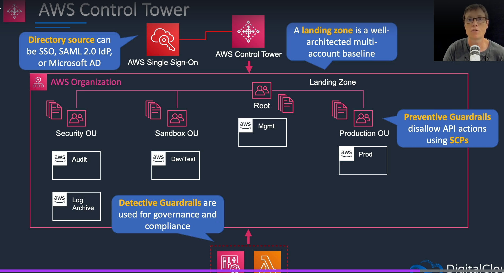

# AWS ACCOUNTS AND ORGANIZATIONS:

- AWS Organizations helps  us to centrally manage all the AWS Accounts.
- It starts of with the management account. its the root of the hierarchy of all the accounts with in the organization.
- We can group accounts under the mgmt account into the organizational units(OU). We can have mutiple accounts under the OUs
- We can then apply service control policies (SCP) to these OUs. which will be effective to the all the accounts under that particular OU.
- SCP controls the tagging and available API actions. 
- We can create accounts programmatically using the oganizations API and attach a particular OU.
- We can enable AWS SSO using the on-prem directory on the AWS Orgnization and all the accounts within them.
- We can get a consolidate bill for all of my accounts for centralization.
- We can enable cloud trail in the mgmt account for the auditing of all the accounts within the organization so that we can note all the API actions that are being executed. (good for complaince)

- Every account create under the mgmt account in the organizations will have a role created by default called **OrganizationAccountAccessRole**
- This role will have full have full perms to that account. Any user under the mgmt account can assume this role using the sts:AssumeRole API permission.
- We might need to lock down the policies so that only specific users will have these kind of assumerole permissions. (we can change the role itself to have few permissions)

## Service Control Policies(SCP):

- By default the root mgmt account has SCP attached which has all the access levels.
- Users in the mgmt account are not restricted by the SCP i.e even if we have deny rules that doesnt effect them. Best practices is not to have many users in the mgmt account.
- tag policy applied to enforce tag standardization. this forces users to attach the policies to the OU.
- We can create more OU within the OU.

### SCP Strategies and Inheritance:

- SCP are explicitly attached to the each OU at every level. Permissions are not flowed down from the parent to the child autmatically we need to attach them explicity. As long as they are not DENIED at higher level they will be allowed.

- We have two strategies
    - Deny List strategy
        - the FullAWSAccess SCP is attached to every OU and account.
        - this SCP allowed to flow down to every OU.
        - Can explicilty override with an DENY in an SCP.
        - This is the default setup
        - An explicit DENY overrides any kind of ALLOW. (Any kind of allow at lower level is not allowed if its denied on higher level)
    - Allow List strategy
        - the FullAWSAccess SCP is removed from every OU and account.
        - To allow a permission SCP with allow access must be added to account and every OU avbove it till the root.
        - An explicit ALLOW can override and implicit DENY(which is denied by default not user expliciltly mentioned)

## AWS Control Tower:

- AWS Control Tower is an extension to the AWS Organizations. It sits on top of the AWS Organization.
- With control tower we create something called Landing Zone. A landing zone is a wellarchitected multi-account baseline.
- Within the Orgnization we have a root OU within that we have the mgmt account.
- It will also create a series of OU and accounts along with the root OU. (Security OU, Production OU, Sandbox OU)
    - Within the security OU by default contains the Audit and Log archive accounts.
    - Audit account contains the information that the Control tower provides and Log archive contains all the consolidated Logs of all the OU within the landing zone.
    - Sandbox and Production OU are empty by default. Within the sanbox OU we can create the test accounts whereas in Production  OU we can create the prodcution accounts.
- We can connect the control tower to the SSO. It can be any Active AD.
- Control Tower create certain Preventive Guadrails which are SCP that disallow certain actions. Basically control tower creating SCP pre-confgured in a certain way for certain purposes.
- It also creates Detective guradrails based on AWS lamda functions and AWS config rules.

