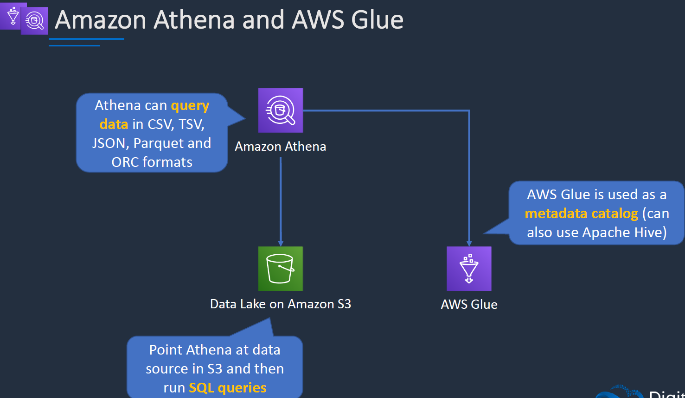

# ANalytics Service

## AWS Athena & AWS Glue :

### Athena:



- Athena is a serverless service to run SQL queries in S3 Data lake.
- It can query data in CSV, JSON and OC formats.
- Glue is used as a metadata catalog (can also use apache hive)
- Athena can be pointed many data sources.

- Ex if we want to run Athena queries against the data source we need a lambda function to connect to the data source so that the athena can run against that data.


https://aws.amazon.com/blogs/big-data/top-10-performance-tuning-tips-for-amazon-athena/


### Glue:

- AWS ETL tool service.
- used to prepare data for analytics.
- It uses fully managed Apache Spark Environment.


## Redshift and OLAP Use Cases:

- Its a DatawareHouse where its used for Online Analytics Processing (OLAP)
- its different compared to Online transactions processing(OLTP) like RDS and DynamoDB.
- These are used to consolidate data from mutiple sources to run very complx long running queries.


- below is the use case for the OLAP and OLTP combined.

- RedShift is not loading the live data. Its loading the consolidated data from RDS.
- Wich is connected to the BI tools for analytics
- We can have mutiple data source to which we can load data into REDSHIFT.
- Athena and redshift spectrum works in a similar way.


- below are the use cases for Redshift.
- We can query on exabyte(100Petabyte) scale on redshift.


## Amazon EMR(Manged Implementation of Hadoop):

- Its simplifies running big data frameworks including Apache Hadoop & Apache Spark.
- Can pefrom ETL functions. 
- We do get root access to cluster in the EMR.


### Architecture EMR:


### Use cases EMR:


## Amazon Kinesis:

- We ingest data into kinesis from mutiple data sources mainly from IoT or Video Streams
- Then we can data analytics done on that data using the kinesis data analytics. we can process that data then with lambda and store in Dynamo DB
- We can also load data directly into S3 using kinesis data firehose , we can query using the athena.
- We can load data into redshift then use the BI tools as well from kinesis data firehose
- **THis is best suitable for video streams**
- **Kinesis is realtime , where as firehose is near real time**


### Kinesis Client Libray(KCL):

- Its a part of software architecture where we need to run the EC2 to process the data from kinesis data stream.

 

- Kinesis data streams has ordering.
- As the recors are added they are processes in order. A parition key can be specified with Putrecord to group data by shard.

### Kinesis Data Firehose:

- producers send data to firehose. here there are no shards, its completely automated(scalablity is elastic)
- Whereas in Data Stream we need to increase the number of shards.
- Near real time delviery ~ 60 sec
- The firehose data is sent to antoher AWS service for storing.
- We can use lambda to optionally transform before storing the data.
 
 

### Kinesis Data Analytics:

- Provides real-time SQL processing for streaming data.
 

# Architecuture Patterns:

 
 
 

### LAB:

- SERVERLESSS PART 5 (Go to serverless section)
    - athena to query the csv data in s3 bukcet and store data in another bucket.
    - give tablename>create a DB(dbname) > mention the s3 bucket where we have the data> CSV data format
    >bulk add columns (string type) > no partitions.>create s3 bucket for athena to store data.
```

productvisitkey string, productid string, productname string, category string, priceperunit string, customerid string, customername string, timeofvisit string

```