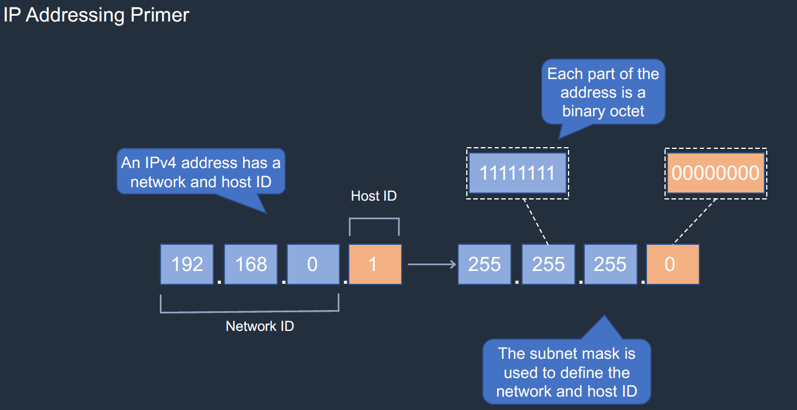
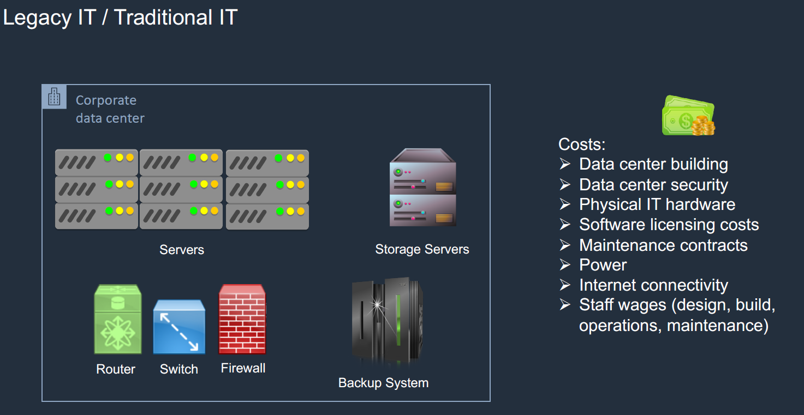

# Building Blocks of Cloud Computing:

## Architecture of Computer:


## Storage Block vs File vs Object:


## IP Addressing:



- The eiht digit binary number is called octet.
- The first 3 of the IP are Network ID and the last one is the Host ID. (Basically the fixed ones are network ID and values that keep varying are host ID)


- Subnets help us understand how many IP address are available.


- All the IP address are divided into 4 classes.


## Networking - Routers and Switches:

- Switch is a device to which our computer connects its network card (NIC).
- We can connect mutiple switches over the wire but thats not feasible.
- Each network may have different IP subnet and IP address to which they belong.
- We cant send a file from a computer using one IP address range to a computer using another IP address range using a switch for that purpose we need ROUTER.

- ROUTER connects the IP address across various ranges using the Route Tables.


## Firewalls:

- Firewalls bascially have rule set what to allow and what not to allow etc.,..


## Virtualization and Docker:

- Earlier OS is tied to the hardware and applications are installed on top of it. So it was tough to move them.
- Virtualization helps us in decouple the server and the OS using Hyervisor(It creates a layer of abstraction).
- Virtual Machines helps us fail over. We can stop the VM on one server and start over on another server.


- BUT the hypervisor has it limitations such as application dependencies, storage space, OS installation which takes a lot of space and resources, Heavy.
- Container is abstracted as a layer on top of the OS. Where we install container engine and run the application as containers.
- Container contain all the dependencies, libs and setttigns that are required for the application to run and it can be run on any device that has container runtime engine (CRE)
- Containers are light, flexible, not hard dependencies on OS, replicate easily.


## Application Programming Interface (API):

- API are like waiters in a hotel which takes the orders from the customers and give to the chef and return the cooked meal as per the preference.
- We interact with API using the HTTP protocols.


# Cloud Computing Intro:

- Owing a own hardware and maintaing is heavy task and capex heavy.

- Example of cloud computing include Gmail, Dropbox, Salesforce software etc.,.. We dont manage anything but pay for the service we use.

## Launching AWS Cloud services:

- Console

- SDK
- AWS CLI

## Cloud Service Models:

- IaaS
- PaaS
- SaaS
- Private Cloud


## Cloud Deployment Models:

- Private Cloud, Public Cloud, Hybrid Cloud and Multi Cloud.

##  Stateful vs Stateless Applications:

- User session is recorded in stateful apps. Sessions are not recorded in stateless apps.
- Ex: when you add items in your cart that info is stored in the browser in the form of cookies. However if user purchase the items application layer process and records the information in the DB. this is stateful.


## Scaling:

- Scale up(Vertical Scaling) : Adding resources to the CPU.

- Scale Out(horizontal Scaling): Adding more VM to the instead of adding resources in the same server.


## Load Balancing:

- LB helps in distributing the traffic across mutiple web servers. If one of the servers fails LB stops sending requesting to that service.


## Fault Tolerance and High Availablility:

- Fault Tolerance is protecting you from the individual component failure.


- High Availablility is make sure the application is up and running as much as possible using Auto Scaling Groups.

## Loose Coupling:

- If the web server and app server are tightly coupled we might miss on some information when there is too much traffic and app server suddenly cant handle those.
- It might drop some critical information until scaling kicks in. We might want to avoid that for banking applications as information is critical.
- This is where message queues comes in msgs comes there and wait for them to get processed in order. We are not integrating the web tier tightly with the app tier.


## Monolithic vs Micro-Service Architecture:

- Consider an e-commerce site where mutiple components talk to each other where we have our applications running on a single server.
- If we want to update, deploy or change something we need to take down the whole application. Also if we have single point of failure the whole application might stop working.


- Even though we have mutiple VM of the application running but we still have same code running across. If we encounter an issue in the code we still need to take out whole thing and fix it. this is where the micro services architecture helps in.
- In Micro service architecture we instead of tighlty coupling the application components , we are seperating the each component of the application and decouple them.
- We use the APIs to conect them to each other and might put message queues in b/w to help with the loose coupling.
- We can also seperate the each DB so that we might have the individual DB for each component of the application.

- Dockers containers are really useful for in deploying these micro service applications. Where we can have each container running applications of containing different microservices which can be scaled out instantly as they are very fast.


## Event Driven Architecture:

-  User places an order in the ecommerce site then the application server process the order and stores a record for the order in the DB server.
- In this case each time a record is placed in the DB it can trigger an different event saying check that out and process the order for the analytics and other uses etc.,..
- Event driven archtiecture basically means when something is happens we can trigger some other event pertaining to that.


# AWS Basics:


## AWS Global Infrstructure:


- AWS Pricing depends on the compute, storage and data transfer mainly.


- Create a free tier account and create a billing alarm for free tier usage using the cloud watch alarm. (region: US EAST N.Virginia)
- Create alarm -> select metric -> billing -> total estimate charge -> static -> Threshold -> USD 5 -> Alaram state trigger(In alaram) -> Create new topic -> billing notification(name) -> go to email and confirm subscription.

## IAM:

- AWS Identity and Access Management helps in authentication and authorization.

- Access can be done via Programmatic Access or console.

## VPC:

- VPC is virtual private cloud within the AWS.

- We can create mutiple VPC within a region(make sure that IP address range doesnt overlap amongst two VPC within the same region)

- **ROUTE TABLES**:


### Security Grousp and NACLs:


- Security group is the firewall of EC2 Instances.
- Network ACL is the firewall of the VPC Subnets.
- Security groups are tied to an instance whereas Network ACLs are tied to the subnet. 
- Network ACLs are applicable at the subnet level, so any instance in the subnet with an associated NACL will follow rules of NACL. That’s not the case with security groups security groups has to be assigned explicitly to the instance.
This means any instances within the subnet group gets the rule applied. With Security group, you have to manually assign a security group to the instances.
```
State: Stateful or Stateless
Security groups are stateful. This means any changes applied to an incoming rule will be automatically applied to the outgoing rule. e.g. If you allow an incoming port 80, the outgoing port 80 will be automatically opened.

Network ACLs are stateless. This means any changes applied to an incoming rule will not be applied to the outgoing rule. e.g. If you allow an incoming port 80, you would also need to apply the rule for outgoing traffic.

Rules: Allow or Deny
Security group supports allow rules only (by default all rules are denied). e.g. You cannot deny a certain IP address from establishing a connection.

Network ACL supports allow and deny rules. By deny rules, you could explicitly deny a certain IP address to establish a connection example: Block IP address 123.201.57.39 from establishing a connection to an EC2 Instance.

Rule process order
All rules in a security group are applied whereas rules are applied in their order (the rule with the lower number gets processed first) in Network ACL.

i.e. Security groups evaluate all the rules in them before allowing a traffic whereas NACLs do it in the number order, from top to bottom.

Defense order
Network ACL first layer of defense, whereas Security group is second layer of the defense for inbound/ingress traffic.

Security group first layer of defense, whereas Network ACL is second layer of the defense for outbound/egress traffic.

Occurrence
Subnet can have only one NACL, whereas Instance can have multiple Security groups.

Rule Destination
Security group rule allow CIDR, IP, Security group as destination.

Network ACL rule only allow CIDR as destination.

```


## AWS Public and Private Services:

- Services that exsist within the VPC are private services. and services that exsist ooutside the VPC are private services.
- Private services can have public IP if they are in the public subnets .
- Public services have public IP addresses or endpoints.
- If private EC2 instance wants to connect to the public service s3 privately we need to use the VPC Endpoint.


# AWS EC2:

- EC2 are VM or Virtual server that are launched on the Physical Servers managed by AWS. 
- We can choose from mutiple flavours of OS from the offerings.
- the EC2 can send traffic from the public subnet to the  internet via IGW.
- If the EC2 is in private subnet it must send traffic from t private subnet to the NAT gateway in the public subnet and it has access to the IGW.


## Launching an EC2 instance:

- We can launch an EC2 instance from the mutiple AMI which are available within the AWS.
- We can connect to the instance using the command (ssh -i "solr-ai-ohio.pem" ec2-user@ec2-3-12-43-171.us-east-2.compute.amazonaws.com)
- We can append the user data while starting the instance something like this.

```
#!/bin/bash
yum update -y
sudo yum install httpd -y
sudo systemctl start httpd
sudo systemctl enable httpd
cd /var/www/html
echo "hellow world from $(hostname -f)" > index.html

```
- In the SG add inbound rules to allow port 80 and 443.
- We can use the access keys to check the instance details, storage details and many more storage information from the CLI.
- **Using IAM Role with the EC2 Instance**:
    - Suppose you want to access the S3 bcuket using the EC2 instance. We can create an IAM role that gets assumed by the EC2 instance while acccessing the content in the S3 bucket.
    - the way we can achieve this is by using the IAM Roles
    - we can a role from the exsisting policies or new pilicy using json file.
    
    - Go to Instance Settings > Attach/Replace an IAM role > attach the read only s3 role.
    - this is the ideal way to give access to the services in aws to perform a certain role.
- **Auto Scaling Group**:
    - It automatically launches new instances when the min no.0f instances are not present or if the exsisiing new instances are more than 90% of their capacity.
    - We can put input of these parameters using the CloudWatch metrics.
    - This is very useful for making ou applocation scalable.
    

    - Go to AGS in ec2 dashboard > create launch template > create ASG (within the ASG we have the Launch configuration what to do on what request.)

- **Create a Target Tracking Policy**:
    - Create a scaling policy in the ASG if the load increases more than 80%.

- **ELB**:
    - We have 3 LB CLB, ALB, NLB all are automatically scalable.
    - we can use a ALB to direct traffic to mutiple instances in the subnets.
    - EC2 Dashboard  > Create LB > ALB  > create TARGET Group and register them to the ALB. (Within the ALB we have TARGET GROUPS as in where to redirect the load balanced traffic)
    - Now go to ASG and enable LB and select the relavant TG.

    

# AWS STORAGE SERVICES:

- There are 3 types of storages Block, File and Object we have various services providing these strorage options in AWS.

# AWS DB:

# AWS Automation:

# DevOps on AWS - creating a Code Pipeline:

# DNS Services and Content Delivery:

# Containers and Serverless Computing:

# Application Integration and Loose Coupling:

