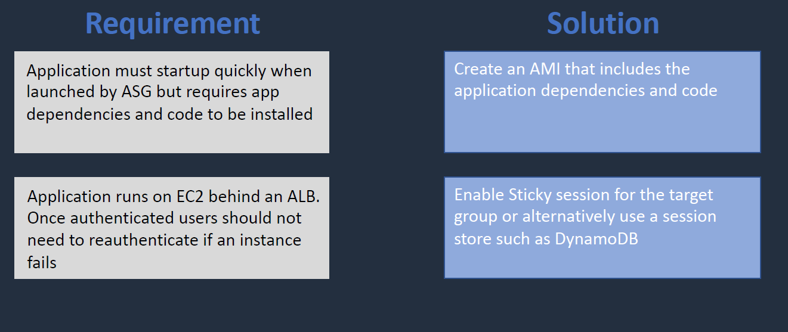

# COMPUTE, AUTO SCALING & LOAD BALANCING:

- Fundamental blocks of AWS.

### EC2 Pricing Options:


- Further we have the Standard RI and Convertible RI


- We have the savings plan of EC2 and compute


- Spot Instances.


- spot block 


- Dedicated Instacnes vs Dedicated Hosts:


### Ec2 Use cases:


### Boostrapping AMIs:

- How to quickly launch the instances with the required dependencies and software installed.
    1. Customized AMI : Where we create a customized AMI from the exsisting running instances by creating a image out of it.The attached EBS Instacne Volume can be backed up by snapshots
    2. Uer data script (Bootstrapping) : We can use user data script written in bash while launching the instance.
    3. Combined Use Case of Customized AMI and User Data Script
    4. We can use automation tools like Packer, Chef, Puppet, Terraform, CloudFormation.

### EC2 Placement Groups:


1. Cluster


2. Partition


3. Spread


4. Use Cases


### Network Interfaces(ENi, EFA,ENA):

- its a Network Adapater that is attached to the EC2 instance.
- We can attach EC2 instances mutiple ENIs from different subnets. 
- **We CANNOT attach ENIs in different AZs**


- There are 3 differnet Network Interfaces
- ENI is the default one that gets attached while we launch a instance.


### Public, Private and Elastic IPs:

- Public IP: its a dynamic IP address. It will change with each restart.
    Note: **Public IP remains intact when we reboot. it changes when we stop and start the instance**
- Private IP: its generally doesnt change for an instance.
- Elastic IP: its a public static IP. We can attach the Elastic IP to netowrk interfaces and it wont change on restart. These are charged. We can move them across AZs.

- If an instance fails for some reason we can remap the ENIs and Elastic IP to another EC2 instance in the same AZ.

- EIPs can be also mapped across AZs.

### NAT for Public IPs:

- consider an EC2 instance having an network interface eth0. It would have both private and public IP.
- When we do ifconfig it will show the private IP address. In general it will show public IP address.
- The EC2 in aws doest have the knowledge of public IP. the requests we send out to the internet is taken care by the IGW by performing a NAT.
- It means it changes the private IP to public IP in source while sending the request, and public IP to private while recieveing the request.


### Advance Auto Scaling:

- We generally have an ASG replace a failed Instance by doing EC2status checks.
- We can collect metrics using CloudWatch (we dont get memory by default we need to install an agent on instance for that) and launch new instance if utilization is more than 80%.


- **Dynamic Scaling (Traget Tracking):**
    - we specify the avg CPU is 60% across different instances. If the avg is more than specified ASG launches a new instance.
    - Newly launched instance metrics are not counted until Warm-Up time has expired.
    - AWS recommends scaling on a 1-minute frequency.
    

    - We can scale instances on below target trackings:
        - ASG AvgCPU Utilization
        - ASG Avg Networking
        - ASG Avg Netowork out
        - ALB Request count per target
        

    - **Target Tracking in SQS**: We have an ASG and SQS Quue. We can emit a custom metric in cloud watch on number of msgs in Cloud watch and we can have the ASG scale depending upon the number of Queue msgs.
    

- **Dynamic Scaling(Simple Scaling):**
    - We set an alarm if CPU>= 60% it launches new instances. It waits 300 seconds before another scaling activity.
    

- **Dynamic Scaling(Step Scaling):**
    - Suppose if the size of the alarm breach is more than 90% which mentioned to as breach set at 60%, we can increase the number of instances launched as 4 instead of two at 60%
    

- **Dynamic Scaling(Scheduled Scaling):**
    - It is schedule to launch instacnes at specific time/days/time etc.,..
    

- Scaling Processes:


- Additonal Scaling Process:

- Termination Policy: https://docs.aws.amazon.com/autoscaling/ec2/userguide/as-instance-termination.html

- Lifecycle Hooks


### ELB:

- We have ELB thats placed in front-end. A listner checks for the connections req on a port/protocol.
- ELB takes out the instacne if the health check fails.
- There are 3 types of LB:
    - Application Load Balancer:
        - Its operated on the request level. Layer 7 on OSI mode
        - it supports path-based and host-ased routing and others.
        - supports lambda functions and containers as targets
    - Network Load Balancer:
        - operates at connection level
        - OSI layer 4. offers ultra high performance and TLS off loading at scale.
        - Can have a static/elastic IP
        - supports UDP and static IP address as targets.
        - we can whitelist a Client IP address only on NLB.

    - Gateway Load Balancer:
        - operates at layer 3.
        - it uses on front of IDS/IPS and deep packet inspection systems .
    - Classic Load Balancer:
        - works on layer7/layer4. 
        - depreceated.


### Routing with  ALB and NLB:

- ALB:
    - Target Groups are used to route the req to registerd targets. 
    -  A rule is configures on the lister to listen on http/https. requests can be routed based on the path.
    
- NLB:
    - NLB listesn TCP, TLS,UDP or TCP_UDP
    - NLB can route different ports. 
    - req are routed based on IP protocol data.
    - NLB nodes have EIP on each subnet.
    - Targets can be outside the VPC.
    

### ALB/NLB access control and SSL/TLS:

- ALB:
    - We can attach an SG to an ALB.
    - we can SG to the instance and use the ALB SG as source to the instance SG.
    - We also have NACL we can also control ingress and egress.
    - we can also have ALB on app layer as well.
    - We can also place the ALB in public sunet and instacne in the private subnet ( it might be required that it is in the same AZ)


- NLB:
    - **We cant associate an SG with NLB**
    - We can attach SG only on instance level.


- **What is the source IP address the APP Sees?**
    - The EC2 instance sees the Private IP associated to the ALB when we use the ALB.
    - In the case of NLB we see the source IP address in EC2 instance  if we specify the instance by instance-id in NLB. Whereas if we specify the isntance by IP address in NLB the app sees the private IP of the NLB.
    - In NLB TCP and UDP can use the NLB IP whereas the UDP and TCP_UDP doesnt work it requires the source IP address.
    - We can capture the source IP of client in ALB usig the X-Forwaded-for.


- **SSL/TLS Termination**:
    - We recieve the encrypted requested and SSL/TLS termination is done at ALB by AWS Certificate Manager. where we place our SSL/TLS certs.
    - Once the SSL termination is done at ALB we can then choose to leave the unecrypted flow to the instance or encrypt the flow to the instance using the self-signed certs.


    - With NLB if we dont have SSL termination at NLB its forwarded straight to the instance we can have termination their.
    - We can also have the termination done at NLB and Instance level as well.


### Session State and Session Stickiness:

- lets say we have two AZ we have subnets and instacnes and LB sending the traffic to them.
- session data such as authentication details tored in DynamoDB.
- session dta retrived from Dynamo DB table.
- Elastic cache is aslo popular for session state data.


- connection comes in and cookie gets generated. client is bound to instance for the lifetime of the cookie.
- in this case session data such as authentication details stored locally.
- if instacne fails session state fails. and client is redirected to another instance.
- so overall session state might be useful for storing the session state. 


- INTERESTING READS:
    - https://medium.com/nerd-for-tech/how-session-stickiness-disrupts-pod-auto-scaling-in-kubernetes-17ece8e2ea4f
    - session caching while scaling down: https://medium.com/swlh/session-management-in-nodejs-using-redis-as-session-store-64186112aa9

```

Another good discussion http://ocklin.org/session_management_cluster.html
The sticky session feature in ELB takes care of a lot of the load balancing issues with session, but not scaling up/down
To maintain the sessions during scale down, you need to store the sessions outside the web server, for example in memcached/ElastiCache or Redis or a database.
Example of memcached session manager http://code.google.com/p/memcached-session-manager/
There are also frameworks which can do this - for example aiCache [http://aws.amazon.com/customerapps/2366]. Let me research and will update the answer when I find good links.
I heven't seen a mechanism to quiesce an instance and then terminate when there are no sessions. This might be tricky due to the session time out setting - for example if the session timeout is 8 hrs, then scale up/down can happen only at a granularity of 8 hours. [Update : I don't think this is easy or required. Externalizing the session handling at the application is the right solution]
I will do some more research and if I find anything, will let you know
[Update] Taking this to a slightly longer architectural discussion, there is the issue of mixing the layers - ELB works at the IaaS and the session recovery/transfer is at the PaaS layer. Hence the challenge.

```

### AWS Batch:

- We can launcha batch job which is a unit of work such as shell script, executable docker container image etc.,.
- before that we need a job definition then job send to a job queue.
- batch launches, manages and terminated resources as required EC2 and ECS/fargate.


### Architecture patterns - for compute:





###### LABS:

- Attach mutiple ENIs to the EC2 instance in differnt subnets. SG are also attached to the ENIs along with the subnets as its the firewall which allow the traffic at instance level.
- create a EIP and allocate to network interface. we can choose if the EIP can be reassociated. then attach the ENI to instance. if we start and stop ec2 we see the EIP stays intact.

- **ASG**: 
     - create a launch tempklate with user data
     - create ASG and review combine purchase options (choose all 3 subnets)
     - No LB  , enable health check, enable cloudwatch metrics collection.
     - scaling policies(none) - review target tracking 
     - enable instacnce scale-in protection.
     - we can see the instacnes launched, we can add scaling policy later as well in ASG
     - we can also set scale-in protection for an instacne
     - try setting the instacne in stand by (if all the min,max,desired equal it might fail) , try chaging it around and see the effects.
     - check on the termination policy
     - check on lifecycle hooks


- register a domain with the route 53. for few labs does cost few dollars
    - select a domain and create it.
- request routing with ALB. (host based routing to ALB) 
    - create two target groups and redirect two domains too redirect to two domains by host based routing. create an ALB and point them accordingly. view and edit rules in listeneres and change conditions

- NLB static IPs whitelisting. 
    - create ASG with the launch template.
    - create a NLB.  
    - create a new TG and register targets.
    - do a nslookup on alb and you should see the IP of one the EIP
    - createa ec2 and add entry for that specific IP in the SG and make sure we have access only via the particular IP.
