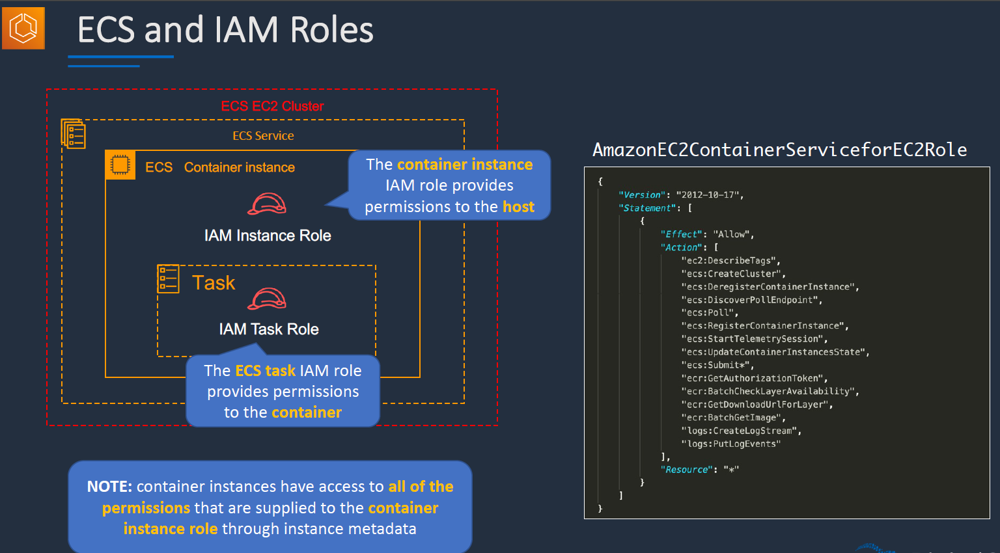
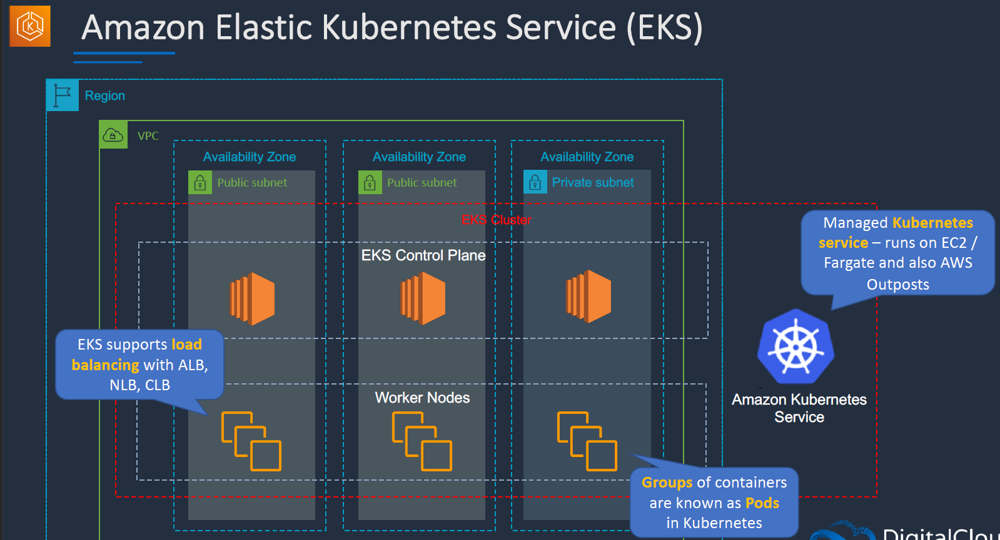
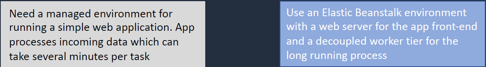

# Docker Containers and PaaS

## Docker & MicroService Architecture:

## Amazon ECS:

- ECS runs a ECS Cluster
- ECS Cluster is a logical grouping of tasks. A taks is mostly a Docker Container Running.
- A Task is defined in task(container) definition.
- The images are stored in the private registry mentioned in the task definition.
- ECS services are used to maintain the desired number of tasks.
- These tasks runs on a ECS Container Instance which we need to provision we can place them in auro scaling group as well.

- We have two types of launch types EC2 and Fargate.
- Ec2 is where we have to provision the instance and maintain. Where as the fargate is serverless.
- For fargate docker images must come from ECR no docker registry is supported.

- We genrally gives the permission to the EC2 instance via IAM Instance role those are applied to the Containers running as well.
- We can add a role to the ECS taks itself as well.
- By default they have all the perms IAM instance role has.

- For fargate its simple as IAM taks roles are only present.

### ECS Netowrking Modes:

### ECS Spot Intance & Draining:

### SCALING ECS:

- With ECS we have two type of scaling. Service Auto Scaling and Cluster Auto Scaling.

#### Service Auto Scaling:

#### Cluster Auto Scaling:

- ASG here is linked to ECS using a Capacity Provider.

### ECS With ALB:

- We have each container exposed on PORT 80 but how to make sure that traffic is distributed across the containers from the web request over the port 80. This is done by Dynamic Port Mapping.
- Dynamic port is allocated to the Host and mapped to the container port.
- ALB will listen on port 80 from the web and forwards the requests  to correct containers as it understands the Dynamic Host Mapping.

## EKS:

- This is the service required to run K8S .
- They need a standardized container orchestration service agnostic to the platform

## Elastic Bean Stalk:

- Its basically acts a Platform as a serv
- EBS is a solution that provides fully managed solution for WEB Applications.
- We can create a complete solution within the network.

- THis is primarliy used where we want to just upload the code and want AWS to basically manage everything once required options are selected.
- It support several apps java, docker, .net etc.,..

- THere are several layers to the Elastic Bean Stalk.
- THere are applications containing environments, configs and their versions. We can have multiple versions attached to an application.
- Ex : we have an application code in S3 and each indivdual version is pointed to an S3 bucket. we can actually deploy these versions to different environments.

- In Elastic Bean Stalk we have web servers that listen on Port 80.
- Workers are specialized apps that have a background procesing that listens on SQS queue.

### Updating Elastic Bean Stalk:

- For B/G we need to use some kind of Route 53 to route traffic to other instances.

# Architecture Patterns:

### LAB:

- **FARGATE CLUSTER**
- Create a fargate cluster.
- Configure Cluster.
- view cluster
- we can create new task and enter the taks definition.

- **Elastic Bean Stalk**
- choose code and upload the same.
- create newer environments.
- Swap environment URL's