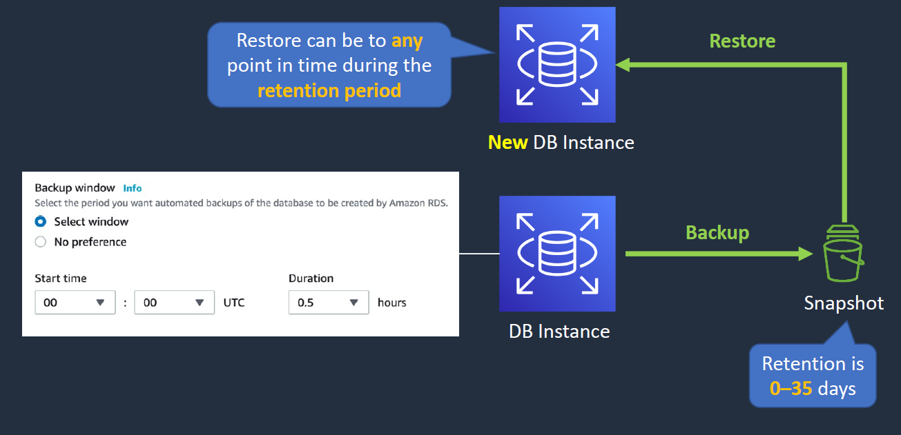
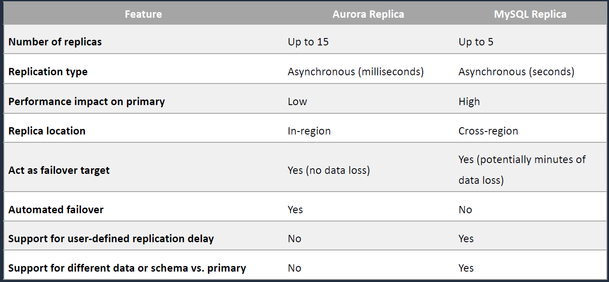
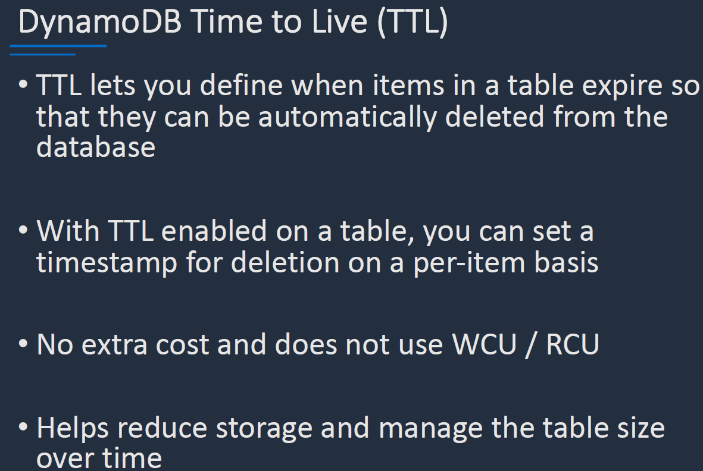
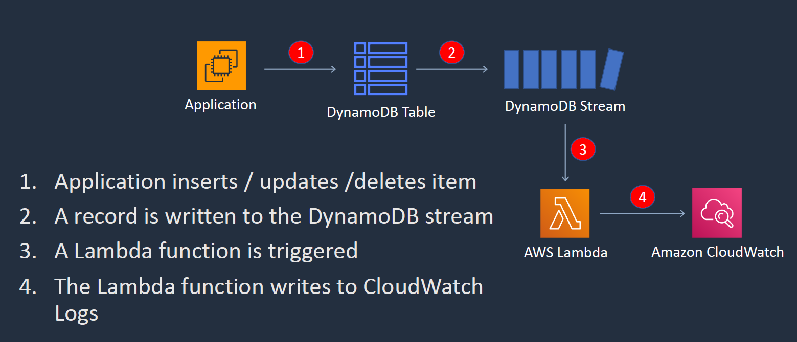

# DB

## RDS:

- RDS is managed relational databse.
- These runs on EC2 instance so you must choose an instance type
- Types of RDS AWS Supports 
    - Amazon Aurora
    - MySQL
    - MariaDB
    - Oracle
    - PostgreSQL
- We can scale the DB Instance Vertically.
- For DR We have RDS Deployed as Multi-AZ.
- We can scale out horizontally with mutiple READ replicas.

- Below are differences b/w Multi-AZ and Read Replicas.
- **Multi-AZ cant be cross region where for read replicas can be cross-region**

### RDS Backup and recovery:

#### Automated backups:

- We have automated backup option while spinning up the DB Instance.
- We can configure a backup window. Either we can choose the window or No preference(automatically chosen for us). 
- It creates a snapshot of the DB and will retain as per the retention period mentioned.(35 days max)
- Restore can be to any point in time during the retention period.

#### Manual backups amazon RDS:

- Manual backups are also using the snapshots.
- However these do not expire.
- Maintence may require taking the DB offline.

### RDS Security:

- It can have a public IP but generally its internal and we dont assign a public IP.
- Encryption at rest and transit. Can be enabled only when creation.
- We can have SG for RDS instance and allow traffic only from App server on port 3306
- We have SSL to add encryption in transit.(AES 256)

## AWS Aurora DB:

-  Its AWS Properity DB.
- Core Features of Aurora.
- it only provides MySQL and PostgreSQL.

### Aurora Automated Deployment Options:

- Auora Fault Tolerance and aurora replicas
- Aurora has 6 copies of data within a region. 
- Writes will happen across the AZ to keep them in SYNC.
- We can scale out the read request across the AZ
- we can promote any Aurora replica to primary. Using the tier we can select  which should be promoted first.

#### Aurora Cross-region:
- Aurora has cross-region replicas with the Asynchronous repllication. With 6 copies of data with in each region.

#### Aurora Global DB:
- We also have the Aurora Global DB. with writes in the Primary Region and writes in the secondary region.

#### Aurora Multi Master:
- Multi-Master with all of them supporting the read/writes. We cannot have cross-region.
- Can restart one of them without impacting the others.

#### Aurora Serverless:

- Aurora Serverless which have DB instances sitting before them have the router fleet which seemlessly scale the Aurora DB.

### Amazon Anti Patterns and Alternatives:

- If we want to control the underlying software and OS patching dont use the RDS.
- We must have to maintain the upgrades and scaling and patching in this case.

#### Scenario where the EC2 DB is required:

## Amazon ElasticCache:

- ElasticCache is an In-memory DB that helps in providing fast access to data.
- Fully managed implementations of Redis and Memcached.
- Its a key/value store. In-memory DB high performance and low latency.

- Can be put in-front of DB RDS and DynamoDB.
- Writes still goes to the DB. THen when you read the data its cached in teh ElasticCache.

- **Elastic Cache is often used for storing Session State**

### Scalability with Elastic cache:

## Dynamo DB:

- Fully managed NoSQL DB(have flexible schema). Key/Value store and Document store.
- Fully serverless and Non-relational,key-value type of DB.
- Push button scaling.

- Its made up of tables and items(which has attributes)
- TTL let you define when items in a table expire.

- DynamoDb has parition key + sort key created for the primary key which will have attributes.

#### Dynamo DB Capcity Modes and RCUs/WCUs:

- We have two capacity modes on-demand and provisioned(where we specify the RCS/WCU)

### Dynamo DB Streams:

- We have an app that performs some action on DynamoDB. Every time a action is taken a record is written in Dynamo DB stream. Each time a record is written to the DynamoDB stream a lambda function is triggered. The lambda can do the appropriate actions.

- We can captrure the time-ordered seq of item-level modifications which stores it for 24 hrs. We can configure what can be written to the stream.

### Dynamo DB DAX:

- DAX is an accelerator for the sub-millisecond latency for the DynamoDB.
- As Dynamo DB is public service we can configure a DAX within the VPC which has the cache stored in it.
- Make sure we give the required perms in the SG.

- DAX is only utilized for READS.

#### DAX vs Elastic Cache:

### Dynamo DB Global Tables:

- It is where we have mutiple Regions for Dynamo DB where we can write/read.
- Replication is Asynchronous.
 
- This is requried in scenarios where we need ready to failover solution that can take Writes and HA.
- We can write both the regions so its a multi-region multi-master solution.

## Architectural Patterns:

###### LABS:

- Create a Dynamo DB
    - 
