# Deployments & Management:

## CI/CD Overview:

### Continuos Integration:

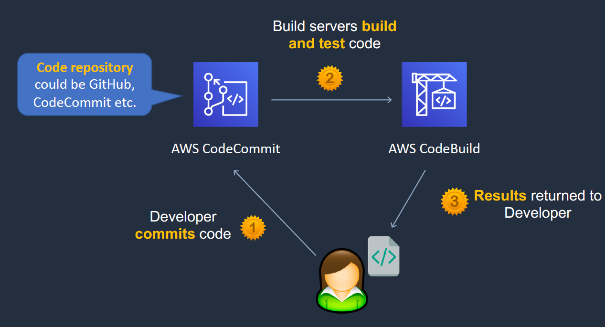

### Contious Delivery:

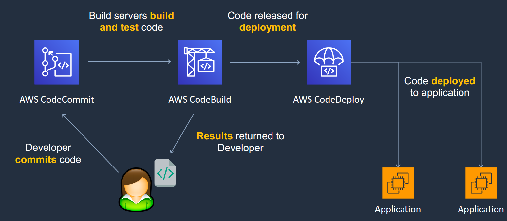

### CI/CD Pipeline:

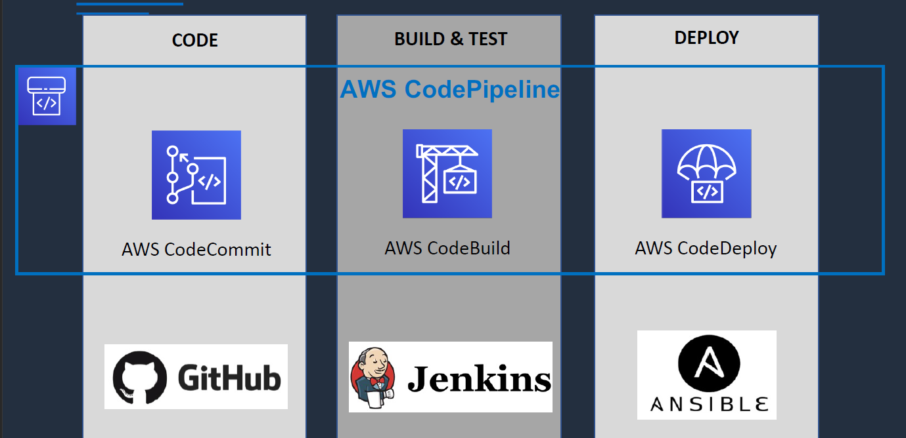

## AWS Code Commit and CodePipeline:

- AWS CodeCOmmit fully managed version control management system.
- Its encrypted and private.
- It scales seamlessly, and intergrated with jenkins and other third party tools.
- IAM supports code commit.
- Need to configure git client to communicate with the code commit.
- IAM supports 3 types of creds for code commit
    - git creds: for HTTPS  
    - SSH  keys: for over the CLI
    - AWS Access keys : these can be used with https.

- CodePipline: 
- Fully managed continous delivery service. 
- Automates all the build, test and deploy stages.


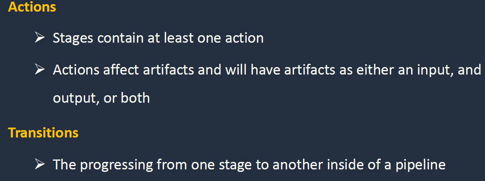

## AWS CLoud Formation:

- Its bascially IaC service which helps in creation  of Infrastructure.

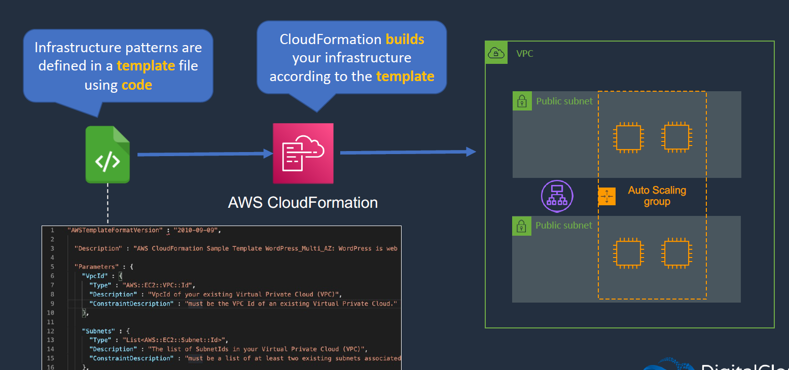
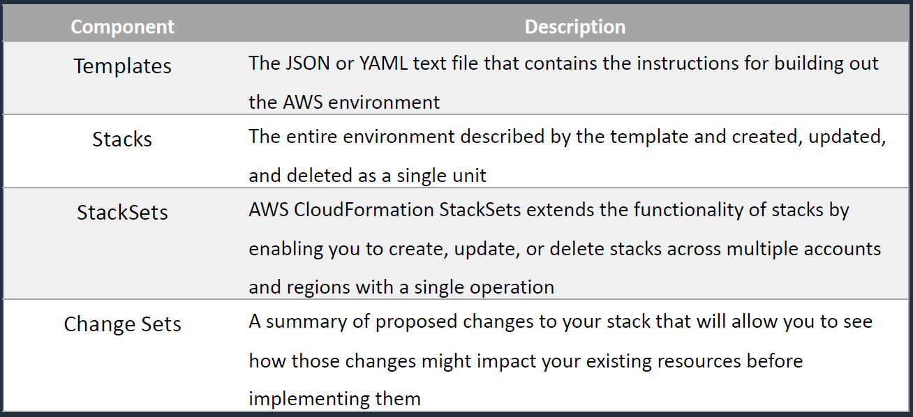

## AWS Service Catalog:

- AWS Service Catalog  allows orgs  to create and manage catalogs of IT services that are approved for use on AWS.
- We generally create a template which contains the products. this product is added to the portfolio to which we grant perms who can spin those stuff.
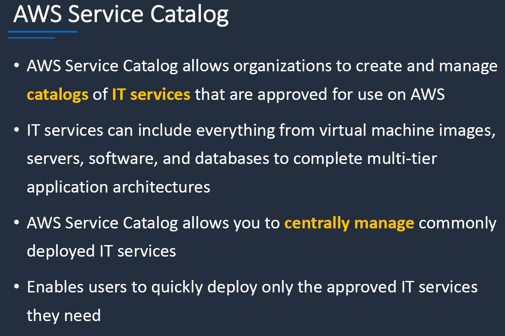
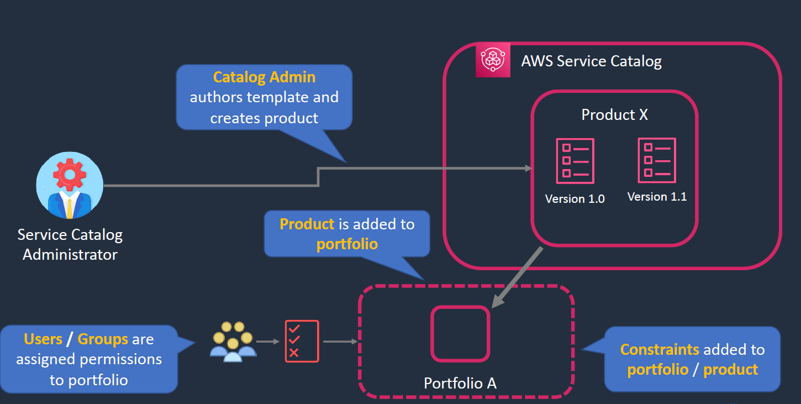

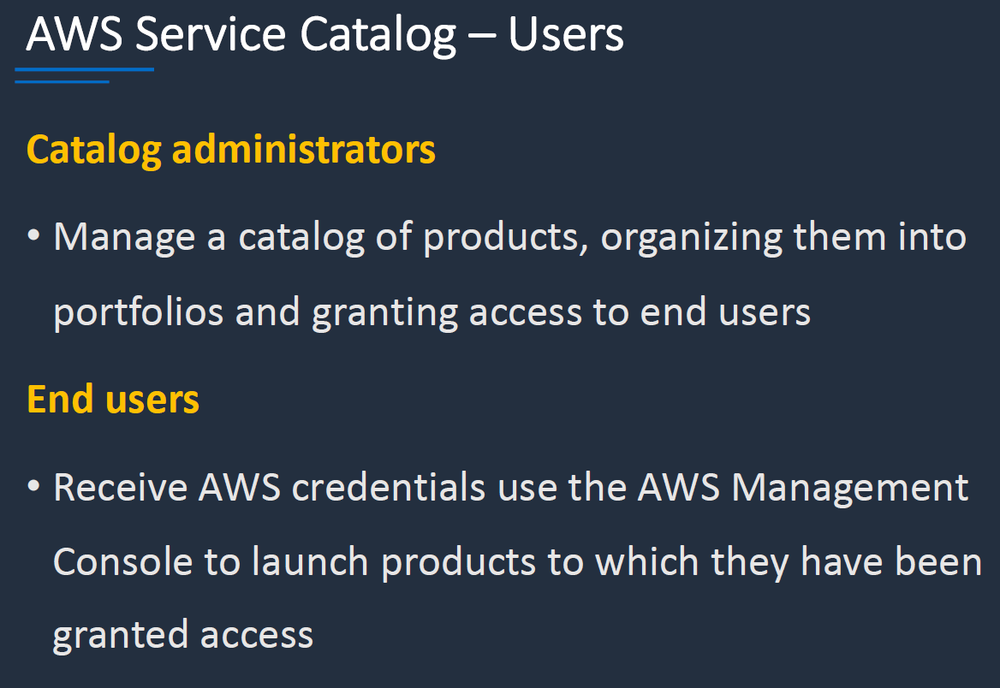
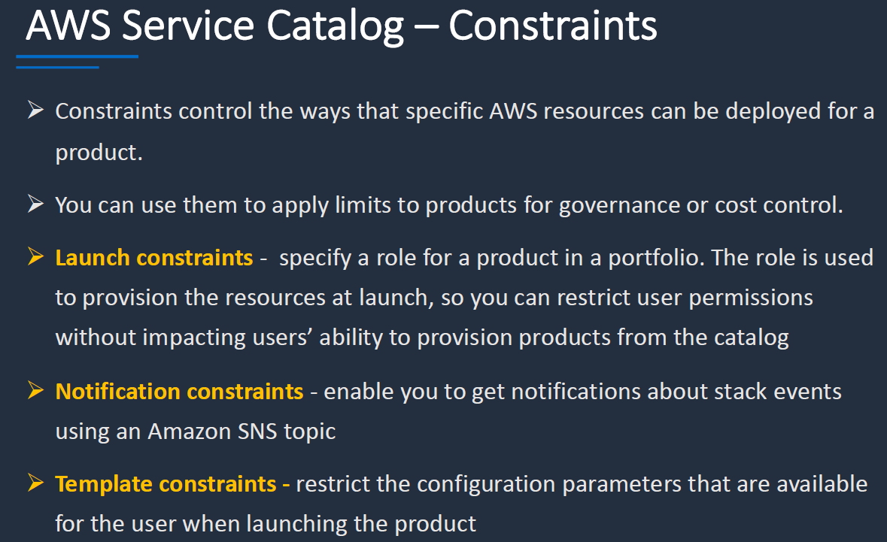
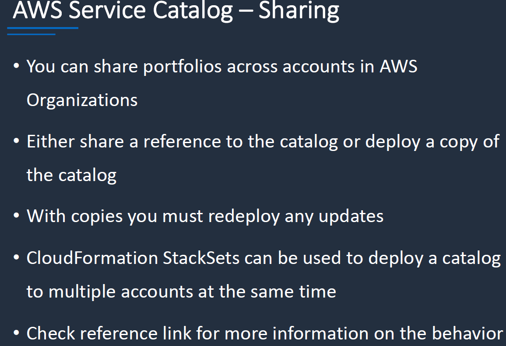

#### LAB:

1. codepipeline : EBS
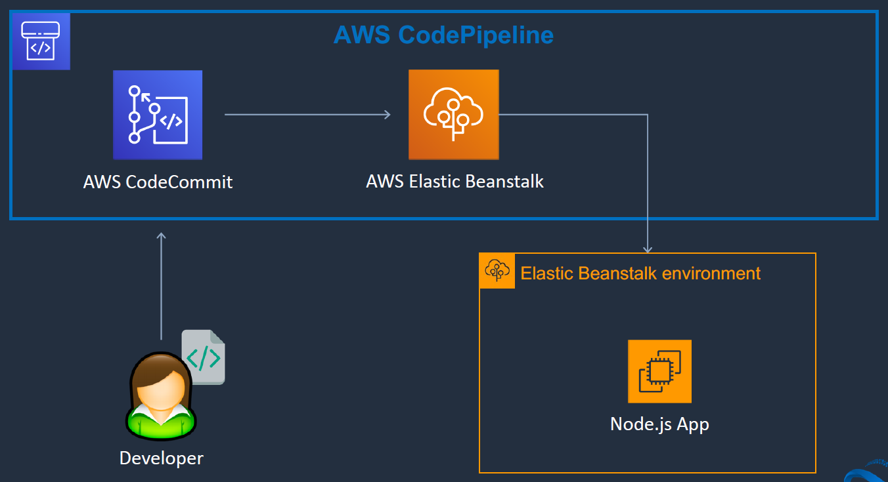
 - go to dev tools > create codeCommit and further make the pipeline

2. AWS Service Catalog:
    - 
```

