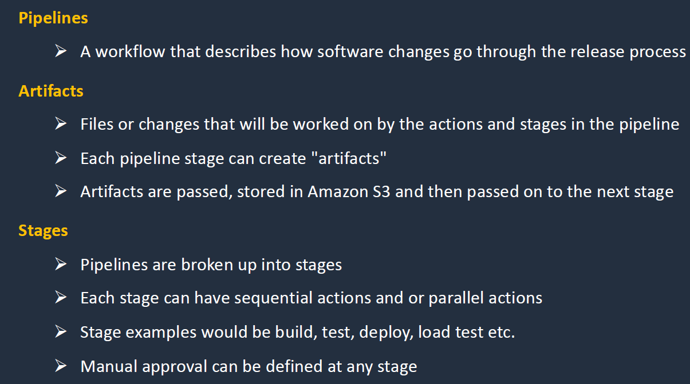

# Deployments & Management:

## CI/CD Overview:

### Continuos Integration:

### Contious Delivery:

### CI/CD Pipeline:

## AWS Code Commit and CodePipeline:

- AWS CodeCOmmit fully managed version control management system.
- Its encrypted and private.
- It scales seamlessly, and intergrated with jenkins and other third party tools.
- IAM supports code commit.
- Need to configure git client to communicate with the code commit.
- IAM supports 3 types of creds for code commit
    - git creds: for HTTPS  
    - SSH  keys: for over the CLI
    - AWS Access keys : these can be used with https.

- CodePipline: 
- Fully managed continous delivery service. 
- Automates all the build, test and deploy stages.

## AWS CLoud Formation:

- Its bascially IaC service which helps in creation  of Infrastructure.

## AWS Service Catalog:

- AWS Service Catalog  allows orgs  to create and manage catalogs of IT services that are approved for use on AWS.
- We generally create a template which contains the products. this product is added to the portfolio to which we grant perms who can spin those stuff.

## AWS CLoud Development Kit:

- Its an open source software dev framework. To define app in familiar programming language.
- Basically we can write in python and pass it to CloudFormation.
- With CDK we can download the infra components and model the workflows and pass it to CloudFormation.

## AWS Serverless Application Model:

- Its provides a shorthand syntax to express functions, APIs, DB and event source mapping.
- Basically to provision serverless application using the CloudFormation.
- We have to upload the SAM YAML config  whith which we decalre the reosurces and store in S3.
- If we see tranform: serverless its an SAM template.

## AWS System Manager:

- Its used to manage AWS Resources mostly being EC2.

- **Automation**: Here we have Documents written  in json or yaml in which we have what action needs to be taken. These are fed in system mgr automation which performs the written task.
- **RUn** : ex if we want to list the missing updates we have run this commands. Run commands check for the updates on the EC2 instances.
- **Inventory**: This gives a inventory of resources we are managing. we to install the agent on the instacnes.
- **Patch Mgr**: this helps in deploy patch for OS and software across the EC2 and other instances. we can specify time when the patch is need to applied. It helps in scan instances for patch complaince and configuration inconsistencies.
- **Session Manager**: Secure remote mgmt of your instances at scale without logging    into your own servers. we dont need to SSH and have bastion host or remote power shell. Can store session  logs in S3 and output to cloudwatch logs. Requires IAM permission for EC2 instance to access SSM, s3 and cloudwatch logs. we are connecting  based on the system manager agent enabled on the EC2 instances.
- **Parameter Store**: we can stored env variables, passwords and strings. we can ecrypt them as well. We can reference the value using the unique name. AWS SECRETS MANAGER automatically rotate the keys natively which is the main diff b/w the two.

## AWS OPsWorks:

- its a configuration management services that provides manged instance of chef and puppet. 
- Updates including pathing, configuration, backup and compliance management.
- All though the above capabilites are with system manager, but the newly migrated ones might still use the chef and puppet this is used for those specific use cases.

## AWS Resources Access Manager:

- Its a service we use to share resources across aws accoutns or orgs as well.

- Ex: we can share a subnet within the mutiple accounts.

# Architecture Patterns:

#### LAB:

1. codepipeline : EBS

 - go to dev tools > create codeCommit and further make the pipeline

2. AWS Service Catalog:
    - Checkout the service cataog folder.

3. AWS Systems Manager:
    - We need to install the system manger agent and give the EC2 reuired permissions.

4. Share a subnet across mutiple accounts (AWS RAM):

    - got to aws ram and settings enable sharing with AWS Orgs
    - create a resource share > choose the subnet > show org structure or another account > we can share with whole org or individual accounts.
    - now check the subnet in both the accounts.
