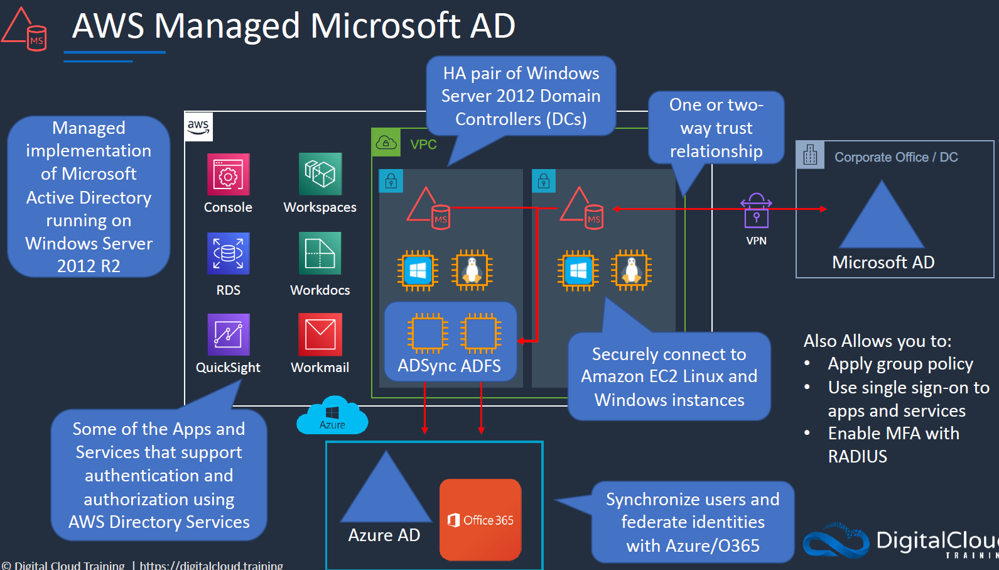
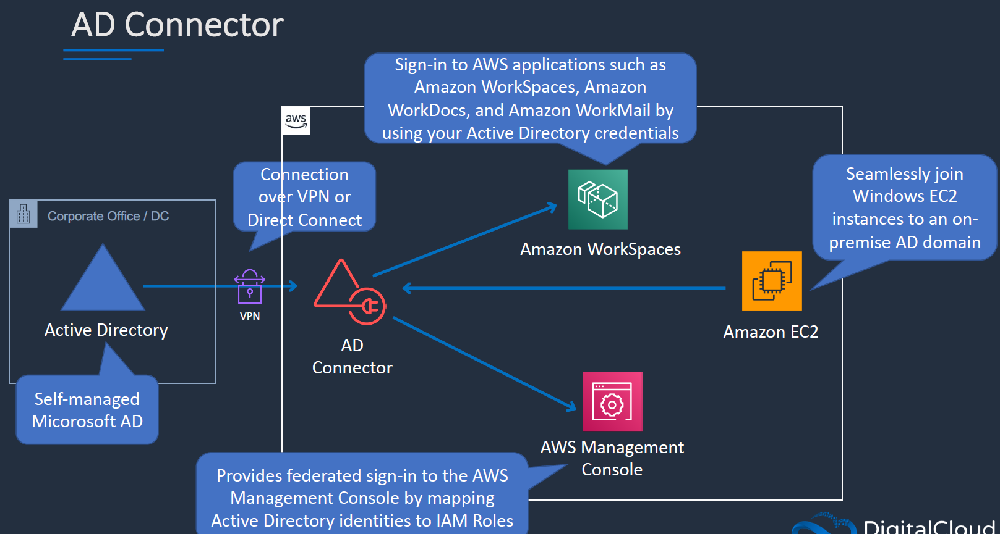
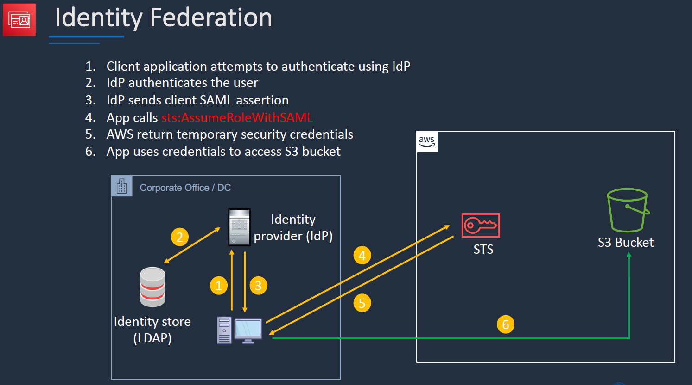
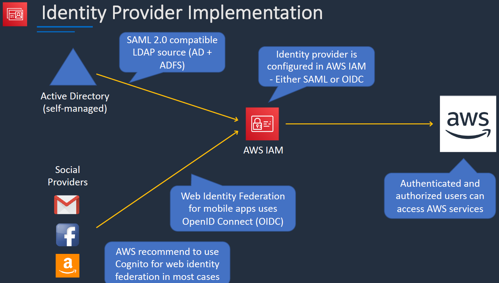
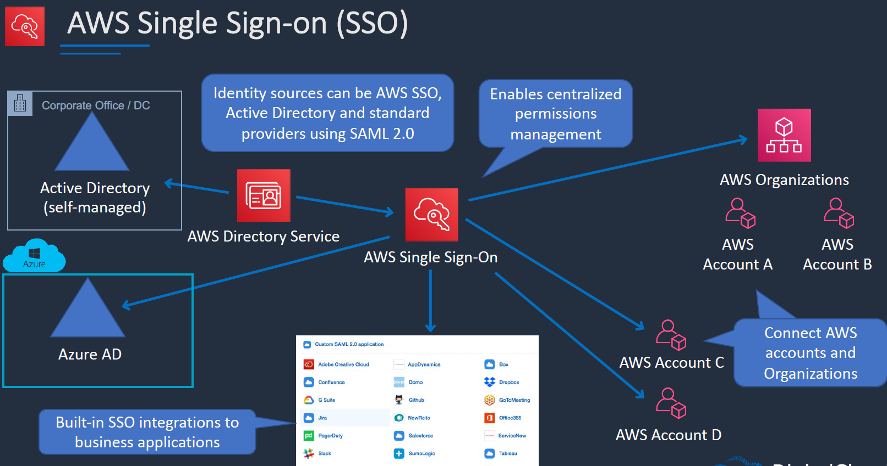
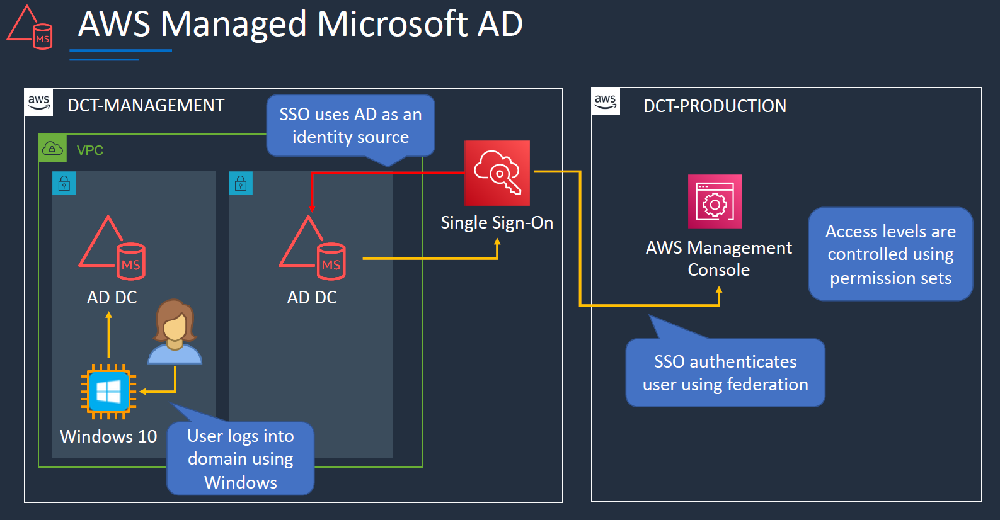
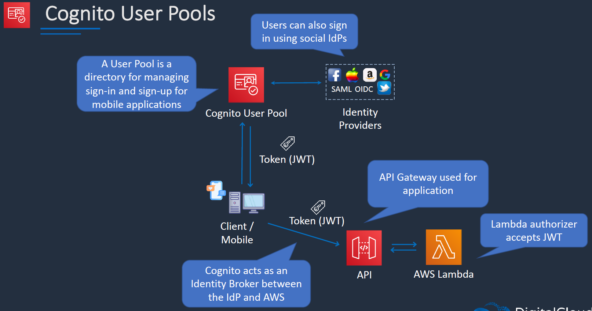
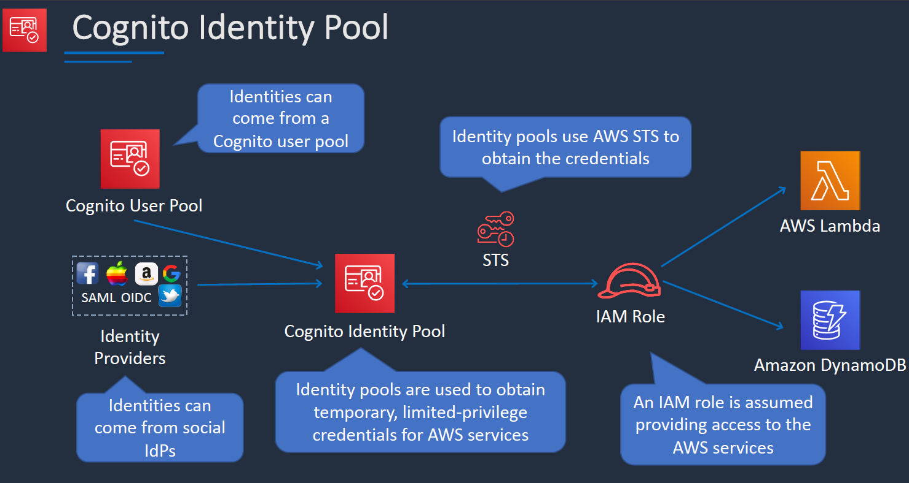
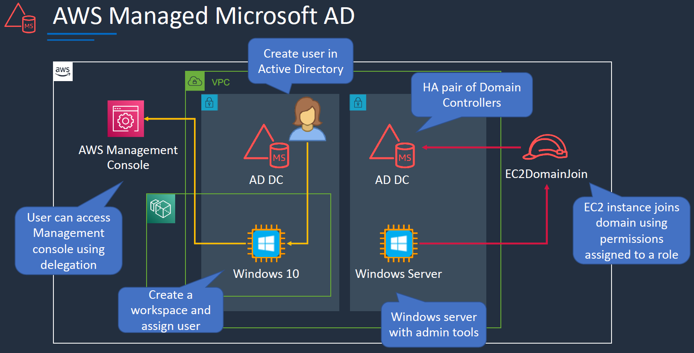

# Directory Services

- There are few services that support the Directory services within the AWS.
1. AWS managed microsoft AD:
    - This is mananged implementation of the microsoft AD running on windows server 2012 R2.
    - This deploys multiple servers across AZ in a region.
    - If you already have corporate AD you can connect that over the VPN and create a trust relation.
    - you can create one way or two way trust relationship(concept to microsft AD).
    - two way means users in both the cloud and on-prem will be able to authenticate.
    - you can alsp connect to azure AD& office 365 using ADSync & ADFS(federation service)
    - some of the few apps and services that support AD are workdocs, workemail etc.

2. AD Connector:
     - we have a on-prem AD that is where we stored all user accounts.
     - we want that users to use services in AWS.
     - we connect to AWS via VPN and AD Connector. 
     - then we can enable SSO to to AWS Services like workspaces, workdocs etcs using AD credentials.
     - It also provides a federated sign-in to AWS Mgmt console by mapping AD identites to IAM roles.
     - we can also join windows EC2 instance to on-prem AD using AD connector.

## Identity Federation:

- Its a system where we have mutiple identity services. (fb,amazon,ad on-prem etc.,.)
- SERVICES: AWS SSO (prefered)
    - Central mgmgt for federated access
    - attach mutiple aws accounts
    - identities can be in AWS SSO
    - works with many IdPs
    - perms asssinged  based on grp membership in IdP
- AWS Identity & Access Management:
    - Can use seperate SAML 2.0 or OIDC IdPs for each accpint.
    - enable access cotnrol using user attributes.
    user attributed can be at cost center, job role etc
- AWS Cognito: (mainly for mobile and web apps)
    - Federation for web and mobile apps
    - provdies sign-in and sign-up
    - supports IdP like fb, google, apple
    - Supports IdP using SAML 2.0

### IAM Identity Federation:

- We have a corporate AD and IdP on-prem. once the user is authenticated on-prem.
- after the authentication client will call sts:AssumeRole with SAML API action, ten client will ave acces to the resources within aws

### AWS SSO(Single Sign on):

- We can use  AWS SSO Idnetited or AD on-prem via AD Connector or Azure AD  or Applications running SAML 2.0  ( third party jira and other monitoring apps)
- we can also connect to AWS Orgs and single accounts.

### AWS Cognito:

- Mainly used for MOBILE and WEB Applications
- Cognito User Pools:
    - Its a directory for managing sign-in or sign-up for mobile apps.
    - we can have identities associated with the user pools.
    - it sends a JWT token to the client. which helps in auth for API and Lambda functions.
    - Cognito acts as broker b/w IdP and AWS.

- Cognito Identity Pools:
    - Identity pools are used to obtain tmp access, limited access.
    - these can come from cognito user pool or IdP from OIDC
    - then we have an STS to obtain tmp creds to access AWS Resources.

### Labs:

#### AD

- Directory Services > setup directory > AWS managed microsoft AD > create a private DNS name (train.aws) > choose VPC along with subents > creation takes almost 20 min.
    - enable application URL 
    - enable mgmt console
    - we can edit session role.
    - we can enable another trust relationship.
- create roles ec2 domain join (to access AD via a windows server) > choose ec2 > amazon SSM directory & managed instacne core policies
- creating role for delegation > poweruser access policy > create a role ad-poweruser. (role created for directory services where we can add multiple users within the AD for the AD to delegate their access) 

#### Connect using AWS SSO:

- We are going to connect AWS SSO to AWS managed AD account.

