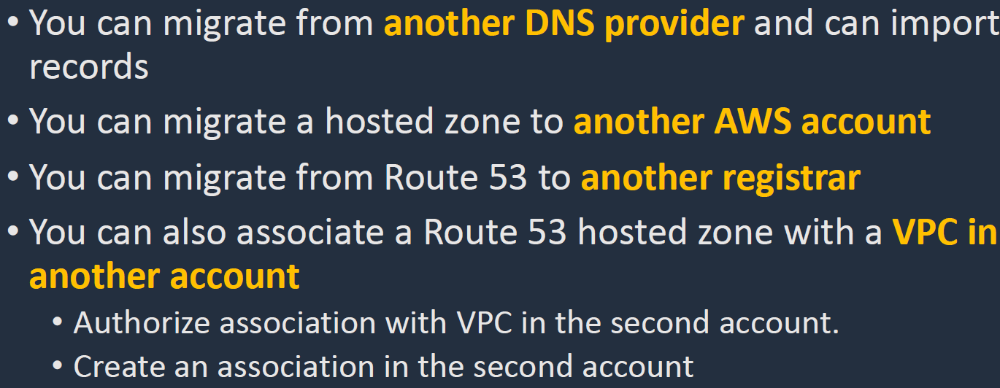
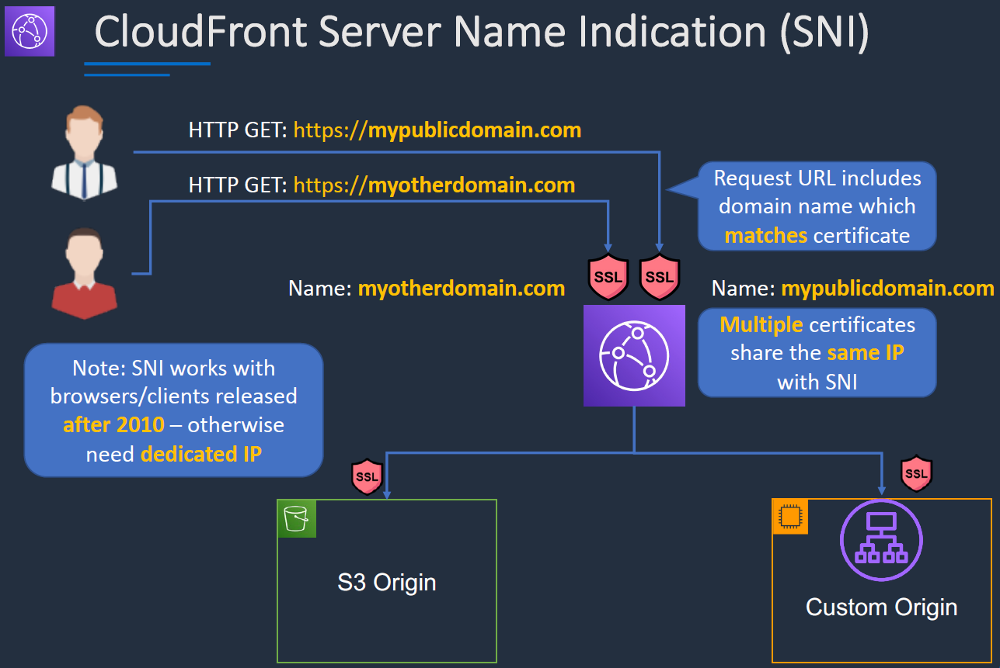

# ROUTE 53

## Route 53 Hosted Zones:

- We have Private Hosted Zones and Public Hosted Zones in Route53
- We have to create a hosted zone(file containing the dns recorrds) (example.com) in which we can enter our Routing Records. If the hosted zone has a public facing its called Public Hosted zone.

- We might have an Internal Domain and we can associate it to an VPC.
- the resources inside the VPC will get automatically an DNS name via DHCP.
- We can change the DNS if we want a different one using private hosted zone addresses.
- these are known as private hosted zones.

- You can migrate from another DNS provider and can import records & Vice Versa.
- you can migrate to another AWS account your hosted zone.
- we can associate route 53 hosted zone with a VPC in another account.

## Routing Policies:

- There are many routing policies that are available.

- Ex: Weighted routing policy used to try new app by directing traffic say 10% to new app.

## Route 53 Resolver:

- If the DNS server doesnt have the final IP address and keeps forwarding it to the next until the result is shown.
- We might have internal DNS in our company. It only responds to the internal computers not from the outisde world. Route 53 can also be used as a Internal DNS resolver.
- We can bring them together and the resolution takes place.

### Outbound Endpoints:

- We have a private VPN connection b/w on-prem and AWS.
- Outbound Endpoint helps resolve the DNS queries with our on-prem DNS server.
- Ex: ec2 server might go to the Route53 and it gives outbound endpoint which is then forwarded to the DNS Server on-prem via the VPN Connection.

### Inbound Endpoint:

- Suppose if the client in the on-prem wants to resolve a record in the Route53 then we need to have an Inbound Endpoint.

## AWS Cloud Front: 

- Content is being pushed from the edge location by enabling caching.

- When we create a cloudfront distribution it gives us a DNS name.
- it might have one or more origins (s3 origin and custom origin ec2 server)
- we might have behavioural patterns that we can set.

### CloudFront Caching:

- There is a Regional Edge Cache(12) which can hold large amounts of content and within that we have many edge locations(210).
- Edge Location is a Point of Presence(POP) i.e it is where users connect.
- the object present in the cached TTL time. (24 hours by default)

- Decrease TTL is good for dynamic content.
- We can define max TTL and Default TTL.
- After TTL it fetches the new object.

### CloudFront Path Patterns:

- We have CloudFront Distribution we can behviour what to forwarded to which origin. We can specify the default as well.

### CF Signed URLs and Origin Access identities(OAI):

- Signed URLs proivde more control over the access to content.
- They have a expiration date and restricted to that individual file/page

- Signed Cookies. Use signed cookies when you want to provide access to mutiple restricted files.

### CF OAI:

- CF Origin Access Identity. When users do a GET on the CF URL.
- It fetches the stuff from S3 using OAI user account.
- The bucket policy only allows the OAI user account. Objects gets perms granted if the user circumvents the CF then its blocked by bucket policy.

- In case of EC2 we need to whitelist the Ip address of the nodes of the CF.
- We can attach WAF ACL to the cloudfront to tackle malicious attacks.

## CF SSL/TLS and SNI(Server Name Indication) :

- We can issue SSL Cert using ACM(region us-east-1 as CF is global ) or Third Party
- S3 will have its own certification so we can connect to it directly. for custom origin we need enable the certificates.

- If we have mutiple domain names we can use mutiple certificates share the Same IP.
- this is achieved via SNI.

## Lambda@Edge:

- Run Node.js and python lambda functions to customize the content CF Delivers.
- This can be run at mutiple ends. this is manily helps in rendering the content faster and efficiently.

## AWS Global Accelarator:

- its a networking service used by AWS Network to escape public internet.
- Users get routed via Route53 using domain name of GA endpoint.
- We need to resolve the DNS name of GA to IP address/ALB etc as listeners.
- We can have multiple IP that leads to the application.
- Once its done you are directed to the closest edge location. then from there we connect to the static any cast IP address via the AWS GLobal Network

###### LABS:

- test routing policies

- cache and behvioral settings.
    - CF > creaet distributions > create bukcets.(origin1 and origin 2) > later we can create mutiple origins in the origin page. > now change the behaviour to redirect to required path.

- create GA