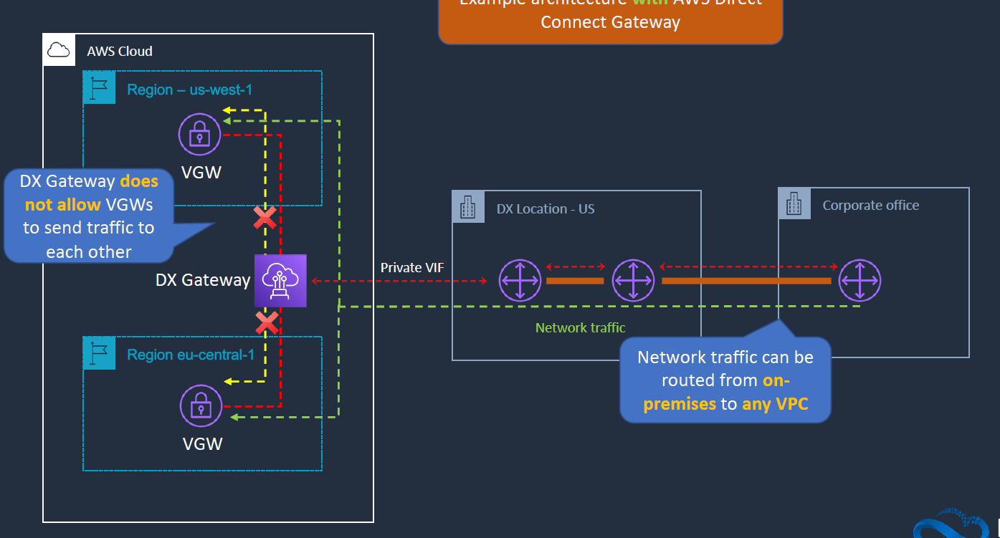

# Hybrid Connectivity:

- Hybrid connectivity refers to the mutli cloud connectivity, cloud to on-prem connectivity and all kinds of connections.
- In AWS we have AWS Transit Gateway and AWS Direct Connect.
- We generally have a Client VPN connection and Site-to-Site VPN Connection etc.,..


## AWS Client VPN:

- This is the way to connect your on-prem data centre to the AWS by using the private IP.
- We have to create a VPN endpoint. The VPN endpoint are associated with the subnets.
- So the client VPN network interfaces are created in the subnet.
- We have to choose from the available VPN options.
- The VPN Endpoint actually does the source-dest NAT functionality.
- In the client route table we need to addd the Gateway end point IP address. Then the communication is enabled as the private.

- the traffic here sent is over  the internet unlike the VPC peering that happens on AWS Network.
https://docs.aws.amazon.com/vpn/latest/clientvpn-admin/cvpn-getting-started.html


## AWS Site-to-Site VPN:

- The other type of VPN we can establish is site-to-site VPN. 
- this way we can connect a customer data centre to AWS using the encrypted connection. 
- once established we can connect using the private IP addresses.
- In this setup we have VGW(virtual private gateway) on AWS and customer gateway on the data center for the encrypted connection.
- Make sure to add a Route table to the VGW in the subnet.


- https://docs.aws.amazon.com/vpn/latest/s2svpn/VPC_VPN.html

## AWS VPN Cloud hub:

- Its a service we can find in the AWS Console. Its  a architectural pattern when you use site-to-site VPN.
- If we have mutiple on-prem envs. All the on-prem data centres to VGW in hub and spoke model.
- Each on-prem dc one must have a unique BGP ASN. BGP is a protocol that you can use for advertising routes to diff parts of network. each data centre has its own uique ASN.
- Then we can establish a connection to VGW to each on-prem data centre. 
- This not only helps in reaching the AWS VGW we can also use this comunicate with the on-prem data centres.


## AWS Direct Connect (DX): (takes weeks to months to provision)

- its provides connection on-prem to AWS via a private connection. Its gives advantanges like bandwith and latency.(costs more)
- to connect on-prem to AWS via DX we need to connect to something called AWS Direct Connect Location.
- It does have something called AWS cage(AWS Networking equipment) and partner cage.(partner networking euipment)
- both are connected to each other via DX Port containg the DX router for both AWS and customer.
- Then we need to connect the AWS and Customer routers to this DX routers.
- the speed can be 1Gbps to 10Gbps


- Once the physical connection is established, we then have to create a VIF (virtual interface)
- we have bothe public and private VIF.
- the private VIF connects to a single VPC in the same aws region using a VGW.
- Public VIF used to connect AWS privates services but not internet.
- In case if we have mutiple VPCs , we then can have muitple VGW connected a mutiple private VIFs

- VIF alo canbe shared with other AWS Accounts. those are known as hosted VIFs. (speeds range from 50mbps to 500 mbps)
- DX connections are not encrypted. Use IPSec S2S VPC connection over a VIF to encryption.


- **DX Native HA**:
    - AWS supply the connection from region to AWS DC Location that are already reduntant.
    - The connection from  the corporate Data centre can be an issue.(there are many single point of failures in the form of routers and wires)
    - In order to overcome we might have mutiple wired connections. We can have mutiple DX location connected to the data centre as well.
    
    - we can also have a VGW connection over the internet as a backup.
    

- **AWS Direct Connect Gateway**:
    - example architecture if we DO NOT use direct connect gateway
    
    - advantanges if we use Direct Connect Gateway.
    
    
    - it can't route regional traffic via DX Gateway though.

## AWS Transit Gateway:(Imp)

- Consider we having mutiple peering connections if we have n no.of VPC it gets complicated to have those many number of VPC Peering links like below.

- This where the Tansit Gateway comes into help. Instead of having mutiple VPC Peering connections it becomes a transit hub for all the VPC to connect to each other.
 
- If we are using a transit gateway and connecting to the corporate data centre then we need to use the DX Gateway(create the transit VIF accordingly).


##### LAB AWS Client VPN:

- connect the windows machine spun up in AWS Workspaces and generate few certs for mutual auth over the VPC endpoint.
- spin up a windows 10 machine from workspaces, copy the clients link and navigate to the web page and download the software to connect to the windows machine.
- https://docs.aws.amazon.com/vpn/latest/clientvpn-admin/cvpn-getting-started.html
- you can follow the above Doc to do a lab.


##### LAB site to site VPN:

- we need a client dc to connect we can create one in different account.
- create a system like below. make sure to make changes to the route table accordingly.

- follow below steps 

```
# STEP 1 - Launch EC2 in ON-PREMISES VPC (Production Account)

# Launch EC2 instance:
#	• Disable source/destination checks
#	• Public subnet
#	• Security group: 22, ICMP=ALL
#	• Make a note of the public IP

# STEP 2 - AWS VPC Configuration (Management Account)

# Launch EC2 instance:
#	• Public or private subnet
#	• 22, ICMP=ALL

# Create a customer gateway:
#	• Name: AWS-VPC-CGW
#	• Routing: static
#	• IP: public IP of on-premises EC2

# Create VGW
#     Name: AWS-VPC-VGW
#     Attach to VPC

# Create a VPN connection:
#	• Name: ON-PREM-AWS-VPN
#	• Target type: Virtual Private Gateway
#	• Select the CGW and VGW
#	• Routing: static - enter prefix: e.g. 172.31.0.0/16, 10.0.0.0/16

# Download VPN configuration as OpenSwan type

# STEP 3 - Enable route propagation for AWS VPC route table selecting the VGW (Management Account)

# STEP 4 - Configure OpenSwan on ON-PREMISES VPC EC2 Instance (Production Account)

# Run commands:

sudo su
yum install openswan -y
nano /etc/sysctl.conf

# Add:

net.ipv4.ip_forward = 1
net.ipv4.conf.all.accept_redirects = 0
net.ipv4.conf.all.send_redirects = 0

sysctl -p

nano /etc/ipsec.d/aws.conf
# Paste the tunnel configuration for TUNNEL 1. This can be obtained from the file we downloaded last task of step 2. Example:

conn Tunnel1
        authby=secret
        auto=start
        left=%defaultroute
        leftid=<Public IP of OpenSwan/CGW>
        right=<Public IP of VGW - Tunnel 1>
        type=tunnel
        ikelifetime=8h
        keylife=1h
        phase2alg=aes128-sha1;modp1024
        ike=aes128-sha1;modp1024
        keyingtries=%forever
        keyexchange=ike
        leftsubnet=172.31.0.0/16
        rightsubnet=10.0.0.0/16
        dpddelay=10
        dpdtimeout=30
        dpdaction=restart_by_peer

## IMPORTANT: REMOVE auth=esp from the code above if present

nano /etc/ipsec.d/aws.secrets
# Add single line: 54.169.159.173 54.66.224.114: PSK "Vkm1hzbkdxLHb7wO2TJJnRLTdWH_n6u3"
# ** The above can be found in the downloaded config file - MUST be updated with correct values ***

# Run commands: 

systemctl start ipsec
systemctl status ipsec

# Connection should now be up
# Test by pinging in both directions and use additional host in on-premises DC to ping EC2 instance in AWS VPC (update route table)

```

###### LAB 