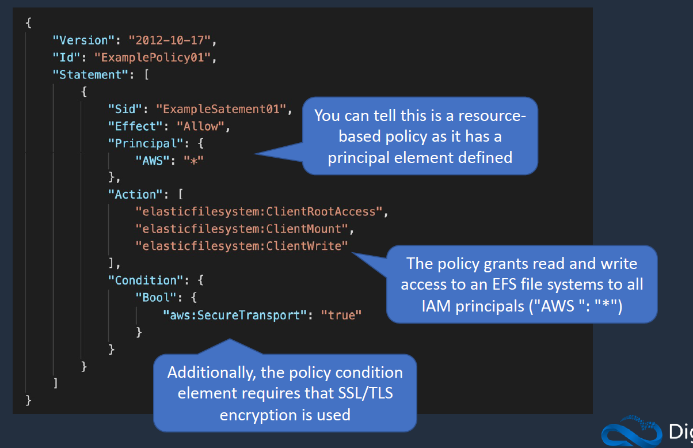

# IAM:

- We can talk to AWS using the AWS CLI, API(programmatic access), Console.
- Whenever we talk to AWS we basically authenticate using AWS IAM.
- There can be few expecptions where we can directly talk to AWS resource ex: S3 bucket to an anonymous user.
- Whever we perform an operation on AWS resources. A request context is formed. Where it verifies  whether the prinicpal(the one requesting the operation) has the authentication and authorization.
- Authorization is done via the IAM policies called Identity Based Policies(Applied to users and roles) and Resource Based Policies(Applied to AWS resources ex:S3 bucket)

## Overview of Uers, Groups, Roles and Policies:

- A Group bascially consists of one or more users.
- Then we can apply a policy to the group. The user gains the permissions attached to group via policy.
- Policies can be attached directly to a user or a group.
- Roles are used for delegation and they are assumed.

### Users:

- We can create upto 5000 individual user accounts. users have no permissions by default.
- Each user will be having a friendly name like sai and a **Amazon Resource Name** (which is unique and assigned to each and evey individual and resource)

### Groups:

- We can create multiple groups and add users to those groups.
- Groups are collection of users and we can add a user up to 10 groups.
- groups are used to apply perms using policies.

### Roles:

- A role is an IAM identity that has specific permissions.
- It is like an IAM user in terms of functionality.
-**We cant attach IAM Role to a user or group. They can just assume them**
- https://aws.amazon.com/iam/faqs/ 
- Roles are assumed by users, application and services.
- we gain short term acces using sts:AssumeRole to gain access to the resources.
https://aws.amazon.com/premiumsupport/knowledge-center/iam-assume-role-cli/#:~:text=Create%20the%20IAM%20role%20and%20attach%20the%20policy&text=Because%20this%20IAM%20role%20is,account%20to%20assume%20that%20role.

### Policies:

- Policies are docs that define the perms and are written in JSON
- User based policies are applied to users and Resource based policies are applied to AWS services.

## IAM Authentication Methods:

- Authentication can be done using username, password and also by MFA.
- We can authenticate programmatically using Access Key and Secret Key via CLI.
- Others we have services Signing Certificate to authenticate some o the services like EC2 SOAP and CLI interfaces.
- We have SSH/HTTPS git creds to authenticate to the AWS Code Commit.
- Keyspaces to authenticate to AWS keyspaces.

### AWS Security Token Service(STS):

- This is the service that provides the short lived or temp access.
- EX: consider we have an EC2 and that needs to access S3 this can be done by using something called Instance Profile (IAM role)
- It with the help of STS Assume Role gets the temp credentials which include (AccessID, Expiration, SecretKey, session token)
- To the Instance profile IAM role will have two policies attached namely Trust Polciy and Permissions Policy.
- Trust Policy: It Controls who can assume this role. like EC2 or EBS etc..,,
- Permissions Policy: It controls what level of access resources has.

### MFA:

- multi factor authentication helps in adding an extra leayer of authentication.
- Ex: mobile key based token authentication.

## Identity-Based and Resource-Based IAM Policies:

- JSON based perms policy docs that control what actions an identity can perform, on what resources under what conditions.

### Identity Based Policy:

- There are few ways in which we can identity based policies.
- Inline Policy: Which we can use the specific user, group or Role (delete the user policy is deleted)
- Managed Policy: AWS managed and Customer managed policies. Customers policies are created by user and can be attached to the users/groups etc.,.

### Resource Based Policy:

- Resource based polices are JSON policy that you attach to resources like S3. lambda etc.
- These are written slightly different to the Identity Based ones. where we have principal we can mention who can perform the actions.
- We can attach resource based to policy to an IAM role. 
- Ex: trust based is referred to resources where as permissions are used in user cases.

## Access Control Methods (RBAC & ABAC):

### RBAC:

- Where we create multiple groups where we keep users and attach policies to that group. So if we add a user to the group he will assume that role.
- Here we can give least access to the user.
- AWS has also pre created few policies which we can leverage like admin, support, security. 

### ABAC:

- Attribute Based access control where we use attributed like tags to define access to a resource.
- In the below ex we have who has a tag dep and value. these are way of assigning metadata to a resource.
- We have policy attached to the group but we can mention the particular tag should be matched by the user only then oerms will be matched. These are important to give which env based access to the users in the group.

- **try doing in lab**

## Permissions Boundaries:

- If a user  has full access to the say Ec2 and s3, we can also set a permission boundary to see max perms that particular user can have.
- Perms boundaries are attached to user or roles.
- Ex: if user has IAM policy but perms bundary can restrict the user to do certain things.

- **Privilege Escalation**: Say if a user has a IAM admin role. then the user will be able to create a user and assign admin perms. so we can restrict the user to do any other actions on the AWS or newly created user by IAM admin  has fewer access.

## IAM Policy Evaluation Logic:

- Refer the below pic AWS flows the perms.

- **Note**:  Observe that the resource based if there is an allow its allowed directly without checking for the perms boundary, assume role, IAM policy. (https://docs.aws.amazon.com/IAM/latest/UserGuide/reference_policies_evaluation-logic.html)
- Check the below slide.

- There are various types of policies in AWS namely.
    - Identity based, Resource Based, IAM Perms Boundaries, AWS Orgs SCPs

- Evaluation takes place in mutiple steps:
    - All the common between Identity based, resource based, SCP & perms boundaries are allowed.

## IAM Policy Structure:

- JSON document is the basic structure of the policy structure.
- this differs for the Identity and Resource based policies( we can identify reosurce based policies  if there is principal in it.)
- Identity

- Resource

- Below example shows identity policy to gives access to a particular user for a particular bucket.

## Use Cases for IAM role:

- **Cross Account Access:**
- Suppose we need a User in Account B able to access S3 bucket in Account A.
- This can be achieved by sts:AssumeRole by user in account B via a trust policy where can mention the specific account or arn in the trust policy.

- **Cross Account Access more secure**:
- here we make sure the account B can access S3 in account only if there an externalID specified.
- this sts:externalID is declared in the users policy in the account B as well.

- **Delegation to AWS Services**:
- Here we attach the IAM role to the Ec2 instances via sts:Assume Role.

## Attach Role to EC2 instance:

- Here the user needs to have GetRole as well as PassRole in his IAM perms so that he can pass that role to the EC2 instance profile. he also needs create,add,associate and delete Instance profile.

# IAM Best practices:

