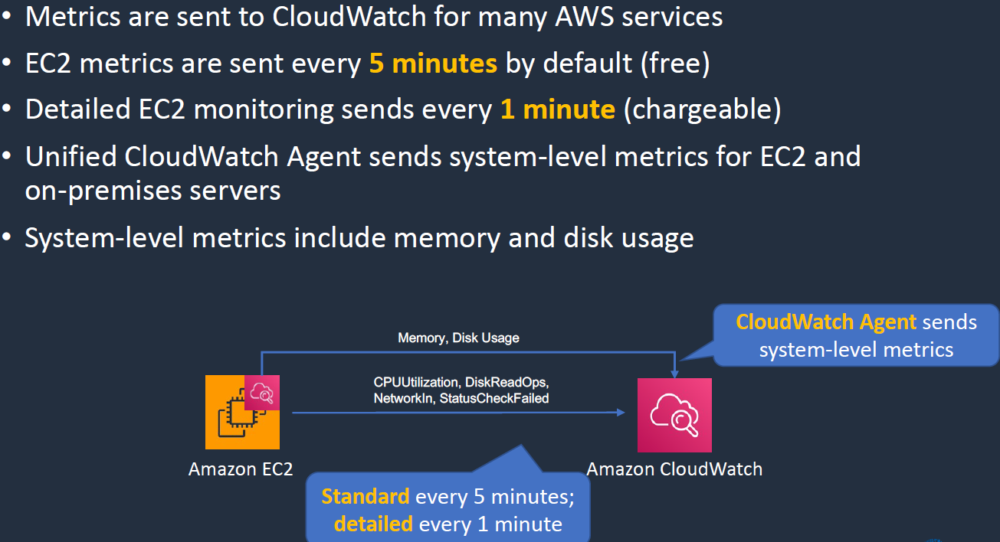
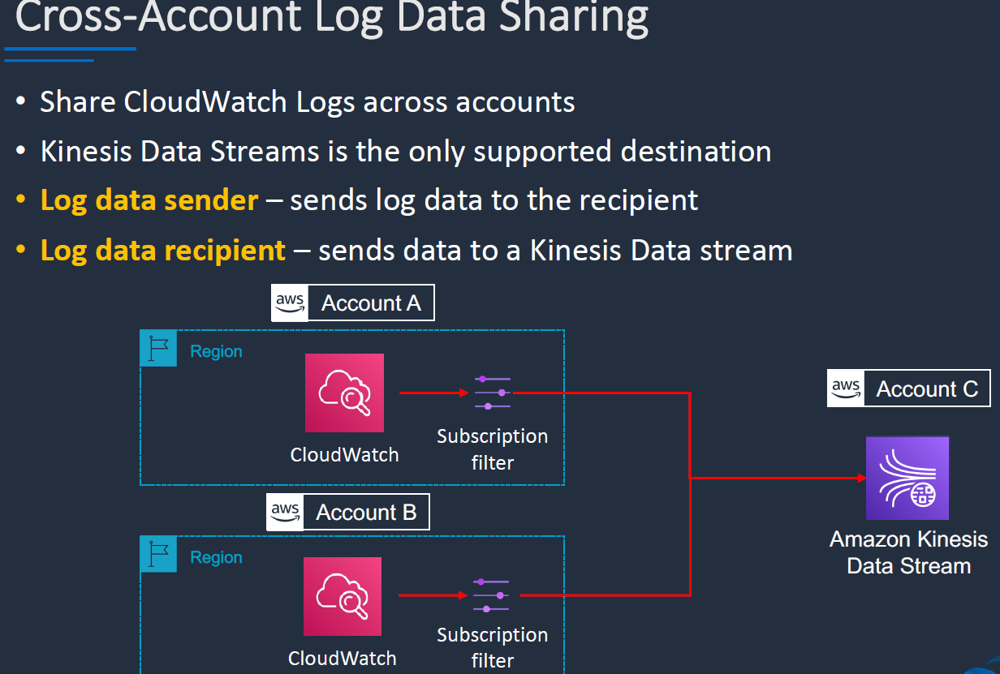
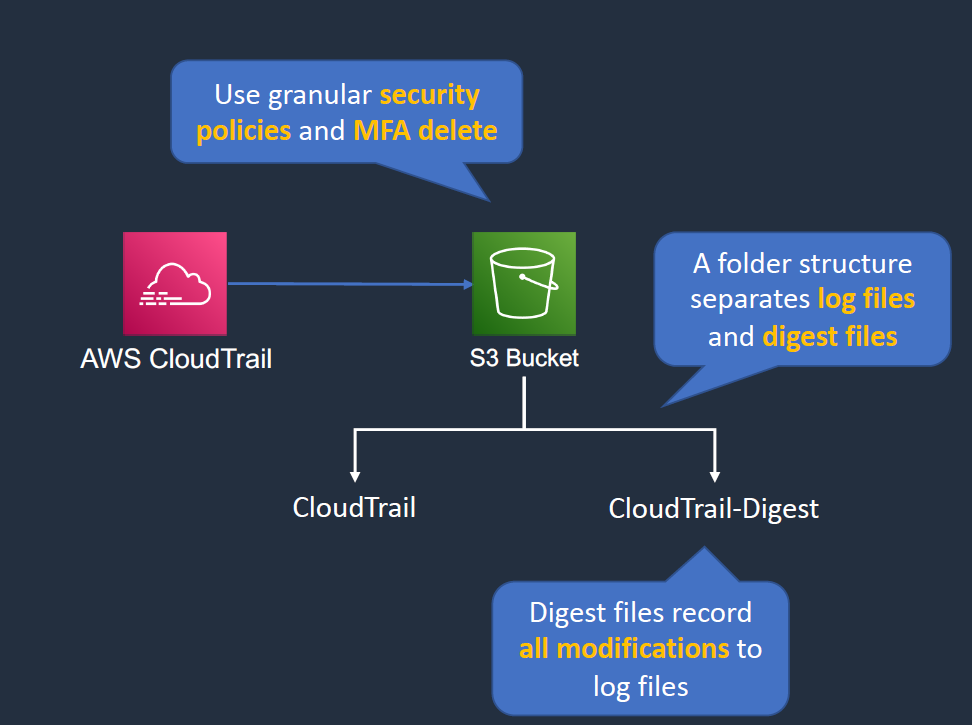

# MONITORING

## Cloud Watch:

- CloudWatch Metrics, CloudWatch Alarms, CloudWatch Logs, CloudWatch Events.

 

### CCloudWatch Metrics:

- We can't include Memory by default in standard metrics we need to enable it additionally.
- every 5 min free, every 1 min chargrable.
- Memory and Disk usage for that we install cloudwatch agent.
 

### CW Alarms:

- Two types of alarms:
    - Metric Alaram: performs action based on a single metric.
    - Composite alarm: uses a rule expression and takes into account multiple alarms.  

 

### CW Events or AWS Event Bridge:

- Event sources can be aws or custom 
- we can set rules what needs to be done for those events and take action accordingly.


### CW Logs:

- Gather application and system logs in CLoudWatch.
- Define expiration policies and KMS ecnryption.
- We can send logs to mutiple tools for storage and analytics.

- logs -> kinesis data firehose -> Splunk

 

#### Cross account logs sharing:

- Cross account log data sharing, we can use the kinesis data stream as supported destination.
 


## AWS Cloud Trail:

- Cloud Trail is used for auditing. 
- We can perform limited API actions. We can choose to retain certains API actions indeinitely. 
- We can have cloudwatch logs for cloudtrail and cerate a cloudwatch alarm for certain metric.(ex:deletion of EC2 instances.)

 
 


### Cloud Trail mgmt event and data events:

- Mgmt Events: changes to the AWS Resources.
- Data Events: Provide Information about resource operations performed on a resource.
 

### Cloud Trail in multi account setup:

 

## AWS X-Ray:
 
 

# Architecture:

 
 
 


### LAB:

1. Export cloudwatch logs to S3:
 
    - Bucket cant be encrypted with the KMS
    - we need to write a bucket policy to enable cloudwathc logs access.
    - create a new bucket > add bucket policy to enable the bucket access(below is the policy)replace the resource arn > 
    - cloudwathc > logs > log groups > we then have mutiple streams > actions > export data to S3.

```
{
    "Version": "2012-10-17",
    "Statement": [
      {
          "Action": "s3:GetBucketAcl",
          "Effect": "Allow",
          "Resource": "arn:aws:s3:::mybucket",
          "Principal": { "Service": "logs.us-east-1.amazonaws.com" }
      },
      {
          "Action": "s3:PutObject" ,
          "Effect": "Allow",
          "Resource": "arn:aws:s3:::mybucket/*",
          "Condition": { "StringEquals": { "s3:x-amz-acl": "bucket-owner-full-control" } },
          "Principal": { "Service": "logs.us-east-1.amazonaws.com" }
      }
    ]
}

```
2. Trigger SSM on Instance Launch:

    - Event Bridge > rule with event pattern > aws evetns > event pattern(aws services > ec2 > ec2 status change notification > any state) > targets > aws servcie > system mange run command > aws fin updates > tar:env > prod > no params > create a new role > review and create
    - ec2 instance role with ssm perms and launch windows instance to check and verify.


3. Enable Cloud Trail Log File validation:

     
    - create new trail > enable encryption > log file validation > create trail
