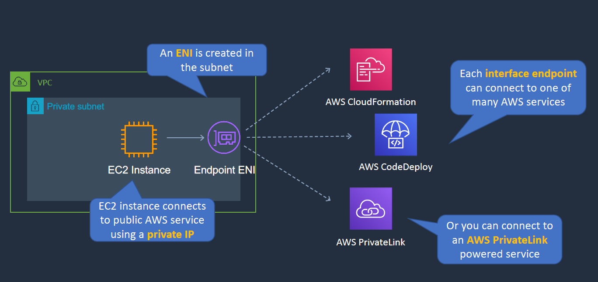

# VPC 

## Defining the VPC CIDR Blocks:

- /24 will give us 256 address (aws reserves the 5 address, first 4 and last one)
- /16 subnet gives us 65,536 address.
- CIDR Block range should be /16 and /28 range.
- We cant increase or decrease exsisting CIDR Blocks.
- you cannot overlap the VPC within same region with the same IP address range.

Can check the CIDR range here: https://network00.com/NetworkTools/IPv4SubnetCalculator/

### Routing Deep Dive:

-  Whenever you create  new vpc the subnets are automatically associated to the default route table.
- we have to reaet a private route table with the IGW for private subnets.
- Each subent can be assoicated with only one route table.
- for the resources in the private subnet to connect to the internet it will go throught the NAT Gateway in the public subnet, we have mention the NAT Gateway in the private route table.

- **THe longest prefix always wins** (that is /16 is greater than /10 , /32 is greate than /24 in the route table)

- This is particularly useful if we have the mutiple VPC, the one which larger prefix gets routed first. if they both have the same over lapping CIDR blocks.
- In the below image the instance will go to anoter route for that particular IP /32 where it has the longest prefix

- In the below example we see the data centre VPC and another VPC having the same IP range.
- the route connected to the on-prem data centre is connected via Virtual Gateway (VGW) and propagated via BGP. The other being in the aws and has the static route. **Static Routes are preferred over propagated routes**

- **Gateway Route Table**:
    - In the below example consider we have application subnet and security appliance and IGW.
    - All the traffic will be sent to the internet from the application via security appliance.
    - the route table attached to the application subnet will have a route to the ENI of the security appliance. The secuity appliance subnet will have a route to the IGW attached.
    - The traffic coming from the internet may have the default routetable  to the local VPC. But we actually want the IGW to hit the security appliance first before forwarding the traffic to the local. The way this can be achieved is by using the **Gateway Route Table** this can be attached to the IGW or VGW. It then forwards traffic to the ENI of the security appliance.
    

## Security Groups and Network ACLs:

- All the traffic entering the subnet should go through a NACL where as the SG works on an instance level.
- SG are stateful whereas NACL are stateless.

- SG allows only an ALLOW rule there is not such thing as DENY rule.
- Best practices of Subnet are listed below. make sure the internal SG allow traffic from the certain SG in the public subnets.

- NACL has both ALLOW and DENY rules.
- It also has a prefernce number the first rule is alsways processed first.

## NAT Gateways:

- For the instacne in the private subnet to reach internet we need a NAT Gateway (create in the public subnet)
- Edit the route table attached to the private subnet and add a route to the NAT Gateway
- NAT Gateways are scalable whereas NAT Instances  are specifc capacity.

## VPC Peering:

- This is used to connect instances in a different VPC using the AWS Global Network. VPC  should not have overlapping CIDR range even amongst the different regions.
- Suppose we have 4 VPC and have a connection A -> B -> C we can directly from A -> C (transitive peering doesnt work here)
- Create a new peering A -> C

- Now we can spin instacnes in the different VPC and make sure the SG have ICMP protocol enabled for the CIDR range of different VPC and the route table has a destination VPC CIDR range  with the peering-id target.

## VPC Endpoints:

- We do have public and private resoruces in AWS. S3 being the private which can be connected from the public internet. What if we want our AWS private instance wants to connect the S3 using a private connection not from the internet. For this purpose we use the VPC endpoints.
- VPC Gateway endpoint(used for S3 and dynamo DB ) and VPC Interface endpoint(mostly used for services other than S3) are the two types of endpoints.
- **VPC Interace Endpoint**:
    - it create an ENI within the private subnet which us used to connect to one or many AWS Services.
    - We can also connect to the AWS Private link powered service

    - the other use case being a service provider asks to connect to the service privately. we can provison gateway endpoint and connect to that service.

- **VPC Gateway Endpoint**:
    - it will create an S3 Gateway endpoint. it will provision an route table entry for the subnet.
    - we can also create a bucket policies to accept traffic only from the gateway endpoint.

- Broad diff b/w interface and gateway endpoint.

## Using IPv6 in VPC:

##### LAB: Create a custom VPC as per the desired region.

- create VPC > tenancy (dedicate more costly as we get dedicated host) > creat subnet (name private or public as per the usage) > enable (modify auto assign public IP address) under actions drop down in public subnet (this will automatically assign an IP address for the resources created within them)

- now create a route table one public and private and attach them to the public and private subnets.

- now create subnets (make private subnet SG allow traffic from only public subnet SG and NACL) for both private and public subnets.
- Now launch instances in the Subnets, and attach the SG created for public and private usage.
- try to access the private instance with the public instance like bastion/jump host.
- create a NAT Gateway (allocate an elsatic IP) now add the route to the private route table for the instance in the private subnet to acccess the internet.
- We can enable DNS Hostnamesnd DNS resoluton on the VPC wee cread from the actions dropdown
- we can also configure our own DHCP protocol within our servers from the VPC as well.

- Now create another VPC in another region and spin a new instances. enable vpc peering b/w these accounts (go to peering connection in the VPC section ). 
- add a rule to accept req from the another VPC and add route in the route table. 
- now we can reach these instances in different VPC using the private IP.
- ping to check the connectivity 

- we can also create a S3 endpoint as per below and check whether if its working.
 
- we need to give an IAM role to the private EC2 isntacne to access stuff in the S3.
- create a bucket. in the vpc left menu go to endpoints search for s3 gateway endpoint and choose the VPC and associate with a RT in the private subnet.
- now try and list the contents from the S3 bucket.
- Note : **The best way to connect to private instacne from public instance is by Agent Forwarding**
- For ease please copy the pem key and connect to the private instance.