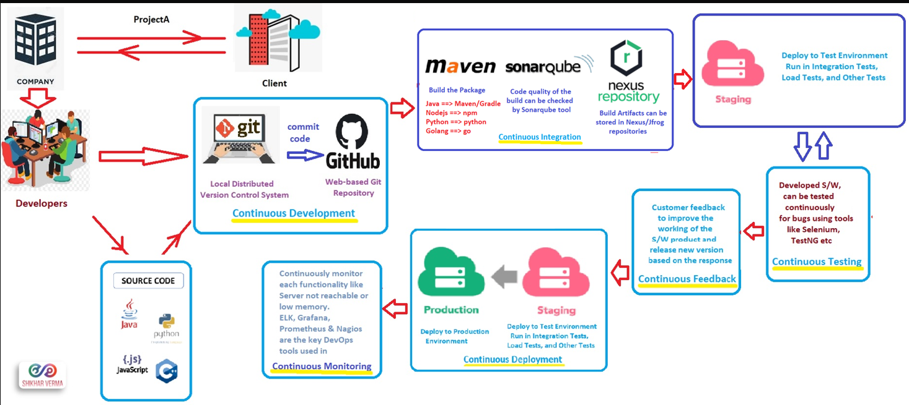
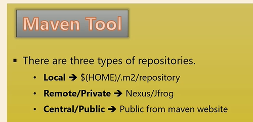
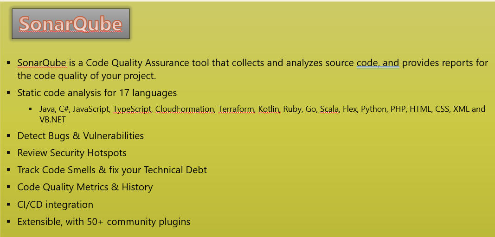
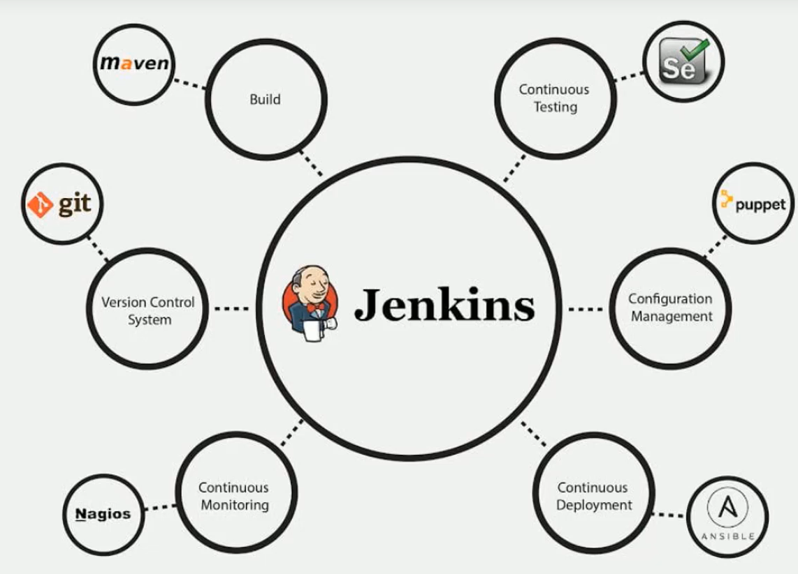
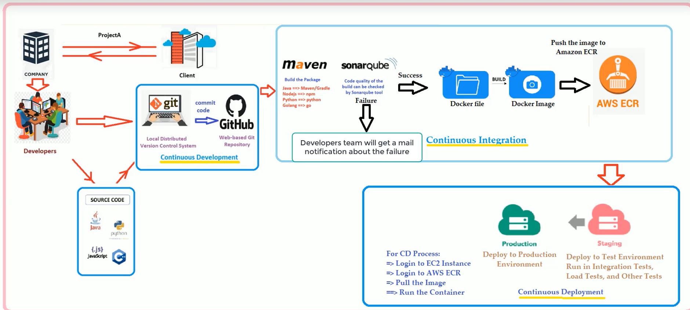

## CI/CD:




1. Build Tool (maven):

- Install java (sudo amazon-linux-extras install java-openjdk11)
- Install maven
    - https://maven.apache.org/install.html
    - https://maven.apache.org/download.cgi



- sample spring boot code:
    - https://github.com/Sai-Kale/springboot-hello.git  (sringboot_hello)
    - https://github.com/Sai-Kale/springboot-webapplication.git (springbootwebapplication)
- Maven Basics (https://github.com/Sai-Kale/springboot-webapplication.git)

2. Sonarqube (Build, Code Quality & Analysis Tool):


- Install Sonarqube:
    - we need atleast 3 GB of ram (t3.medium)
    - docker run -d --name sonarqube -p 9000:9000 <image_name>
    - clone the repo (https://github.com/Sai-Kale/realtime-project-demo.git)
    - Sonar- Maven Integration (https://docs.sonarqube.org/latest/analysis/scan/sonarscanner-for-maven/)

    - get the sonar command from the sonarqube UI (mvn clean verify sonar:sonar   -Dsonar.projectKey=java   -Dsonar.host.url=http://35.76.107.24:9000   -Dsonar.login=sqp_49df4988939d66b3a85fa1243144be7931774175 )
    - change the code and see if the sonarqube fails or not (System.out.println("get customers is called by getcustomers"))
    /home/ec2-user/realtime-project-demo/src/main/java/com/cloudtechmasters/realtimeprojectdemo
- Integrate Sonarqube and PostgreSQL:
    - https://medium.com/aleph-universe/setup-a-sonarqube-instance-in-less-than-30-minutes-cbc665ea9814

3. Nexus repo:
    - create new t3.medium
    - https://ahgh.medium.com/how-to-setup-sonatype-nexus-3-repository-manager-using-docker-7ff89bc311ce
    - now make maven to send artifacts to nexus repo
    https://www.baeldung.com/maven-deploy-nexus
    ```
    
   <Repository>
      <id>nexus-releases</id>
      <url>http://35.72.182.74:8081/repository/maven-releases/</url>
   </Repository>
   <snapshotRepository>
      <id>nexus-snapshots</id>
      <url>http://35.72.182.74:8081/repository/maven-snapshots/</url>
   </snapshotRepository>

   ```
   - now when we do mvn deploy it fails as it doesnt have the credentials declared anywhere. declare those in settings.xml in mvn conf file.
   ```
   <servers>
   <server>
      <id>nexus-snapshots</id>
      <username>admin</username>
      <password>admin</password>
   </server>
    </servers>
    ```
    - this should pusht the artifacts to the nexus repo.

4. **Integration with Jenkins**


```
$ sudo mkdir -p /var/jenkins_home

$ sudo chown -R 1000:1000 /var/jenkins_home/

$ docker run -p 8080:8080 -p 50000:50000 -v /var/jenkins_home:/var/jenkins_home --name jenkins -d jenkins/jenkins:lts

```
- install maven 
-  sudo docker exec -u root -t -i [container-id] bash
- apt-get update & apt-get install
- export PATH=/usr/share/maven/bin/conf:$PATH
- in jenkins global tool configuration add maven installation path
- maven (/usr/share/maven/)
- add a github webhook to trigger the build. (https://www.blazemeter.com/blog/how-to-integrate-your-github-repository-to-your-jenkins-project)
- in the plugins install the maven integration and the in the jobs maven project keeps showing.

5. **CI/CD** :

- Build docker images and push to AWS ECR.



- create  a java server along with maven and integrate sonar.
- git clone https://github.com/Sai-Kale/springboot-maven-micro
- Sonar- Maven Integration (https://docs.sonarqube.org/latest/analysis/scan/sonarscanner-for-maven/)

- **Dockerfile to create docker image**
```
FROM java:8
COPY target/springboot-maven-micro*.jar app.jar
ENTRYPOINT ["java","-jar","app.jar"]
```

- now setup the ECR by giving the ECR isntance role to the EC2 instance.
- once its working create a CD server by giving the ECR instance role and install docker and aws cli2.
- then try and run the container from ECR in the local to check if its working fine.
- docker container run --name=container_name -p 8080:8080 -d 436771193637.dkr.ecr.ap-northeast-1.amazonaws.com/java_image:latest
- ip:8080/course-svc/getAllDevopsTools

6. Jenkins CI/CD:


- create a pipeline to fetch the code from git and run mvn clean package.
- install maven 
-  sudo docker exec -u root -t -i [container-id] bash
- apt-get update & apt-get install
- export PATH=/usr/share/maven/bin/conf:$PATH
- in jenkins global tool configuration add maven installation path
- maven (/usr/share/maven/bin)

```
pipeline {
    tools {
        maven 'M3'
    }
    stages {
        stage('Build the package') {
            steps {
                git 
            }
        }
    }
}

```


- Integrating the sonar qube.
    - run the sonarqube server and go to the admin>security>generate token.
    - save this token as secret text in the jenkins creds
    - go to managejenkins> configure system > SonarQube Servers.
    - integrate sonarqube in the jenkins pipeline (https://docs.sonarqube.org/latest/analysis/scan/sonarscanner-for-jenkins/)
    - withSonarQubeEnv(installationName: 'sonarqube', credentialsId: 'jenkins-sonar-token')  (this is the installation name of sonar if we have multiple installations and the credential token to verify the authrization)

    ```
            stage('Sonar quality check') {
                steps {
                    withSonarQubeEnv(installationName: 'sonarqube', credentialsId: 'jenkins-sonar-token') {
                       sh 'mvn sonar:sonar'     
                    } 
                }
            }
    ```
    - Now we need to abort the pipeline if the code quality check fails for that we need to include the abort step if the sonarscan fails.
    ```
    stage("Sonar Quality Check"){
                steps{
                    script{
                     withSonarQubeEnv(installationName: 'sonar-9', credentialsId: 'jenkins-sonar-token') {
                     sh 'mvn sonar:sonar'
                }
                 timeout(time: 1, unit: 'HOURS') {
              def qg = waitForQualityGate()
              if (qg.status != 'OK') {
                  error "Pipeline aborted due to quality gate failure: ${qg.status}"
                    }
                 }

    ```
    - script : The script step takes a block of Scripted Pipeline and executes that in the Declarative Pipeline. (https://www.jenkins.io/doc/book/pipeline/syntax/#script)
    - Now we need to configure a webhook with the sonarqube server. If its success or failure Jenkins will get to know from the sonarqube webhook.

- Adding steps to build the docker image and store it in the registry,
    ```
        environment {
        registry = '719218709170.dkr.ecr.ap-south-1.amazonaws.com/hellodatarepo'
        registryCredential = 'jenkins-ecr-login-credentials'
        dockerimage = ''
    }
    ```
    - The above steps are required for the docker to authenticate with the registry.
    - Install the requried plugins for ECR, Docker , Azure etc.,.. the repo where we need to push the built image to.
    - For AWS make sure the instance thas the Instance role to push the stuff to the ECR by giving ECR full access to it.
        - The other way is to create a IAM user and give perms ECR full acccess and use the secret key and access key to push to the mentioned repository.
        - Go to manage jenkins > credentials > global creds > In the dropdown we have to see AWS Credentials (we dont see this if we dont install cloudbees or AWS ECR plugin)
        - We reuire docker, docker pipeline, ECR and cloud bees.
    - the below steps are mentioned for the in build docker function to build the image from the Dockerfile mentioned in the repository.

    ```
     stage('Building the Image') {
        steps {
            script {
            dockerImage = docker.build registry + ":$BUILD_NUMBER"
        }
    }
    }
    stage ('Deploy the Image to Amazon ECR') {
       steps {
           script {
           docker.withRegistry("http://" + registry, "ecr:ap-south-1:" + registryCredential ) {
           dockerImage.push()
                    }
                }
            }
        }
    ```
- Configuring EMAIL Notifications once the pipline is completed.
    - We can integrate with outlook for POC we will integrate SES instead of gmail SMTP server.
    - AWS Simple Email Service , enter email > create identity > accept the email verfification > account dashboard > crate configuration  > create jenkins-smtp-ses-server.
    - copy the smtp credentials.
    - Integrate AWS SES with jenkins.
    - Now got to jenkins> configure system > enter SMTP server > use smtp authentication (enter username and password) > port 465 > enter email reply to address.
    - also enter the email in the system admin email address.
    - add the post step in Jenkins pipeline and see whether you receive and email or not.

6. **CD using Ansible:**

- Create  a new CD server.
- Install Ansible on Jenkins server / Jenkins Container.
- Once the ansible Is installed on Jenkins Docker Container. Change the Inventory file and /etc/ansible/hosts


