# CKA

## 1.0 Cluster Architecture:

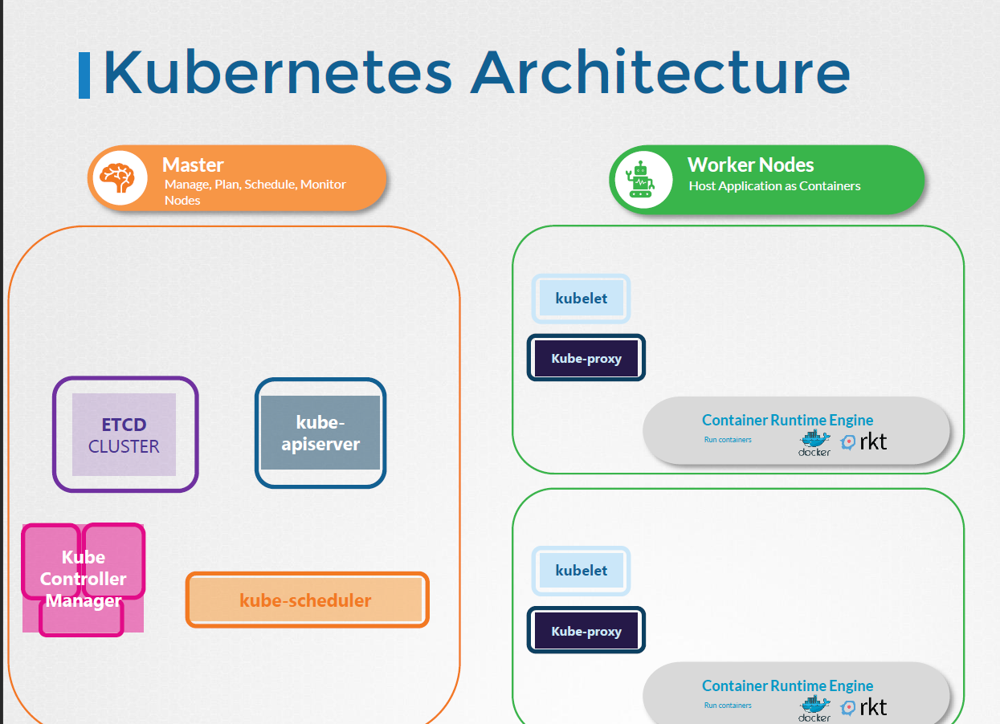

### ETCD:

- Its a simple key-value store DB. 
- Its stores data in key and value format. ex: Key: Name Value: Sai
- Its easy to install etcd download and run the binaries and install it. By default it runs on port 2379. 
- Later we can attach clients once the ETCD is up and running.
- It comes with the command line etcdctl. Ex: etcdctl get key1
- Its stores all the information about K8S cluster and nodes. Ex: Nodes, PODS, Configs, Secrets etc.,..
- There are couple of ways we can spin up a server using the manual way by downloading the binaries or by using the kubeadm commands.
- When you deploy etcd using kubeadm it deploys the same as pod in the kube-system namespace.
- Note : Refer to the pdf in the git for more pictorial repsresentation.
- ETCD stores all the information inside a folder called registry.
- In HA environment we may have mutiple masters along with the mutiple etcd DB. In that situation make sure the etcd knows about all these different DB avaiable.
   --initial-cluster controller-0=https://${CONTROLLER0_IP}:2380,controller-1=https://${CONTROLLER1_IP}:2380 \\

```
(Optional) Additional information about ETCDCTL Utility

ETCDCTL is the CLI tool used to interact with ETCD.

ETCDCTL can interact with ETCD Server using 2 API versions - Version 2 and Version 3.  By default its set to use Version 2. Each version has different sets of commands.

For example ETCDCTL version 2 supports the following commands:

etcdctl backup
etcdctl cluster-health
etcdctl mk
etcdctl mkdir
etcdctl set


Whereas the commands are different in version 3

etcdctl snapshot save 
etcdctl endpoint health
etcdctl get
etcdctl put

To set the right version of API set the environment variable ETCDCTL_API command

export ETCDCTL_API=3


When API version is not set, it is assumed to be set to version 2. And version 3 commands listed above don't work. When API version is set to version 3, version 2 commands listed above don't work.


Apart from that, you must also specify path to certificate files so that ETCDCTL can authenticate to the ETCD API Server. The certificate files are available in the etcd-master at the following path. We discuss more about certificates in the security section of this course. So don't worry if this looks complex:

--cacert /etc/kubernetes/pki/etcd/ca.crt     
--cert /etc/kubernetes/pki/etcd/server.crt     
--key /etc/kubernetes/pki/etcd/server.key


So for the commands I showed in the previous video to work you must specify the ETCDCTL API version and path to certificate files. Below is the final form:


kubectl exec etcd-master -n kube-system -- sh -c "ETCDCTL_API=3 etcdctl get / --prefix --keys-only --limit=10 --cacert /etc/kubernetes/pki/etcd/ca.crt --cert /etc/kubernetes/pki/etcd/server.crt  --key /etc/kubernetes/pki/etcd/server.key" 
```

### Kube-API server:

- kube-api server is the primary management component in k8s.
- when you run kubectl , it first reaches the kube-api server and authenticates the command. Then it communicates with the etcd DB and retrives the information.
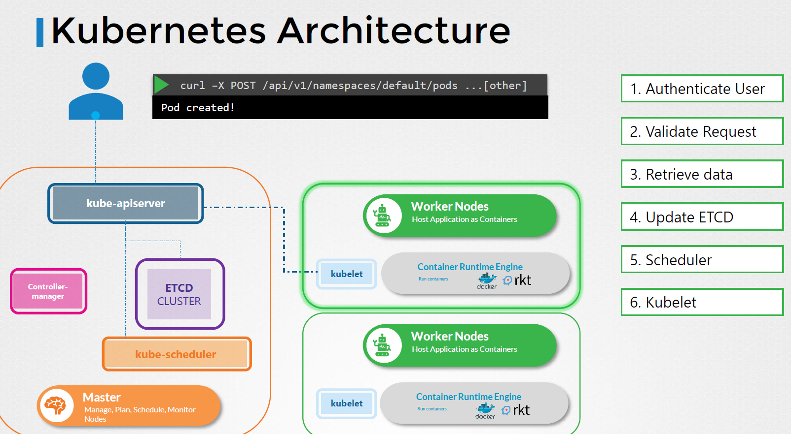
- kube-api is the center of all the communication in k8s cluster.
- there are lot of certificates to take care of when we configure k8s cluster manually check those out in the ssl and tls certificate section.
- We create this api-server manually in the kube-system namespace and we can check all the components of api-server in the relavant manifest files.

### Kube Controller Manager:

- it manages various components within the k8s cluster and takes necessary actions.
- In k8s terms a controller is a process that continously  monitors the status of the relavant components and takes remediate action to bring it to the desired state.
- Ex: Node controller continously monitor the health of application nodes via api-server every 5 seconds and it its doesnt recieve a signal it marks that particular node unreachable and takes necessary actions to spin up those pods on the reachable worker nodes after 40secs
- Similarly we have the Replication Controller which ensure the monitoring of replica sets. if a pod dies its responsible for creation of another one.
- There are many more controllers in k8s to maintain the desired state. The main logic behind the k8s functionality.
- we can manage the way a controller works using the kube-controller.service and check the relavant options we can enable sprcific controllers required for our use case as well. In case doesnt work this can be a good strating point to look at.
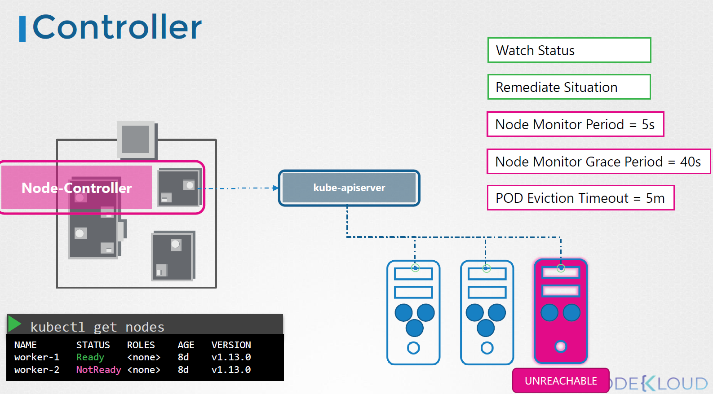
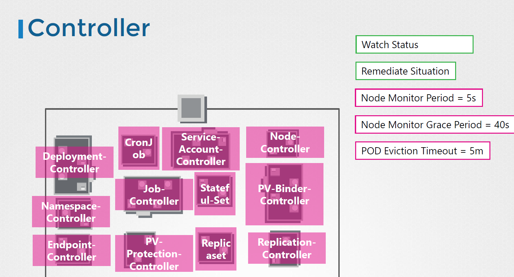

### Kube-Scheduler:

- Its repsonible for the scheduling the pods on the nodes.
- Please take care that the kube-scheduler is only responsible for deciding which pod goes on which node. 
- The actual pod get created by the kubelet on the respective worker node.
- Scheduler is required as there are many nodes and we need deploy mutiple pods of different usage capacity. To make sure the node has sufficient capacity and relavant applications for the pod to run seamlessly.
- refer the picture on how the scheduler filter to decide on which node the particular pod run.
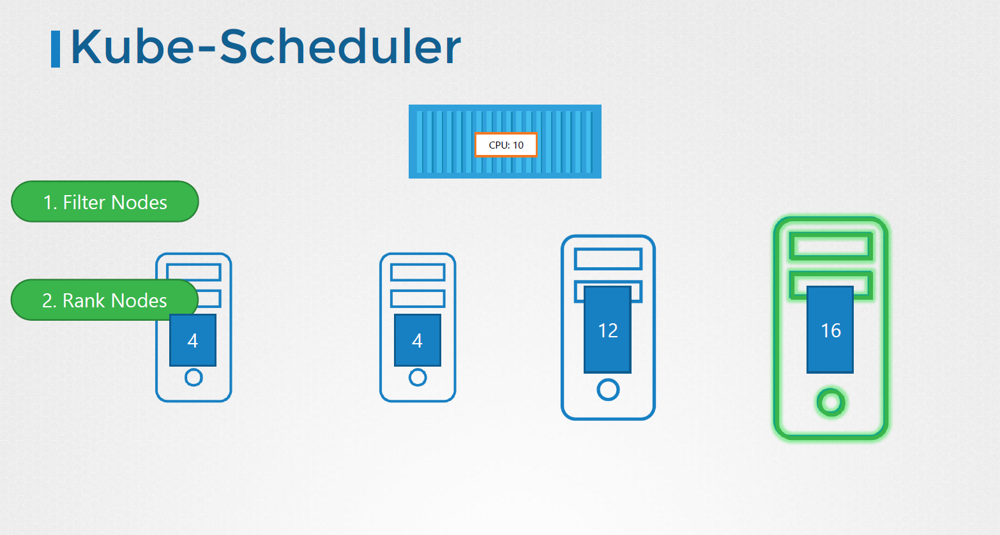
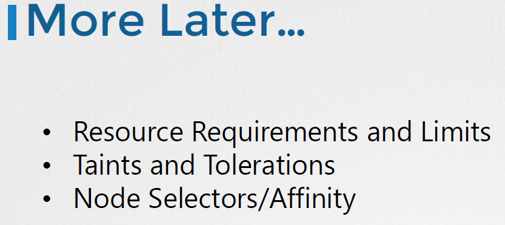

- Please check the relavant process using ps -aux | grep kube-scheduler and modify the options as per the requirement.

### Kubelet:

- its like the captain of the ship.
- It runs on the each worker node and responsible for the communcation b/w master and worker node. it also helps in sending the necessary details about the current pods and health check to the controller via kube-api server.
- Similar to others the funtionalities of kubelet can be configured using the manual setup.
- we have to install it expicitly on worker nodes. it does not get installed directly with the kubeadm.

### Kube Proxy:

- Within a k8s cluster every pod can reach every other pod using a POD network.
- POD network is an internal virtual network which spans across the mutiple nodes and pods.
- We can reach a web server pod using the IP address of the particular pod where the web server container is running, but there is no gurantee that the IP will be constant.
- The better way to access is using the service(which we will get to know further). Service has a fixed IP address and will be constant unlike container it doesnt die and gets recreated.
- Service can't join the pod network unlike the container coz its not an actual thing like container, its a virtual component that lives in the K8S memory. it just used as a fixed IP thing to refer to the relavant backend like webserver, appserver or DB.
- But the service should be accessible across the many worker nodes as we might have our web server pods running across mutiple worker nodes. The way the communication b/w the service and the pods across mutiple worker nodes is achieved using the "Kube Proxy".
- Its installed on the each of the worker nodes and every time a service is created it creates appropriate rules on each node to forward traffic to the relavant pods across different nodes.
- The way the kube proxy achieves this is using the IP tables. the services IP and pods IP running across mutiple nodes is matched and request is served.
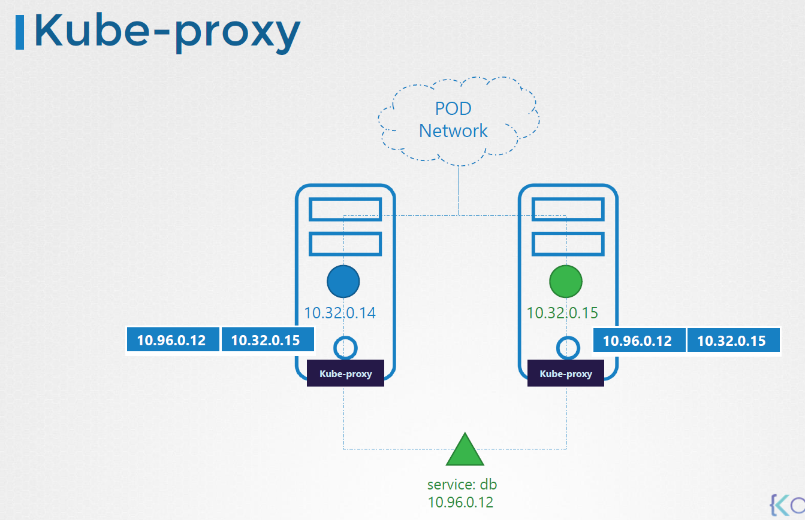
- kubeadm deploys kube proxy as pods on each worker nodes in kube sytem name space.
- Infact its deployed as a daemon set on each node. (daemon set we will no in upcoming lectures)

### POD:
- its the smallest unit inside the k8s cluster.
- ** Node > POD > Container **

- we can have mutiple containers running witin a single pod. Multi container pods.


## 1.1 K8S Replication Controller:

- There are many controllers in K8S. But the replication controller is the most important amongst all for the day to day usage.
- Generally when we spin up a pod , we just spin one container or more containers within a pod. If for someone reason the pod dies we dont have a backup.
- Here the replication controller help us run multiple instances of a single pod thus providing High Availability.
- Hence, if a single pod dies replication controller ensures that the desired number of pods are always running.
- Another reason for replication controller is we can give the minimum and max number of pods range that needs to be running at given point of time.
- In case of increased traffic replication cotroller spins up more pods not exceeding the max number given and distributes the traffic across.
- The Replication controller is replaced by replicaSet. 
- We need to spin up all the stuff using the replicaset.
- Refer to the yaml section on how to write the yaml's for the replica set.


**Deployments > ReplicaSets > Pod**  (Refer to the k8s_commands and yaml folder)

### Namespaces:

- In Kubernetes, namespaces provides a mechanism for isolating groups of resources within a single cluster.Names of resources need to be unique within a namespace, but not across namespaces.       Namespace-based scoping is applicable only for namespaced objects (e.g. Deployments, Services, etc) and not for cluster-wide objects (e.g. StorageClass, Nodes, PersistentVolumes, etc).
- Be defualt k8s has 2 different name space.
   - default (where the user pod gets created by default)
   - kube-system (admin level pods and services are created)
   - kube-public (resources made avaiable to public are placed)
- namespacing helps in isloating reosurces into QA, STG and PROD environments.
- Each namespace can have own set of policies and resource quotas.
- to connect to resources in a different namespace using a hostname. for example webserver in a default namespace to db in a DB namespace object. we have to use
   mysql.connect("db-service.dev.svc.cluster.local)
- we can mention the namespace in the yaml file instead of command line. Under the metadata section (namepsace: dev)
   metadata:
      name: my-app
      namespace: dev
- namespace can be created using the object type Namespace. using the below yaml definition. 
- To limit the usage of resources in a namespace create the **resource quota**.

## 1.3 Services:

- An abstract way to expose an application running on a set of Pods as a network service.
- There are about 3 main service types in k8s.
   1. NodePort
   2. ClusterIP
   3. Loadbalancer
- **Nodeport** :
   - Consider we have an webserver pod. how do we as an external user acccess that pod. As we know that pod has a IP adress, Node has an IP address.
   for this purpose we use k8s service to forward the request to a pod.
   - the use of this service is to listen to a port on the node and forward the request to the pod. This type of service is called NodePort service
     As it listens to a particular port on the node and forwards the requests to the pod.
   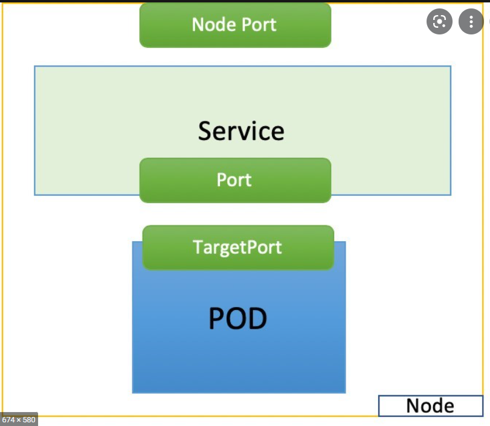
   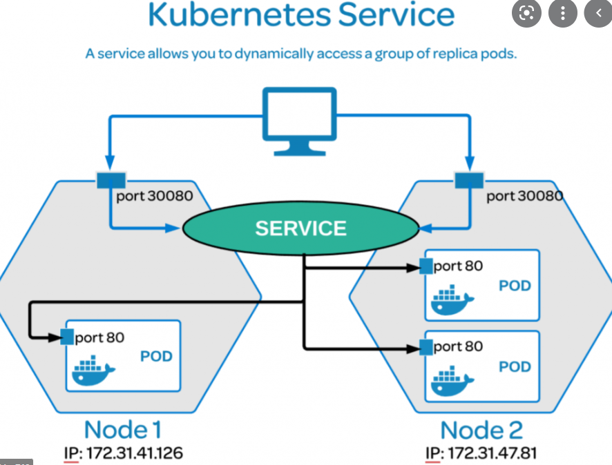
   - Target port is the port on which the container listens, port is on which the service listens and sends the requests. Whereas Nodeport is the port on which the Node is listening to the outisde world requests. By default NodePort has a range of 30000-32787
   targetport: One or more ports on which a container listens within a pod.

   nodeport: Used primarily to accept consumer requests. (Eg: HTTP request from consumers to a webserver running in a container)

   nodeport is listened on all nodes on all interfaces i.e 0.0.0.0:nodeport. Consumer service requests sent to nodeport is routed to container's targetport so that the container can fulfill the request.

   port: Port used within the kubernetes pod network, primarily used to exchange requests between pods. Here as well, requests to a pod from another, is routed to the corrosponding pod's container targetport.

   Summary: all requests end up in the targetport. nodeport is used if request from outside k8s network & port if from within.
   
   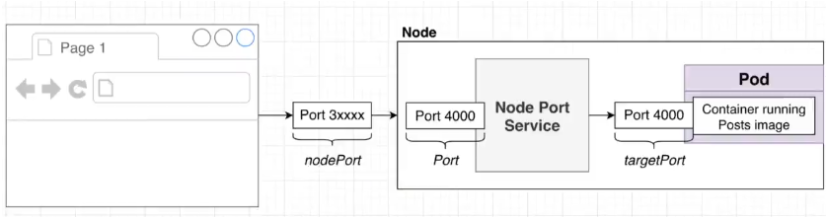
   - How to write yml file for service refer to the yaml folder.
   - services are matched to respective pods using the lables and selectors.
   - In case of the pods are span across the mutiple nodes. we dont have to do anything the service itself spans across mutiple nodes thus distributing traffic to the multiple pods across different nodes in k8s cluster.
   - generally this setup is not secure as we expose a port on the node to the outside world hence we got other type of services.
- **ClusterIP** :
   - consider we have a 3 tier application where we have web app, app  and redis runing across mutiple pods and request flow from webapp-> app -> redis
    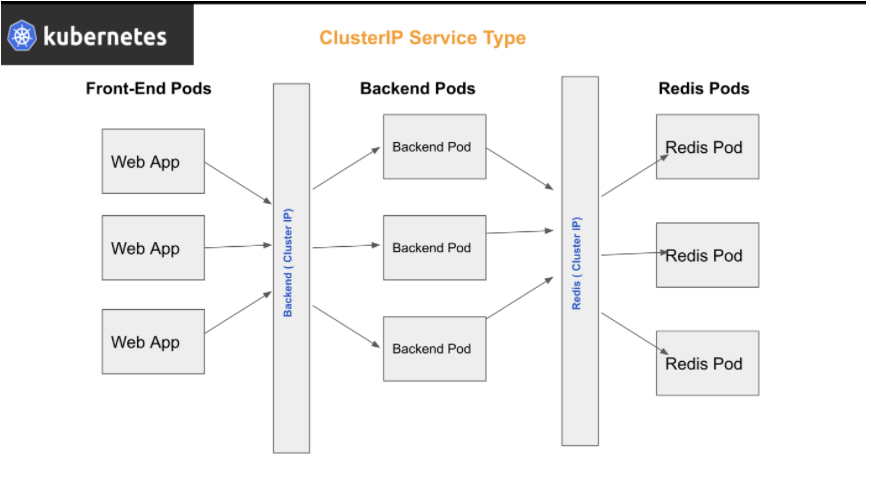
   - How will the traffic from mutiple web pods is being sent to the app pods , how it will decide to which app pod the traffic should be sent to. Here k8s service clusterIP helps us with this.
   - We create a service backend and assigns the app backend to that service so the traffic is being distributed to that relavant pods using lables and selectors.
   - When we create a ClusterIP service its get a name and IP assigned to it. when we refer to that name the traffic will be sent to those relavant backend pods.

- **LoadBalancer** :
   - when we expose the application to the external users , the service that serves the request might span across mutiple nodes. Which IP address would we give to the end user amogst the different nodes IP address and the port number on which its exposed. to solve this issue we need a single URL to access the application. this is achieved using LoadBalancer.
   - This LB can be created only on a supported Cloud Platform like GCP/AWS
   - We can leverage that support of native load balancer and configure that for us. For example, if we set the service type to the LB it spins up CLB by default in AWS unless specific LB type is specified.

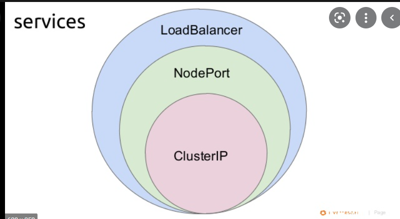


## 1.3 Imperative vs Declarative:

- Mentioning what needs to be  executed is done using declarative approach. Ex: ansible, terraform etc.,..
   most scenarios are covered as we use thrid party tools which know how to handle these situations.
  Ex: k8s we write these in the yaml format. 
  kubectl apply -f pod.yml
  if we want all the yml under a specific folder to be run we use.
  kubectl apply -f /path/to/yaml/files.
   make necessary changes and we can run the apply command again to update the changes.
- Where as giving step by step instructions on what needs to be done and how is given by Imperative approach. More dependent on the logic we write and result in failures in few scenarios.
   ex: kubectl run -image=nginx ngnix, kubectl create deployment --image=nginx nginx
      kubectl update...., kubectl update.... , etc.,..
-      


