# CKA

## 1.0 Cluster Architecture:


#### ETCD:

- Its a simple key-value store DB. 
- Its stores data in key and value format. ex: Key: Name Value: Sai
- Its easy to install etcd download and run the binaries and install it. By default it runs on port 2379. 
- Later we can attach clients once the ETCD is up and running.
- It comes with the command line etcdctl. Ex: etcdctl get key1
- Its stores all the information about K8S cluster and nodes. Ex: Nodes, PODS, Configs, Secrets etc.,..
- There are couple of ways we can spin up a server using the manual way by downloading the binaries or by using the kubeadm commands.
- When you deploy etcd using kubeadm it deploys the same as pod in the kube-system namespace.
- Note : Refer to the pdf in the git for more pictorial repsresentation.
- ETCD stores all the information inside a folder called registry.
- In HA environment we may have mutiple masters along with the mutiple etcd DB. In that situation make sure the etcd knows about all these different DB avaiable.
   --initial-cluster controller-0=https://${CONTROLLER0_IP}:2380,controller-1=https://${CONTROLLER1_IP}:2380 \\

```
(Optional) Additional information about ETCDCTL Utility

ETCDCTL is the CLI tool used to interact with ETCD.

ETCDCTL can interact with ETCD Server using 2 API versions - Version 2 and Version 3.  By default its set to use Version 2. Each version has different sets of commands.

For example ETCDCTL version 2 supports the following commands:

etcdctl backup
etcdctl cluster-health
etcdctl mk
etcdctl mkdir
etcdctl set


Whereas the commands are different in version 3

etcdctl snapshot save 
etcdctl endpoint health
etcdctl get
etcdctl put

To set the right version of API set the environment variable ETCDCTL_API command

export ETCDCTL_API=3


When API version is not set, it is assumed to be set to version 2. And version 3 commands listed above don't work. When API version is set to version 3, version 2 commands listed above don't work.


Apart from that, you must also specify path to certificate files so that ETCDCTL can authenticate to the ETCD API Server. The certificate files are available in the etcd-master at the following path. We discuss more about certificates in the security section of this course. So don't worry if this looks complex:

--cacert /etc/kubernetes/pki/etcd/ca.crt     
--cert /etc/kubernetes/pki/etcd/server.crt     
--key /etc/kubernetes/pki/etcd/server.key


So for the commands I showed in the previous video to work you must specify the ETCDCTL API version and path to certificate files. Below is the final form:


kubectl exec etcd-master -n kube-system -- sh -c "ETCDCTL_API=3 etcdctl get / --prefix --keys-only --limit=10 --cacert /etc/kubernetes/pki/etcd/ca.crt --cert /etc/kubernetes/pki/etcd/server.crt  --key /etc/kubernetes/pki/etcd/server.key" 
```

#### Kube-API server:

- kube-api server is the primary management component in k8s.
- when you run kubectl , it first reaches the kube-api server and authenticates the command. Then it communicates with the etcd DB and retrives the information.

- kube-api is the center of all the communication in k8s cluster.
- there are lot of certificates to take care of when we configure k8s cluster manually check those out in the ssl and tls certificate section.
- We create this api-server manually in the kube-system namespace and we can check all the components of api-server in the relavant manifest files.

#### Kube Controller Manager:

- it manages various components within the k8s cluster and takes necessary actions.
- In k8s terms a controller is a process that continously  monitors the status of the relavant components and takes remediate action to bring it to the desired state.
- Ex: Node controller continously monitor the health of application nodes via api-server every 5 seconds and it its doesnt recieve a signal it marks that particular node unreachable and takes necessary actions to spin up those pods on the reachable worker nodes after 40secs
- Similarly we have the Replication Controller which ensure the monitoring of replica sets. if a pod dies its responsible for creation of another one.
- There are many more controllers in k8s to maintain the desired state. The main logic behind the k8s functionality.
- we can manage the way a controller works using the kube-controller.service and check the relavant options we can enable sprcific controllers required for our use case as well. In case doesnt work this can be a good strating point to look at.


#### Kube-Scheduler:

- Its repsonible for the scheduling the pods on the nodes.
- Please take care that the kube-scheduler is only responsible for deciding which pod goes on which node. 
- The actual pod get created by the kubelet on the respective worker node.
- Scheduler is required as there are many nodes and we need deploy mutiple pods of different usage capacity. To make sure the node has sufficient capacity and relavant applications for the pod to run seamlessly.
- refer the picture on how the scheduler filter to decide on which node the particular pod run.


- Please check the relavant process using ps -aux | grep kube-scheduler and modify the options as per the requirement.

#### Kubelet:

- its like the captain of the ship.
- It runs on the each worker node and responsible for the communcation b/w master and worker node. it also helps in sending the necessary details about the current pods and health check to the controller via kube-api server.
- Similar to others the funtionalities of kubelet can be configured using the manual setup.
- we have to install it expicitly on worker nodes. it does not get installed directly with the kubeadm.

#### Kube Proxy:

- Within a k8s cluster every pod can reach every other pod using a POD network.
- POD network is an internal virtual network which spans across the mutiple nodes and pods.
- We can reach a web server pod using the IP address of the particular pod where the web server container is running, but there is no gurantee that the IP will be constant.
- The better way to access is using the service(which we will get to know further). Service has a fixed IP address and will be constant unlike container it doesnt die and gets recreated.
- Service can't join the pod network unlike the container coz its not an actual thing like container, its a virtual component that lives in the K8S memory. it just used as a fixed IP thing to refer to the relavant backend like webserver, appserver or DB.
- But the service should be accessible across the many worker nodes as we might have our web server pods running across mutiple worker nodes. The way the communication b/w the service and the pods across mutiple worker nodes is achieved using the "Kube Proxy".
- Its installed on the each of the worker nodes and every time a service is created it creates appropriate rules on each node to forward traffic to the relavant pods across different nodes.
- The way the kube proxy achieves this is using the IP tables. the services IP and pods IP running across mutiple nodes is matched and request is served.

- kubeadm deploys kube proxy as pods on each worker nodes in kube sytem name space.
- Infact its deployed as a daemon set on each node. (daemon set we will no in upcoming lectures)

#### POD:
- its the smallest unit inside the k8s cluster.
- ** Node > POD > Container **

- we can have mutiple containers running witin a single pod. Multi container pods.


### 1.1 K8S Replication Controller:

- There are many controllers in K8S. But the replication controller is the most important amongst all for the day to day usage.
- Generally when we spin up a pod , we just spin one container or more containers within a pod. If for someone reason the pod dies we dont have a backup.
- Here the replication controller help us run multiple instances of a single pod thus providing High Availability.
- Hence, if a single pod dies replication controller ensures that the desired number of pods are always running.
- Another reason for replication controller is we can give the minimum and max number of pods range that needs to be running at given point of time.
- In case of increased traffic replication cotroller spins up more pods not exceeding the max number given and distributes the traffic across.
- The Replication controller is replaced by replicaSet. 
- We need to spin up all the stuff using the replicaset.
- Refer to the yaml section on how to write the yaml's for the replica set.


**Deployments > ReplicaSets > Pod**  (Refer to the k8s_commands and yaml folder)

#### Namespaces:

- In Kubernetes, namespaces provides a mechanism for isolating groups of resources within a single cluster.Names of resources need to be unique within a namespace, but not across namespaces.       Namespace-based scoping is applicable only for namespaced objects (e.g. Deployments, Services, etc) and not for cluster-wide objects (e.g. StorageClass, Nodes, PersistentVolumes, etc).
- Be defualt k8s has 2 different name space.
   - default (where the user pod gets created by default)
   - kube-system (admin level pods and services are created)
   - kube-public (resources made avaiable to public are placed)
- namespacing helps in isloating reosurces into QA, STG and PROD environments.
- Each namespace can have own set of policies and resource quotas.
- to connect to resources in a different namespace using a hostname. for example webserver in a default namespace to db in a DB namespace object. we have to use
   mysql.connect("db-service.dev.svc.cluster.local)
- we can mention the namespace in the yaml file instead of command line. Under the metadata section (namepsace: dev)
   metadata:
      name: my-app
      namespace: dev
- namespace can be created using the object type Namespace. using the below yaml definition. 
- To limit the usage of resources in a namespace create the **resource quota**.

### 1.3 Services:

- An abstract way to expose an application running on a set of Pods as a network service.
- There are about 3 main service types in k8s.
   1. NodePort
   2. ClusterIP
   3. Loadbalancer
- **Nodeport** :
   - Consider we have an webserver pod. how do we as an external user acccess that pod. As we know that pod has a IP adress, Node has an IP address.
   for this purpose we use k8s service to forward the request to a pod.
   - the use of this service is to listen to a port on the node and forward the request to the pod. This type of service is called NodePort service
     As it listens to a particular port on the node and forwards the requests to the pod.
   
   
   - Target port is the port on which the container listens, port is on which the service listens and sends the requests. Whereas Nodeport is the port on which the Node is listening to the outisde world requests. By default NodePort has a range of 30000-32787
   targetport: One or more ports on which a container listens within a pod.

   nodeport: Used primarily to accept consumer requests. (Eg: HTTP request from consumers to a webserver running in a container)

   nodeport is listened on all nodes on all interfaces i.e 0.0.0.0:nodeport. Consumer service requests sent to nodeport is routed to container's targetport so that the container can fulfill the request.

   port: Port used within the kubernetes pod network, primarily used to exchange requests between pods. Here as well, requests to a pod from another, is routed to the corrosponding pod's container targetport.

   Summary: all requests end up in the targetport. nodeport is used if request from outside k8s network & port if from within.
   
   
   - How to write yml file for service refer to the yaml folder.
   - services are matched to respective pods using the lables and selectors.
   - In case of the pods are span across the mutiple nodes. we dont have to do anything the service itself spans across mutiple nodes thus distributing traffic to the multiple pods across different nodes in k8s cluster.
   - generally this setup is not secure as we expose a port on the node to the outside world hence we got other type of services.
- **ClusterIP** :
   - consider we have a 3 tier application where we have web app, app  and redis runing across mutiple pods and request flow from webapp-> app -> redis
    
   - How will the traffic from mutiple web pods is being sent to the app pods , how it will decide to which app pod the traffic should be sent to. Here k8s service clusterIP helps us with this.
   - We create a service backend and assigns the app backend to that service so the traffic is being distributed to that relavant pods using lables and selectors.
   - When we create a ClusterIP service its get a name and IP assigned to it. when we refer to that name the traffic will be sent to those relavant backend pods.

- **LoadBalancer** :
   - when we expose the application to the external users , the service that serves the request might span across mutiple nodes. Which IP address would we give to the end user amogst the different nodes IP address and the port number on which its exposed. to solve this issue we need a single URL to access the application. this is achieved using LoadBalancer.
   - This LB can be created only on a supported Cloud Platform like GCP/AWS
   - We can leverage that support of native load balancer and configure that for us. For example, if we set the service type to the LB it spins up CLB by default in AWS unless specific LB type is specified.


### 1.4 Imperative vs Declarative:

- Mentioning what needs to be  executed is done using declarative approach. Ex: ansible, terraform etc.,..
   most scenarios are covered as we use thrid party tools which know how to handle these situations.
  Ex: k8s we write these in the yaml format. 
  kubectl apply -f pod.yml
  if we want all the yml under a specific folder to be run we use.
  kubectl apply -f /path/to/yaml/files.
   make necessary changes and we can run the apply command again to update the changes.
- Where as giving step by step instructions on what needs to be done and how is given by Imperative approach. More dependent on the logic we write and result in failures in few scenarios.
   ex: kubectl run -image=nginx ngnix, kubectl create deployment --image=nginx nginx
      kubectl update...., kubectl update.... , etc.,..

## 2.0 SCHEDULING:
- Every pod has a component in spec section called nodeName which by default is not set. k8s sets it automatically.
   Scheduler checks for all those pods for which these values are not set and schedules the same. It then identifies the right node for the pod by running the scheduling algorithm.
   Once identified it binds the pod to that node by creating a binding object.

### 2.1 Manual Scheudling:
- If there is no scheduler to assign pods to nodes , the pods will remain in pending state.
- we can manually schedule the pods to node by mentioning the nodeNamein the pod definition yaml file. This is called Manual Scheduling. Its rarely done.
- We cant change the nodeName once the pod is created by editing the yaml file. Another apporach is to create a binding object and send a POST request binding API. Thus mimicking what the sheduler does.
- POST request is done using the curl command by sending a YAML content in JSON format via the command line.


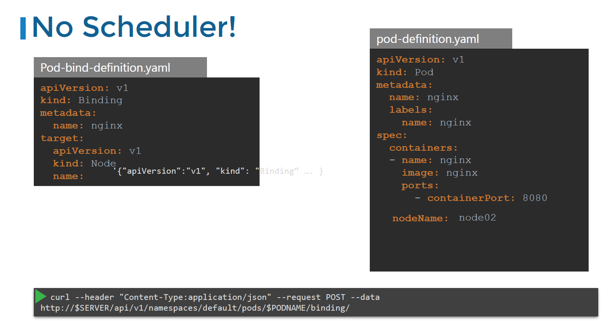

### 2.2 Labels and Selectors:
-  Labels are key/value pairs that are attached to objects, such as pods. Labels are intended to be used to specify identifying attributes of objects that are meaningful and relevant to users, but do not directly imply semantics to the core system. Labels can be used to organize and to select subsets of objects. Labels can be attached to objects at creation time and subsequently added and modified at any time. Each object can have a set of key/value labels defined. Each Key must be unique for a given object.
- metadata:
  labels: 
    key1 : "value1",
    key2 : "value2"
  annotations:
   
- Annotations: these are used for information purpose along with the labels in yaml file. 
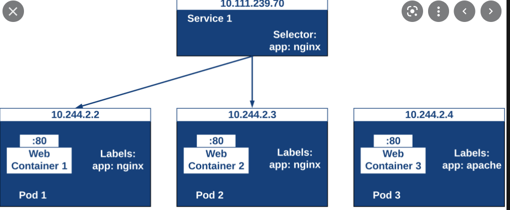

### 2.3 Taints & Tolerations:
- Node affinity is a property of Pods that attracts them to a set of nodes (either as a preference or a hard requirement). Taints are the opposite -- they allow a node to repel a set of pods.
- Tolerations are applied to pods, and allow (but do not require) the pods to schedule onto nodes with matching taints.

- Taints and tolerations work together to ensure that pods are not scheduled onto inappropriate nodes. One or more taints are applied to a node; this marks that the node should not accept any pods that do not tolerate the taints
- kubectl taint nodes node-name key=value:taint-effect
  (taint the nodes in key value format; taint-effect has three options Noschedule| PreferNoSchedule | NoExecute)
- Taints are added to the nodes
- Tolerations are added to the pods. there are added in yaml file in under tolerations section in spec. the values must be spcified in quotes.
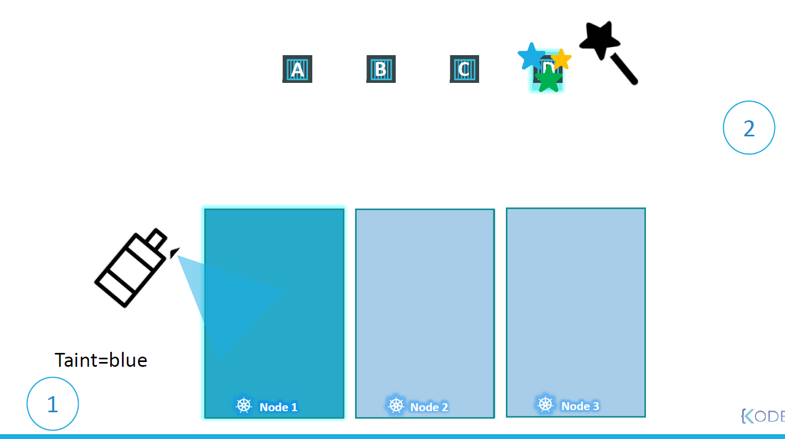
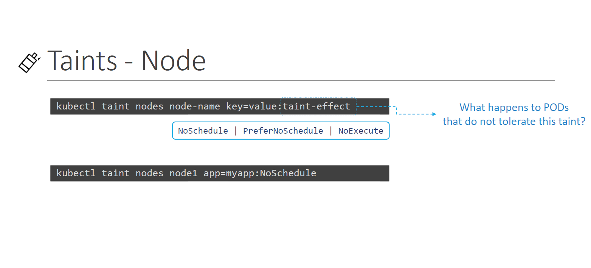
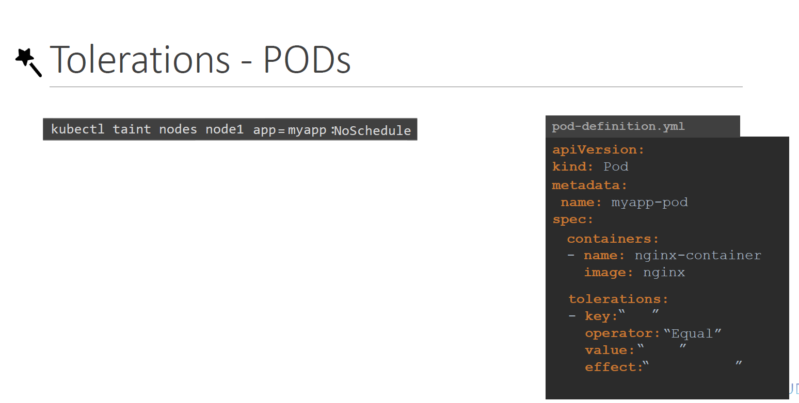

- **Taints and Tolerations doesn't tell the pod to go a particular node, instead taint tells the node to accept a particular pod only.**
- when the k8s is setup, a taint is setup on the master node so as not to accept any pods on the master node.
kubectl describe node kubemaster | grep Taint

### 2.4 Node Selectors: (mostly we used node affinity instead of this)
- Consider we  have a 3 node cluster with varying resources. We have different kinds of workloads in cluster.
  we want the larger node configured to be with data processing pods as that would be the only node that wouldn't run of resources in case of increased workload.
- To solve this we can set a limitation on the pod to run on a particular pod. we add a new property called **nodeSelector** in the pod yaml file.
   spec:
      nodeSelector:  
         size: Large
- But how can we label a node to be of size large. we can achieve that by using kubectl commands.
   kubectl label nodes <node-name> <label-key>=<label-value>
- However, it has limitations we used a single label and selector here. what if we have a requirement to place the pod on a large or medium node. OR to place the pod on node which is NOT small.
   To serve this purpose Node Affinity and Anit Affinity are introduced.

### 2.5 Node Affinity:

- the main use case of node Affinity is to ensure large pods are scheduled to run on node with large resources.
- we can provide advance capabilites to limit pod placement on relavant nodes  unlike node selectors.
- node affinity is mentioned  under the spec as most other parameters.
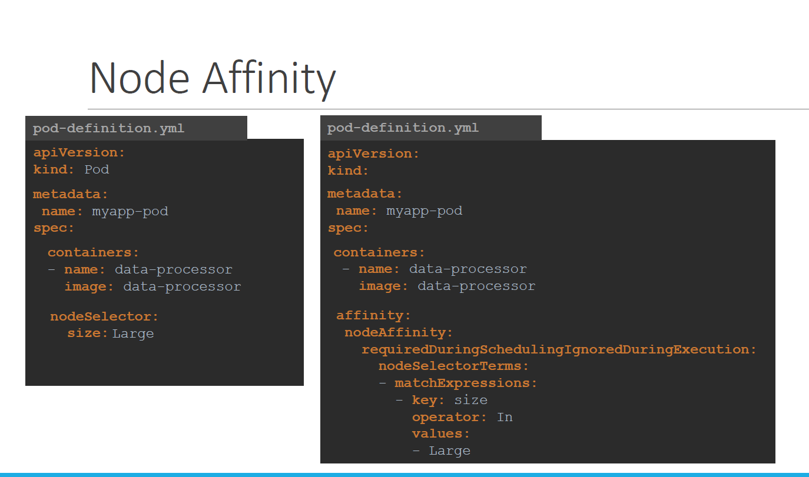
- in the below yaml we can see node affinty is set to check only if the operator size exsists.
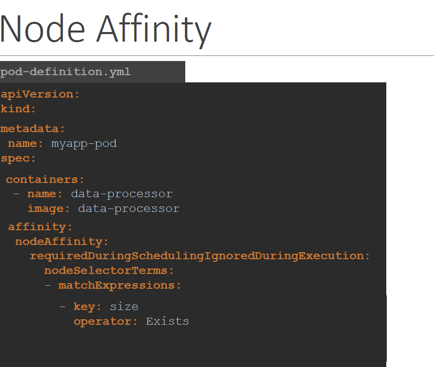
- We have mutiple node affinity types.
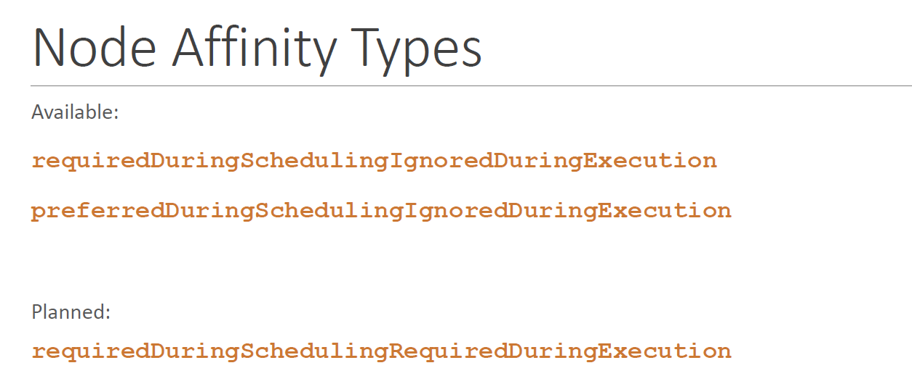
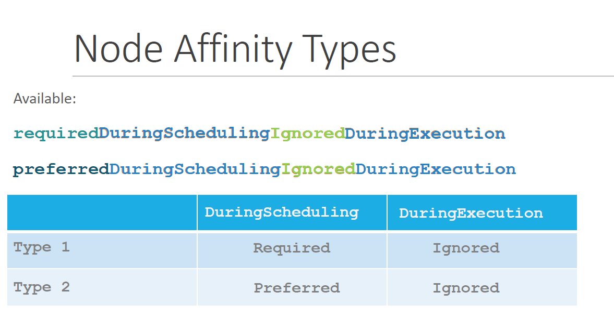
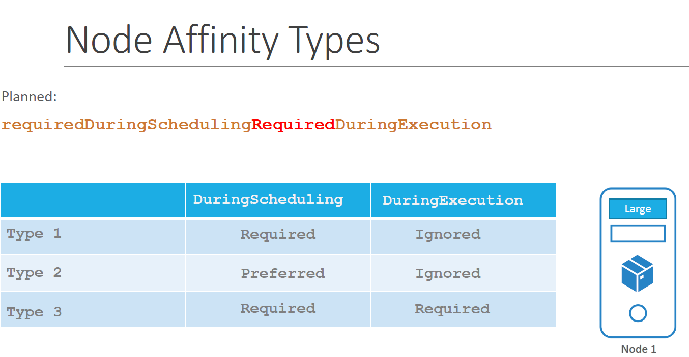
- All these node affinity types helps us in selecting nodes for pod objects as per our requirement.

#### Taints & Tolerations V/S Node Affinity:

- consider we have 2 node and 3 pods blue, red and green. end goal should be same both node and pod should have the same color.
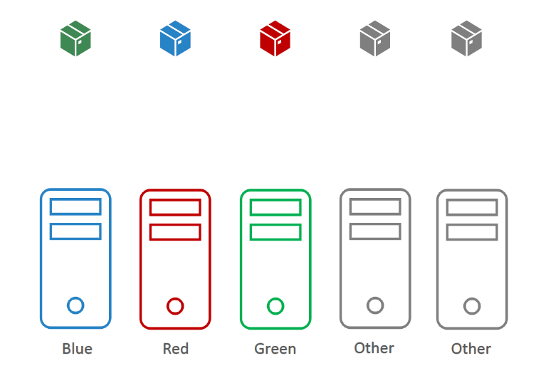
- use taints and toleration as below image. taint the nodes and add tolerations to the pods.
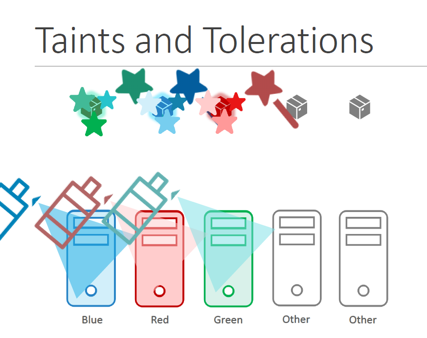
- As taints & tolerations doesnt ensure that the pod for sure ends up on given nodes it might placed on different node as well which is un tainted.
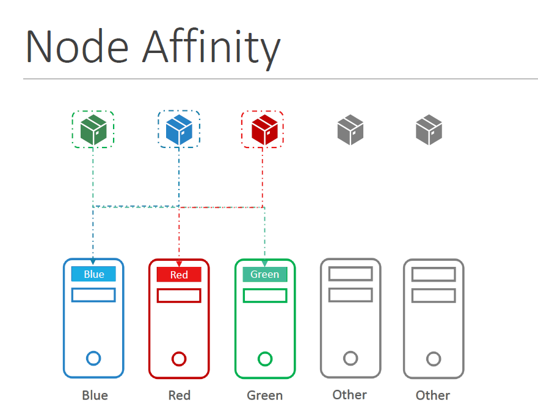
- use node affinity to labels the nodes with respective colors. Then use the node selectors to tie the pods to the nodes.
  however, that doesnt gurantee other pods doesnt end on these nodes.    
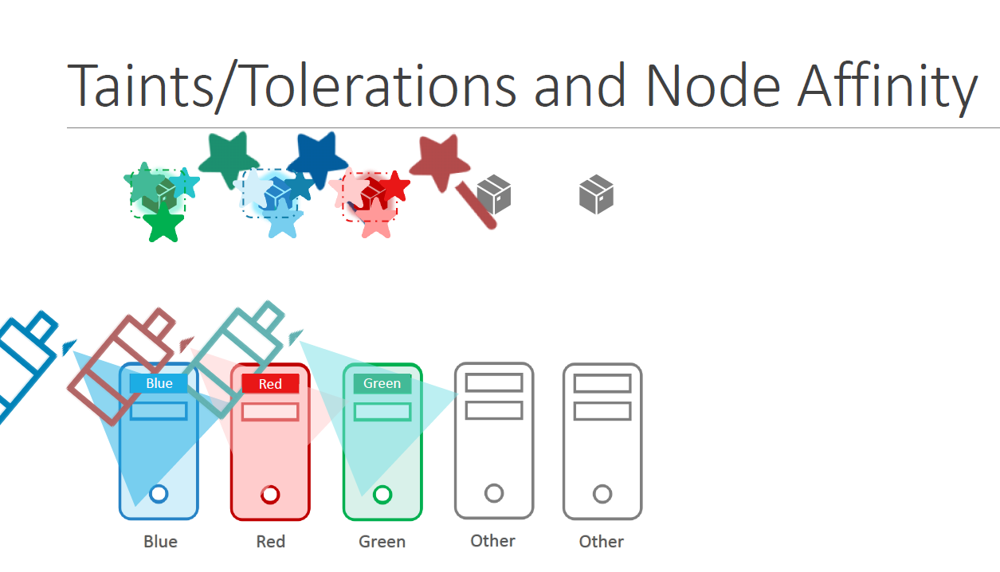
- hence , we use a combination of both are used to completely dedicate particular pods to desired nodes.

### 2.6 Resource Limits:
- if the resource limits threshold is breached on nodes, k8s does not schedule additional pods on these nodes and gives error resource requirements not matched.
 Resources: CPU, MEM, DISK
- resource requests minimum number of CPU and MEM required by the container. It uses this number to check where to schedule these pods. (default CPU=0.5, MEM=256 Mi, DISK)
- if  you want to increase the resource requirements for a give pod we can mention it in the pod  definition yaml file.
   spec:
      containers:
         resource:
            requests:
               memory: "1Gi"
               cpu: 1 # 1 CPU means 1 vCPU Core in AWS
- In docker , the container doesnt have any restriction on how much vCPU it can use. 
- In k8s each container has a limit on how much vCPU it can consume. If not  stated explicitly container will be limited to only 1 vCPU usage. same with memory 512 Mi. we can set them manually as well.
   spec:
      containers:
         resource:
            requests:
               memory: "1Gi"
               cpu: 1 
            limits:
               memory: "2Gi"
               cpu: 2
- If container CPU goes beyond mentioned certain threshold , k8s will throttle the request. In the case of memory it doesnt throttle but repeated increase in usage k8s kills that pod.

```
In the previous lecture, I said - "When a pod is created the containers are assigned a default CPU request of .5 and memory of 256Mi". For the POD to pick up those defaults you must have first set those as default values for request and limit by creating a LimitRange in that namespace.


apiVersion: v1
kind: LimitRange
metadata:
  name: mem-limit-range
spec:
  limits:
  - default:
      memory: 512Mi
    defaultRequest:
      memory: 256Mi
    type: Container
https://kubernetes.io/docs/tasks/administer-cluster/manage-resources/memory-default-namespace/


apiVersion: v1
kind: LimitRange
metadata:
  name: cpu-limit-range
spec:
  limits:
  - default:
      cpu: 1
    defaultRequest:
      cpu: 0.5
    type: Container
```

```
A quick note on editing PODs and Deployments
Edit a POD
Remember, you CANNOT edit specifications of an existing POD other than the below.

spec.containers[*].image

spec.initContainers[*].image

spec.activeDeadlineSeconds

spec.tolerations

For example you cannot edit the environment variables, service accounts, resource limits (all of which we will discuss later) of a running pod. But if you really want to, you have 2 options:

1. Run the kubectl edit pod <pod name> command.  This will open the pod specification in an editor (vi editor). Then edit the required properties. When you try to save it, you will be denied. This is because you are attempting to edit a field on the pod that is not editable.


A copy of the file with your changes is saved in a temporary location as shown above.

You can then delete the existing pod by running the command:

kubectl delete pod webapp


Then create a new pod with your changes using the temporary file

kubectl create -f /tmp/kubectl-edit-ccvrq.yaml


2. The second option is to extract the pod definition in YAML format to a file using the command

kubectl get pod webapp -o yaml > my-new-pod.yaml

Then make the changes to the exported file using an editor (vi editor). Save the changes

vi my-new-pod.yaml

Then delete the existing pod

kubectl delete pod webapp

Then create a new pod with the edited file

kubectl create -f my-new-pod.yaml


Edit Deployments
With Deployments you can easily edit any field/property of the POD template. Since the pod template is a child of the deployment specification,  with every change the deployment will automatically delete and create a new pod with the new changes. So if you are asked to edit a property of a POD part of a deployment you may do that simply by running the command

kubectl edit deployment my-deployment

```

### 2.7 Daemon Sets:

- A DaemonSet ensures that all (or some) Nodes run a copy of a Pod. As nodes are added to the cluster, Pods are added to them. As nodes are removed from the cluster, those Pods are garbage collected. Deleting a DaemonSet will clean up the Pods it created.

Some typical uses of a DaemonSet are:

running a cluster storage daemon on every node
running a logs collection daemon on every node
running a node monitoring daemon on every node
In a simple case, one DaemonSet, covering all nodes, would be used for each type of daemon. A more complex setup might use multiple DaemonSets for a single type of daemon, but with different flags and/or different memory and cpu requests for different hardware types.
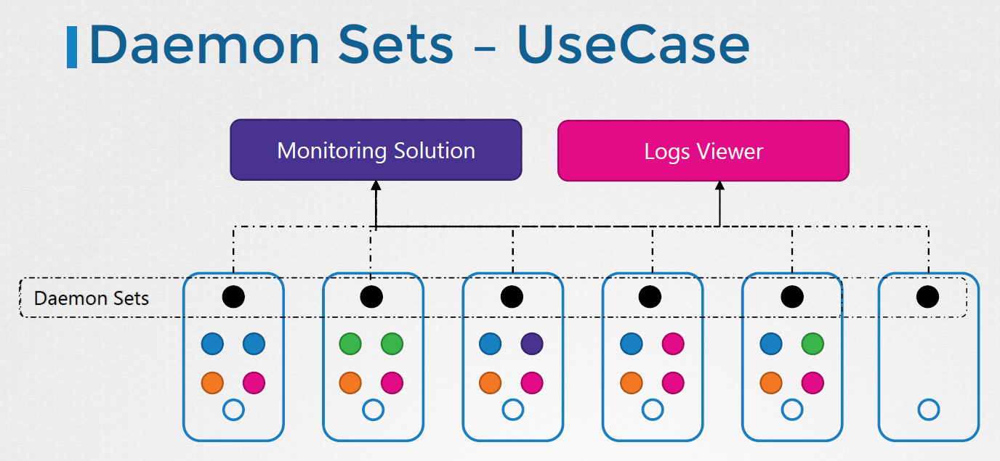
- Its helps in running one copy of your pod  on each node in your cluster, whenever new noe is added to the cluster a replica of the pod is automatically added and vice versa.
- The use case is monitoring agent/logs viewer, it is helpful as it can deploy monitoring agent as a deamon set running on each node.
- kube proxy can also be deployed as a daemon set, similarly networking solution requires agent to be running on each node.
- the daemon set yaml file is similar to pod replica set.

- How does daemon set schedule each pod on every node?
   - one solution is using nodeName in yaml as discusssed in earlier section.so it gets placed on respective node.
     Hoever, after version 1.1 its uses node affinity rules and default scheduler.
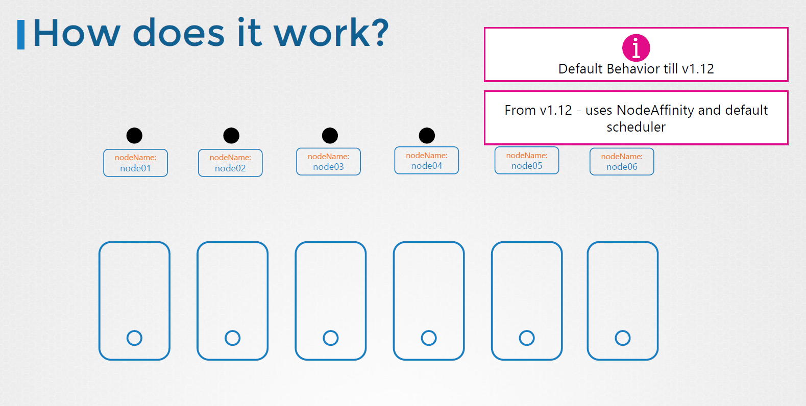

### 2.9 Static Pods:

- Static Pods are managed directly by the kubelet daemon on a specific node, without the API server observing them. Unlike Pods that are managed by the control plane (for example, a Deployment); instead, the kubelet watches each static Pod (and restarts it if it fails).

Static Pods are always bound to one Kubelet on a specific node.

The kubelet automatically tries to create a mirror Pod on the Kubernetes API server for each static Pod. This means that the Pods running on a node are visible on the API server, but cannot be controlled from there. The Pod names will be suffixed with the node hostname with a leading hyphen.

- Consider if there was no master node, is there anything kubelet can do as the capitain of the ship.
- kubelet can manage a node independently. it has docker installed as well.
- we can configure the kubelet to read the pod yaml files to read from a directory inside the node /etc/k8s/manifests/
- Not only creates the pods if the application crashes it ensures to restart it. If we make any changes to the directory kubelet attempts to recreate it.
- If u remove a file , pod is deleted automatically.
- These pods that are created automatically without the intervention of master node directly on that particular node are called **static pods**
- we can only create pods these way , we cant create deployments or replica sets etc.,..
- It could be any directory on the host, it is passed inside the kubelet.service uder --pod-manifest-path OR we could provide a --config path.
- we should know this irrespective of the pod. check for the path in kubelet.service and look for pod manifest path or config.
- once the static pods are created run docker ps to check the cotainers running, we cant use the kubectl commands as we dont have the master yet.
- kubelet can create pods both from  manifest path and from kube api server simultanesouly.
-  We can get the static pods details running on the node via the kubectl commands when the master is active, however we can't edit or replace the pod as master doesnt have the acess.
- we can only change the static pods via the files placed on the node, also these static pods names are appendend with the node name at the end. Ex:green-pod-node01 
- Use Case:
   - all the yaml files corresponding to the master node (ex: etcd, controlplane etc.,.) can be placed in the /etc/k8s/manifests . thats how the kubeadm make sure that these pods keep running all the time and setup the cluster. that is the reason when you type kubectl get pods -n kube-system , lists all the components as pods.

#### Static Pods vs Daemon Sets:
- Static pods:
      - created by kubelet
      - deploy control plane components as Static Pods.
- Daemon Sets:
      - Created by kube-API server
      - Deploy monitoring agents, logging agents on nodes.
- Both of them are ignored by kube-scheduler. It doesnt care about these pods.

### 2.10 Multiple Schedulers:
- Kubernetes ships with a default scheduler. If the default scheduler does not suit your needs you can implement your own scheduler. Moreover, you can even run multiple schedulers simultaneously alongside the default scheduler and instruct Kubernetes what scheduler to use for each of your pods.
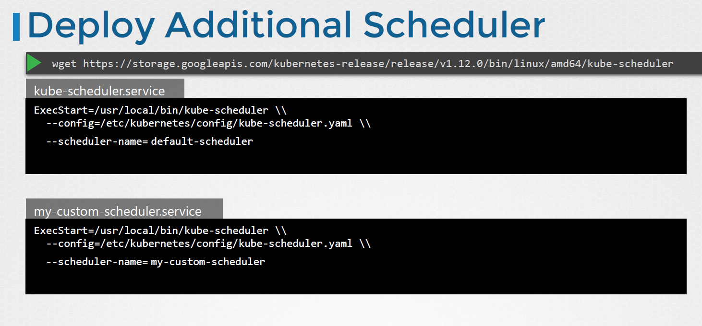
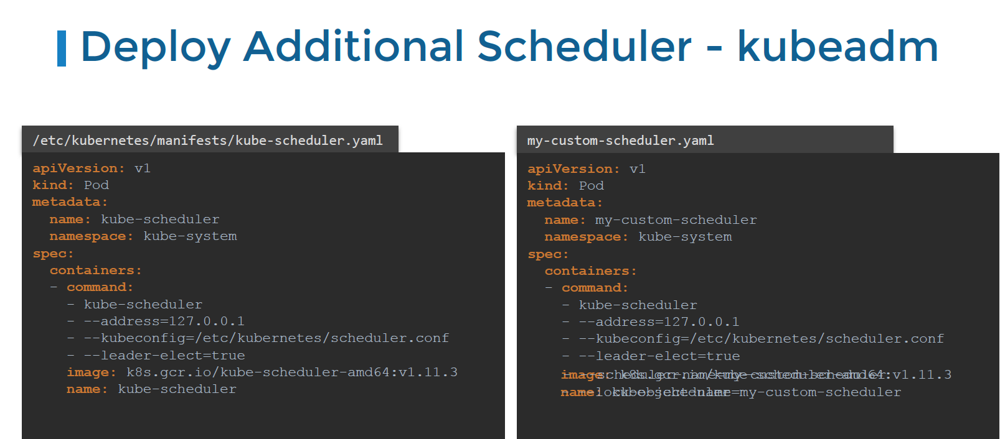
- If you have multiple master then we have to mention the leader elect and lock object in the yaml file to select the custom scheduler. 
- Mention the schedulerName while spinning up the pod to pick the right scheduler. If the schduler is not configured correctly the pod will be in pending state.
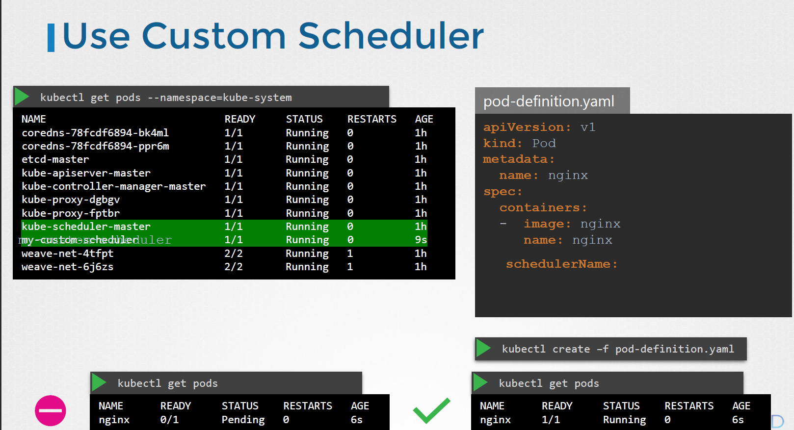
- kubectl get events, it lists all the recent events.
- View the logs 
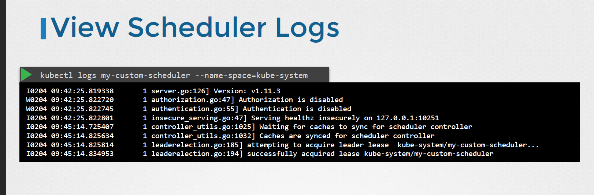

## 3.0 Logging & Monitoring:

- How to monitor CPU, usage, disk , networking etc.,. on Node and POD level.
- on each node k8s runs kubelet daemon set, which recieves instructions from kube-api-server.
- kubelet also contains a sub component called cAdvisor, its resposible for retrieving container metrics and expsoing them to the outside via the kubelet API.
- enable the metrics server by downloading from git , and creating the respective pods.
- Once the metrics server is installed we can run the kubectl top node (which provides the CPU and memory of each of the nodes), similarly kubectl top pod.
- Application Logs:
      - kubectl logs -f event-pod
      - if there are multiple containers in a pod. then use below command.
         - kubectl logs -f pod-name container-name
- https://kubernetes.io/docs/tasks/debug-application-cluster/resource-usage-monitoring/
- https://kubernetes.io/docs/tasks/administer-cluster/manage-resources/

## 4.0 Application Lifecycle Management:

- We discuss about the rolling update deployments,configure applications, self healing and scale applications.

### 4.1 Rolling updates & Rollbacks:

- When you create a deployment it triggers a rollout which creates a new revision. ex: first one revision 1
- When the container version is upgraded a new deployment is created with revision 2. 
- Run the below command to check the rollout status (kubectl rollout status deployment/myapp-deployment)
- We can also check the history of rollouts(kubectl rollout histiry deployment-name)
- There are two kinds of deployment strategies:
   - Recreate: Destroy the running containers and create the new ones. Application will have some downtime. this strategy is recreate  strategy
   - Rolling Update: it is the default deployment strategy. it takes container down at a time and updates the same. Almost everyone follows this strategy.
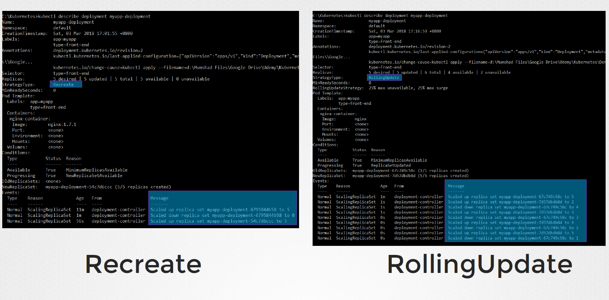
- How the upgrade works under the hood?
   When you run a new deployment the k8s creates a  new replica set and deploys the new containers , same time taking down the containers in the old replicaset. one by one.
- to rollback a deployment do the undo command.(kubectl rollout undo deployment-name)

### 4.2 HOrizontal Pod Autoscaling:
 https://kubernetes.io/docs/tasks/run-application/horizontal-pod-autoscale/

   https://medium.com/avmconsulting-blog/horizontal-pod-autoscaler-hpa-in-kubernetes-part1-afba286becf


### 4.3 Configuring Applications:
- configuring applications comprises of understanding the following concepts.
   - configuring command and arguments on applications.
   - Configuring Environment Variables
   - Configuring Secrets.
- **Configuring Commands & Arguments:** - when you run a  docker cotainer from a ubuntu image. (docker run ubuntu) it exsists immediately.
            unlike VM , containers are not meant to host a OS. its meant to run only to run certain processes. If the processes inside the container is stopped container exsists.
            how to know what process runs inside the container once it starts. its defined in the dockerfile of the image being pulled. 
            Ex: if we pull an nginx image docker file, at the end it does have CMD ['nginx']
            Similarly, for ubuntu the command is ['bash'],  unlike nginx bash isnt a web server it checks for the input from the terminal, if it doesnt find one it exists.
            we need to specify the input to  bash terminal like "docker run ubuntu sleep 5", how to make that change permanent. to do that we create a new image out of a base image and specify the command to be run at the bottom of docker file like below example.
            Ex: ["command", "param"] the command should be always executable command . I can run the ubuntu now as CMD ["sleep", "5"]
            build a docker image out of it using "docker build -t ubuntu-sleeper . "
            - Suppose if you want to change the CMD command input to something else while starting the container say 10, we dont have to pass it as "docker run ubuntu-sleeper sleep 10"
               we can just say "docker run ubuntu-sleeper 10" , the value 10 will automatically picked by our new container by using the ENTRYPOINT in dockerfile.  
               So whatever you append to the docker command after mentioning the ENTRYPOINT in the docker file , it gets appended to it.
            - What if we dont mention the value of 10 while running the docker run command, if throws an error, to avoid this we  need to use  both ENTRYPOINT and CMD, here CMD is the default value that gets appended to the ENTRYPOINT , if we dont mention any value during the docker run command.
            - if you want to mention a different entry point then use the command . "docker run --entrypoint sleepXYZ  ubuntu-sleeper 10"


```
FROM ubuntu

ENTRYPOINT ["sleep"]

CMD ["5"]
```
```
FROM debian:bullseye-slim

COPY docker-entrypoint.sh /
COPY 10-listen-on-ipv6-by-default.sh /docker-entrypoint.d
COPY 20-envsubst-on-templates.sh /docker-entrypoint.d
COPY 30-tune-worker-processes.sh /docker-entrypoint.d
ENTRYPOINT ["/docker-entrypoint.sh"]   #executes at the startup of the container for once.

EXPOSE 80

STOPSIGNAL SIGQUIT

CMD ["nginx", "-g", "daemon off;"] #get appended to the ENTRYPOINT script.  
```

   - Now lets create a pod using the ubuntu-sleeper image created above.
   -  apiVersion: v1
      kind: Pod
      metadata:
         name: ubuntu-sleeper-pod
      spec:
         containers:
         -  image: ubuntu-sleeper
            image: ubuntu-sleeper.
            args: ["10"] # Anything that we  append to the docker run command, like in the above mentioned example it  goes in the args property of POD Definiton file.
            command: ["sleepXYZ"] #to override the ENTRYPOINT in the dockerfile.
   - With the args we can replace the CMD of the docker file. Similarly, to override the ENTRYPOINT in the use the commands field

- **Configuring Environment Variables:**   We can give the env variables value directly in the pod definition file.
   spec:         
      containers:
      - name: ubuntu
        ports:
         - containerPort: 8080
        env:  #Plain Key Value
         - name: APP_COLOR
           value: pink    
- we can also pass the environment variables from ConfigMaps and Secrets. using the below,
      env:
      - name: APP_COLOR
        valueFrom: #fetching values from configmaps
          configMapKeyRef:
            name: app-config
            key: APP_COLOR
      
       OR

       env:
       - name: APP_COLOR
         valueFrom: #fetching values from secrets.
            SecretKeyRef:
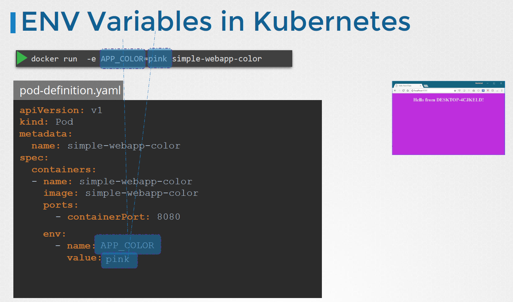
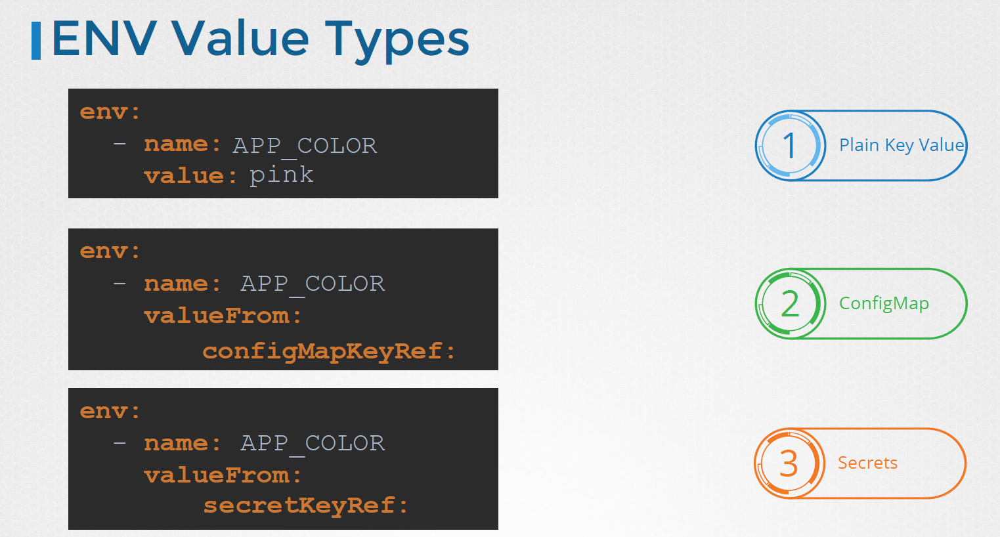

- **ConfigMaps:** 
   - configMaps are created in the key value format , so that they can be passed in to the pod dfenition file.
   - 1) creating a configMap:  Imperative (kubectl create configmap) config-name  --from-literal=key=value
                              Ex: kubectl create configmap app-config --from-literal=APP_COLOR=blue   (keep adding --from-literal for more env variables declaration)

                              Declarative(kubectl apply -f configmap.yml)
                             apiVersion: v1
                              kind: ConfigMap
                              metadata:
                              name: app-configmap
                              spec:
                              APP_COLOR: blue
                              APP_MODE: prod

                              Create as many configmaps as needed with relevant naming convention.
   - 2) Injecting into a pod: it can be done in 3 wayd ,
         1) To inject an env variable use envFrom 
         envFrom:
            - configMapRef:
                 name: app-config
         2) Single Env using the env 
            env:
             - name: APP_COLOR
               valueFrom: #fetching values from secrets.
               configMapKeyRef:
                   name: app-config
                   key: APP_COLOR
         3) using Volumes
            volumes:
            - name: app-config-volume
              configMap: 
                 name: app-config   


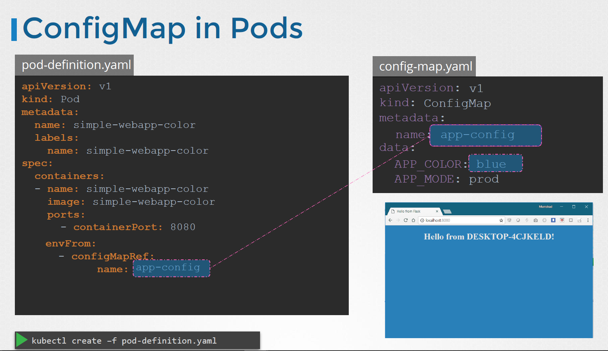
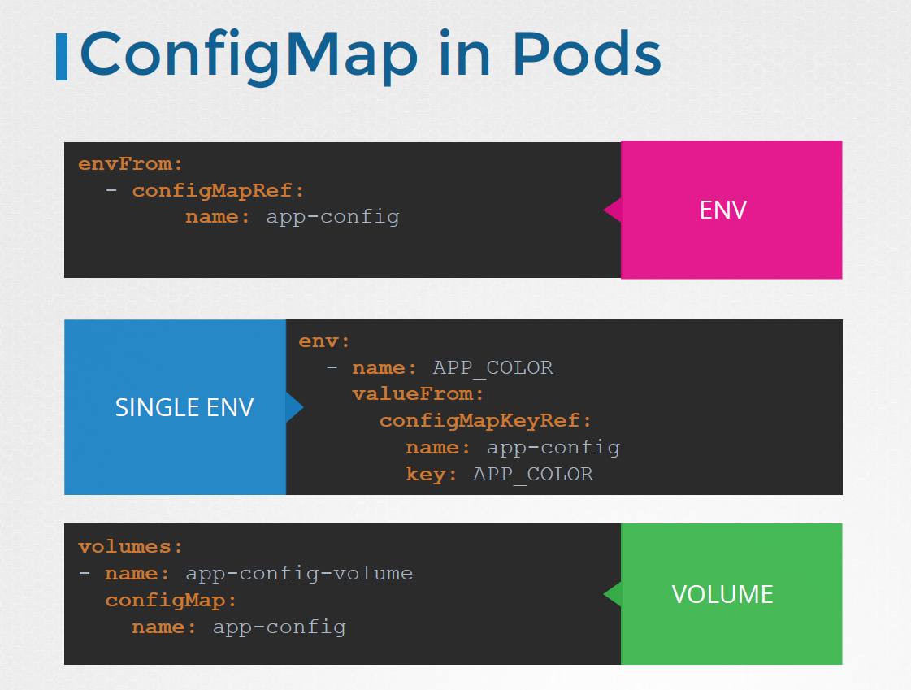

- **Secrets:**
   - We can use environment varibles for DB username and passwords and other connectivites, but thats not a good idea as they are not secure.
     this is the reason on top of configmap we use secrets to store sensitive information. they are similar to configmap but they are encoded in base64 format.

   - Like configmap we can create secrets using both imperative and declarative ways. (kubectl create secret generic secret-name )
      refer yaml file of configmap for declarative way.
   - All the  values in the secrets should be base64 encoded. to covert the normal values into base 64 encoding use  
      echo -n 'mysql' | base64
      To decode > echo -n '5qvu=' | base64 --decode

   - injecting a secret into a pod: same way as we inject the configmaps including the 3 ways as configmaps.
            envFrom:
            - secretRef:
                 name: app-config
   - all the secrets should be created as filename which includes the secret.
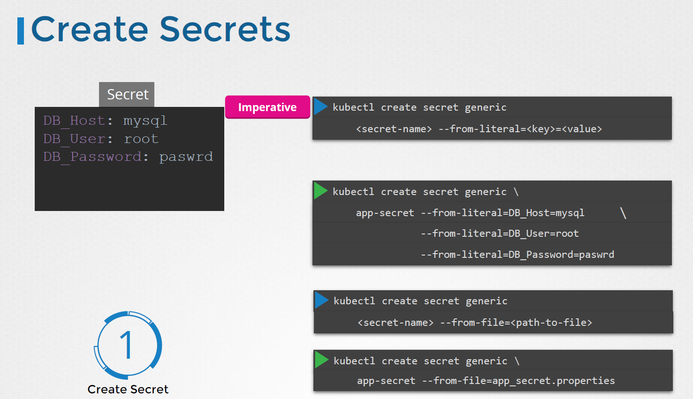
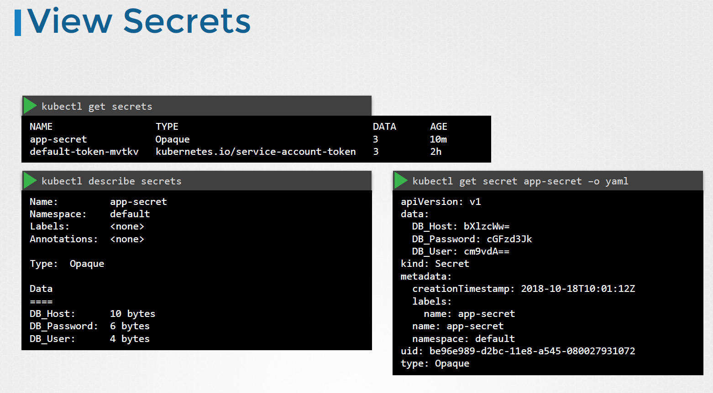
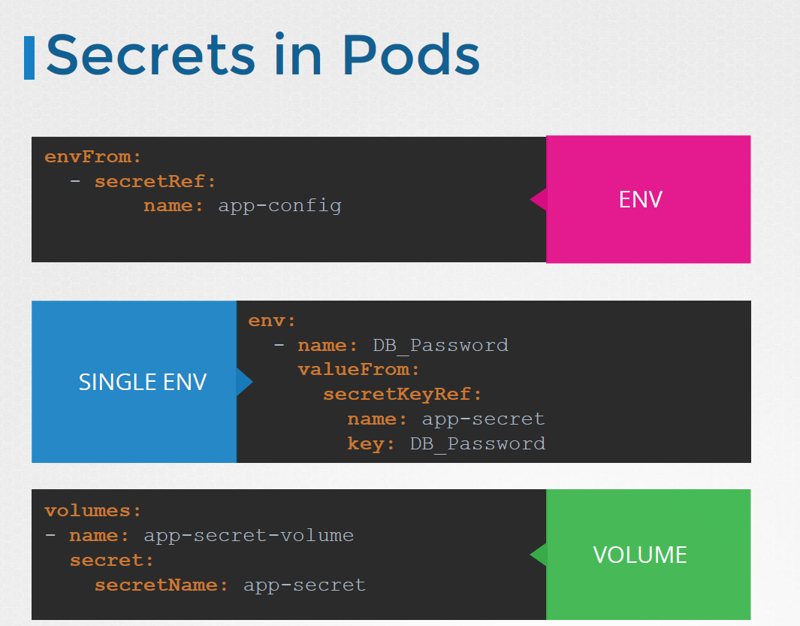
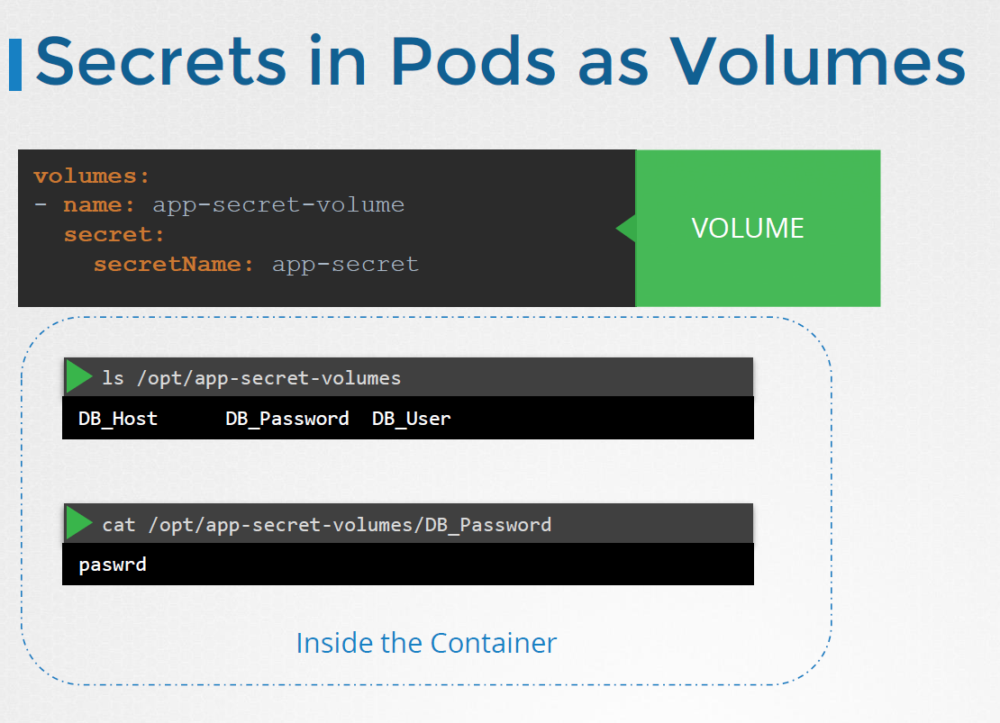
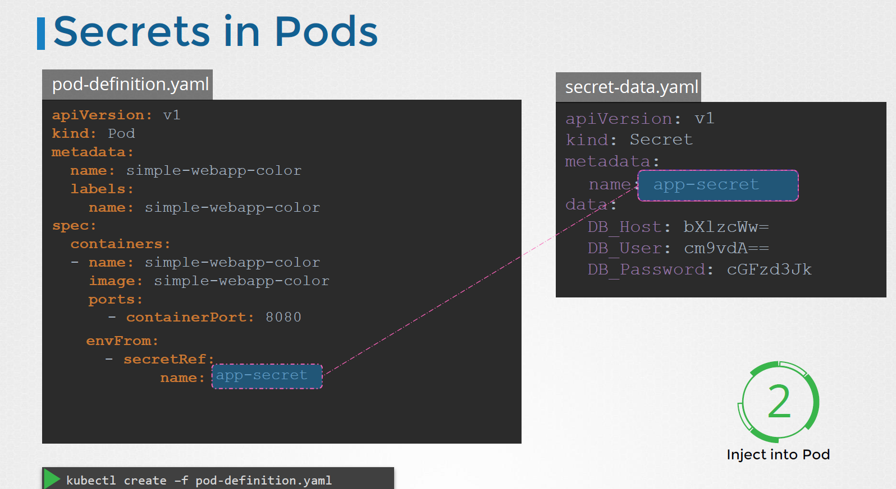

### 4.4 Multi Container Pods:

- having two or more pods running inside a pod.
- Microservcies architecture , helps us breaking large application into small chunks and work as an individual member.
- Most of the times we may require a logging agent and web/application should be paried with each other.
- that is the reason we have multi container pod i.e they are created together and destroye together. they share the same network space.  they can refer to each other as localhost and same volumes.
- this way u dont have to establish volume sharing and services to enable communication b/w them.
- to create a multi container pod , add another pod in the spec section in pod definition yaml.

- Multi-container PODs Design Patterns
   There are 3 common patterns, when it comes to designing multi-container PODs. The first and what we just saw with the logging service example is known as a side car pattern. The others are the adapter and the ambassador pattern.

### 4.5 Init Containers:

- In a multi-container pod, each container is expected to run a process that stays alive as long as the POD's lifecycle. For example in the multi-container pod that we talked about earlier that has a web application and logging agent, both the containers are expected to stay alive at all times. The process running in the log agent container is expected to stay alive as long as the web application is running. If any of them fails, the POD restarts.


- But at times you may want to run a process that runs to completion in a container. For example a process that pulls a code or binary from a repository that will be used by the main web application. That is a task that will be run only  one time when the pod is first created. Or a process that waits  for an external service or database to be up before the actual application starts. That's where initContainers comes in.


- An initContainer is configured in a pod like all other containers, except that it is specified inside a initContainers section,  

```
apiVersion: v1
kind: Pod
metadata:
  name: myapp-pod
  labels:
    app: myapp
spec:
  containers:
  - name: myapp-container
    image: busybox:1.28
    command: ['sh', '-c', 'echo The app is running! && sleep 3600']
  initContainers:
  - name: init-myservice
    image: busybox
    command: ['sh', '-c', 'git clone <some-repository-that-will-be-used-by-application> ; done;']
```

- When a POD is first created the initContainer is run, and the process in the initContainer must run to a completion before the real container hosting the application starts. 

- You can configure multiple such initContainers as well, like how we did for multi-pod containers. In that case each init container is run one at a time in sequential order.

- If any of the initContainers fail to complete, Kubernetes restarts the Pod repeatedly until the Init Container succeeds.

```
apiVersion: v1
kind: Pod
metadata:
  name: myapp-pod
  labels:
    app: myapp
spec:
  containers:
  - name: myapp-container
    image: busybox:1.28
    command: ['sh', '-c', 'echo The app is running! && sleep 3600']
  initContainers:
  - name: init-myservice
    image: busybox:1.28
    command: ['sh', '-c', 'until nslookup myservice; do echo waiting for myservice; sleep 2; done;']
  - name: init-mydb
    image: busybox:1.28
    command: ['sh', '-c', 'until nslookup mydb; do echo waiting for mydb; sleep 2; done;']

```

https://kubernetes.io/docs/concepts/workloads/pods/init-containers/


### 4.6 Self healing Containers:

- Kubernetes supports self-healing applications through ReplicaSets and Replication Controllers. The replication controller helps in ensuring that a POD is re-created automatically when the application within the POD crashes. It helps in ensuring enough replicas of the application are running at all times.
- Kubernetes provides additional support to check the health of applications running within PODs and take necessary actions through Liveness and Readiness Probes. However these are not required for the CKA exam and as such they are not covered here. 

https://kubernetes.io/docs/tasks/configure-pod-container/configure-liveness-readiness-startup-probes/

https://kubernetes.io/docs/tasks/configure-pod-container/configure-liveness-readiness-startup-probes/


## 5.0 Cluster Maintenance:

-  We need to know about the cluster upgrade process, upgrading the os and patching and Backup & Restore Methodologies.
### 5.1 OS Upgrades:

- 