# CKA

## 1.0 Cluster Architecture:


#### ETCD:

- Its a simple key-value store DB. 
- Its stores data in key and value format. ex: Key: Name Value: Sai
- Its easy to install etcd download and run the binaries and install it. By default it runs on port 2379. 
- Later we can attach clients once the ETCD is up and running.
- It comes with the command line etcdctl. Ex: etcdctl get key1
- Its stores all the information about K8S cluster and nodes. Ex: Nodes, PODS, Configs, Secrets etc.,..
- There are couple of ways we can spin up a server using the manual way by downloading the binaries or by using the kubeadm commands.
- When you deploy etcd using kubeadm it deploys the same as pod in the kube-system namespace.
- Note : Refer to the pdf in the git for more pictorial repsresentation.
- ETCD stores all the information inside a folder called registry.
- In HA environment we may have mutiple masters along with the mutiple etcd DB. In that situation make sure the etcd knows about all these different DB avaiable.
   --initial-cluster controller-0=https://${CONTROLLER0_IP}:2380,controller-1=https://${CONTROLLER1_IP}:2380 \\

```
(Optional) Additional information about ETCDCTL Utility

ETCDCTL is the CLI tool used to interact with ETCD.

ETCDCTL can interact with ETCD Server using 2 API versions - Version 2 and Version 3.  By default its set to use Version 2. Each version has different sets of commands.

For example ETCDCTL version 2 supports the following commands:

etcdctl backup
etcdctl cluster-health
etcdctl mk
etcdctl mkdir
etcdctl set


Whereas the commands are different in version 3

etcdctl snapshot save 
etcdctl endpoint health
etcdctl get
etcdctl put

To set the right version of API set the environment variable ETCDCTL_API command

export ETCDCTL_API=3


When API version is not set, it is assumed to be set to version 2. And version 3 commands listed above don't work. When API version is set to version 3, version 2 commands listed above don't work.


Apart from that, you must also specify path to certificate files so that ETCDCTL can authenticate to the ETCD API Server. The certificate files are available in the etcd-master at the following path. We discuss more about certificates in the security section of this course. So don't worry if this looks complex:

--cacert /etc/kubernetes/pki/etcd/ca.crt     
--cert /etc/kubernetes/pki/etcd/server.crt     
--key /etc/kubernetes/pki/etcd/server.key


So for the commands I showed in the previous video to work you must specify the ETCDCTL API version and path to certificate files. Below is the final form:


kubectl exec etcd-master -n kube-system -- sh -c "ETCDCTL_API=3 etcdctl get / --prefix --keys-only --limit=10 --cacert /etc/kubernetes/pki/etcd/ca.crt --cert /etc/kubernetes/pki/etcd/server.crt  --key /etc/kubernetes/pki/etcd/server.key" 
```

#### Kube-API server:

- kube-api server is the primary management component in k8s.
- when you run kubectl , it first reaches the kube-api server and authenticates the command. Then it communicates with the etcd DB and retrives the information.

- kube-api is the center of all the communication in k8s cluster.
- there are lot of certificates to take care of when we configure k8s cluster manually check those out in the ssl and tls certificate section.
- We create this api-server manually in the kube-system namespace and we can check all the components of api-server in the relavant manifest files.

#### Kube Controller Manager:

- it manages various components within the k8s cluster and takes necessary actions.
- In k8s terms a controller is a process that continously  monitors the status of the relavant components and takes remediate action to bring it to the desired state.
- Ex: Node controller continously monitor the health of application nodes via api-server every 5 seconds and it its doesnt recieve a signal it marks that particular node unreachable and takes necessary actions to spin up those pods on the reachable worker nodes after 40secs
- Similarly we have the Replication Controller which ensure the monitoring of replica sets. if a pod dies its responsible for creation of another one.
- There are many more controllers in k8s to maintain the desired state. The main logic behind the k8s functionality.
- we can manage the way a controller works using the kube-controller.service and check the relavant options we can enable sprcific controllers required for our use case as well. In case doesnt work this can be a good strating point to look at.

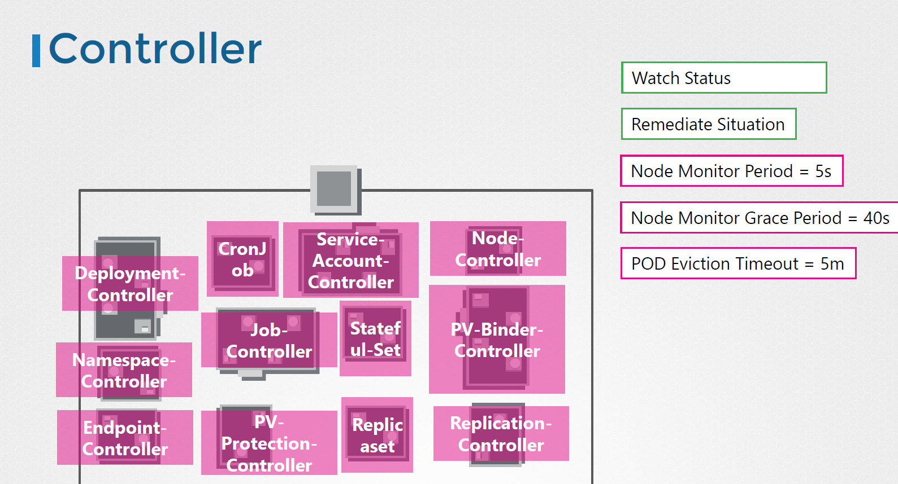

#### Kube-Scheduler:

- Its repsonible for the scheduling the pods on the nodes.
- Please take care that the kube-scheduler is only responsible for deciding which pod goes on which node. 
- The actual pod get created by the kubelet on the respective worker node.
- Scheduler is required as there are many nodes and we need deploy mutiple pods of different usage capacity. To make sure the node has sufficient capacity and relavant applications for the pod to run seamlessly.
- refer the picture on how the scheduler filter to decide on which node the particular pod run.

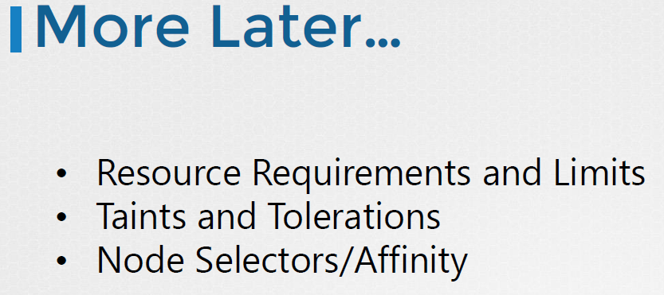

- Please check the relavant process using ps -aux | grep kube-scheduler and modify the options as per the requirement.

#### Kubelet:

- its like the captain of the ship.
- It runs on the each worker node and responsible for the communcation b/w master and worker node. it also helps in sending the necessary details about the current pods and health check to the controller via kube-api server.
- Similar to others the funtionalities of kubelet can be configured using the manual setup.
- we have to install it expicitly on worker nodes. it does not get installed directly with the kubeadm.

#### Kube Proxy:

- Within a k8s cluster every pod can reach every other pod using a POD network.
- POD network is an internal virtual network which spans across the mutiple nodes and pods.
- We can reach a web server pod using the IP address of the particular pod where the web server container is running, but there is no gurantee that the IP will be constant.
- The better way to access is using the service(which we will get to know further). Service has a fixed IP address and will be constant unlike container it doesnt die and gets recreated.
- Service can't join the pod network unlike the container coz its not an actual thing like container, its a virtual component that lives in the K8S memory. it just used as a fixed IP thing to refer to the relavant backend like webserver, appserver or DB.
- But the service should be accessible across the many worker nodes as we might have our web server pods running across mutiple worker nodes. The way the communication b/w the service and the pods across mutiple worker nodes is achieved using the "Kube Proxy".
- Its installed on the each of the worker nodes and every time a service is created it creates appropriate rules on each node to forward traffic to the relavant pods across different nodes.
- The way the kube proxy achieves this is using the IP tables. the services IP and pods IP running across mutiple nodes is matched and request is served.

- kubeadm deploys kube proxy as pods on each worker nodes in kube sytem name space.
- Infact its deployed as a daemon set on each node. (daemon set we will no in upcoming lectures)

#### POD:
- its the smallest unit inside the k8s cluster.
- ** Node > POD > Container **
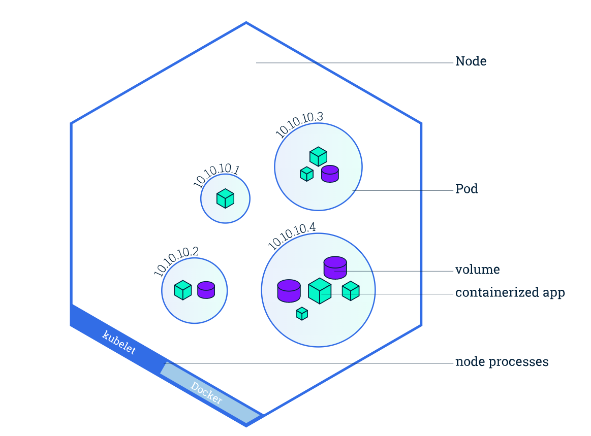
- we can have mutiple containers running witin a single pod. Multi container pods.


### 1.1 K8S Replication Controller:

- There are many controllers in K8S. But the replication controller is the most important amongst all for the day to day usage.
- Generally when we spin up a pod , we just spin one container or more containers within a pod. If for someone reason the pod dies we dont have a backup.
- Here the replication controller help us run multiple instances of a single pod thus providing High Availability.
- Hence, if a single pod dies replication controller ensures that the desired number of pods are always running.
- Another reason for replication controller is we can give the minimum and max number of pods range that needs to be running at given point of time.
- In case of increased traffic replication cotroller spins up more pods not exceeding the max number given and distributes the traffic across.
- The Replication controller is replaced by replicaSet. 
- We need to spin up all the stuff using the replicaset.
- Refer to the yaml section on how to write the yaml's for the replica set.


**Deployments > ReplicaSets > Pod**  (Refer to the k8s_commands and yaml folder)

#### Namespaces:

- In Kubernetes, namespaces provides a mechanism for isolating groups of resources within a single cluster.Names of resources need to be unique within a namespace, but not across namespaces.       Namespace-based scoping is applicable only for namespaced objects (e.g. Deployments, Services, etc) and not for cluster-wide objects (e.g. StorageClass, Nodes, PersistentVolumes, etc).
- Be defualt k8s has 2 different name space.
   - default (where the user pod gets created by default)
   - kube-system (admin level pods and services are created)
   - kube-public (resources made avaiable to public are placed)
- namespacing helps in isloating reosurces into QA, STG and PROD environments.
- Each namespace can have own set of policies and resource quotas.
- to connect to resources in a different namespace using a hostname. for example webserver in a default namespace to db in a DB namespace object. we have to use
   mysql.connect("db-service.dev.svc.cluster.local)
- we can mention the namespace in the yaml file instead of command line. Under the metadata section (namepsace: dev)
   metadata:
      name: my-app
      namespace: dev
- namespace can be created using the object type Namespace. using the below yaml definition. 
- To limit the usage of resources in a namespace create the **resource quota**.

### 1.3 Services:

- An abstract way to expose an application running on a set of Pods as a network service.
- There are about 3 main service types in k8s.
   1. NodePort
   2. ClusterIP
   3. Loadbalancer
- **Nodeport** :
   - Consider we have an webserver pod. how do we as an external user acccess that pod. As we know that pod has a IP adress, Node has an IP address.
   for this purpose we use k8s service to forward the request to a pod.
   - the use of this service is to listen to a port on the node and forward the request to the pod. This type of service is called NodePort service
     As it listens to a particular port on the node and forwards the requests to the pod.
   
   
   - Target port is the port on which the container listens, port is on which the service listens and sends the requests. Whereas Nodeport is the port on which the Node is listening to the outisde world requests. By default NodePort has a range of 30000-32787
   targetport: One or more ports on which a container listens within a pod.

   nodeport: Used primarily to accept consumer requests. (Eg: HTTP request from consumers to a webserver running in a container)

   nodeport is listened on all nodes on all interfaces i.e 0.0.0.0:nodeport. Consumer service requests sent to nodeport is routed to container's targetport so that the container can fulfill the request.

   port: Port used within the kubernetes pod network, primarily used to exchange requests between pods. Here as well, requests to a pod from another, is routed to the corrosponding pod's container targetport.

   Summary: all requests end up in the targetport. nodeport is used if request from outside k8s network & port if from within.
   
   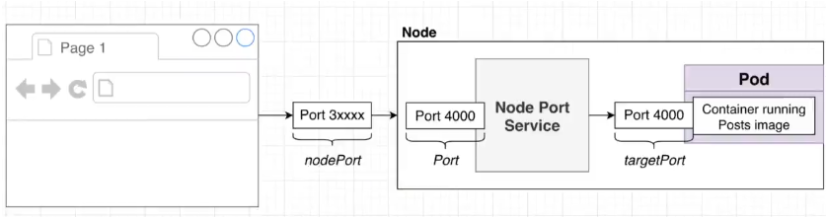
   - How to write yml file for service refer to the yaml folder.
   - services are matched to respective pods using the lables and selectors.
   - In case of the pods are span across the mutiple nodes. we dont have to do anything the service itself spans across mutiple nodes thus distributing traffic to the multiple pods across different nodes in k8s cluster.
   - generally this setup is not secure as we expose a port on the node to the outside world hence we got other type of services.
- **ClusterIP** :
   - consider we have a 3 tier application where we have web app, app  and redis runing across mutiple pods and request flow from webapp-> app -> redis
    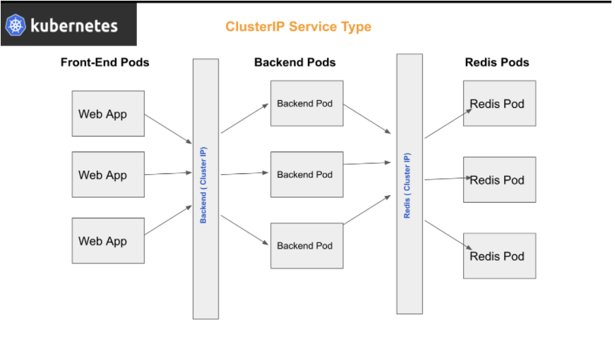
   - How will the traffic from mutiple web pods is being sent to the app pods , how it will decide to which app pod the traffic should be sent to. Here k8s service clusterIP helps us with this.
   - We create a service backend and assigns the app backend to that service so the traffic is being distributed to that relavant pods using lables and selectors.
   - When we create a ClusterIP service its get a name and IP assigned to it. when we refer to that name the traffic will be sent to those relavant backend pods.

- **LoadBalancer** :
   - when we expose the application to the external users , the service that serves the request might span across mutiple nodes. Which IP address would we give to the end user amogst the different nodes IP address and the port number on which its exposed. to solve this issue we need a single URL to access the application. this is achieved using LoadBalancer.
   - This LB can be created only on a supported Cloud Platform like GCP/AWS
   - We can leverage that support of native load balancer and configure that for us. For example, if we set the service type to the LB it spins up CLB by default in AWS unless specific LB type is specified.


### 1.4 Imperative vs Declarative:

- Mentioning what needs to be  executed is done using declarative approach. Ex: ansible, terraform etc.,..
   most scenarios are covered as we use thrid party tools which know how to handle these situations.
  Ex: k8s we write these in the yaml format. 
  kubectl apply -f pod.yml
  if we want all the yml under a specific folder to be run we use.
  kubectl apply -f /path/to/yaml/files.
   make necessary changes and we can run the apply command again to update the changes.
- Where as giving step by step instructions on what needs to be done and how is given by Imperative approach. More dependent on the logic we write and result in failures in few scenarios.
   ex: kubectl run -image=nginx ngnix, kubectl create deployment --image=nginx nginx
      kubectl update...., kubectl update.... , etc.,..

## 2.0 SCHEDULING:
- Every pod has a component in spec section called nodeName which by default is not set. k8s sets it automatically.
   Scheduler checks for all those pods for which these values are not set and schedules the same. It then identifies the right node for the pod by running the scheduling algorithm.
   Once identified it binds the pod to that node by creating a binding object.

### 2.1 Manual Scheudling:
- If there is no scheduler to assign pods to nodes , the pods will remain in pending state.
- we can manually schedule the pods to node by mentioning the nodeNamein the pod definition yaml file. This is called Manual Scheduling. Its rarely done.
- We cant change the nodeName once the pod is created by editing the yaml file. Another apporach is to create a binding object and send a POST request binding API. Thus mimicking what the sheduler does.
- POST request is done using the curl command by sending a YAML content in JSON format via the command line.


### 2.2 Labels and Selectors:
-  Labels are key/value pairs that are attached to objects, such as pods. Labels are intended to be used to specify identifying attributes of objects that are meaningful and relevant to users, but do not directly imply semantics to the core system. Labels can be used to organize and to select subsets of objects. Labels can be attached to objects at creation time and subsequently added and modified at any time. Each object can have a set of key/value labels defined. Each Key must be unique for a given object.
- metadata:
  labels: 
    key1 : "value1",
    key2 : "value2"
  annotations:
   
- Annotations: these are used for information purpose along with the labels in yaml file. 
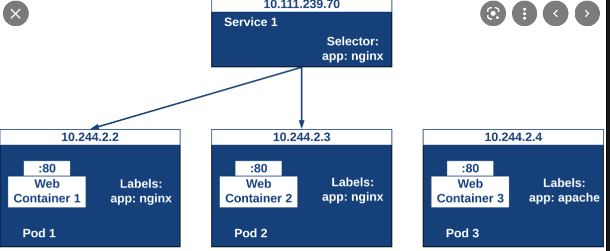

### 2.3 Taints & Tolerations:
- Node affinity is a property of Pods that attracts them to a set of nodes (either as a preference or a hard requirement). Taints are the opposite -- they allow a node to repel a set of pods.
- Tolerations are applied to pods, and allow (but do not require) the pods to schedule onto nodes with matching taints.

- Taints and tolerations work together to ensure that pods are not scheduled onto inappropriate nodes. One or more taints are applied to a node; this marks that the node should not accept any pods that do not tolerate the taints
- kubectl taint nodes node-name key=value:taint-effect
  (taint the nodes in key value format; taint-effect has three options Noschedule| PreferNoSchedule | NoExecute)
- Taints are added to the nodes
- Tolerations are added to the pods. there are added in yaml file in under tolerations section in spec. the values must be spcified in quotes.


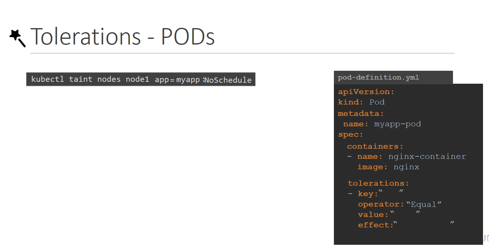

- **Taints and Tolerations doesn't tell the pod to go a particular node, instead taint tells the node to accept a particular pod only.**
- when the k8s is setup, a taint is setup on the master node so as not to accept any pods on the master node.
kubectl describe node kubemaster | grep Taint

### 2.4 Node Selectors: (mostly we used node affinity instead of this)
- Consider we  have a 3 node cluster with varying resources. We have different kinds of workloads in cluster.
  we want the larger node configured to be with data processing pods as that would be the only node that wouldn't run of resources in case of increased workload.
- To solve this we can set a limitation on the pod to run on a particular pod. we add a new property called **nodeSelector** in the pod yaml file.
   spec:
      nodeSelector:  
         size: Large
- But how can we label a node to be of size large. we can achieve that by using kubectl commands.
   kubectl label nodes <node-name> <label-key>=<label-value>
- However, it has limitations we used a single label and selector here. what if we have a requirement to place the pod on a large or medium node. OR to place the pod on node which is NOT small.
   To serve this purpose Node Affinity and Anit Affinity are introduced.

### 2.5 Node Affinity:

- the main use case of node Affinity is to ensure large pods are scheduled to run on node with large resources.
- we can provide advance capabilites to limit pod placement on relavant nodes  unlike node selectors.
- node affinity is mentioned  under the spec as most other parameters.

- in the below yaml we can see node affinty is set to check only if the operator size exsists.

- We have mutiple node affinity types.
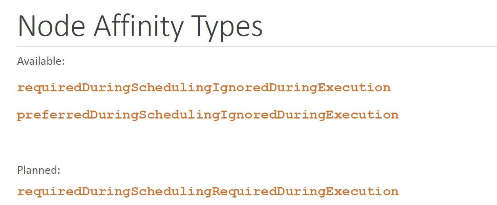
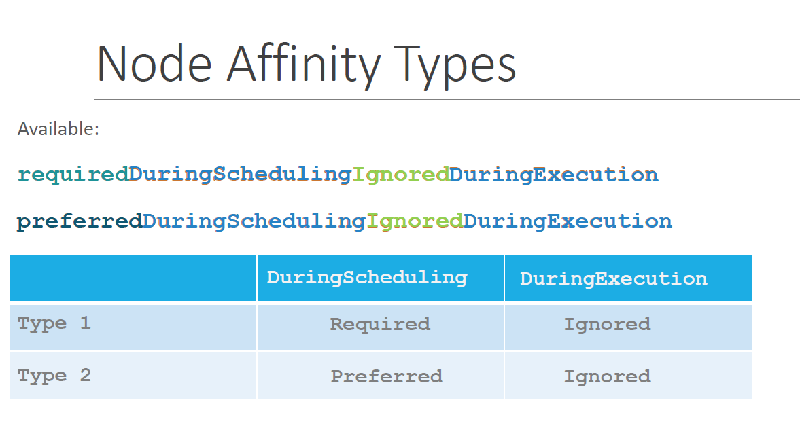
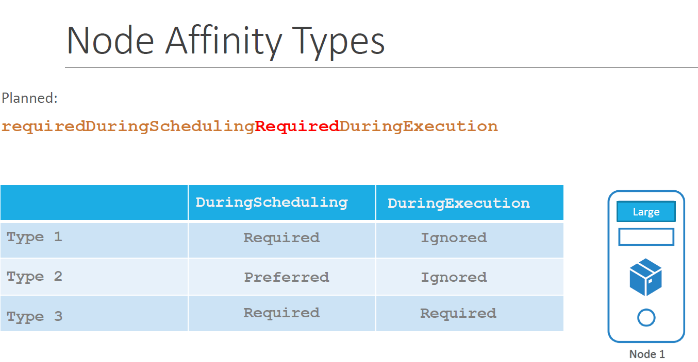
- All these node affinity types helps us in selecting nodes for pod objects as per our requirement.

#### Taints & Tolerations V/S Node Affinity:

- consider we have 2 node and 3 pods blue, red and green. end goal should be same both node and pod should have the same color.

- use taints and toleration as below image. taint the nodes and add tolerations to the pods.

- As taints & tolerations doesnt ensure that the pod for sure ends up on given nodes it might placed on different node as well which is un tainted.

- use node affinity to labels the nodes with respective colors. Then use the node selectors to tie the pods to the nodes.
  however, that doesnt gurantee other pods doesnt end on these nodes.    

- hence , we use a combination of both are used to completely dedicate particular pods to desired nodes.

### 2.6 Resource Limits:
- if the resource limits threshold is breached on nodes, k8s does not schedule additional pods on these nodes and gives error resource requirements not matched.
 Resources: CPU, MEM, DISK
- resource requests minimum number of CPU and MEM required by the container. It uses this number to check where to schedule these pods. (default CPU=0.5, MEM=256 Mi, DISK)
- if  you want to increase the resource requirements for a give pod we can mention it in the pod  definition yaml file.
   spec:
      containers:
         resource:
            requests:
               memory: "1Gi"
               cpu: 1 # 1 CPU means 1 vCPU Core in AWS
- In docker , the container doesnt have any restriction on how much vCPU it can use. 
- In k8s each container has a limit on how much vCPU it can consume. If not  stated explicitly container will be limited to only 1 vCPU usage. same with memory 512 Mi. we can set them manually as well.
   spec:
      containers:
         resource:
            requests:
               memory: "1Gi"
               cpu: 1 
            limits:
               memory: "2Gi"
               cpu: 2
- If container CPU goes beyond mentioned certain threshold , k8s will throttle the request. In the case of memory it doesnt throttle but repeated increase in usage k8s kills that pod.

```
In the previous lecture, I said - "When a pod is created the containers are assigned a default CPU request of .5 and memory of 256Mi". For the POD to pick up those defaults you must have first set those as default values for request and limit by creating a LimitRange in that namespace.


apiVersion: v1
kind: LimitRange
metadata:
  name: mem-limit-range
spec:
  limits:
  - default:
      memory: 512Mi
    defaultRequest:
      memory: 256Mi
    type: Container
https://kubernetes.io/docs/tasks/administer-cluster/manage-resources/memory-default-namespace/


apiVersion: v1
kind: LimitRange
metadata:
  name: cpu-limit-range
spec:
  limits:
  - default:
      cpu: 1
    defaultRequest:
      cpu: 0.5
    type: Container
```

```
A quick note on editing PODs and Deployments
Edit a POD
Remember, you CANNOT edit specifications of an existing POD other than the below.

spec.containers[*].image

spec.initContainers[*].image

spec.activeDeadlineSeconds

spec.tolerations

For example you cannot edit the environment variables, service accounts, resource limits (all of which we will discuss later) of a running pod. But if you really want to, you have 2 options:

1. Run the kubectl edit pod <pod name> command.  This will open the pod specification in an editor (vi editor). Then edit the required properties. When you try to save it, you will be denied. This is because you are attempting to edit a field on the pod that is not editable.


A copy of the file with your changes is saved in a temporary location as shown above.

You can then delete the existing pod by running the command:

kubectl delete pod webapp


Then create a new pod with your changes using the temporary file

kubectl create -f /tmp/kubectl-edit-ccvrq.yaml


2. The second option is to extract the pod definition in YAML format to a file using the command

kubectl get pod webapp -o yaml > my-new-pod.yaml

Then make the changes to the exported file using an editor (vi editor). Save the changes

vi my-new-pod.yaml

Then delete the existing pod

kubectl delete pod webapp

Then create a new pod with the edited file

kubectl create -f my-new-pod.yaml


Edit Deployments
With Deployments you can easily edit any field/property of the POD template. Since the pod template is a child of the deployment specification,  with every change the deployment will automatically delete and create a new pod with the new changes. So if you are asked to edit a property of a POD part of a deployment you may do that simply by running the command

kubectl edit deployment my-deployment

```

### 2.7 Daemon Sets:

- A DaemonSet ensures that all (or some) Nodes run a copy of a Pod. As nodes are added to the cluster, Pods are added to them. As nodes are removed from the cluster, those Pods are garbage collected. Deleting a DaemonSet will clean up the Pods it created.

Some typical uses of a DaemonSet are:

running a cluster storage daemon on every node
running a logs collection daemon on every node
running a node monitoring daemon on every node
In a simple case, one DaemonSet, covering all nodes, would be used for each type of daemon. A more complex setup might use multiple DaemonSets for a single type of daemon, but with different flags and/or different memory and cpu requests for different hardware types.
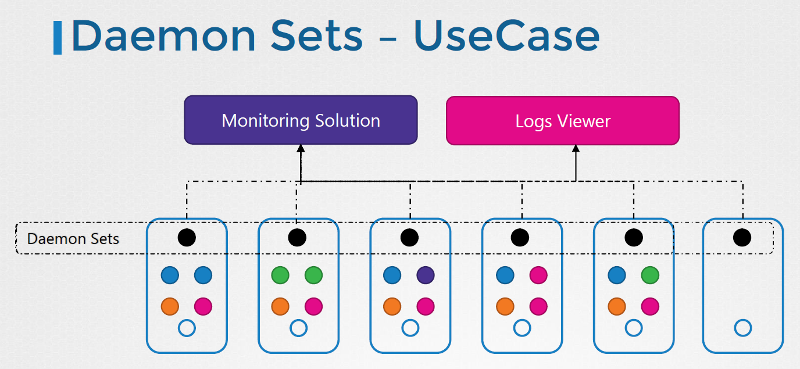
- Its helps in running one copy of your pod  on each node in your cluster, whenever new noe is added to the cluster a replica of the pod is automatically added and vice versa.
- The use case is monitoring agent/logs viewer, it is helpful as it can deploy monitoring agent as a deamon set running on each node.
- kube proxy can also be deployed as a daemon set, similarly networking solution requires agent to be running on each node.
- the daemon set yaml file is similar to pod replica set.

- How does daemon set schedule each pod on every node?
   - one solution is using nodeName in yaml as discusssed in earlier section.so it gets placed on respective node.
     Hoever, after version 1.1 its uses node affinity rules and default scheduler.


### 2.9 Static Pods:

- Static Pods are managed directly by the kubelet daemon on a specific node, without the API server observing them. Unlike Pods that are managed by the control plane (for example, a Deployment); instead, the kubelet watches each static Pod (and restarts it if it fails).

Static Pods are always bound to one Kubelet on a specific node.

The kubelet automatically tries to create a mirror Pod on the Kubernetes API server for each static Pod. This means that the Pods running on a node are visible on the API server, but cannot be controlled from there. The Pod names will be suffixed with the node hostname with a leading hyphen.

- Consider if there was no master node, is there anything kubelet can do as the capitain of the ship.
- kubelet can manage a node independently. it has docker installed as well.
- we can configure the kubelet to read the pod yaml files to read from a directory inside the node /etc/k8s/manifests/
- Not only creates the pods if the application crashes it ensures to restart it. If we make any changes to the directory kubelet attempts to recreate it.
- If u remove a file , pod is deleted automatically.
- These pods that are created automatically without the intervention of master node directly on that particular node are called **static pods**
- we can only create pods these way , we cant create deployments or replica sets etc.,..
- It could be any directory on the host, it is passed inside the kubelet.service uder --pod-manifest-path OR we could provide a --config path.
- we should know this irrespective of the pod. check for the path in kubelet.service and look for pod manifest path or config.
- once the static pods are created run docker ps to check the cotainers running, we cant use the kubectl commands as we dont have the master yet.
- kubelet can create pods both from  manifest path and from kube api server simultanesouly.
-  We can get the static pods details running on the node via the kubectl commands when the master is active, however we can't edit or replace the pod as master doesnt have the acess.
- we can only change the static pods via the files placed on the node, also these static pods names are appendend with the node name at the end. Ex:green-pod-node01 
- Use Case:
   - all the yaml files corresponding to the master node (ex: etcd, controlplane etc.,.) can be placed in the /etc/k8s/manifests . thats how the kubeadm make sure that these pods keep running all the time and setup the cluster. that is the reason when you type kubectl get pods -n kube-system , lists all the components as pods.

#### Static Pods vs Daemon Sets:
- Static pods:
      - created by kubelet
      - deploy control plane components as Static Pods.
- Daemon Sets:
      - Created by kube-API server
      - Deploy monitoring agents, logging agents on nodes.
- Both of them are ignored by kube-scheduler. It doesnt care about these pods.

### 2.10 Multiple Schedulers:
- Kubernetes ships with a default scheduler. If the default scheduler does not suit your needs you can implement your own scheduler. Moreover, you can even run multiple schedulers simultaneously alongside the default scheduler and instruct Kubernetes what scheduler to use for each of your pods.


- If you have multiple master then we have to mention the leader elect and lock object in the yaml file to select the custom scheduler. 
- Mention the schedulerName while spinning up the pod to pick the right scheduler. If the schduler is not configured correctly the pod will be in pending state.
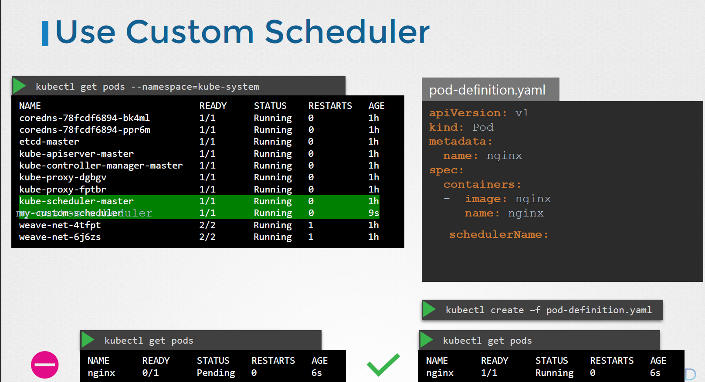
- kubectl get events, it lists all the recent events.
- View the logs 


## 3.0 Logging & Monitoring:

- How to monitor CPU, usage, disk , networking etc.,. on Node and POD level.
- on each node k8s runs kubelet daemon set, which recieves instructions from kube-api-server.
- kubelet also contains a sub component called cAdvisor, its resposible for retrieving container metrics and expsoing them to the outside via the kubelet API.
- enable the metrics server by downloading from git , and creating the respective pods.
- Once the metrics server is installed we can run the kubectl top node (which provides the CPU and memory of each of the nodes), similarly kubectl top pod.
- Application Logs:
      - kubectl logs -f event-pod
      - if there are multiple containers in a pod. then use below command.
         - kubectl logs -f pod-name container-name
- https://kubernetes.io/docs/tasks/debug-application-cluster/resource-usage-monitoring/
- https://kubernetes.io/docs/tasks/administer-cluster/manage-resources/

## 4.0 Application Lifecycle Management:

- We discuss about the rolling update deployments,configure applications, self healing and scale applications.

### 4.1 Rolling updates & Rollbacks:

- When you create a deployment it triggers a rollout which creates a new revision. ex: first one revision 1
- When the container version is upgraded a new deployment is created with revision 2. 
- Run the below command to check the rollout status (kubectl rollout status deployment/myapp-deployment)
- We can also check the history of rollouts(kubectl rollout histiry deployment-name)
- There are two kinds of deployment strategies:
   - Recreate: Destroy the running containers and create the new ones. Application will have some downtime. this strategy is recreate  strategy
   - Rolling Update: it is the default deployment strategy. it takes container down at a time and updates the same. Almost everyone follows this strategy.
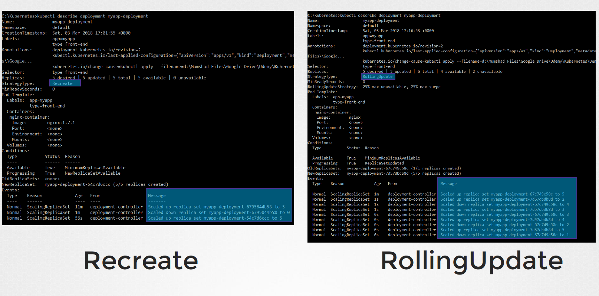
- How the upgrade works under the hood?
   When you run a new deployment the k8s creates a  new replica set and deploys the new containers , same time taking down the containers in the old replicaset. one by one.
- to rollback a deployment do the undo command.(kubectl rollout undo deployment-name)

### 4.2 HOrizontal Pod Autoscaling:
 https://kubernetes.io/docs/tasks/run-application/horizontal-pod-autoscale/

   https://medium.com/avmconsulting-blog/horizontal-pod-autoscaler-hpa-in-kubernetes-part1-afba286becf


### 4.3 Configuring Applications:
- configuring applications comprises of understanding the following concepts.
   - configuring command and arguments on applications.
   - Configuring Environment Variables
   - Configuring Secrets.
- **Configuring Commands & Arguments:** - when you run a  docker cotainer from a ubuntu image. (docker run ubuntu) it exsists immediately.
            unlike VM , containers are not meant to host a OS. its meant to run only to run certain processes. If the processes inside the container is stopped container exsists.
            how to know what process runs inside the container once it starts. its defined in the dockerfile of the image being pulled. 
            Ex: if we pull an nginx image docker file, at the end it does have CMD ['nginx']
            Similarly, for ubuntu the command is ['bash'],  unlike nginx bash isnt a web server it checks for the input from the terminal, if it doesnt find one it exists.
            we need to specify the input to  bash terminal like "docker run ubuntu sleep 5", how to make that change permanent. to do that we create a new image out of a base image and specify the command to be run at the bottom of docker file like below example.
            Ex: ["command", "param"] the command should be always executable command . I can run the ubuntu now as CMD ["sleep", "5"]
            build a docker image out of it using "docker build -t ubuntu-sleeper . "
            - Suppose if you want to change the CMD command input to something else while starting the container say 10, we dont have to pass it as "docker run ubuntu-sleeper sleep 10"
               we can just say "docker run ubuntu-sleeper 10" , the value 10 will automatically picked by our new container by using the ENTRYPOINT in dockerfile.  
               So whatever you append to the docker command after mentioning the ENTRYPOINT in the docker file , it gets appended to it.
            - What if we dont mention the value of 10 while running the docker run command, if throws an error, to avoid this we  need to use  both ENTRYPOINT and CMD, here CMD is the default value that gets appended to the ENTRYPOINT , if we dont mention any value during the docker run command.
            - if you want to mention a different entry point then use the command . "docker run --entrypoint sleepXYZ  ubuntu-sleeper 10"


```
FROM ubuntu

ENTRYPOINT ["sleep"]

CMD ["5"]
```
```
FROM debian:bullseye-slim

COPY docker-entrypoint.sh /
COPY 10-listen-on-ipv6-by-default.sh /docker-entrypoint.d
COPY 20-envsubst-on-templates.sh /docker-entrypoint.d
COPY 30-tune-worker-processes.sh /docker-entrypoint.d
ENTRYPOINT ["/docker-entrypoint.sh"]   #executes at the startup of the container for once.

EXPOSE 80

STOPSIGNAL SIGQUIT

CMD ["nginx", "-g", "daemon off;"] #get appended to the ENTRYPOINT script.  
```

   - Now lets create a pod using the ubuntu-sleeper image created above.
   -  apiVersion: v1
      kind: Pod
      metadata:
         name: ubuntu-sleeper-pod
      spec:
         containers:
         -  image: ubuntu-sleeper
            image: ubuntu-sleeper.
            args: ["10"] # Anything that we  append to the docker run command, like in the above mentioned example it  goes in the args property of POD Definiton file.
            command: ["sleepXYZ"] #to override the ENTRYPOINT in the dockerfile.
   - With the args we can replace the CMD of the docker file. Similarly, to override the ENTRYPOINT in the use the commands field

- **Configuring Environment Variables:**   We can give the env variables value directly in the pod definition file.
   spec:         
      containers:
      - name: ubuntu
        ports:
         - containerPort: 8080
        env:  #Plain Key Value
         - name: APP_COLOR
           value: pink    
- we can also pass the environment variables from ConfigMaps and Secrets. using the below,
      env:
      - name: APP_COLOR
        valueFrom: #fetching values from configmaps
          configMapKeyRef:
            name: app-config
            key: APP_COLOR
      
       OR

       env:
       - name: APP_COLOR
         valueFrom: #fetching values from secrets.
            SecretKeyRef:


- **ConfigMaps:** 
   - configMaps are created in the key value format , so that they can be passed in to the pod dfenition file.
   - 1) creating a configMap:  Imperative (kubectl create configmap) config-name  --from-literal=key=value
                              Ex: kubectl create configmap app-config --from-literal=APP_COLOR=blue   (keep adding --from-literal for more env variables declaration)

                              Declarative(kubectl apply -f configmap.yml)
                             apiVersion: v1
                              kind: ConfigMap
                              metadata:
                              name: app-configmap
                              spec:
                              APP_COLOR: blue
                              APP_MODE: prod

                              Create as many configmaps as needed with relevant naming convention.
   - 2) Injecting into a pod: it can be done in 3 wayd ,
         1) To inject an env variable use envFrom 
         envFrom:
            - configMapRef:
                 name: app-config
         2) Single Env using the env 
            env:
             - name: APP_COLOR
               valueFrom: #fetching values from secrets.
               configMapKeyRef:
                   name: app-config
                   key: APP_COLOR
         3) using Volumes
            volumes:
            - name: app-config-volume
              configMap: 
                 name: app-config   


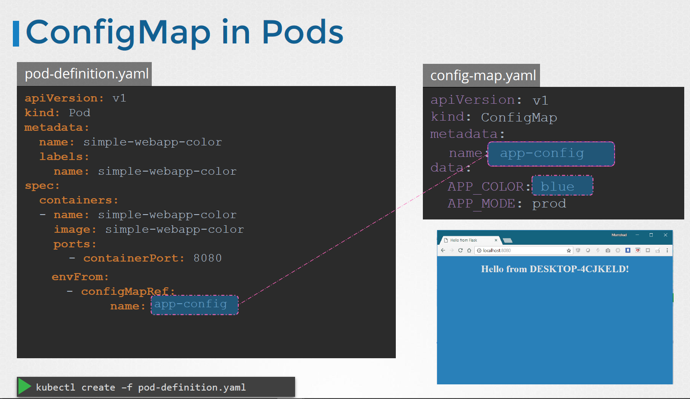
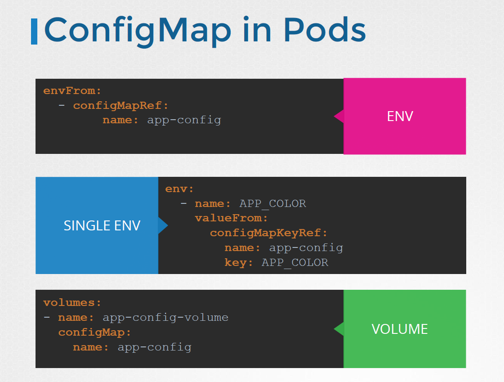

- **Secrets:**
   - We can use environment varibles for DB username and passwords and other connectivites, but thats not a good idea as they are not secure.
     this is the reason on top of configmap we use secrets to store sensitive information. they are similar to configmap but they are encoded in base64 format.

   - Like configmap we can create secrets using both imperative and declarative ways. (kubectl create secret generic secret-name )
      refer yaml file of configmap for declarative way.
   - All the  values in the secrets should be base64 encoded. to covert the normal values into base 64 encoding use  
      echo -n 'mysql' | base64
      To decode > echo -n '5qvu=' | base64 --decode

   - injecting a secret into a pod: same way as we inject the configmaps including the 3 ways as configmaps.
            envFrom:
            - secretRef:
                 name: app-config
   - all the secrets should be created as filename which includes the secret.
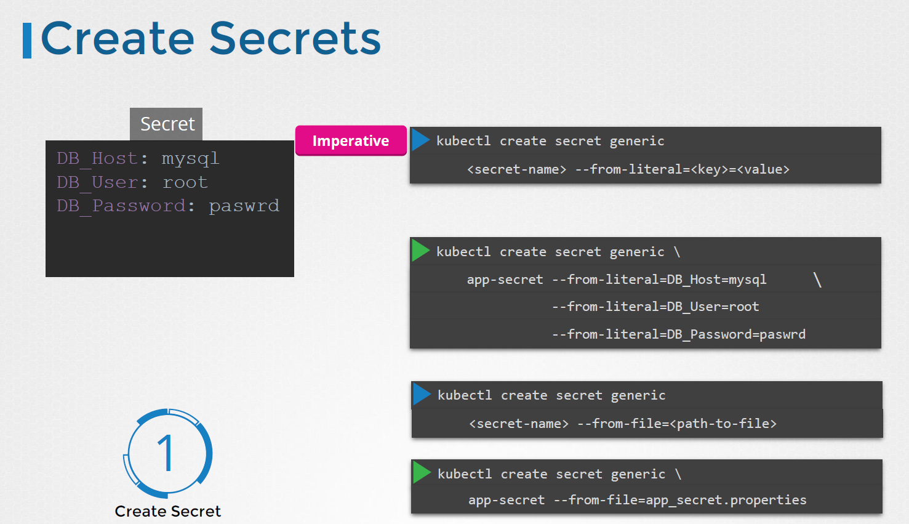


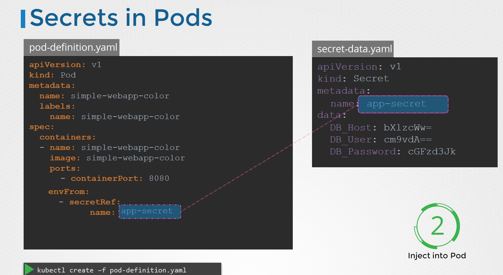

### 4.4 Multi Container Pods:

- having two or more pods running inside a pod.
- Microservcies architecture , helps us breaking large application into small chunks and work as an individual member.
- Most of the times we may require a logging agent and web/application should be paried with each other.
- that is the reason we have multi container pod i.e they are created together and destroye together. they share the same network space.  they can refer to each other as localhost and same volumes.
- this way u dont have to establish volume sharing and services to enable communication b/w them.
- to create a multi container pod , add another pod in the spec section in pod definition yaml.

- Multi-container PODs Design Patterns
   There are 3 common patterns, when it comes to designing multi-container PODs. The first and what we just saw with the logging service example is known as a side car pattern. The others are the adapter and the ambassador pattern.

### 4.5 Init Containers:

- In a multi-container pod, each container is expected to run a process that stays alive as long as the POD's lifecycle. For example in the multi-container pod that we talked about earlier that has a web application and logging agent, both the containers are expected to stay alive at all times. The process running in the log agent container is expected to stay alive as long as the web application is running. If any of them fails, the POD restarts.


- But at times you may want to run a process that runs to completion in a container. For example a process that pulls a code or binary from a repository that will be used by the main web application. That is a task that will be run only  one time when the pod is first created. Or a process that waits  for an external service or database to be up before the actual application starts. That's where initContainers comes in.


- An initContainer is configured in a pod like all other containers, except that it is specified inside a initContainers section,  

```
apiVersion: v1
kind: Pod
metadata:
  name: myapp-pod
  labels:
    app: myapp
spec:
  containers:
  - name: myapp-container
    image: busybox:1.28
    command: ['sh', '-c', 'echo The app is running! && sleep 3600']
  initContainers:
  - name: init-myservice
    image: busybox
    command: ['sh', '-c', 'git clone <some-repository-that-will-be-used-by-application> ; done;']
```

- When a POD is first created the initContainer is run, and the process in the initContainer must run to a completion before the real container hosting the application starts. 

- You can configure multiple such initContainers as well, like how we did for multi-pod containers. In that case each init container is run one at a time in sequential order.

- If any of the initContainers fail to complete, Kubernetes restarts the Pod repeatedly until the Init Container succeeds.

```
apiVersion: v1
kind: Pod
metadata:
  name: myapp-pod
  labels:
    app: myapp
spec:
  containers:
  - name: myapp-container
    image: busybox:1.28
    command: ['sh', '-c', 'echo The app is running! && sleep 3600']
  initContainers:
  - name: init-myservice
    image: busybox:1.28
    command: ['sh', '-c', 'until nslookup myservice; do echo waiting for myservice; sleep 2; done;']
  - name: init-mydb
    image: busybox:1.28
    command: ['sh', '-c', 'until nslookup mydb; do echo waiting for mydb; sleep 2; done;']

```

https://kubernetes.io/docs/concepts/workloads/pods/init-containers/


### 4.6 Self healing Containers:

- Kubernetes supports self-healing applications through ReplicaSets and Replication Controllers. The replication controller helps in ensuring that a POD is re-created automatically when the application within the POD crashes. It helps in ensuring enough replicas of the application are running at all times.
- Kubernetes provides additional support to check the health of applications running within PODs and take necessary actions through Liveness and Readiness Probes. However these are not required for the CKA exam and as such they are not covered here. 

https://kubernetes.io/docs/tasks/configure-pod-container/configure-liveness-readiness-startup-probes/

https://kubernetes.io/docs/tasks/configure-pod-container/configure-liveness-readiness-startup-probes/


## 5.0 Cluster Maintenance:

-  We need to know about the cluster upgrade process, upgrading the os and patching and Backup & Restore Methodologies.
### 5.1 OS Upgrades:

- Lets consider there are 3 nodes in the cluster, if one of the node went down for more than 5 min k8s considers this as dead and evicts the pods inside them known as pod eviction.
- if the pods inside that are part of replicaset then will spun up in the nodes that are available.
- We can control the pod eviction time out as well. (kube-controller-manager --pod-eviction-timeout=5m0s)
- If the node comes back online after the pod eviction timeout it comes as a blank node. if the pods running on this node are not a part of replica set they are gone.
- to upgrade the any one of the nodes we can purposefully drain the pods within node to move to other nodes available.
- Under the hood , the node which is drained  pods are gracefully brought down, and brought up in other nodes.
- Once you drain the node and the pods are running on other nodes and safe we can reboot that node and perform the upgrade.(kubectl drain node-1)
- But the challenge is when it comes back online the node is unscheduleable for that we need to uncordon the node, by running command (kubectl uncordon node-01)
- Note: we can also make a node unschedulable by cordoning it, run command (kubectl cordon node-02) so that no new pods will be scheduled on this node.

### 5.2 K8S Releases:

- When we install a K8S in cluster we install a sepcific version of K8S. We can see that when we execute (kubectl get nodes ) in the version coloumn. 
- K8S release version consists of three parts major.minor.patches( v1.1.3)
- In K8s all the components have same version number, except the ETCD cluster and core DNS (they have their own releases)

https://kubernetes.io/docs/concepts/overview/kubernetes-api/

### 5.3 Cluster Upgrade Process:

- There is a mechanism in the cluster upgrade process
- Refer the below pics for the same.
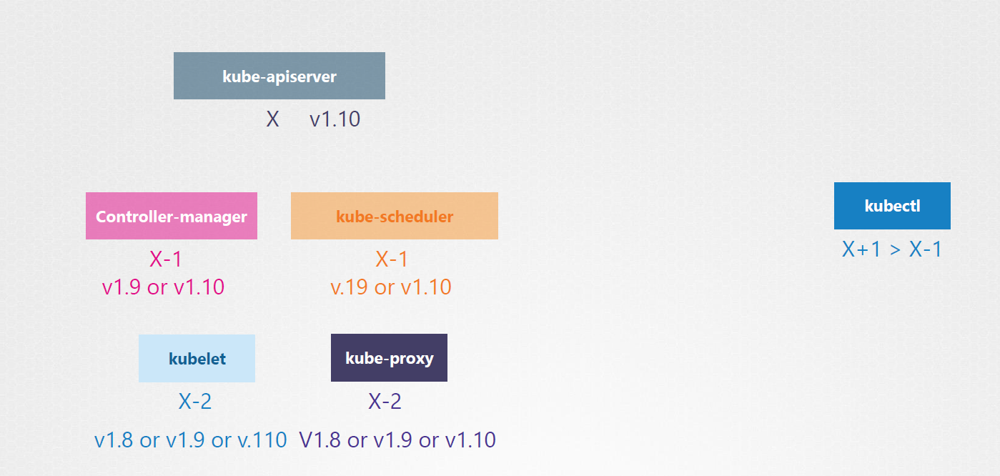
- At any given time only 3 versions are supported by k8s. if 1.13 is released only 1.12 and 1.11 are supported.
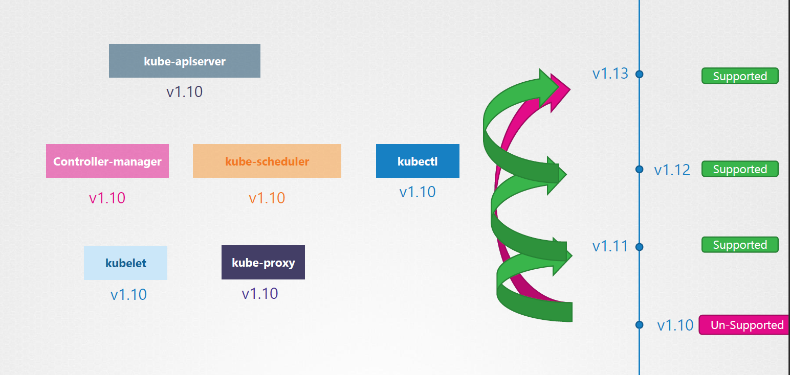
- if its a managed server  with some cloud it lets you upgrade the server with just few simple clicks.
- if you deployed the cluster from scratch then you manually do the upgrade.
- Upgrading the cluster requires two major parts first upgrading the Master and then the nodes.
- While the master being updated doesn't mean the worker nodes stop working they serve the traffic as it is. All the items relevant to the kubectl and controller mgr doesnt work.
-  Once the master is up and back online we are good to go.
- Coming to the worker nodes we can bring down the application and upgrade all at once but that requires downtime.
- Othere way is to shift pods to other working nodes and bring each one down and upgrade.
- Last approach is to spin up new nodes with upgraded version and shift the workload to there. this can be achieved easily in cloud base k8s.

- In order to upgrade master from 1.11 to 1.12, please run (kubeadm upgrade plan) it gives all the information related to upgrade, kubelet must be upgraded seperately.
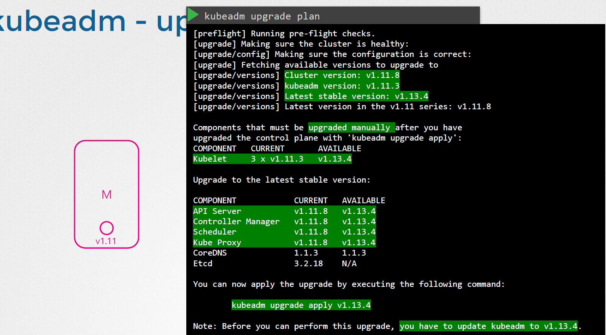
- We cant upgrade mutiple versions at once. we can only upgrade one minor version at a time.
   - First upgrade kubeadm to 1.12 (apt update, apt-get install kubeadm=1.12.0-00 or  apt-get upgrade -y kubeadm=1.12.0-00)
   - next upgrade the cluster (kubeadm upgrade apply v1.12.0)
   - It pulls the necessary images and completes the upgrade.
   - if you run kubectl get nodes command you will still get the older version. **it shows the version of the kubelet associated with the nodes not the api-server itself**
   - Next step is to upgrade the kubelets. (apt-get upgrade -y kubelet=v1.12.0)
   - systemctl restart kubelet
   - now run kubelet get nodes you will see the updated version of the master and the worker  nodes still at lower version.
   - now upgrade the worker nodes.
      - Drain the pods running on the first worker node using (kubect drain node01). this makes sures all the pods running are moved to the other running nodes. it also cordons the node01 so that no new pods get scheduled on this node01.
      - now run the upgrade command (apt-get upgrade -y kubeadm=v1.12.0) followed by upgradtion of kubelet (ap-get upgrade -y kubelet=v1.12.0)
      - Now update the node configuration for the new kubelet version (kubeadm upgrade node config --kubelet-version v1.12.0)
      - now restart the kubelet (systemctl restart kubelet). the node should be now be up, make the node01 up schedulable by uncordoning it. (kubectl uncordon node-1)
         Note: the pods doesnt automatically come back on this node. only if those pods belongign to the node01 are deleted on other nodes, they will come back on this node01
      - similary upgrade all the remaining worker nodes.
      

### 5.4 Backup and Restore:

- Whats needs to be backedup in a K8S cluster?
   - K8S configuration
   - ETCD Cluster
   - Persistent Volumes
- **Resource Configuration:**
         - We created the secrets, configmaps and namespace using imperative and declarative approach.
         - Declarative is preferred approach to save the configgurations. We need have a copy of these files all the time.
         - we need use SCM(GitHub) to store this configurations. even if we lose entire configuration we can just apply these files to restore the same.
         - But what if any one of the team member changed the configration using the imperative way and we didnt know?
         - The solution to the above problem is querying the kube-apiserver and storing the same at regular intervals (ex" kubectl get namespaces -all-namepaces -o yaml > namespace.yaml)
         - we might have independent tools that manage and backup the k8s cluster etc.,..
- **ETCD DB:**
         - ETCD DB is where are the cluster related information is stored.
         - We need to backup the ETCD server, as its hosted on master node. there is a directory whil confiuring the ETCD where all the information is stored. (--data-dir=/var/lib/etcd )
           that is the directory that needs to be backedup in order to store the information.
           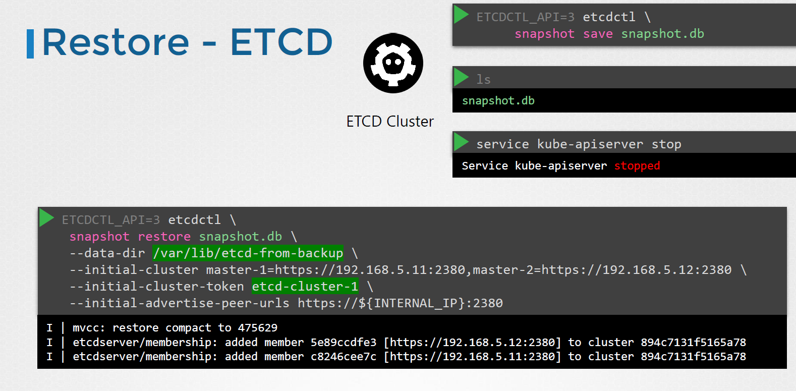
         - ETCD also comes with a built in snapshot backup. (ETCD_API=3 etcdctl snapshot save /etc/backup/snapshot.db )
         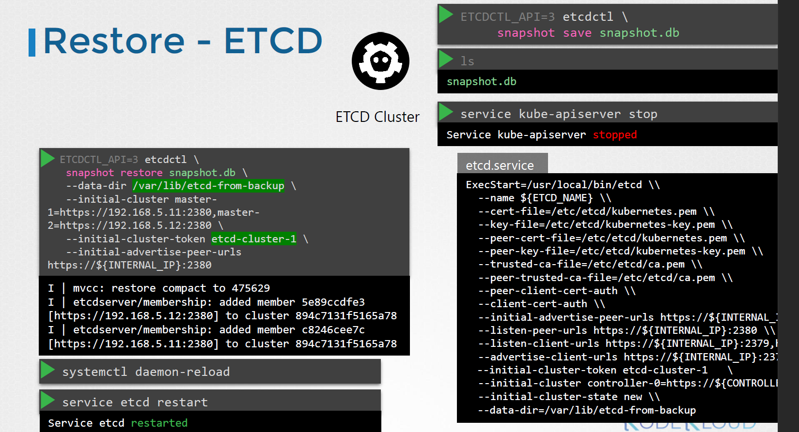
         - How to restore from a etcd snashot. first stop the kube-apiserver(service stop kube-apiserver) then restore (ETCDCTL_API=3 etcdctl snapshot restore snapshot.db --dat-dir /var/lib/etcd-frombackup). then relaod the service daemon(systemctl daemon-reload) and restart the etcd service(service etcd restart)
         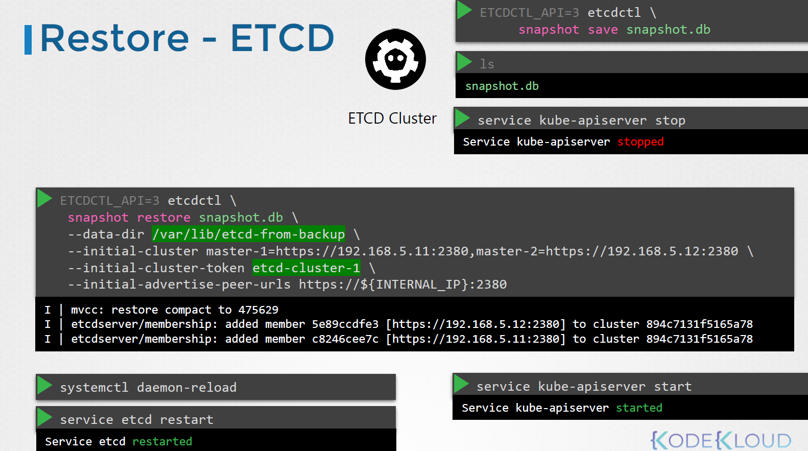
         - fibnally start the kube-apiserver.
         - Note: With all the etcdctl commands mention the --cacert, --cert and --key and endpoints.
         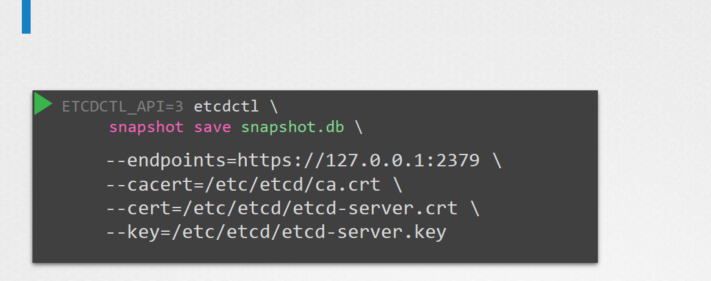
         - Note: if we are using the managed k8s server then backing up may not have access. then backup using querying the kube-apiserver is the better approach (ex: EKS,GKE,AKS)

```sh

Working with ETCDCTL


etcdctl is a command line client for etcd.


In all our Kubernetes Hands-on labs, the ETCD key-value database is deployed as a static pod on the master. The version used is v3.

To make use of etcdctl for tasks such as back up and restore, make sure that you set the ETCDCTL_API to 3.


You can do this by exporting the variable ETCDCTL_API prior to using the etcdctl client. This can be done as follows:

export ETCDCTL_API=3

On the Master Node:


To see all the options for a specific sub-command, make use of the -h or --help flag.


For example, if you want to take a snapshot of etcd, use:

etcdctl snapshot save -h and keep a note of the mandatory global options.


Since our ETCD database is TLS-Enabled, the following options are mandatory:

--cacert                                                verify certificates of TLS-enabled secure servers using this CA bundle

--cert                                                    identify secure client using this TLS certificate file

--endpoints=[127.0.0.1:2379]          This is the default as ETCD is running on master node and exposed on localhost 2379.

--key                                                      identify secure client using this TLS key file


Similarly use the help option for snapshot restore to see all available options for restoring the backup.

etcdctl snapshot restore -h

For a detailed explanation on how to make use of the etcdctl command line tool and work with the -h flags, check out the solution video for the Backup and Restore Lab.

```

## 6.0 Security:

- In general in order to make the host secure we diable passwordf based authentication and enable only SSH access.
- Here our focus in mainly on K8S related security. 
- kube-apiserver is center of all the actions in K8S server.
- thats the first line of defence controlling the access to the K8S server.
- Who can access the cluster? is given by the below methods
- The level of acces to the kube-apiserver is acheieved using various ways.
      - Files - usernames and passowords
      - Files - usernames and tokens
      - Certificates
      - External authentications provider LDAP
      - Service Accounts.
- Once access is given what can they do? is given by the below.
      - RBAC authorization
      - ABAC authorzation
      - Node Athorization
      - webhook mode.
- All communication within the cluster by the apiserver is secured using the TLS certificates.
- What about the communication between the application by the pods within the cluster. By default all the pods can access all other pods within the cluster we can restrict them using the **Network Policies**.

### 6.1 Authentication :

- Securing the access to the k8s cluster.
- K8s doesnt manage users naturally, it relies on a file with users, external source or LDAP.
- However K8S can manage service accounts, we will check this later.
- All user access is managed by the kube-apiserver. kube-apiserver authenticates the user before granting access. how does it authenticate ?
   - Different authentication mechanisms can be configured:
      - **Static Password File** : we cn create a csv file with usernames, password and their userid. we can pass the file name as an option to the kube-apiserver service.
        In case if you setup the server using the kubeadm tool, we can modify the yaml file and add the --basic-auth-file and restart the kube-apiserver.
        We can also have a fourth coloumn in csv file as group name. then we can authenticate using the user & passowrd verifyinh via curl command.
      - **static token file** : Similarly instead of password file we can have a token file. similarly verify authentication using the token.
   - However the above two approaches are not recommended as they store the details in the raw format. Lets see other two methods. if you are trying the abov setup in case try volume mount of auth file and setup RBAC for the new users.

```sh
Article on Setting up Basic Authentication
Setup basic authentication on Kubernetes (Deprecated in 1.19)
Note: This is not recommended in a production environment. This is only for learning purposes. Also note that this approach is deprecated in Kubernetes version 1.19 and is no longer available in later releases

Follow the below instructions to configure basic authentication in a kubeadm setup.

Create a file with user details locally at /tmp/users/user-details.csv

# User File Contents
password123,user1,u0001
password123,user2,u0002
password123,user3,u0003
password123,user4,u0004
password123,user5,u0005


Edit the kube-apiserver static pod configured by kubeadm to pass in the user details. The file is located at /etc/kubernetes/manifests/kube-apiserver.yaml


apiVersion: v1
kind: Pod
metadata:
  name: kube-apiserver
  namespace: kube-system
spec:
  containers:
  - command:
    - kube-apiserver
      <content-hidden>
    image: k8s.gcr.io/kube-apiserver-amd64:v1.11.3
    name: kube-apiserver
    volumeMounts:
    - mountPath: /tmp/users
      name: usr-details
      readOnly: true
  volumes:
  - hostPath:
      path: /tmp/users
      type: DirectoryOrCreate
    name: usr-details


Modify the kube-apiserver startup options to include the basic-auth file


apiVersion: v1
kind: Pod
metadata:
  creationTimestamp: null
  name: kube-apiserver
  namespace: kube-system
spec:
  containers:
  - command:
    - kube-apiserver
    - --authorization-mode=Node,RBAC
      <content-hidden>
    - --basic-auth-file=/tmp/users/user-details.csv
Create the necessary roles and role bindings for these users:


---
kind: Role
apiVersion: rbac.authorization.k8s.io/v1
metadata:
  namespace: default
  name: pod-reader
rules:
- apiGroups: [""] # "" indicates the core API group
  resources: ["pods"]
  verbs: ["get", "watch", "list"]
 
---
# This role binding allows "jane" to read pods in the "default" namespace.
kind: RoleBinding
apiVersion: rbac.authorization.k8s.io/v1
metadata:
  name: read-pods
  namespace: default
subjects:
- kind: User
  name: user1 # Name is case sensitive
  apiGroup: rbac.authorization.k8s.io
roleRef:
  kind: Role #this must be Role or ClusterRole
  name: pod-reader # this must match the name of the Role or ClusterRole you wish to bind to
  apiGroup: rbac.authorization.k8s.io
Once created, you may authenticate into the kube-api server using the users credentials

curl -v -k https://localhost:6443/api/v1/pods -u "user1:password123"

```
### 6.2 TLS Certificates:

- Consider logging into the banking server without TLS the username and password as sent as plain text to the server. Any middle man attacks could easily know the credentials.
   So we need to encrypt those details while sending them to the server using **encryption**.  We can decrypt them using a key, so a key is also send over the internet to the server. The attacker can sniff that as well and hack credentails. This is called **symmetric encryption**. This is the reason **Asymmetric encryption** comes in.
   Instead of using a single key, asymmetric encryption uses a pair of keys a private and public key.  this is similar to SSH key pair based access
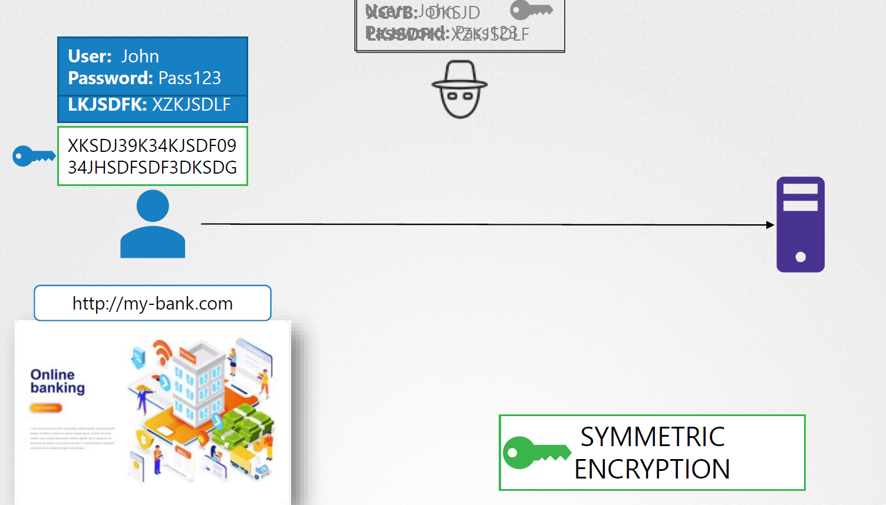
   - SSH: we generate a key pair using the ssh-keygen. it generates private and public keys. the public key is copied over to the server which we access frequently and placed under the /.ssh/authorized_keys . it can be authroized using only the public key of the relavant user. then we ssh without password dierctly using the private key ssh -i id_rsa sai@server1 . we can copy the public key and place it on as many servers as we want. similar process can be followed to the other users as well. this eliminates the risk of symmetric encryption.
   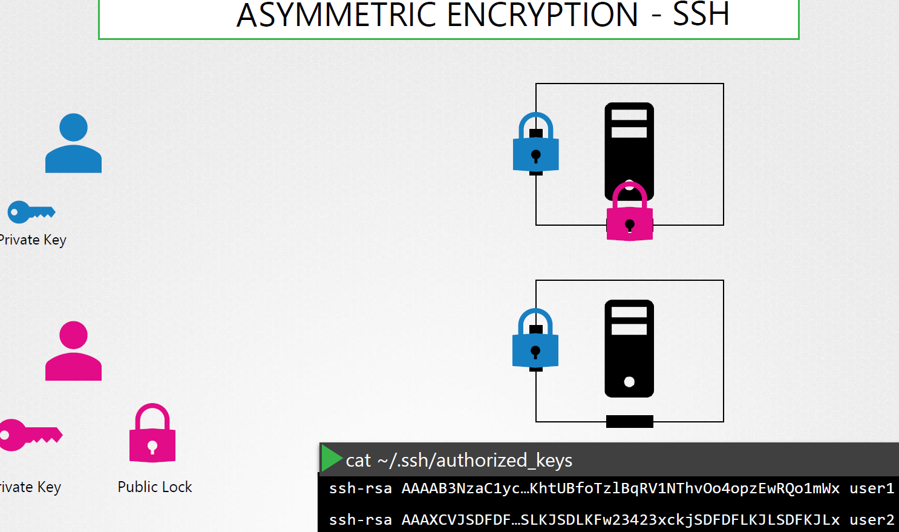
   - The username and password that we send over the internet will be ecnrypted and we need to somehow send the key to decrypt the data to the server safely. to securely transfer the symmetric key from client to server we use asymmetric encryption. we generate a public and private key on the server. we use the below commands for that purpose unlike ssh.
   (openssl genrsa -out my-bank.key 1024)  and (openssl rsa -in my-bank.key -pubout > mybank.pem)
   - "When you enter https://mybank.com you get the public_key from the server, lets assume even the hacker got the access to the public key. The symmetric key is  then again encrypted using the public key provided by the server. then the client sends that to the server and hacker also knows the same. the server then uses the private key to decrypt the message and get the symmetric key. when user send the encrypted details to the server, it uses the symmetric key to decrypt the same. However the hacker doesnt have the private key of the server to decrypt the message. so the hacker cant get the symmetric key.  with asymmetric key we secured the connection and symmetric key ensures all the future communication b/w them is secure."
   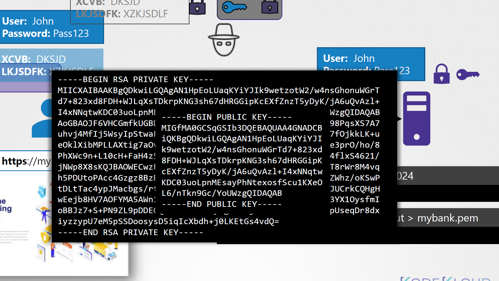
   - Now the only way hacker can hack is by using your credentials, he then creates a web server that looks exactly like you bank server. he wants you to believe that its genuine to so he configures his own set of public and private key pairs. he someone manages to tweak  your network to redirect that to his server. you recieve a public key provided by the hacker. how will you know if you receive a public key and know that its sent genuinely by the bank? **when the bank server sends the public key it sends the certificate along with the key within, it looks like an actual certificate . it has all the details of the certificate. it has all the alternative domain names as well with which the bank is serving the requests. Even the hacker can generate the certificates as well. This is where the most important part comes in. who signed and issued the certificate. if you signed the certificate yourself and issued the same its called self signed certificate. If you look at the certificate signed by the hacker closely you can see its signed by self and a fake certificate. In fact the browser does that for you, it actually auto verifies the certificate, if it finds it to be a fake certificate then it actually warns you. Then how do you create a legitimate certificate that web browser will trust and how do you get the certificate signed by someone with authority? That is where the CERTIFICAATE AUTHORITY(CA) comes in. They are well known organizations that can sign and validate certificates for you   (symantec, global sign, digicert etc.,..) It works by generating a certificate signing request (CSR) using the key we generated earlier and bank domain name ( openssl req -new -key my-bank.key -out my-bank.csr -subj "/C=US/ST=CA/O=MyOrg, Inc./CN=mydomain.com" )  that should be be sent to the CA for signing. The CA verifies the details and sign the certificate and send it back to you. Now your certificate got signed by CA that browsers trust. Hacker would be rejected by CA. CA use different techniques to make sure you are the actual owner of the certificate. how will the browser know if the CA signature was genuine ? the CA themselves have set of public and private keys. The CA use their private keys to sign the certificates, the public keys of the CA are built in into the browser. The browser uses the public key to verify the signature(private key). However, they dont help validate certificates for sites hosted privately. For that we can host our own private CA. Companies provide that services as well. You can have the private and public key generated by CA and sue the public key to install on all the employees system broswers and establish the secure connection within the browser**

    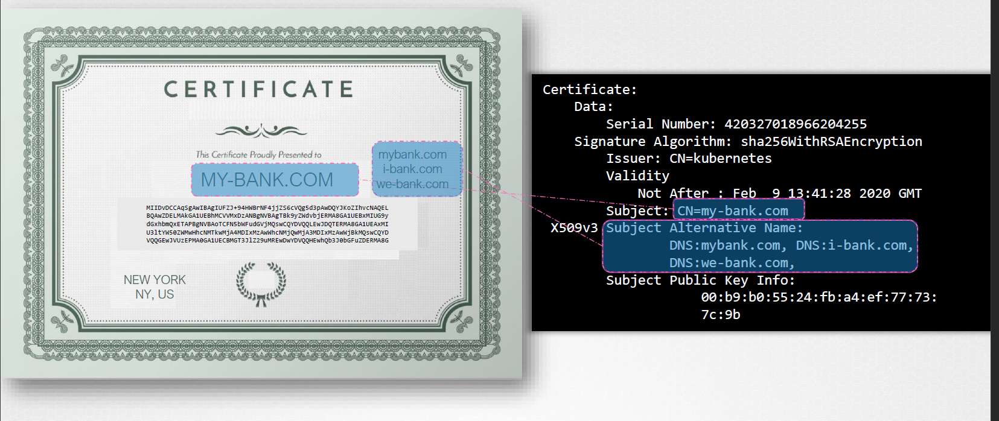
     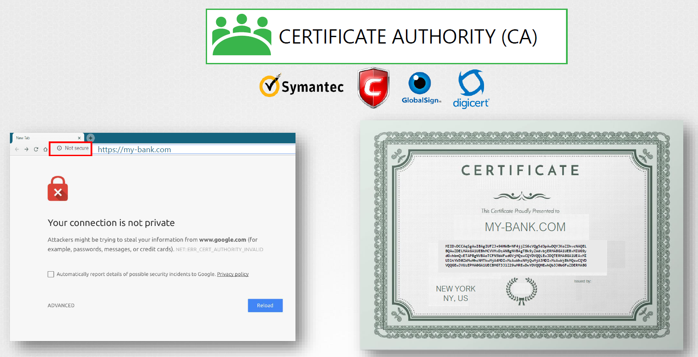
      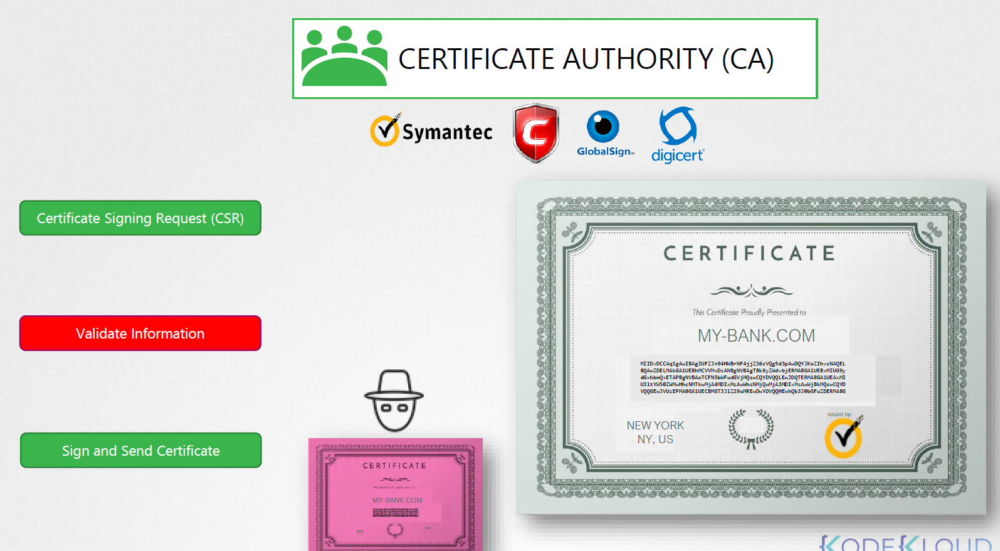
       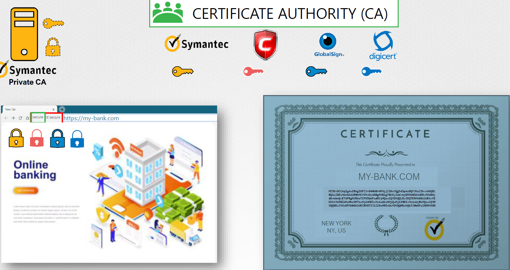
   - The server generated key pair for SSH, web server generates for https, CA generates it for serving certificates. End user goal is only single symmetric key.
   - What is the server whats to verify if the client is same who they say they are in the intial trust buildup, then the client sends the certificate verified by CA to the server. TLS client certificates are not generally implemented on web servers as common ppl dont generate their client certs. it all managed under the hood.
   - This whole infrastructure of generating , mantaining and authenticating the keys is maintained by **Public Key Infrastrucutre (PKI)** 
   - Note: when we generate key pairs we can encrypt data with any one of them and decrypt with other, generally public key is shared across.
   - IMP: Usually certificates with public key have **.crt** or **.pem** extension. Private keys with extenstion **.key** or **-key.pem**.
     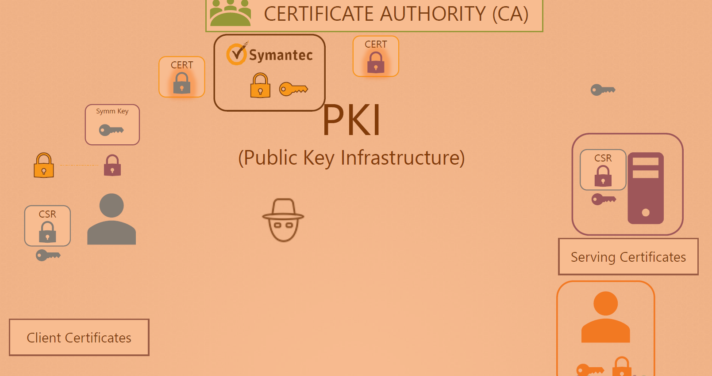
       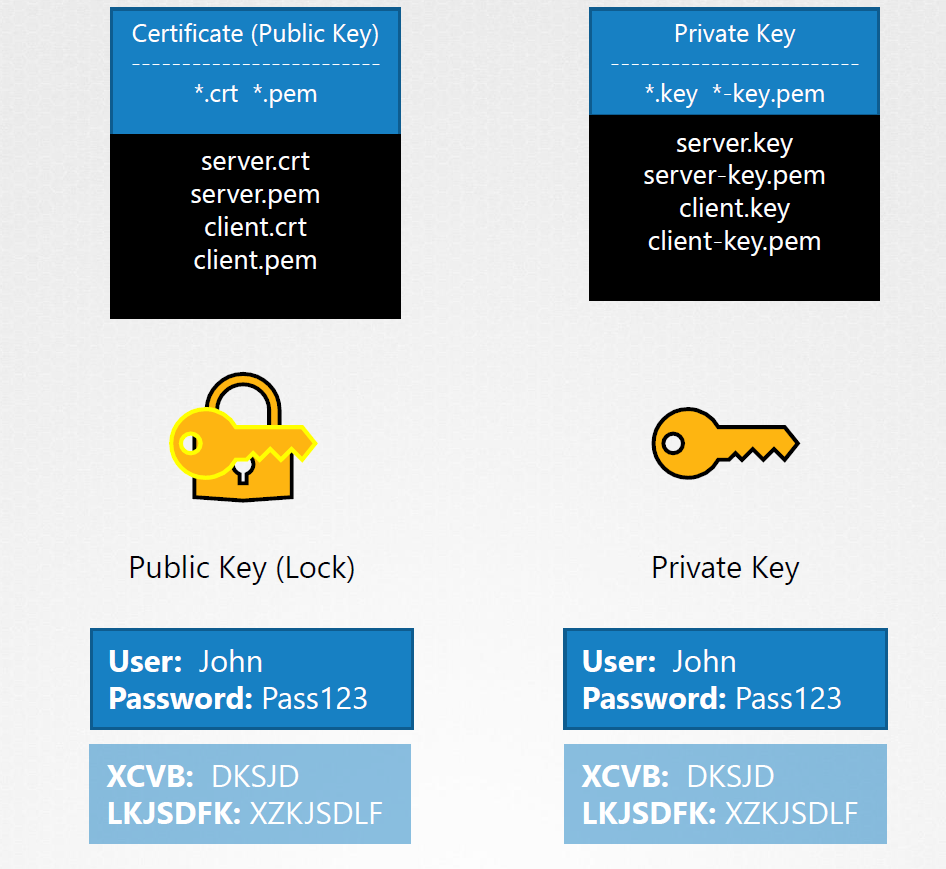

#### 6.2.1 TLS Certificates in K8S:
   -  All the communication b/w K8S master and worker nodes must be secured and encrypted. Communication b/w the user and kube-apiserver also must be secured. Also communication b/w k8s kube-apiserver and other components in the master must also be secured.
   - The two primary requirements to achieve above is to use all sever certificates for servers and client certificates for client to verify who they say who they are.
   - Ex: kube-apiserver creates two keys the private key is within the certificate called **apiserver.crt** and private key **apiserver.key** . the public key is within the certificate for the TLS mechanism to work. Similarly for other servers within the cluster as well like ETCD and kubelet. refer below image.
   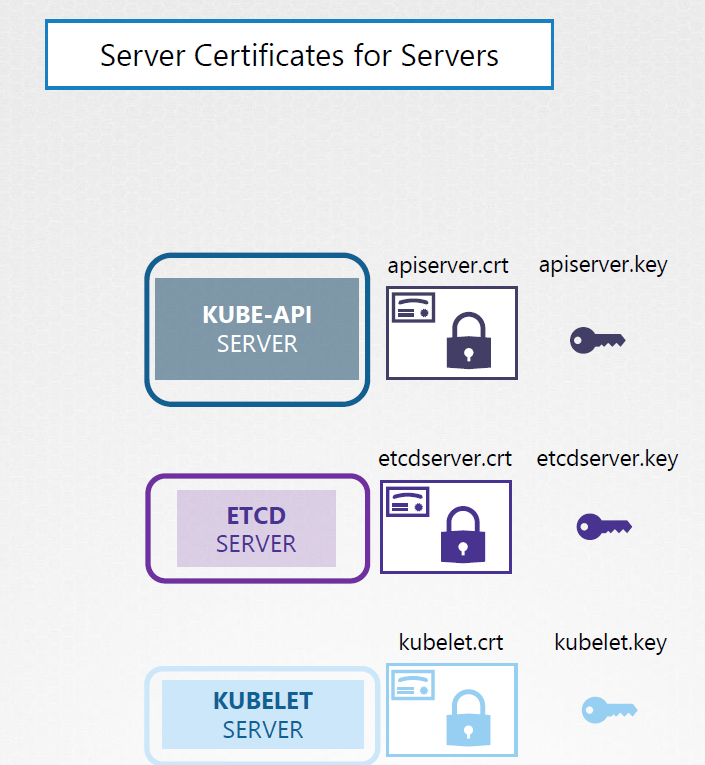
   - Now who require the client certs? Us the admin or any other user calling the kubectl REST API. There can be other components with in the cluster who talk to kube-apiserver like scheduler they also require their certs to talk to the kube-apiserver. Refer below image.
   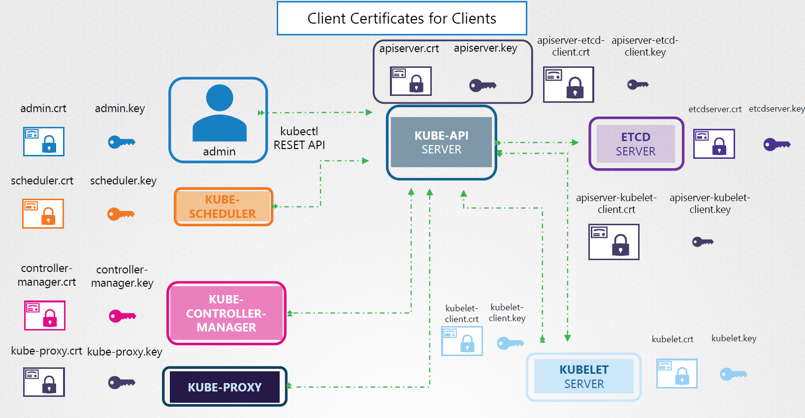
   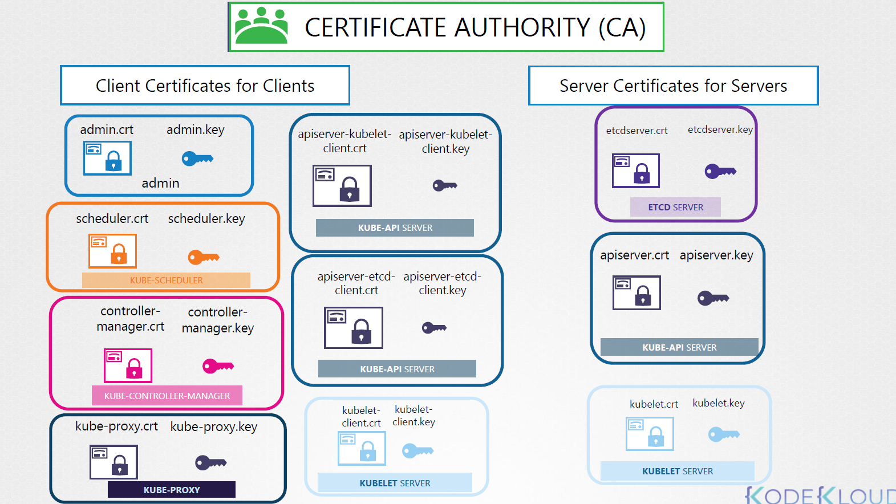

#### 6.2.2 Generation of certs in K8S:

https://stackoverflow.com/questions/63180110/certificate-signing-request-does-it-contain-public-key-or-private-key

https://stackoverflow.com/questions/62356398/is-the-csr-encrypted-withe-the-private-key

https://stackoverflow.com/questions/991758/how-to-get-pem-file-from-key-and-crt-files


   - there are mechanisms how can we generate certs like (EASYRSA, OPENSSL, CFSSL) . Here in this course they use openssl.
      here we need private key to generate CSR and that we need to get it signed. that can be singed by CA or our self private key.
   - 1. Create certificates for K8S CA. create a private key using below command.
         - openssl genrsa -out ca.key 2048 (this creates a public and private key pair))
         we can extract the public key from the above https://stackoverflow.com/questions/10271197/how-to-extract-public-key-using-openssl 
     2. Send a request to sign the certificate by generating a csr. CSR generated using private key using below request.
         openssl req -new -key ca.key -subj "/CN=KUBERNETES-CA" -out ca.csr  (this will have the public key details inside the CSR generated signed by the private key to ensure our ownership to be verified by CA)
      3. Sign the csr with the private key we generated in 1 step using this command. 
         - openssl x509 -req -in ca.csr -signkey ca.key -out ca.crt  (we are self signing our certificate instead of a 3rd party verifier)
         we now have the ca.key (private key) and ca.crt (signed by the private key) and within it has the public key(while generating the csr)

  - Using above three steps we generate CA certificates first.
  - Next we generate admin certificates using the same above process but chaging few things.
      1. openssl genrsa -out admin.key 2048
      2. openssl req -new -key  admin.key -subj \ "/CN=kube-admin/O=system:masters" -out admin.csr (we are providing the system:masters to make sure the person using this cert is granted admin priviliges)
      3. openssl x509 -in admin.csr -CA ca.crt -CAKey ca.key -out admin.crt (now we are sigining it with the CA cert we generated.)
  - To make sure the above admin.crt only refers to the admin users , u do that by adding the details of the user in the group SYSTEM:MASTERS(it exsist on K8S with admin privilges).
  - In a similar fashion generate certificates for the kube-scheduler and kube-proxy.
  - we use this certs while using the curl calls to the REST API server or in the yaml file in the declarative way.
    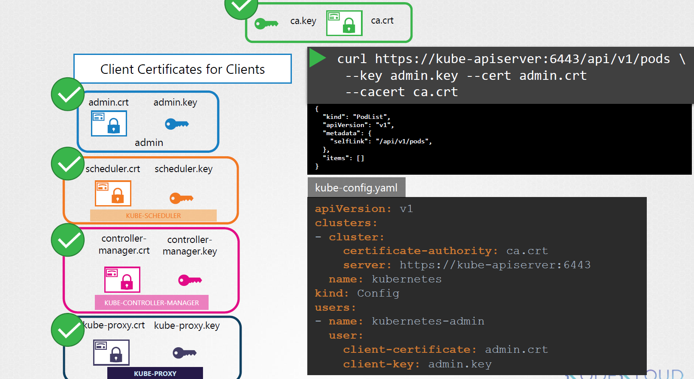
  - As the browser by default have the ca.crt to verify the server-client calls, similarly we need to copy the ca.crt onto each component of the k8s to verify the certs.
  - We also need to generate the server side certificates now. (ETCD, KUBE-APISERVER, KUBELET )
      - First we generate for the certs for the ETCD cluster , as ETCD can have more than one server for HA we generate peer certificates as well.
    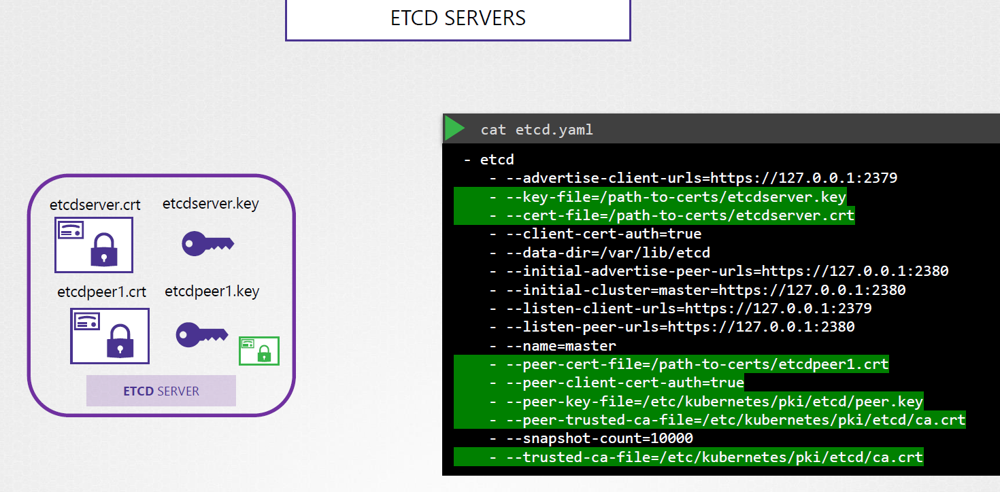
      - Now the KUBE-APISERVER certificates, many ppl refer to the kube-api server using different names we need to mention all the DNS names of kube-apiserver in the openssl.cnf
      - here we use 3 categories of certs in the kub-apiserver(api-etcd-client, api-server, kubelet-client)
         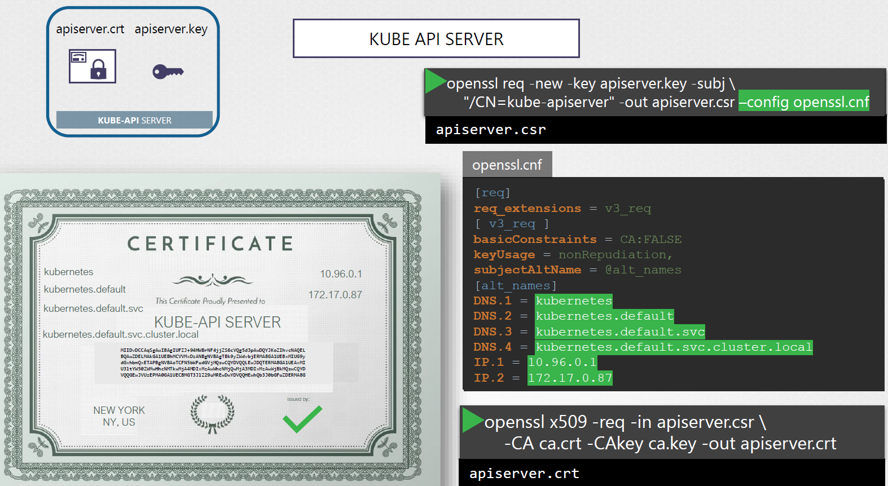
         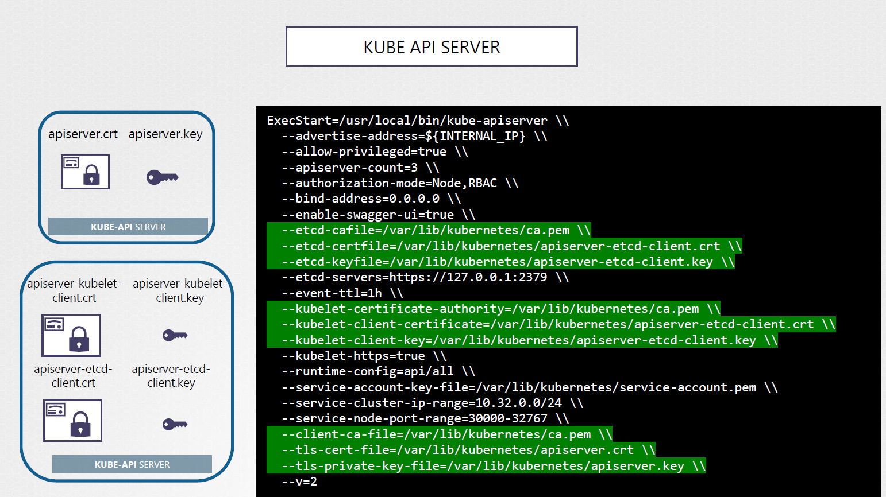
      - Now the kubelet server, which runs on each node responsible for managing the node. that what the api-server talks to manage the node.
         we need certs for each node, they are named after their node like node01, node02 etc.,..
         we need kubelet client certs as well to talk to kube-apiserver. how the kube-apiserver knows what perms to be given to kubelet, for that purpose we name the group and format in the cert (system:nodes:node01) so that its added accordingly in the kube config.
      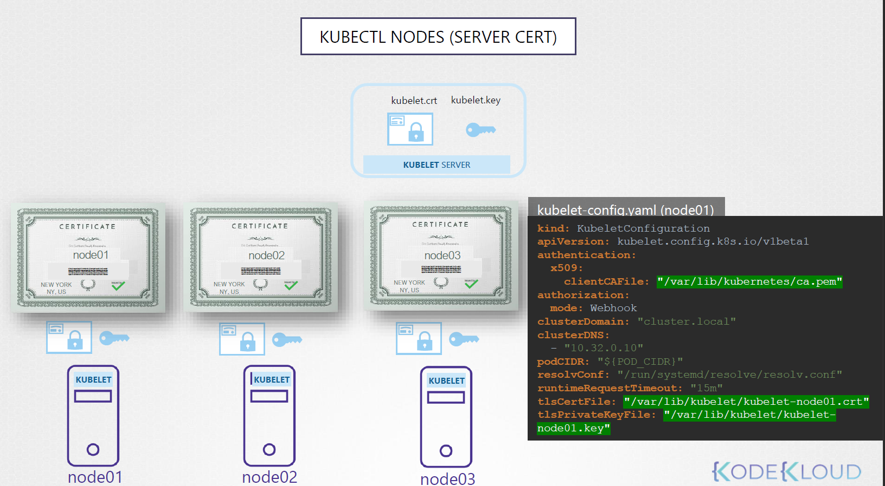
      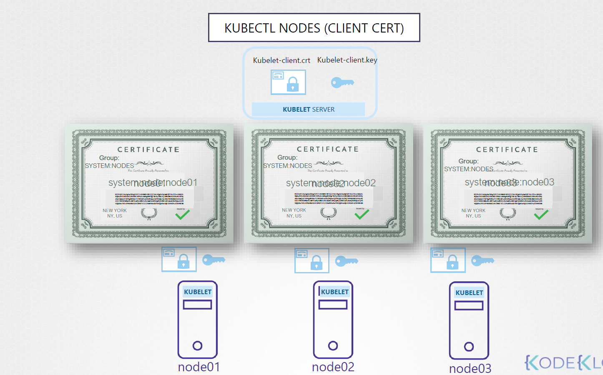

#### 6.2.3 View Exisisting Cluster certificates:

- Suppose we a new team as a k8s admin, we need to know the all the certs in the cluster.
- We need to know how the cluster was setup, if we setup from scratch we need to custom mention all the k8s certs.
- else if we rely on kube-adm tool it automatically generates certs and creates cluster for us. lets take a look at cluster setup by kubeadm tool.
- We need to list down all the certificate details in the tabular format as below.
      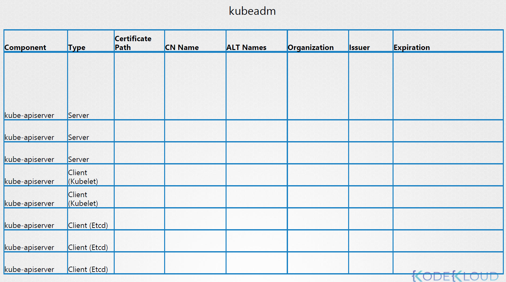
- First look for the kube-apiserver manifest file under /etc/kubernetes/manifests/kueb-apiserver.yaml
- Under the spec section  of the manifest file we have all the details. later view all the certificate details  for each of them using the openssl
   (openssl x509 -in /etc/kubernetes/pki/apiserver.crt -text -noout)
- It has all the details  of the issuer(CA), Subject(cert to whom it belong to), alternate DNS name etc.,..
      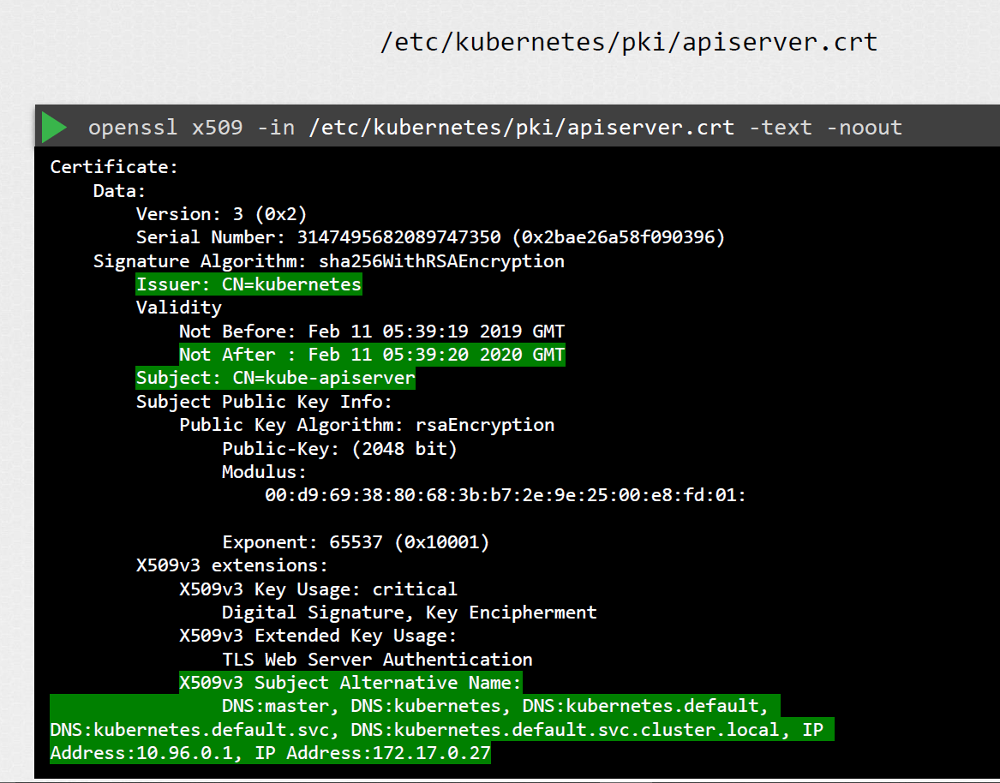
            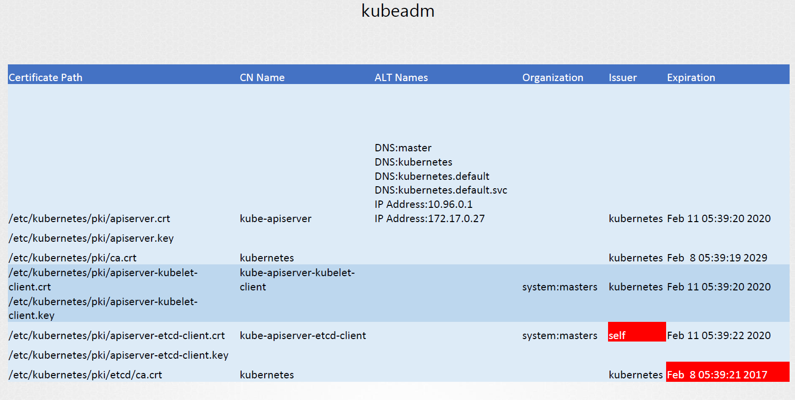   
- The certificate requirements are listed in the k8s documentation page.
- When you run into issues you need to look into the logs. when you setup the cluster from scratch and the stuff is spun up as services we need to check the service logs.
- If we use the kubeadm it spins up as pods, then we need to look the pod logs. (kubectl logs pod-name)
- If the kube-apiserver and etcd desnt funtion then the kubectl commands wont funtion, in that case we need to go one level down to docker to fetch the logs.
   - docker ps -a (to list all the running container)
   - docker logs container_id
- Excel sheet link: https://github.com/mmumshad/kubernetes-the-hard-way/tree/master/tools

#### 6.2.4 Certificate API (Manging the certificates):

- Consider we have new admin in the team, the new member generated the key pair sends the csr. that csr is sent to ca server, gets it singed and generated certificate.
  now the new admin has a valid cetificate. the certificates keep rotating and valid for one year in general.
- CA server signs the certificate, so these files needs to be protected. generally these are placed on master node itself.
- When the users keep increasing it requires an effective way to manage. This is where **Certificates API** manager comes to help.
- with certificates API you directly send an certificate request via an API call.   Instead of logging on master and signing the certificate the below steps are followed.
   1. Createcertificate signing request  object. (all certificate signing request can be seen by all cluster admins)
    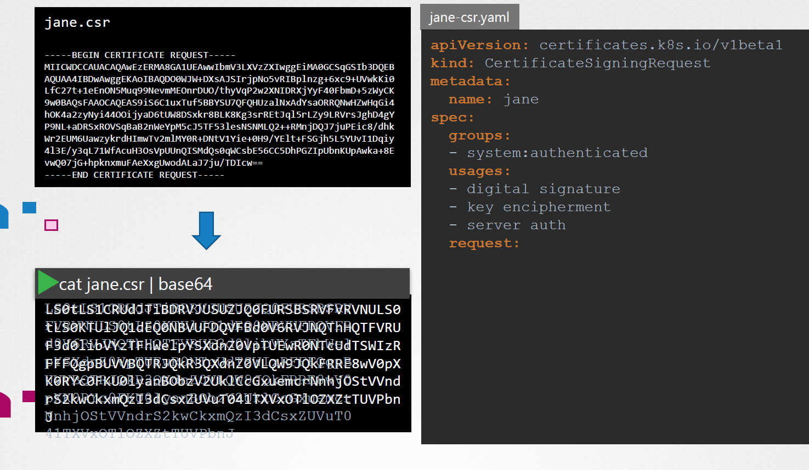
   2. review requests, approve requests and share the certs.
   kubectl get csr
   kubectl certificate approve csr-name
   kubectl get csr jane -o yaml (get the certificate details from the yaml and send it to the user after base64 decoding)
- All the certificate signing requests are handled by the controller manager done via API
- we need to mention the CA certs in the controller manager service options these so the requests can be approved.

#### 6.2.5 kube config:

- Lets consider if we sending a request to the kube-apiserver we need to mention all the cert along with the request we are sending as arguments.
- same with kubectl command we need to pass all the arguments for certs with the command that needs to be executed.
- typing those everytime is tedious task hence we move all that information to the kube-config. (kubectl get pods --config config-file-path)
- By default the k8s checks the config in the file name config in the $HOME/.kube/config  file.
- If you specify the config there you no need to explicitly mention them .
- The config file has 3 sections clusters, contexts and users.
- clusters are like environments (dev, qa, prod) and users(admins,dev,devops) and contexts (admin@production, qa@devops to match the users and environments)
    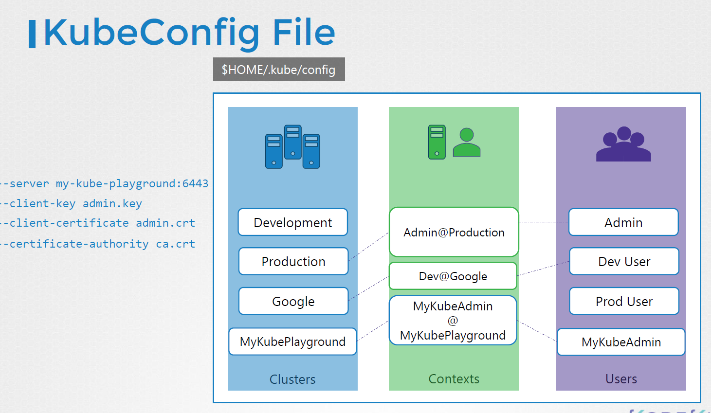
- we dont create any new users by entering them in the config we mention the exsisting users and groups and what priviliges needed to access what. So we dont need to specify all the certificates in every kubectl command we run.
- we specify the server details in the clusters section and certificates under the respecitve users. In the context we match these to acess different clusters.
- Refer to the kube config file how to enter all these details in the yaml file. 
 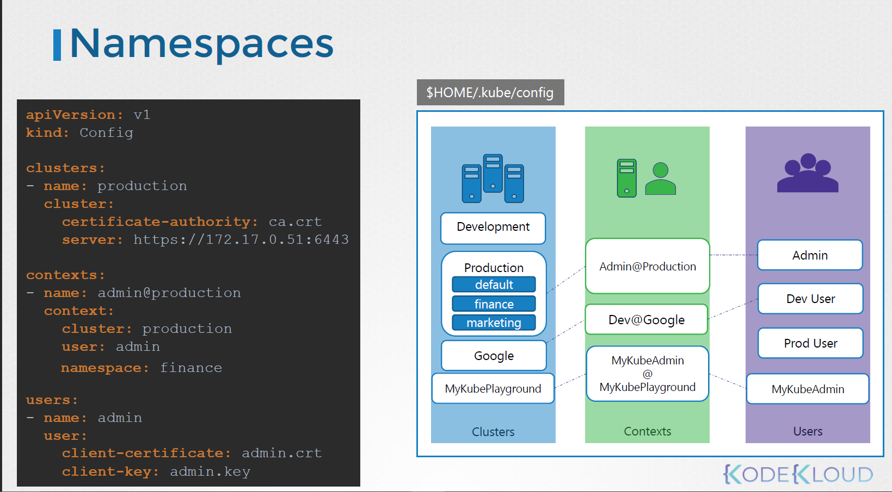
- once the kubeconfig is ready we dont have to create do kubectl apply unlike other objects, the file is left as it is.
- we can also specify the default context in the config file in case no context is given.(kubectl config view)
- kubectl config view -kubeconfig=my-custom-config (to use the custom config file)
- kubectl config use-context prod-user@production (to update the default context in the config file)
- If we have multiple namespaces we can specify name space as well in the config file.
 
- Also while creating the config file its better to use the full path of the certificates instead of just mentioning the certificate.

#### 6.2.6 API Groups:
- If we want to know the kube api server version (curl https://kube-master:6443/version) similarly we have a curl call to check the list of pods(curl https://kube-master:6443/api/v1/pods). Like this we have mutiple paths to make the api calls to the kube-master like health, metrics etc.,.
 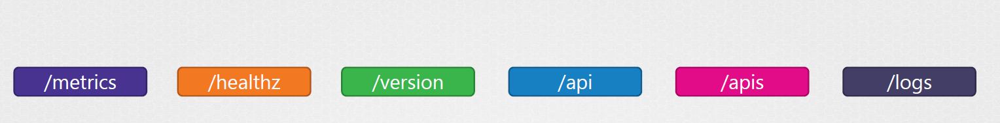
- Our main concentration here is on the apis(named group) and api(core group) paths
- The core group is where all the core functionality exsists. (namespaces,rc,pods,PVC etc.,..)
 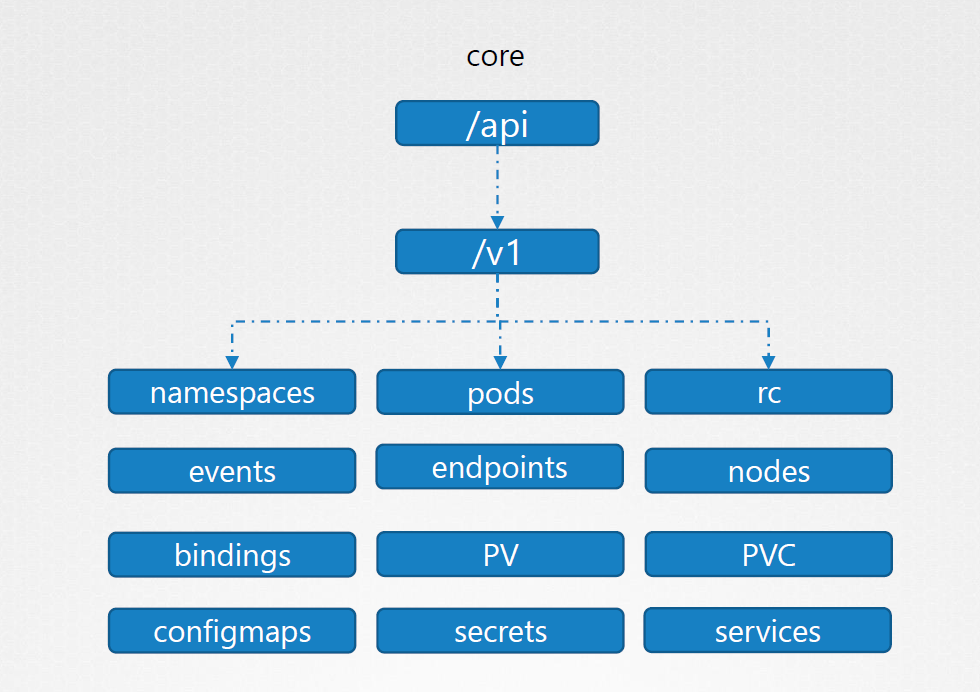
- the named group apis are more organized,it has more featured oriented options.(certificates, authentication, apps etc.,..) see few below.
 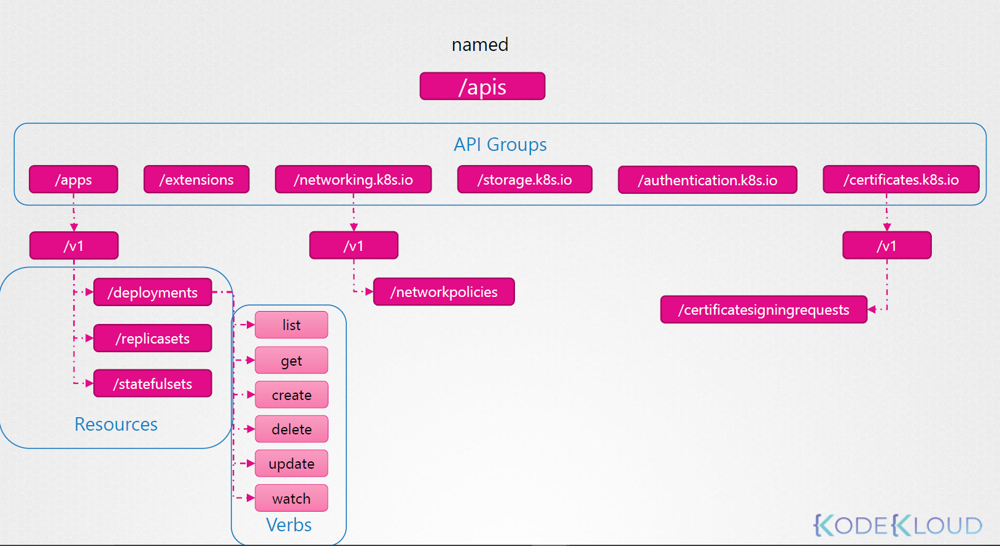
- To list the available apis groups just pass the curl command within the kube master server(curl https://localhost:6443 -k) it lists all the available apis groups, further we can list the apis within paths (curl https://localhost:6443/apis -k | grep "name") 
 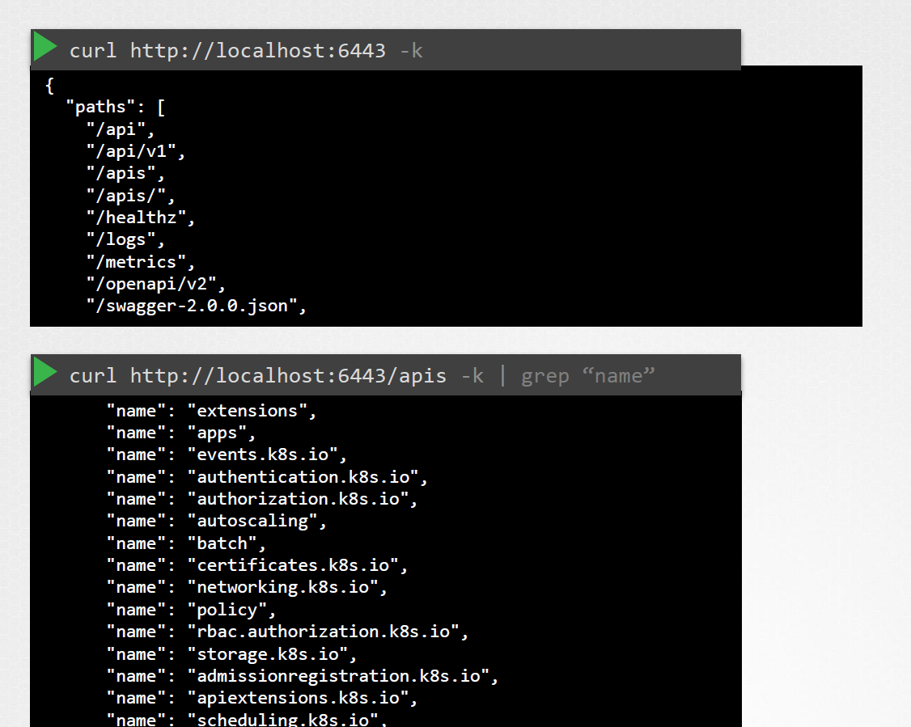
- However when to run curl directly on locahost if might throw error as we are not authenticated. we have to pass arguments for certs.
- In order to deal with the above use kube proxy client. kube proxy by uses the default config. by that we dont have to specify the certs in arguments each time.
 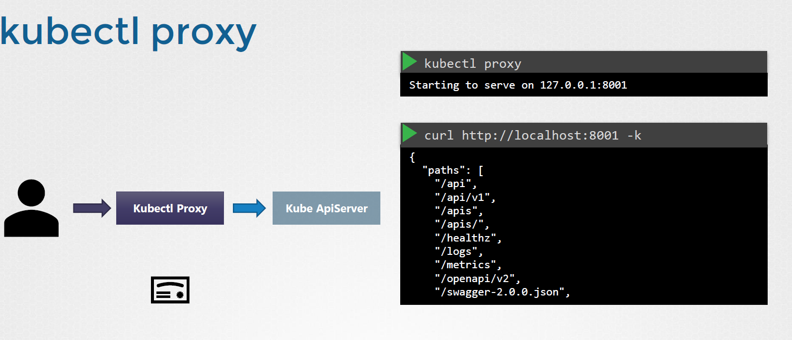
- kube proxy(is used to enable comminucation within the nodes(master and worker)) and kubectl proxy(is a https service created by kubectl utility to access kube apiserver ) are not same

### 6.3 Authorization:

- Once a user gains access(authentication) to the cluster. What can he/she can do comes in the Authorization. ex: Admin has entire operations control, dev has min access
- For all others users we dont want them to have access like admins.
- Different groups require different set of access. we can create different namespaces to the different user groups and restrict access to that namespaces alone. 
- There are mutiple authorization techniques supported by k8s:
   - Node Auth
   - ABAC
   - RBAC
   - Webhook
- **Node Auth**:
   - As we know all the kubectl commands are directed to the kube-apiserver and kubelet also passes the node information to the kube-apiserver.
   - These requests are handled by special authorizer known as node authorizer. 
   - As we saw in the certs section any requests from the kubelet to the kube-apiserver is done by certs which has system:nodes group enabled and the name of the kubelet should be prefixed system:node:node01. This is access within the cluster.
- **ABAC**-
   - External access to the user or group can be given using a set of permission like only read permission to the dev-user. (attributes based access control)
   - We do this by creating a policy file by creating a set of perms in JSON format. we pass this file into the apiserver. each user or group must be explicitly assocaited with a policy.
   - Similarly we create policies for each group like this. But everytime we need to make changes to this group we need to manual change them and restart the server which is not feasible. This is where RBAC helps us.
- **RBAC**:
   - Instead of creating a group with a set of permissions which they can perform on the cluster. We create a role say "Developer" and associate all the dev users or dev group to that role. This role can be attached with mutiple policies which are common to all users and specific to certain groups.
   - Similarly we can create a role for security users or group and associate a role to them as well. So whenever we change a permission in the role the change will be reflected immedieatly to all those associate with the role.
   - This is a more standard approach for authorization.
- **Webhook**:
   - What if we want manage authorization externally, ex: open policy agent is a external tool that can be used to perform these tasks.
   - If a user make a certain call to the kube-apiserver, kube-apiserver checks with the open policy agent whether he should be permitted or not.
- In addition to the above authorization modes we have two more modes as well **AlwaysAllow** and **AlwaysDeny**.
- As the name states AlwaysAllow allows all the requests without any authorization checks. By default if we dont specify the authorization mode its always allow.
- Wer can configure these modes  in the kube-apiserver in the authorization-mode option. We can mention mutiple modes we wish to use. Ex:Node,RBAC,webhook (its authorized in that order).
- It gives access as soon as any one of the modes mentioned provides access.
 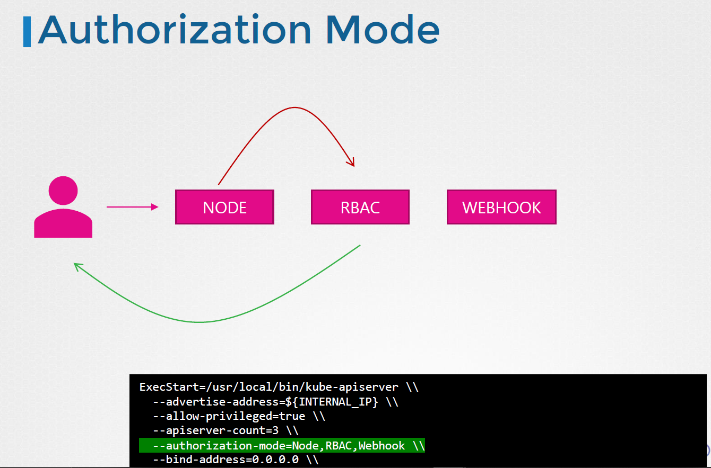

#### 6.3.1 RBAC:

- We can create a role by using the **apiVersion: rbac.authorization.k8s.io/v1 and kind: Role**. Then we specify rules.see below image. 
- We can also provide mutiple rules for a single role within the yaml say creating a configmap etc.,..
- Now we create a link to user and role using **RoleBinding** . In the rolebinding yaml we have two sections after metadata, Subjects(where we specify the user or groups) and roleRef (where we specify the role name to be associated to the subjects)
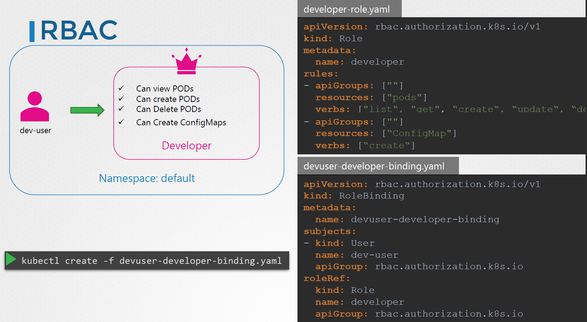
- Note: Roles and RoleBinding are specific to the Namespaces, if we dont mention namespace in the yaml it works only in default namespace. If we spcify the namespace this access only works in that particular namspaces.
- kubectl get roles,  kubectl get rolebindings and kubectl describe role developer.
- What if I being a user if I have access to a certain role, we can check using the (kubectl  auth can -i create deployments)
- An admin can impersonate as a certain user then we can use the same command as user (kubectl auth can -i create deployments --as dev-user or kubectl get pods --as dev-user)
- We can also restrict the access to a certain pods within the nodes by mentioning the resourcename in the Role yaml.
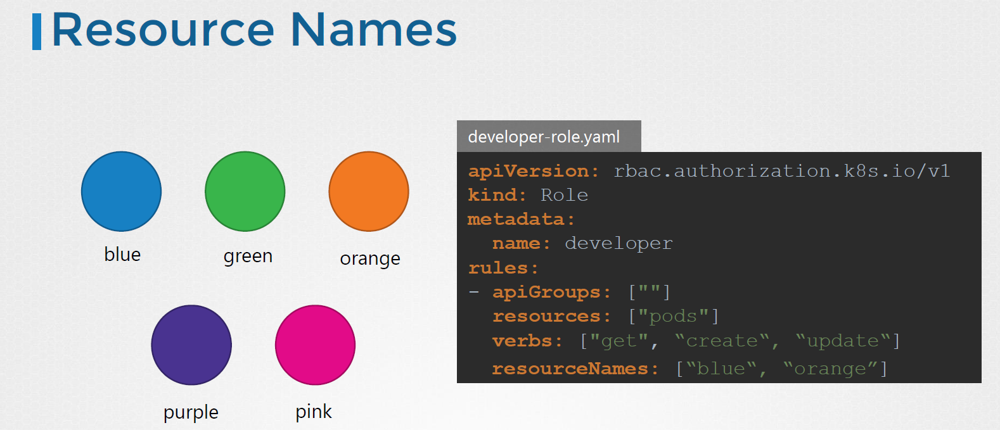

#### 6.3.2 Cluster Roles and Cluster Role Bindings:

- The generic Roles and RoleBindings are specific to a Namespace. If we dont mention the Namespace then its confined to the default namespace.
- **We cannot group Nodes into a specific Namespace. They are cluster wide resources**
- So resource are categorized as namespace and cluster scoped.
- In general when we create resources they are created in the default namespace. (ex: pods, pvc, condifmaps, jobs and replicasets etc.,.)
- They are few things that are not specific to name space(ex: node, PV, CSR, clusterroles and clusterole bindings etc.,,)
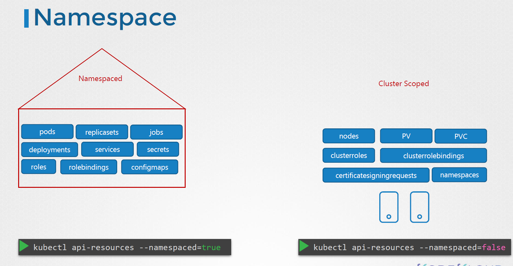
- List of namespaced(kubectl api-resources -namspaced=true) and non-namespaced(kubectl api-resources --namespaced=false) resources
- Authorization of users for nodes and PV is done using Cluster and and ClusterRoleBindings.
- Cluster role admin can create nodes , PV etc.,.. The yaml file can be find below kind: ClusterRole and kind:ClusterRoleBinding.
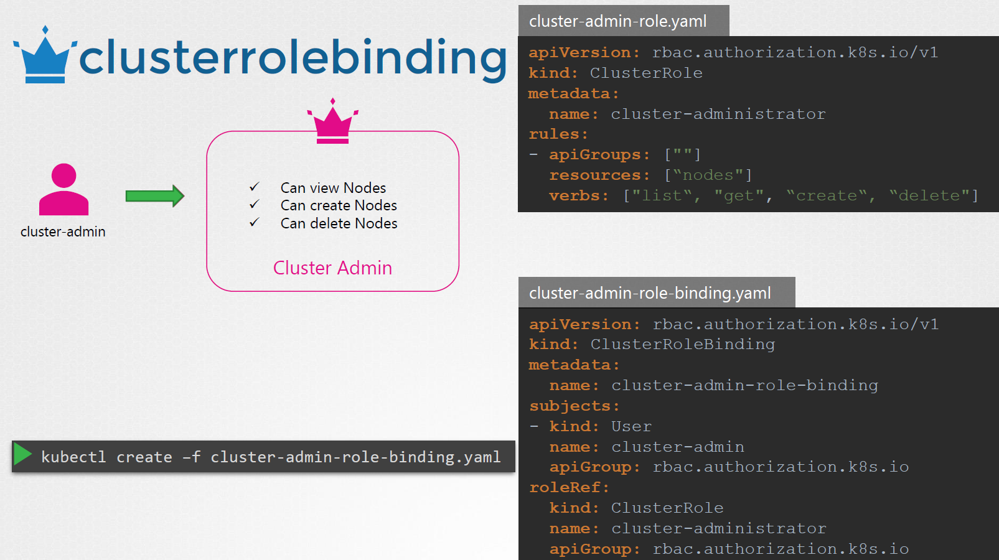
- **We can create a cluster role for namespaced resources as well. Then users will have access to this resources across all Namespaces.**
- K8S creates a number of cluster roles by default while creating the cluster. 

### 6.4 Service Accounts:

- SA is linked to other security related concepts like authentication , authorization and  RBAC etc.,..
- There are two types of accounts in K8S user account and service account.
- User account is used bu humans and SA is used by machines.
- SA can be used by a monitoring application like prometheus to call K8S api.  (Jenkins to deploy stuff to cluster)
- Ex: Suppose we have a k8s dahsboard that displays all the information. For it to access the information it has to talk to kube-apiserver. for that is needs to be authenticated for that we use a Service Account.
- kubectl create serviceaccount dashboard-sa
- when we create a service account it automatically creates token. SA token is what must be used by the external application while communicating to the K8S API.
- The token however is stored as a secret object. When the SA is created it first creates a token and SA object, then it later creates a secret object which has the token.
- The secret is then  linked to the SA. (kubectl describe secret secret-name)
- In the curl we can provide auth token while making a call to the k8s api. In case of dashboard app or some other app copy and paste  the token into the token space in the application.
- We can create a SA and assign the right perms using the RBAC. Export the SA tokens to thrid party applications to authenticate to the k8s API.
- If the 3rd party application is hosted on th k8s cluster itself then the we can make the process simpler by attaching the secret as a volume inside the application pod.
  Thus we can provide the token to the pod directly instead of providing manually.
- If you see the list of SA. Each namespace has a default SA. Whenever a pod is created in a namespace , the default SA and its token are automatically mounted as a volume mount.
- If you execute the command (kubectl exec -it pod-name ls /var/run/secrets/kubernetes.io/serviceaccount) you will see the secret mounted as 3 seperate files(token,namespace,ca.crt). The one with the token has the actual token.
- However, the default SA has very limited access to  execute basic api calls.
- **We cannot edit the SA of an exsisting pod we must delete and re create the pod.**
- In case of deployment we can edit the service account mentioned inside the pod yaml as any deployment will trigger a new rollout.
- **K8S automatically mounts an SA if you create pod. we can mention automountServiceAccountToken: false under the spec if you dont wish to do so**

### 6.5 Image Security:

- We deploy numerous pods across different applications in K8S.
- In the pod definition we just mention "name: nginx" in actual its name: library/nginx .
- library is where the docker official images are stored. since we dont specify the name where it needs to be pulled from the docker assumes its from docker default registry (docker hub) 
- docker.io/library/nginx. refer below pic
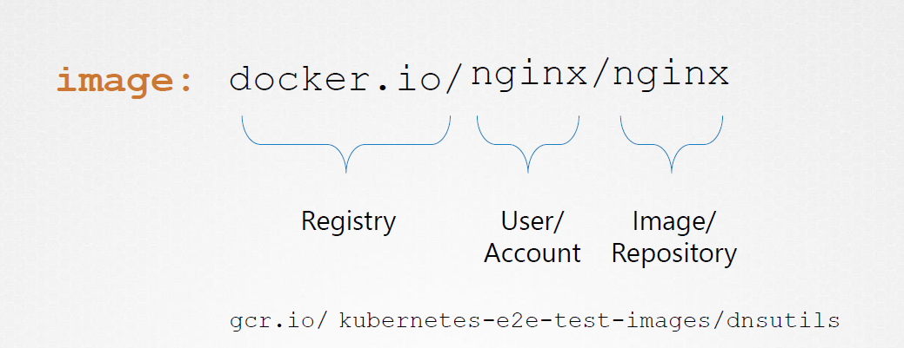
- When you a application in-house , we need to have a private registry, many cloud providers prvide private registry.
- to use a image from private registry, mention the full name of the private regitry(ex: for google, image: gcr.io/kubernetes e2e test images/ dnsutils)
- how do we pass the credentials for the docker  runtimes on the worker nodes to pull the images.
- for that we need to create an secret and put the crednetials in it. refer the command below.
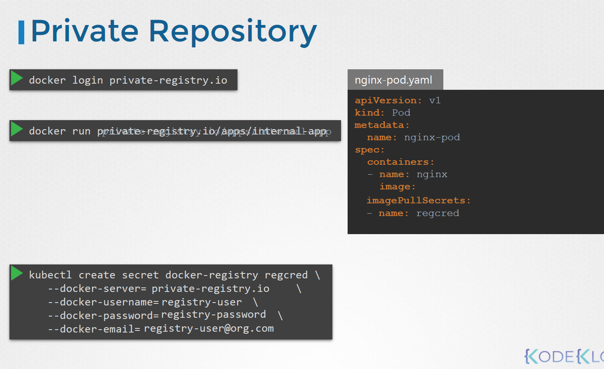

### 6.6 Security Contexts :

- When we run docker we can define certain secruity standards like ADMIN_ID of user  and linux capabilites etc.,..
- In k8s we can choose the security settings at container level or pod level. if you configure it at pod level it will carry over to all the containers in the pod.
- If we configure it both on the cotainer and pod level, the container level settings will take effect.
- Ex; take a pod that runs ubuntu image with sleep command.
   apiVersion: v1
   kind: Pod
   meta:
      name: web-pod
   spec:
      containers:
      - image: ubunut
        name: ubuntu
        command: ["sleep","3600"]
        securityContext:
         runAsUser: 1000
         capabilities: #security capabilites can be added only on the container level.
            add: ["ADMIN_ID"] 

### 6.7 Network Policies:

- We have a web server serving content to users and backend we have API's serving the content and DB at the end.
- User sends a request port 80 -> api server: 5000 -> DB server :3306
- Ingress: Incoming traffic, egress: Outgoing traffic
- Let us consider we have a nodes in which we have pods and services running. 
- Whatever the network solution that we implement the pods should be able to communicate with each other across the different nodes. Hence , we keep nodes under same VPN.
- They all can reach each other via services or IPs etc.,..
- We need to deploy pods for each layer in our example.
- All the three pods deployed in each layer can communicate with each other. What if we dont want our web server to communicate with the DB server.
- That is where we implment an **Network Policy** in k8s.
- We can define network policy to only allow traffic from API to DB server pod on port 3306. Once policy is created it blocks all other traffic other than the rule. 
- We link a network policy on to the pod similar to *labels and selectors* 
- we label the pod and use the same lables in the podSelector feild in the network policy. under the policyType we cab specify the ingress or egress and port to allow traffic on.
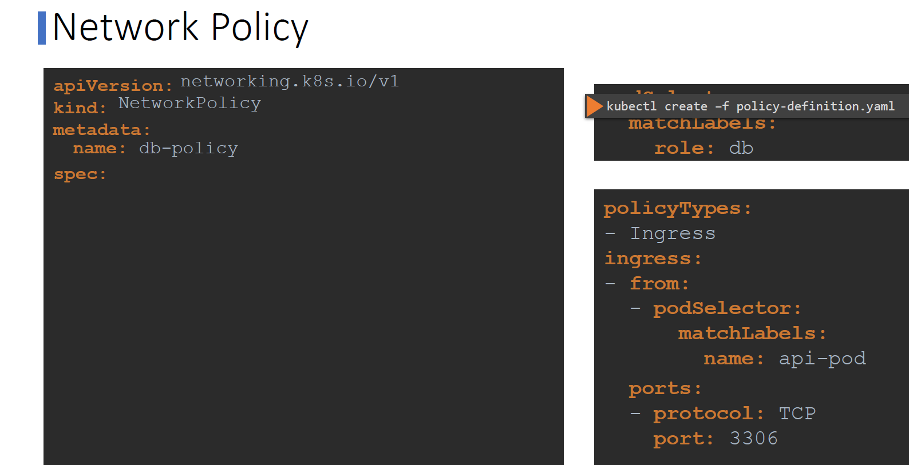
- In this move both pod selector and policy types under the spec secction of the network policy.
- Note: Network policies are enforced by the network solutions on the k8s cluster. Not all network solutions support network policies. 
   Supported(calico, romana, kube-route), unsupported(Flannel)

#### 6.7.1 Developing Network Policies:

- We want to protect DB pod and only allow traffic from API pod.
- By default k8s all traffic from all pods.
- Create a network policy first and associate that policy to the DB using labels and selectors. Here example role: db.
- However we need API pod to send traffic via port 3306.
- Under the spec section we haev pod selector, where we need to match using the labels and selectors to the pod to which we want to attach the network policy.
   In the same section we also mention the   policyTypes (both ingress and egress) and port number as well. Please have a look on how to write the yaml file and practice the same.

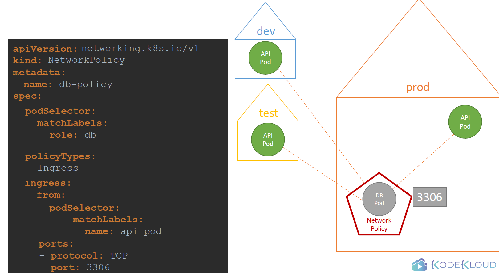
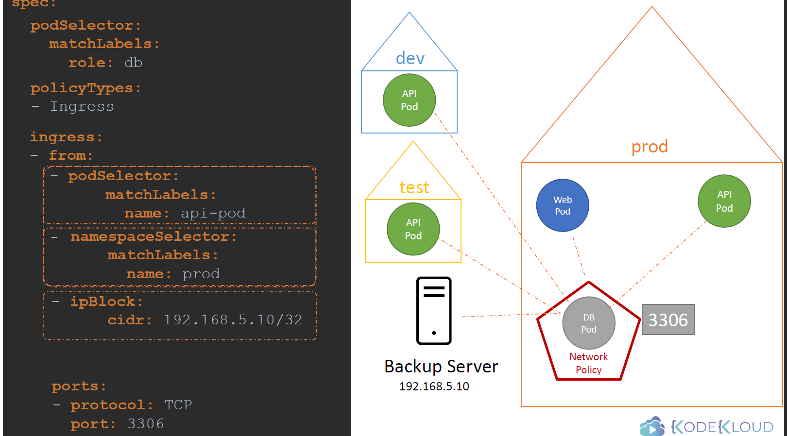
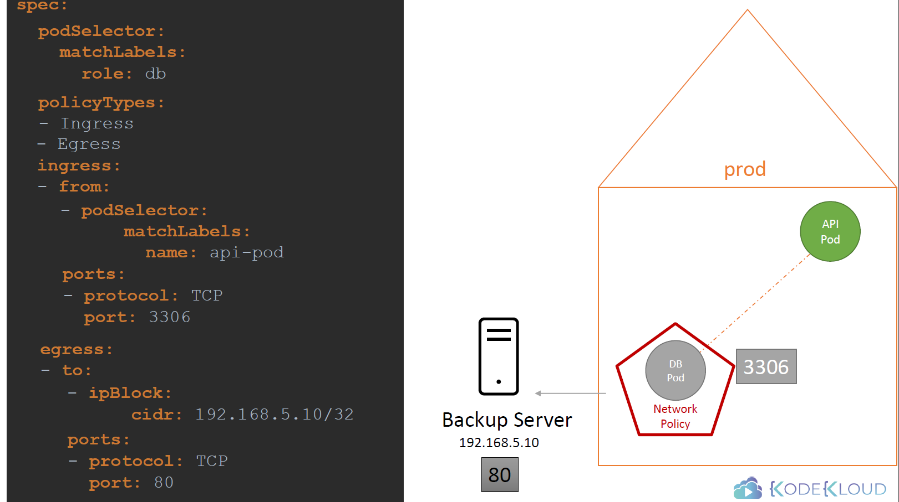


## 7.0 Storage:

### 7.1 Docker Storage:

- Docker storage has two concepts **Storage Drivers** and **Volume Drivers** (Plugins).
- Docker stores data at local FS at /var/lib/docker.
- It has mutiple folder within where it stores all the docker related data. we have mutiple folder under it like aufs, containers, images, volumes etc.,..
- Docker works on Layered Architecture. Each line in a Dockerfile is one layer.

```sh

Dockerfile:

FROM ubuntu

RUN apt-get update && apt-get install python

RUN pip install flask flask-mysql

COPY . /opt/source-code

ENTRYPOINT FLASK_APP=/opt/source-code/app.py flask run

- When you run docker build -t for the above Dockerfile it builds the image in layers.

Layer 1: Base ubuntu
Layer 2: Changes in apt packages
Layer 3: Changes in pip pkgs
Layer 4: source code copy
Layer 5: Update enntrypoint

Layer 6: Container Layer

- Now consider a different Dockerfile2 with change in COPY and ENTRYPOINT in the above Dockerfile.
- Docker doesnt build all the layers it fetches the image from previous build cache upto 3 rd layer and builds on top of that , this way it builds the images fast and saves disk space.
- When you run  docker run once the build is done , Docker creates a new layer called Container Layer which is writable, all the previous layers are read only. The life of this layer is only till the container is alive.
- When you create new files docker creates them in the Container layer, What if we want to change the source code.
- As all the previous layers that are build read only. Docker creates a copy of the source code from Read only layers in to teh container layer where we can change the source code for some testing and changes. Image will remain same all the time.
- All the change we made in the container layer will be delete once the container is killed.\
- To store the changes we made to the source code and any other new files we can add a Persistent Volume to the container.
- We can create PV by using docker volume create data_volume
- It first creates a folder in the /var/lib/docker/volumes/data_volume.
- Now we start the container with the volume attached. docker run -v data_volume:/var/lib/mysql mysql
- Here we are starting the mysql container where we are attaching the data_volume to the path /var/lib/mysql inside the read write layer of the container that is running.
-So all the information written to the /var/lib/mysql is still secured after we lost the container.
- If we dont create the volume after and run docker with the volume mount, docker automatically creates the volume for us.
- This entire process is called volume mounting.
- Consider we already have our at some other volume. Here we need to run dcoker command with the complete path of the volume location.
- docker run -v /data/volume/nfs/msql:/var/lib/mysql mysql. this process is called Bind Mounting.
- The latest docker command to attach a volume while running docker is below
- docker run --mount type=bind,source=/data/volume/nfs/mysql,target=/var/lib/mysql mysql.
- docker uses the storage drivers to maintain the layered approach. THere are mutiple storage drivers, depending the underlying os we use it will change.
- Docker will choose best storage driver depending upon the type of OS installed.


Volume Drivers:

- Storage drivers help maintain storage on images and containers.
- If you want to persist storage we want volumes. these are handled by volume plugins.
- If helps store the volumes under /var/lib/docker/volumes there are many volume  drivers out there. (ex: azure file srtorage, gce-dokcer,RexRey etc.,.)
- These helps us store data on to the volumes.
- When you run docker container we can choose sepcific volumes driver like rexrey EBS to provision a volume from amazon EBS.
```

### 7.2 Container Storage Interface (CSI):

- In the past K8S docker alone as container runtime engine, it source code is embedded in source code. As we have new container engines like cri-o and rkt. It was important open up and not be dependent.
- This is where Container Runtime Interface(CRI) comes in. How an orchestration service like k8s will communicate with CRI like docker.
- If any new container runtime is provided all it has to do is follow CRI standards to work with K8S.
- Similarly now Container Network Interface(CNI) is developed. Now any new networking renders(flannel, cilium, weaveworks) could simply develop and  intergrate using the CNI standards with the K8S.
- In the same fashion,  they have developed Container Storage Interface(CSI). In which mutiple volume providers (Amazon EBS) can integrate with the k8s using the CSI standards and with the help of CSI drivers.
- CSI is universal standard not only particular to K8S. Same with the CNI and CRI as well.
- If implemented it will allow any container orchestration tool with any storage provider with the supported plugin.
- THere are steps that needs to be followed to create volumes. 
   - The orchestration tool should call the create volume RPC and pass a set of details like volume name,
   - The storage driver should implement this RPC and return the results of the operation. 
   - Similary it should call the RPC for deleting or recreating the volume. The storage drivers should perform the same.

### 7.3 Persistent Volumes in K8S:

#### 7.3.1 Volumes in Docker: 

   - Docker Containers are transient in nature, they are called upon when required to  process data and destroyed once finished. data is destroyed along with the container.
   - To persist the data after the container is lost we use the Persistent Volumes.
   - K8s also operates in a similar fashion. The pods creates are transient in nature, data processed by it gets deleted as well once the pods are deleted.

- Lets take an example of a pod in which it generates a random number.
- The number generated is stored in a folder. Now we attach a data-volume inside the pod and volume we use is the some space on the node1.
- Once the volume is created we specify this volume under the volumemount section under spec section of yaml.
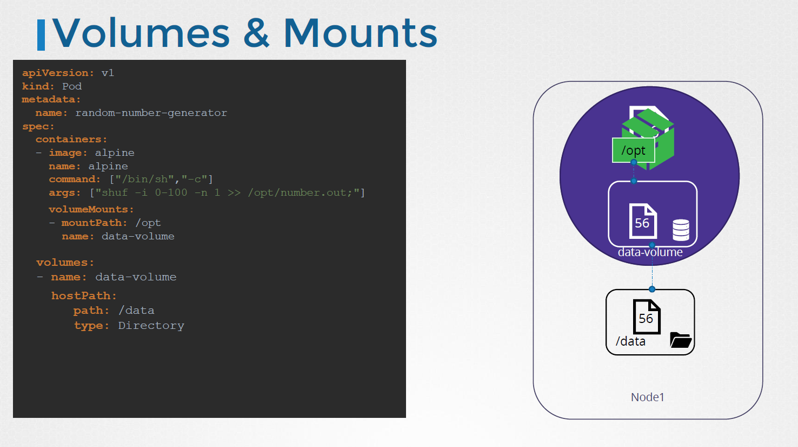
- Here in the above example we used the hostpath, this is not recommend in the muti node architecture.   As we ustilise the sapce on the node as well.
- K8S supports different type of volumes such as NFS, FlOCKer, EBS, Azure File Storage, Google Persistent Disk.
- If we want to store data on the AWS EBS. We mention the same under the volume section in the yaml.
```
Volumes:
- name: data-volume
  awsElasticBlockStore:
   volumeID: <volume-id>
      fsType: ext4
```

#### 7.3.2 PV in K8S:

- When we created volumes in the previous section, the storage for the volume goes within the POD definition file.
- If we have large number of PODs the users have to configure storage for each pod. This is not ideal.
- Its best to maintain storage centrally. This is where PV comes in. Its a pool of PV carved by the admin from a central storage, this can be  used by user to claim the volume known as PVC.
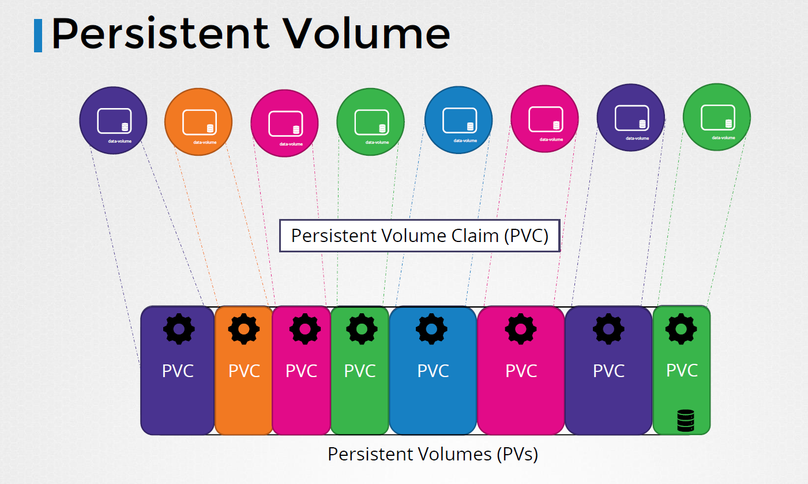
-  Create PV using the PV yaml and list the PV using (kubectl get pv). under the spec section in the PV check the different accessModes and capacity, hostpath is to create a volume from the nodes local directory(it shoudlnt be used in prod). Replace the hospath with the any supported storage solutions.
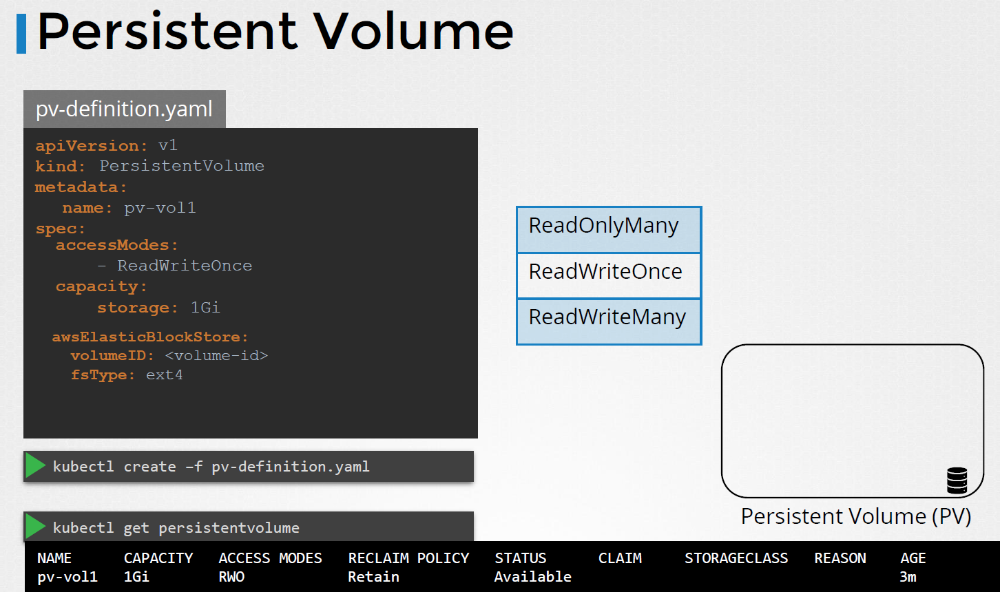

#### 7.3.3 PVC in K8S:

- PVC and PV are two seperate things in k8s namespace. Admin creates PV and user creates PVC.
- Once the PVC are created k8s binds the claims to the PV accroding to the properties the set on the volume.
- K8S finds the sufficient capacity PV as per the PVC properties(RequestModes, AccessModes, VolumesModes, StorageClass) 
- If there are mutiple matches for a single cliam and if we still need to use a particular claim we can do that by using Labels and Selectors.
- **If there are mutiple matches for PV and there isnt any specifications then the PV uses a PVC with larger volume, and as it is a one-to-one claim we cant use the remaining space for other PVC.**
- If there are no volumes available the PVC will remain in a pending state until newer volumes are made available to the cluster.
- Refer the below yaml for the PVC and bind it to the PV. (kubectl get pvc)
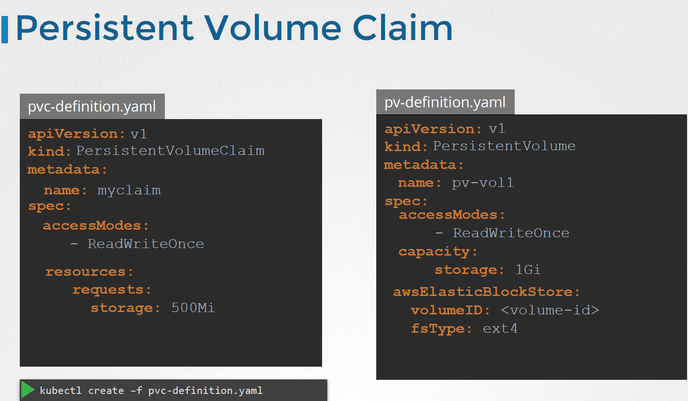
- If a PVC is deleted , we can choose what needs to happen to the PV by default is set to **Retain**. We can make it to delete it. Another option is Recycle that to make data scrub an make avialable again in the PVC pool.

```sh
Using PVCs in PODs
Once you create a PVC use it in a POD definition file by specifying the PVC Claim name under persistentVolumeClaim section in the volumes section like this:


apiVersion: v1
kind: Pod
metadata:
  name: mypod
spec:
  containers:
    - name: myfrontend
      image: nginx
      volumeMounts:
      - mountPath: "/var/www/html"
        name: mypd
  volumes:
    - name: mypd
      persistentVolumeClaim:
        claimName: myclaim


The same is true for ReplicaSets or Deployments. Add this to the pod template section of a Deployment on ReplicaSet.
```

#### 7.3.4 Storage Class:

- In the previous example we have seen have to create PV and PVC to claim that PV as volumes
- Before we provision a PV we must provision that space on the cloud or any storage. This is called static provisioning. Every time before we create an PV we must create storage and this is not ideal.
- It would be nice if the storage gets provisioned automatically after creating PV thats where Storage classes comes in.
- With Storage Classes we can define a provisioner like Amazon EBS. that can automatically provision storage when a claim is made. That is called Dynamic Provisioning of Volume.
- So we no longer need the PV to provision storage and bind to PVC,  We now have a storage class. The PV and storage is automatically created when the storage class is created.
- We specify the storage class name in the PVC definition yaml. (PV is created automatically)
- With each provisioner we can specify the storage type (ex: SSD etc.,.) depends upon the kind of cloud storage we use.
- Else we can create mutiple storage class and use them in the PVC.   


```
apiVersion: v1
kind: PersistentVolumeClaim
metadata:
   name: pv-vol
spec:
   accessMode:
      - ReadWriteOnce   
   capacity:
      storage: 1Gi
   storageClassName: amazon-EBS
   resources:
      requests:
         storage: 500Mi

-------------

apiVersion: V1
kind: StorageClass
metadata:
   name: amazon-EBS
provisioner: kubernetes.io/amzaon-pd

```


#### 7.3.5 StatefulSets:

https://medium.com/stakater/k8s-deployments-vs-statefulsets-vs-daemonsets-60582f0c62d4

https://kubernetes.io/docs/concepts/workloads/controllers/statefulset/


## 8.0 NETWORKING:

- Here we focus on networking concepts in the K8S architecture.

### 8.1 Networking Basics:

This course is cool for entire Networking Basics: https://www.youtube.com/watch?v=IPvYjXCsTg8&list=PL9gnSGHSqcnoqBXdMwUTRod4Gi3eac2Ak&index=3&t=1492s


- Here we go through the basics of networking concepts like below.
   - Switching & Routing
   - DNS
   - Network Namespaces
   - Docker Networking

**Switching & Routing:**


- We have 2 computers A and B. How does A reach B , we connect them thorugh a switch and switch creates a network containing the two systems.
- To connect through a switch we need an network interface on each host (Physical or Virtual) .
- We see the network interfaces for the host we use the command ( ip link) eth0.
- Let assume the Switch has an IP address 192.168.1.0 , then we assign the system with IP addresses on the same network using the command ( ip addr add 192.168.1.10/24 dev eth0)
- Once they are assinged the ip then can send and receive the packets within the same network.
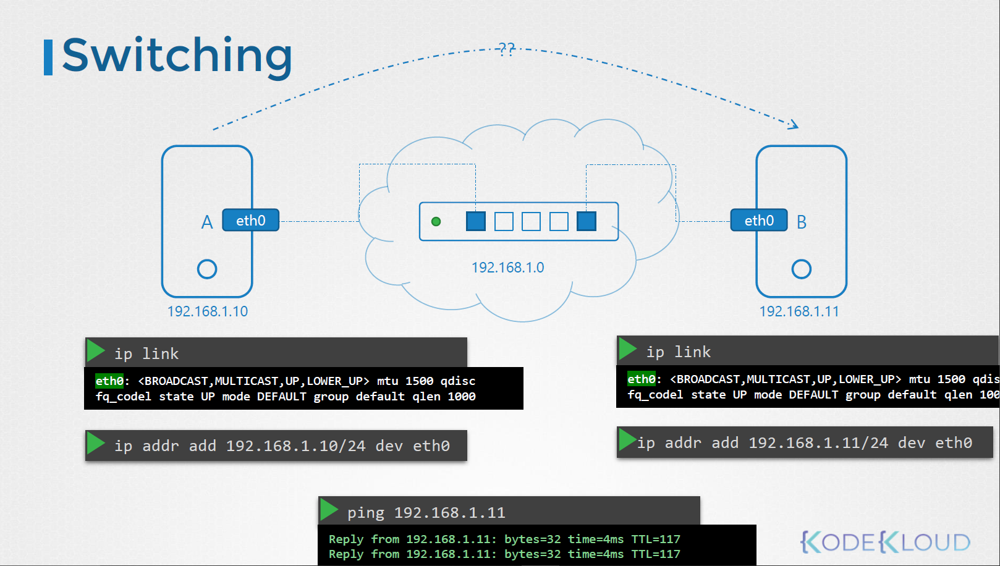
- If we have another network with different IP range,  how does two networks interact with each other, thats where routers come in.
- Router is like another server with many network ports, since it connects two networks it gets assgined two IP addresses one on each different networks.
- When the packets are sent from one network to another, how does the system know where the router is on the network to send the packet through.
- The router is just another device on the network there could be many such devices on the network.
- This is where Gateway comes into picture. 
- type (route) in the kernel to see the routes configured on our system. If nothing is configured we can bascially send the packets within our own network.
- We need to add a route (ip route add 192.168.2.0 via 192.168.1.1) to send packets to the IP outside of our network.
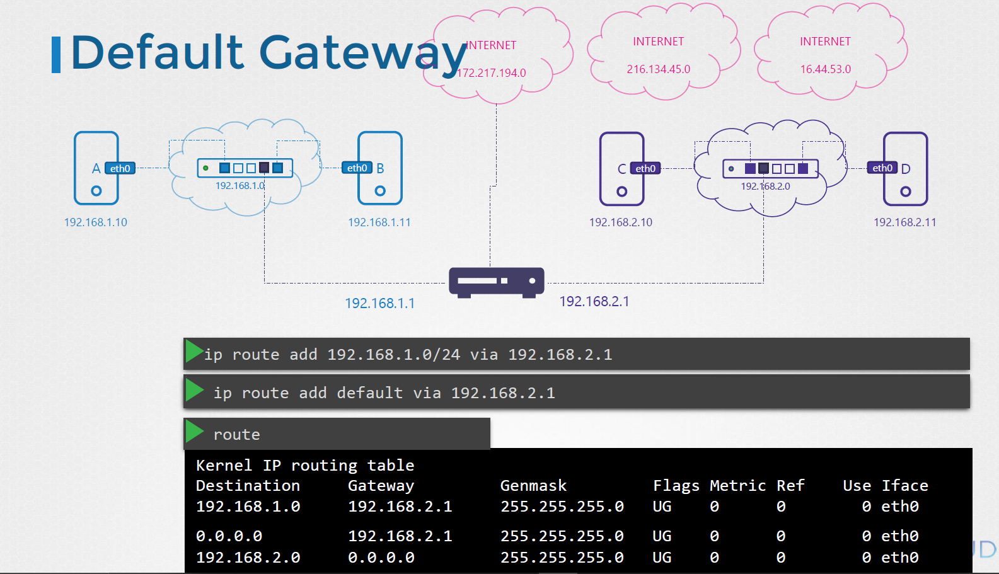
- As we dont know all the destination IP address. we need a simple rule to redirect all the request
- For any network we dont know the route to use this router as the default gateway.
- This way any request sending it to the outside of this particular network goes through that router.
- A 0.0.0.0 field in the gateway feild in the route command indicates that you dont need a gateway as destination Ip is within its own network
- SO if we have issues regarding the internet the route table needs to have a default entry for destination.

**Setting Linux Host as a Router:**

- Lets consider we have 3 hosts A,B and C. A and B are conected to a network 192.168.1.0 , B and C to another 192.168.2.0 .
- Host B is connected to both the networks via eth0 and eth1.
- if we try connecting from Host A to Host C , it say network un reachable.
- We need to tell Host A the gateway to host c if through Host B. we can do that by ng a routing table entry and vice versa.
- But default packets that reach Host B on eth0 cant be transferred by eth1 on Host B. So we still cant get the connectivity from Host A to C
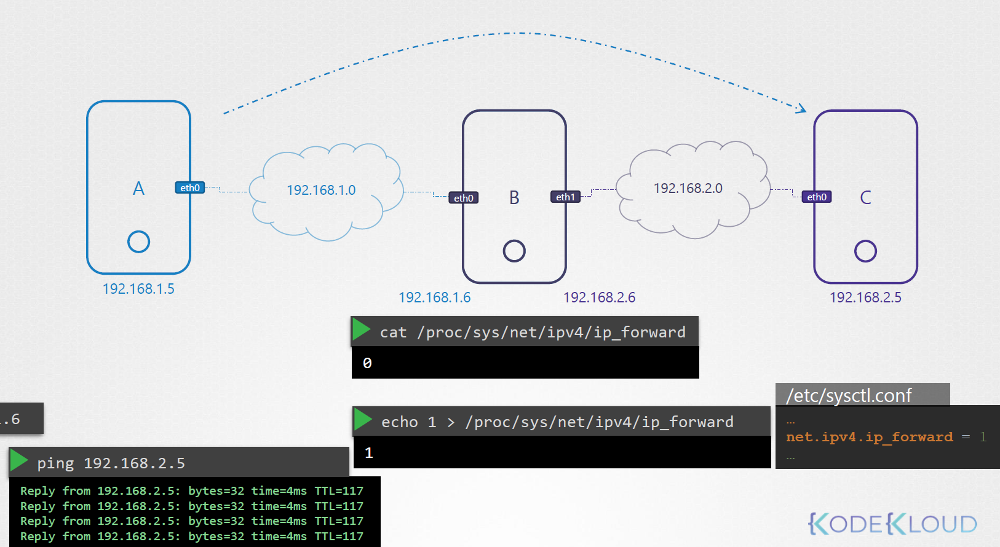
- This is beacuse of security reasons if we have somone that can send eth0 to eth1, then we can send packets from public to private requests.
- We need to mention explicitly in the ip_forward, cat /proc/sys/net/ipv4/ip_forward is 0. set this to one and you should see that the pings go through.
- Simply changing this values doesnt persist across the reboots, we need to change it in the /etc/sysctl.conf (net.ipv4.ip_forward=1)

**DNS:**

- We have two systems within the same network, we are able to ping sys B from sys A. If the second system is DB. When you "ping DB", its unaware of the host.
- We wanna tell system A the system B can be refered as DB. Please add ( ip_address db ) in the /etc/hosts file. So the system A knows its DB.
- Sys A takes all the names we put in /etc/hosts as granted. Translating hostname like in this the folder is knowns as Name Resolution. 
- So how could we make sure all the system reach DB by the same name if we dont put the name in hosts file. So we moved all these hosts name and IP and manage it centrally known as DNS. That server is called DNS server. Then we lookup that server to resolve a hostname to a IP address.
- We point the host to the DNS server by mentioning the IP of the DNS server in the /etc/resolv.conf file.
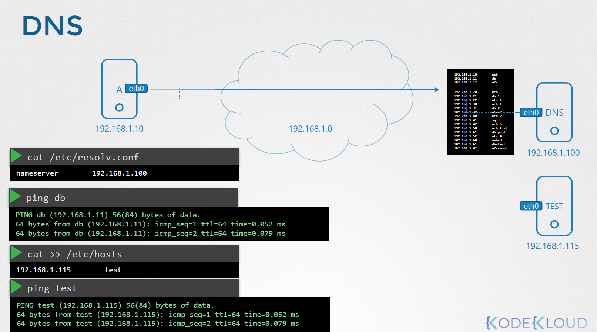
- Now we centrally maintain all the DNS hostnames for IP address. Still we can add an entry into the hosts and it still works just fine from local system.
- If we have entry in both the DNS and local server. the host first looks in the local, if not it looks in the DNS server.
- We can change that order in the file /etc/nssswitch.conf ( hosts: files dns) , just we need to place dns first.
-  Generally we add the address 8.8.8.8 in /etc/resolv.conf the common name server from google that has all the DNS addresses. we can can check in our systems too.
- we have mutiple domain names ( .com, .in, .net, .edu , .org, .io) for different organizations.
- For www.google.com ->  . is the root and **.com** is top level domain name and **www** is the sub domain. Ex: maps.google.com (maps is the sub-domain under .com) , mail.google.com, apps.google.com
- We begin to see a tree structure, firs the request we ping is sent to the internet, then it resolves using root DNS, .com DNS, google DNS. 
- These requests from a certain IP are generally cached for some time so as to not to go through the entire process again.
  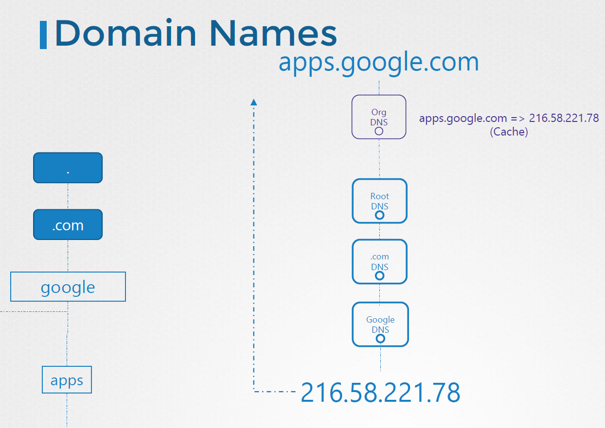
- Similar thing can be configured for our organization internal DNS server.
- suppose we have web.mycompany.com  and if you ping web it doesnt know such DNS, so we can mention the search in the hosts file(search mycompany.com) to default the search to web.mycompany.com

- DNS stores mutiple record types:
   - A type: IP to hostnames
   - AAAA name: IPv6 to hostname
   - C name: one hostname to another name (like google.com -> www.google.com)
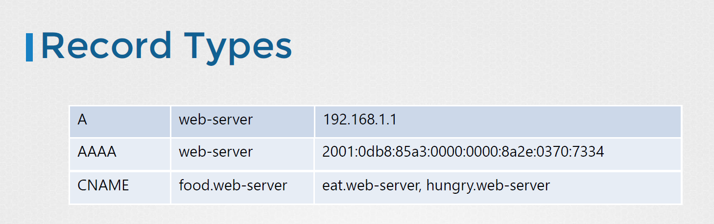
- we can use nslookup but nslookup doesnt count entry in the local hostfile, so if you add a local entry it will not find it. it should be present in the DNS server.
- We also have dig command for DNS name resolution , it returns more details than the nslookup command.


```
Prerequisite - CoreDNS
In the previous lecture we saw why you need a DNS server and how it can help manage name resolution in large environments with many hostnames and Ips and how you can configure your hosts to point to a DNS server. In this article we will see how to configure a host as a DNS server.


We are given a server dedicated as the DNS server, and a set of Ips to configure as entries in the server. There are many DNS server solutions out there, in this lecture we will focus on a particular one  CoreDNS.


So how do you get core dns? CoreDNS binaries can be downloaded from their Github releases page or as a docker image. Lets go the traditional route. Download the binary using curl or wget. And extract it. You get the coredns executable.


Run the executable to start a DNS server. It by default listens on port 53, which is the default port for a DNS server.


Now we havent specified the IP to hostname mappings. For that you need to provide some configurations. There are multiple ways to do that. We will look at one. First we put all of the entries into the DNS servers /etc/hosts file.


And then we configure CoreDNS to use that file. CoreDNS loads its configuration from a file named Corefile. Here is a simple configuration that instructs CoreDNS to fetch the IP to hostname mappings from the file /etc/hosts. When the DNS server is run, it now picks the Ips and names from the /etc/hosts file on the server.


CoreDNS also supports other ways of configuring DNS entries through plugins. We will look at the plugin that it uses for Kubernetes in a later section.

Read more about CoreDNS here:

https://github.com/kubernetes/dns/blob/master/docs/specification.md

https://coredns.io/plugins/kubernetes/


```
**Network Namespaces:** 
- Note : For indepth understadin check the networking course.
- Network namespaces is used by docker to implement network isolation.
- If the server is house, namespaces are rooms within them, they isolate and provide privacy each one.
- As far the namespaces goes it has only the process that are specific to that namespace, however the underlying host as the visiblity of what its running.
- The host as the network interface and route tables , but the namespaces has its own virtual network interface and underlying route and ARP tabels. With namespaces we successfully prevent it from seeing the underlying host and its network.
- We can connect two namespace with each other using the virtual  connection.(ip link add veth-red type veth peer name veth-blue) and various other comands to establish a connection b/w them.
- What if we have a n number of namespaces. We create a virtual switch within a host and connect all the namespaces to it.
- We have mutiple solutions like linux bridge.
- If you want to reach the namespace from the underlying host , add an addr to the route table in the locahost for virtual bridge and we will be able to ping the namespaces.
- All this stuff is still private, the only door to the outside world is through the ethernet port on the localhost.
- We establish a connection to the outisde world using the gateway(localhost) and outside stuff is reached using the NAT.


**Docker Networking:**

- A server with docker installed connects to the local host network via eth0 interface on IP address 192.168.1.10.
- When u run a container we have different networks to choose from (docker run --network none nginx) runs continer with no network. We can also run with  the host network which uses same network as host. If you wish to run another container that share the same host network it doesnt work as we already have one that shares the localhost networking.
- Two process cant listen to the same port at the same time.
- Another networking option is the bridge, in this case an internal private network to which the docker containers attach to. (this is what docker does mostly)
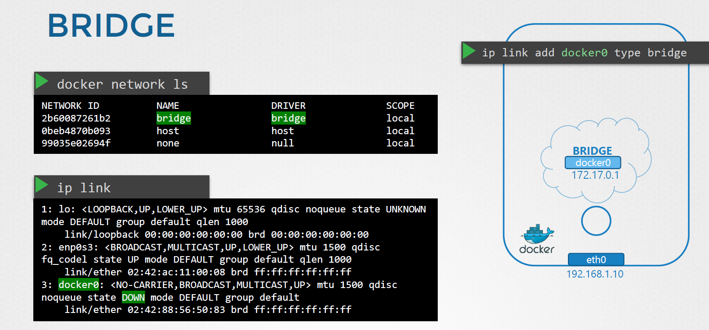
- When you run docker it create internal private network called bridge (docker network ls)
- On the host its created by the name docker0. Docker internally uses the network namespacing techniques.
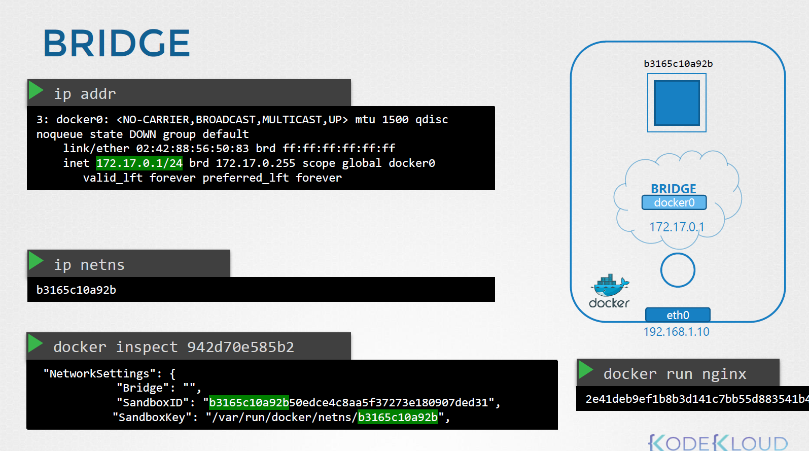
- The bridge network is like an interface to the host, but it also acts as a switch to the containers within the host.
- ip netns (to list the namspaces created by docker) there is a minor tweak that needs to done. to get the results.
- docker inspect container_id (gvies the namespces id as well)
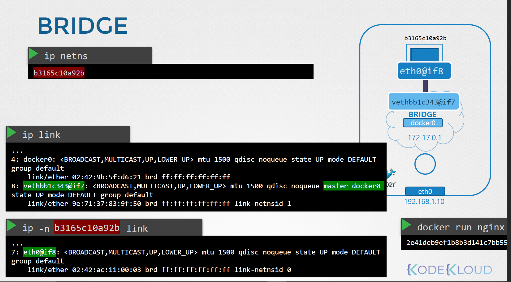
- Docker creates a connection to the bridge using the same method as network namespacing.
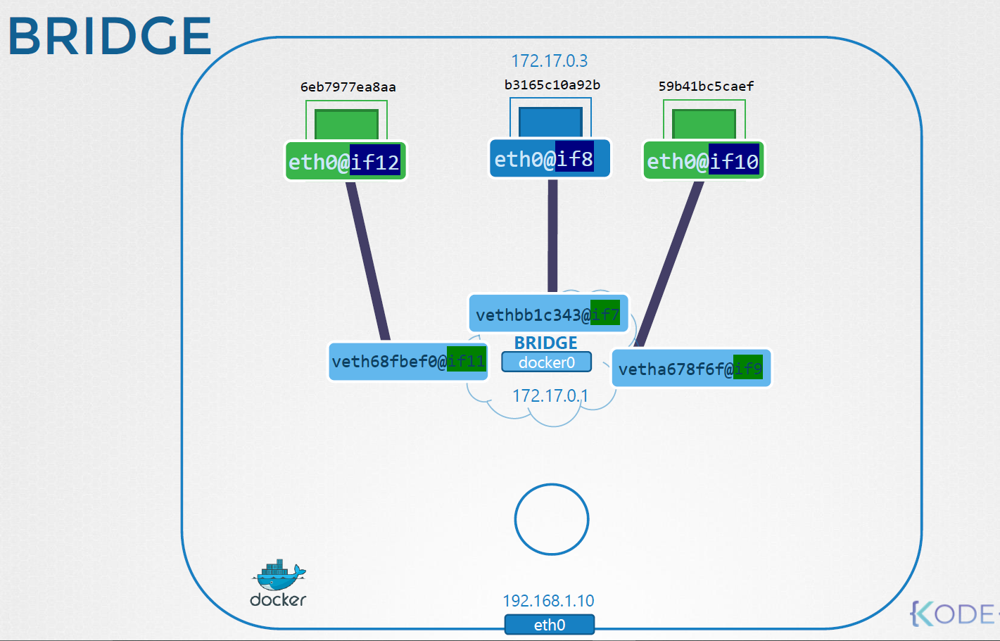
- Lets take an example for nginx 
- We can reach this nginx network via the localhost using the IP address of the container and port 80. to avoid this we run container using the port mappig feature.
  docker run -p 8080:80 nginx
- docker forwards this traffic from one port to another , docker makes changes to the ip tables to include this forwarding happen.

**Container Networking Interface:**

- Network Namespaces are created as described earlier in docker  networking or network namespaces.
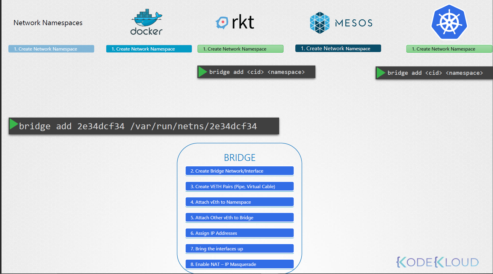
- Almost all the networking solutions work in the same way, hence why code and develop mutiple times , code a single program. This is for the bridge network lets call this a bridge.
- bridge add container_id namespace (its creates all the reamaining steps to create a bridge for container to interact to with the localhost)
- If we want to create such bridge code for a new networking solution, it should have certain standard arguments to support.
- Thats where CNI comes in, it sets the standards in which the networking solutions should use,and the code they develop are known as plugins. (Ex: Bridge Plugin)
- CNI defines how the plugin needs to be developed and interacted with the container run times. see below
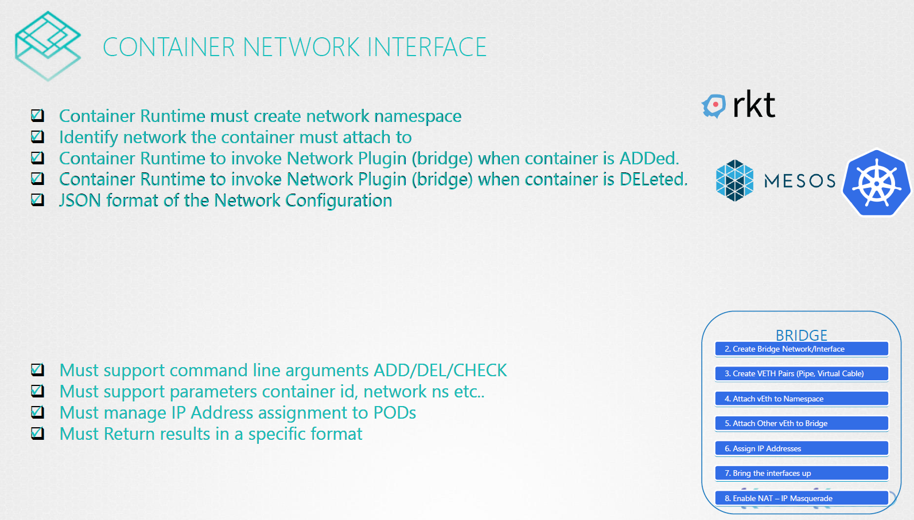
- There are many such plugins developed using the CNI standards (Docker doesnt support the CNI standards instead uses Container Networking Model (CNM))
- 3rd party developers also develop these plugins using the CNI standard that work with all container runtime engines.
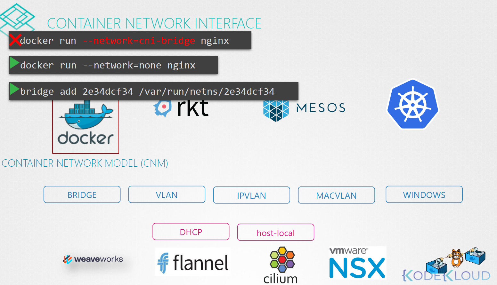
- We can run a dcoker container without network and manually invoke this plugin (workaround for docker to use the CNI netowork plugin)

### 8.2 CNI for K8S:

- Each node in K8S must have one interface to connect to network. Each interface must have an address.
- The Host (eaach node) must have a unique mac address  and hostname set.
- There are few ports that needs to be opened as well.
   - Master - 6443 -apiserver
   - Worker node - 10250 - kubelet 
   - master- kube controller maanger - 10252
   - worker - expose applications to world - 30000-32767
   - master - etcd -2379 (2380 ETCD clients can talk to each other for multiple etcd DB)
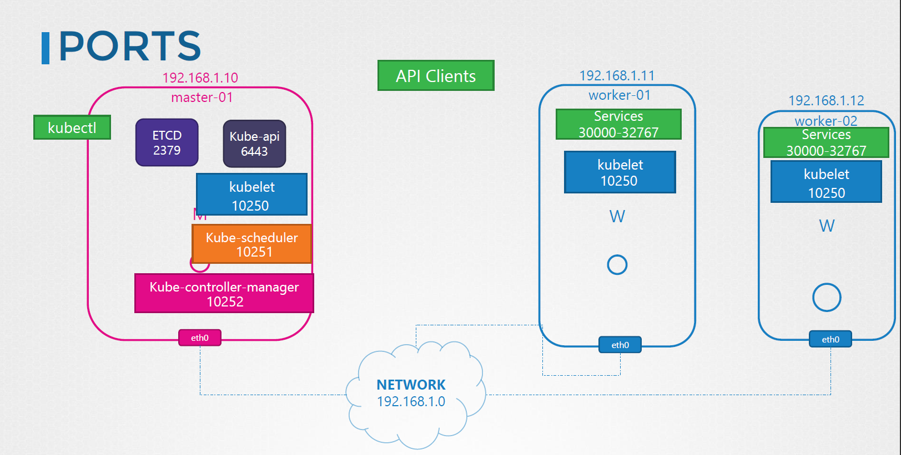
- Commands for network debugging.
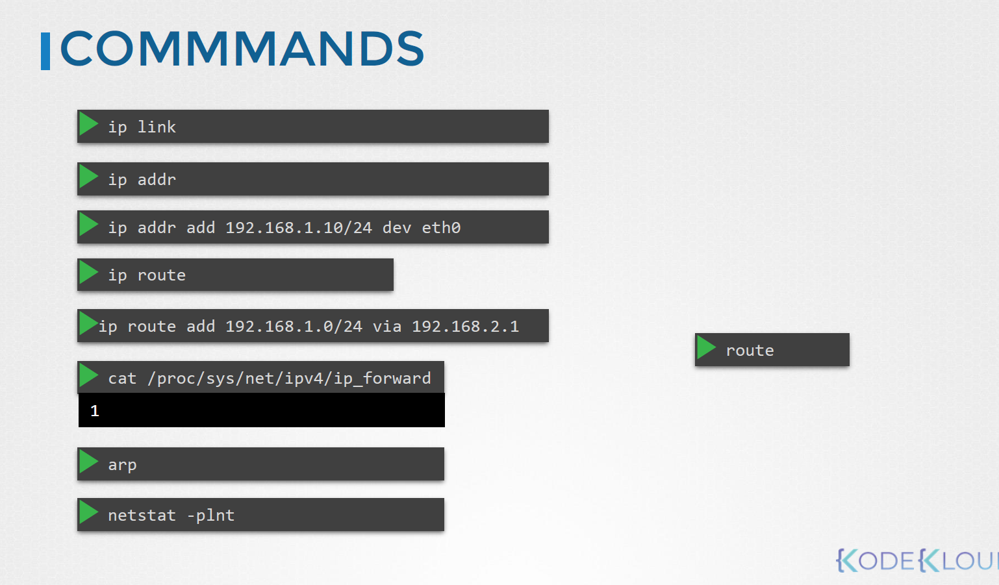

```
Important Note about CNI and CKA Exam
An important tip about deploying Network Addons in a Kubernetes cluster.


In the upcoming labs, we will work with Network Addons. This includes installing a network plugin in the cluster. While we have used weave-net as an example, please bear in mind that you can use any of the plugins which are described here:

https://kubernetes.io/docs/concepts/cluster-administration/addons/

https://kubernetes.io/docs/concepts/cluster-administration/networking/#how-to-implement-the-kubernetes-networking-model


In the CKA exam, for a question that requires you to deploy a network addon, unless specifically directed, you may use any of the solutions described in the link above.


However, the documentation currently does not contain a direct reference to the exact command to be used to deploy a third party network addon.

The links above redirect to third party/ vendor sites or GitHub repositories which cannot be used in the exam. This has been intentionally done to keep the content in the Kubernetes documentation vendor-neutral.

At this moment in time, there is still one place within the documentation where you can find the exact command to deploy weave network addon:


https://kubernetes.io/docs/setup/production-environment/tools/kubeadm/high-availability/#steps-for-the-first-control-plane-node (step 2)
```

### 8.3 POD Networking:

- We know there is a network that connects the nodes. Now let us see the network that connects the PODs across the nodes and within them as well.
- K8S does not have a built in solution for this, we to install 3rd party providers for this.
- There are few rules k8s set for us to follow:
   - Every POD should have an IP address
   - Every POD should able to communicate to every other POD in the same node.
   - Every POD should be able to communicate to every other POD in other nodes without NAT.
- There are netoworking solutions out there like (flannel, weave net etc.,..)
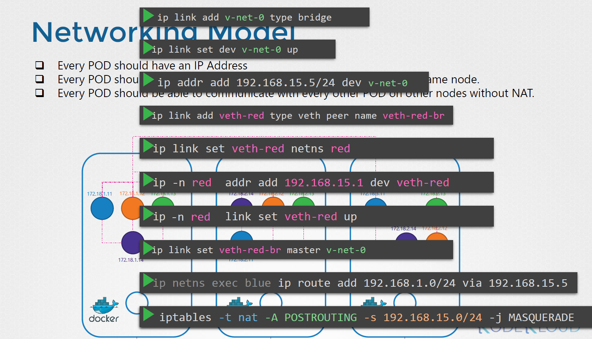
   - Let us consider there are 3 nodes , each node will have a an IP address.
   - When containers are created inside them K8S creates network namespaces for them, to enable communication we attach these namespace to a network like bridge network.
   - We createa bridge network on each node. Each bridge network will have private IP address range.
   - We set the IP address for te Bridge Interface
   - TO attach a container to a network we need a virtual network cable (ip link add ....)
   - We then attach one end to the container and other end to the bridge (ip link set ...., ip link set ......)
   - We then assign IP address to the namespacess( ip -n <namespace> addr add ....) and add a route to the route table ( ip -n namespace route add ....)
   - Bring up the interface (ip -n <namespace> link set ....)
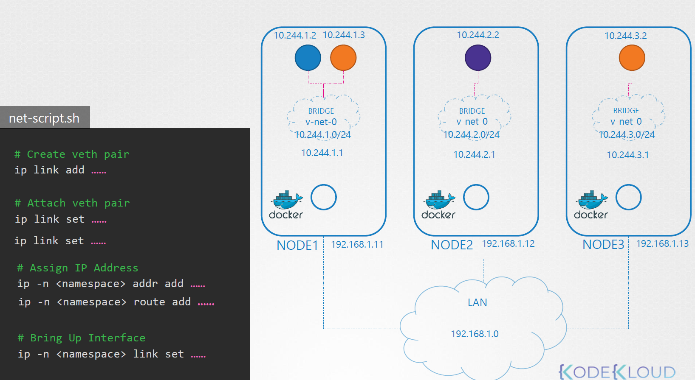
- In order to reach to the IP of the pod in a different node , we need to add the route for the pod IP to the IP of the different node its trying to reach (ip route add 10.244.2.2 vai 192.168.1.12)
- Simiarly we  need to consider for all other route, its get complicated very quickly.
- Instead create  a external router that routes all the requests and points all the of them to use this as default gateway.
- In order to acieve this we need to run a script everytime we create a container for that to use the default gateway, this is where CNI comes into the picture which helps  has certain standards on how we can achieve that. How the script should be configured etc.,..
- Kubelet is responsible for creating containers on the node, it looks for the --cni-conf-dir=/etc/cni/net.d each time a container is run.
- then the script takes care of eveything using the name and namespace id of the container
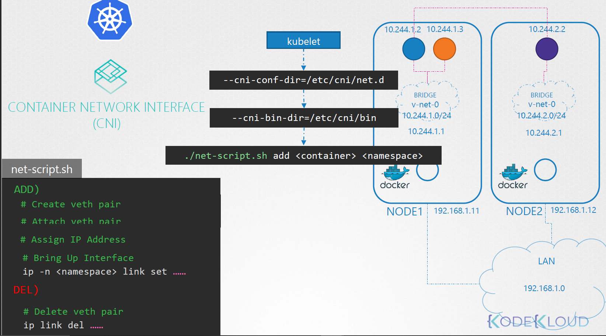


### 8.4 CNI in K8S:

- Where do we specify the CNI plugin for the k8s to use?
- CNI plugin is configured inside the kubelet service on each node  of the cluster. we can also see thos options (ps -aux | grep kubelet) on each node.
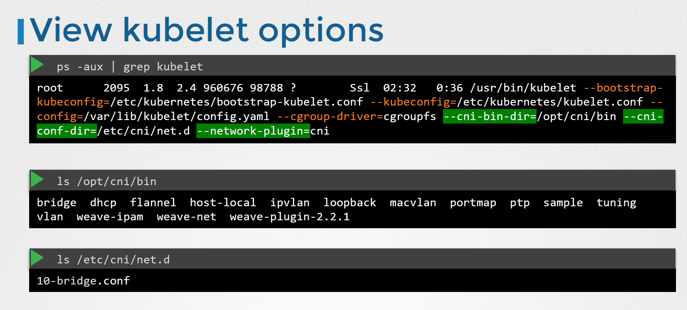
- If there are mutiple config files it checks in for the first one in alphabetical order.

### 8.5 CNI Weave Plugin :

- Its important to understand atleast network plugin, hence we look at the waeve plugin. To relate to other solutions.
- Weaveworks deploy an Agent on each node, which communicates with the agents across the other nodes.
- They share a topology of entire setup.
- They can be deloyed as daemon sets on each nodes.  With a kubectl command (kubectl apply -f "https://cloud.weave.works/k8s/net?k8s-version=$(kubectl version | base64
| tr -d '\n')")

#### IP address Mgmt:

- How the BRIDGE networks within the nodes and pods are assinged a IP address?
- CNI plugin is responsible for the assigning the IP address.
- Easy way to do it maintain a list IP in the each pod and nodes in there,
- CNI comes with two built in plugins which implement these plugins, DHCP and host-local plugins within it.
- Different network providers does it differently.

### 8.6 Service Networking:

- PODs are rarely communicate each other directly, we always use the service.
- Service is not bound to Node, its accessible across the cluster. This is Cluster IP.
- If its a web application and want to access outside the outside the cluster we use NodePort which exposes the application on port 30080 on each node.
- How services getting IP and does all other stuff ?
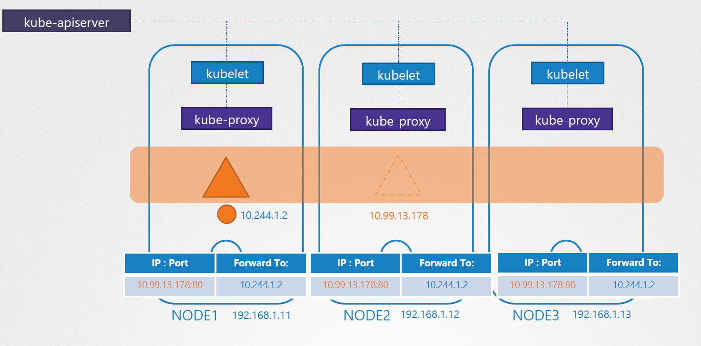
- Whenever we create a service it gets assigned a IP from a pre defined range.
- Kube proxy running on each node gets these IP and creates a forwarding  rules on each node.
- kube proxy uses different ways to enable this. (userspace, iptables,ipvs) . Default is IP table.
   - Let us create a service CusterIP to access a pod, k8s assgins the IP address to this service from the default range the kube-api-server has for services i.e 10.0.0.0/24
   - We need to make sure that the POD IP and Service IP ranges doesnt overlap
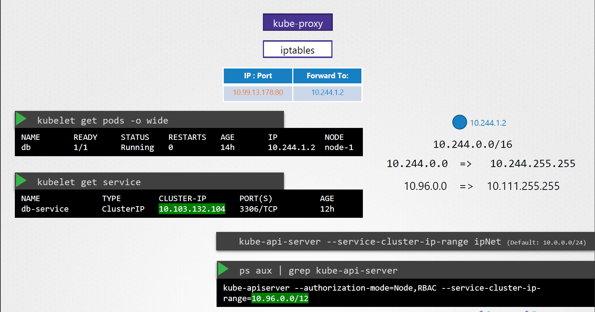
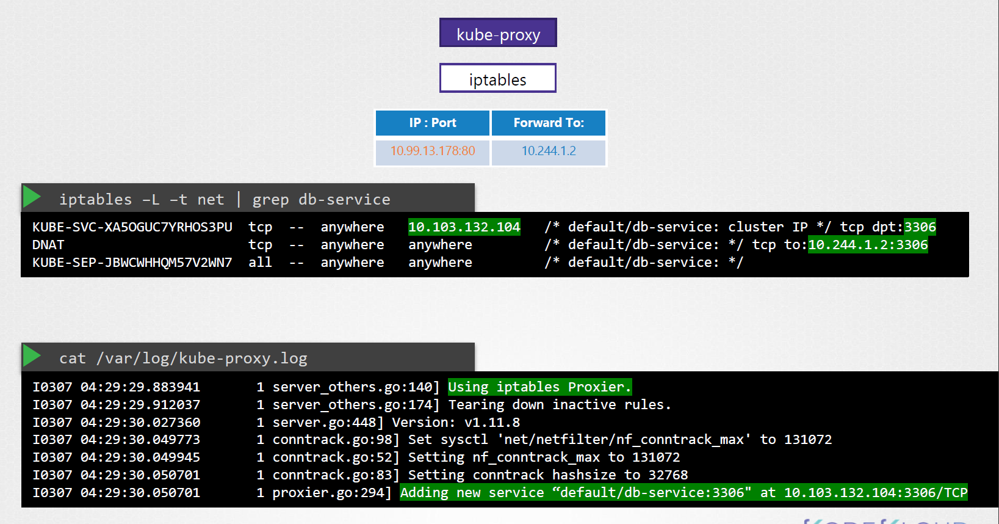

### 8.7 DNS in K8S:

- DNS resolution within the cluster. K8S deploys DNS when you install it using kubeadm, if its done manually we need to set it up.
- Whenever a service is created, K8S DNS service creates a record for DNS name for the service.
- Fo each namespace , DNS server creates a sub-domain with the namespace name.
- All the services are further grouped in to a sub-domain called svc.
- All the stuff has a root domain called called cluster.local
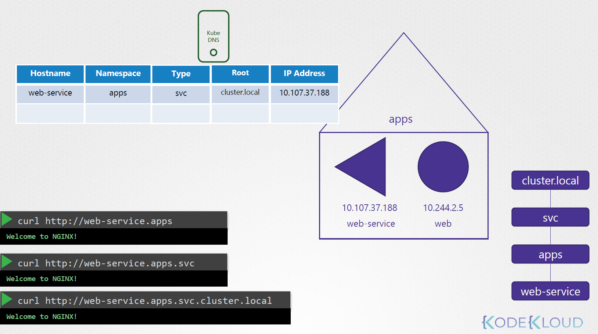

### 8.8 CoreDNS in K8S:

- Each time a pod is created a record is created in the DNS server.
- It also configures /etc/resolv.conf to point the nameserver to the DNS ip.
- For POD names are done by using the IP by replacing the . with -.
- CoreDNS is deployed in the kube-system namespace.
- k8s plugin helps it work with coreDNS, the root domain is cluster.local in /etc/coredns/Corefile
- this Corefile is passed into the k8s as a ConfigMap. 
- PODS gets assigned CoreDNS server, the CoreDNS runs as a service called kube-dns on the kube-system namespace. this IP is configured in nameserver in /etc/resolv.conf in pods created. This is done automatically.
- kubelet is resposible for the above step.
- Even we search with the service name , it returns the output as the resolv.conf has search row which helps in fetching the output using any name.
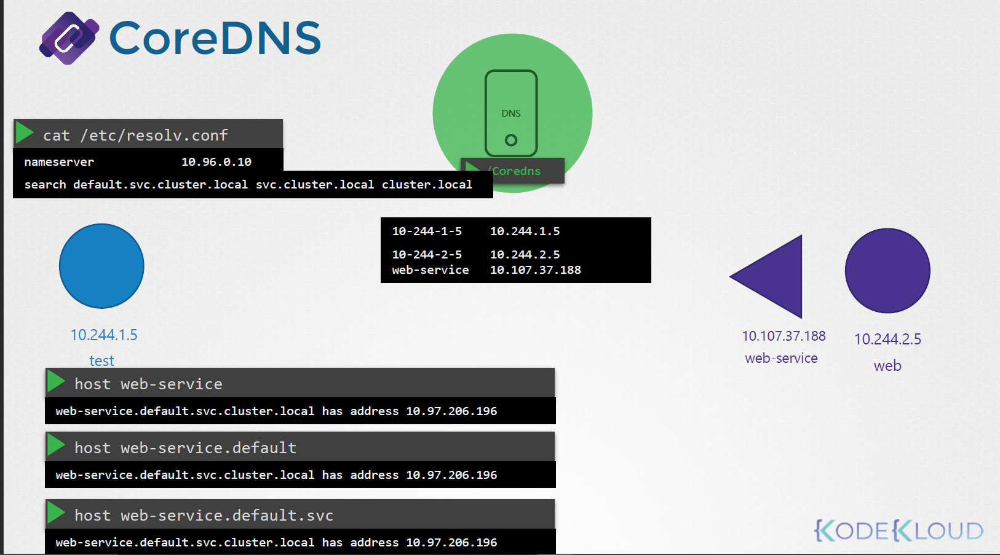


### 8.9 INGRESS:

- Generally when we have a 3 tier application, web server is connected to the application server n DB server via services.
- To access app server and DB server from within the cluster we use ClusterIP.
- As we know services are distributed across mutiple node unlike pods, so it distributes traffic accordingly to each one of the pods across multiple nodes.
- For the web server now to be accessed to the outside world we need to expose it , this can be done by using service NodePort. We can configure a DNS and access it via this port say 38080
- We dont want our users to access the web page say my-online-store.com:38080 using the port number each time. So we have to setup a proxy server ahead of it which exposes port 80.
- Instead if we use a cloud provider , it creates the Nodeport like earlier but it also sends a request to create Load Balancer (NLB in GCP, CLB in AWS by default)
- On recieveing the request cloud provider configure a LB to route the traffic to the service ports on all the Nodes. The LB has an external IP and users access the site using the DNS attached to this IP.
- Now the company service grows we have mutiple pages(microsites) (ex: my-online-store.com/video)
- Dev developed the video application as completely new application as it has nothing to do with the current application, Cloud provider provisions a new LB with port 38282, But consider we have mutiple paths like /video, /games, /men, /women etc.,.. Everytime we introduce a service we need to add a new LB and proxy to route the traffic accrodingly.
- To avoid this its better use a feature within k8s cluster that manages all the services and sits within our cluster. Thats where INGRESS comes in, It helps access mutiple URL within our cluster based on the URL path(Path Based Routing) and implement SSL security as well. Still with ingress we need expose it to the outside world as a NodePort or Cloud Load Balancer( Cloud LB is often used across these days)

#### How to Configure Ingress ??

- Without Ingress we  would use a reverse proxy and configure to route traffic across mutiple services , the configuration consists of URL route and SSL certificates etc.,.
- INGRESS is implemented in the same way. Here the rever proxy server is the INGRESS CONTROLLER and the set of rules we configure are called as INGRESS RESOURCES( created ).
- Which Ingress Controller do we need, they are number of solutions ( GCE, nginx, Istio etc.,.)
- GCE and Nginx are supported and maintained by k8S.
- LB part of the above Ingress controllers are a part of it, Nginx controller is deployed as any other deployment in k8s .
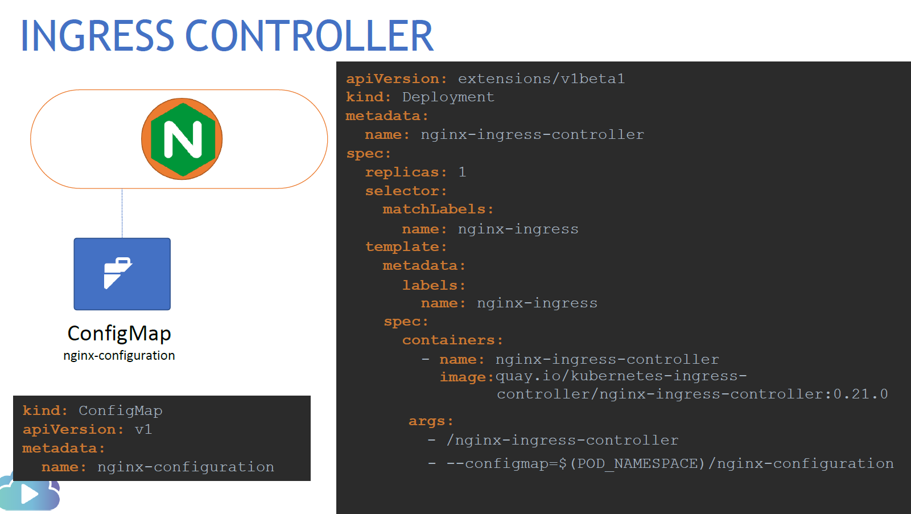
- here the args are defined as the within the image ngix controller is stored in /nginx-ingress-controller
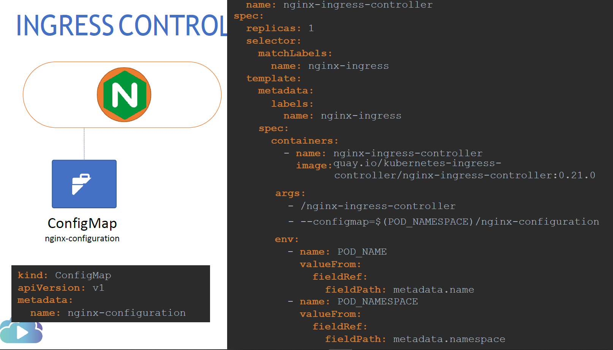
- We must also configure where to store erro logs, keep-alive and ssl-protocols for that we need a ConfigMap and store that in. ConfigMap at first can be empty but it must be added to make changes in the future and not worry about modifying the ngixn configuration files.
- We must also pass two environment variables that carry the pods name and namespace this is required to read the configuration data within the pod.
- Finally specify the ports used by the Ingress Controller (80 and 443)
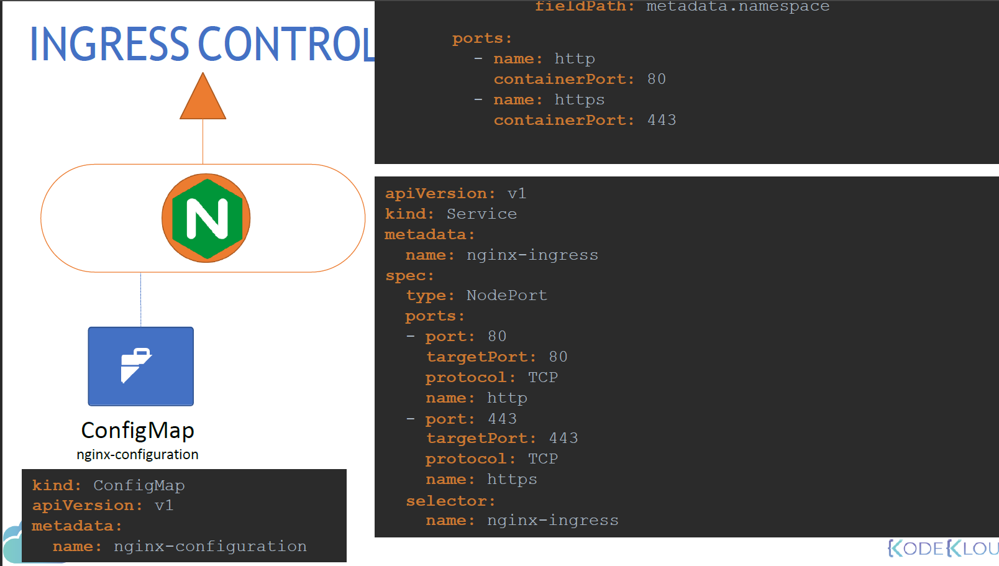
- We now create a service to expose the  ingress controller we create a service of type NodePort.
- Ingress have additional intelligence built in to monitor the K8S cluster for ingress resources and configure the ingress services accordingly.
- To do that we need and service account with relavant roles and auth.
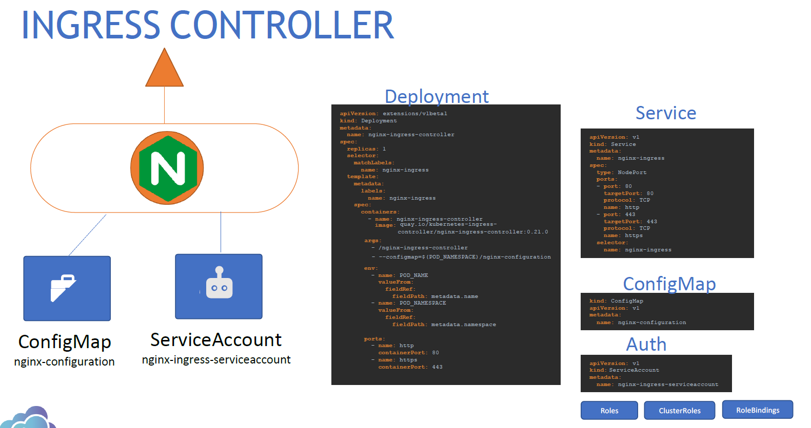

**Ingress Resources Creation**
- Its a set of rules configured on Ingress Controller. Such as Path based routing etc.,..
- We could route users based on Domain name as well.
- Its created with a k8s definition file.
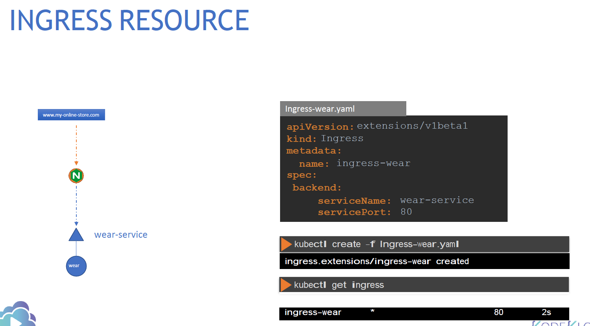
- Once the above is done the new ingress if created and route the traffic to webserver service that we are using.
- We can set rules depending upon the kind of traffic or Domain name. Within the rules we can define paths which can be routed to particular pods.
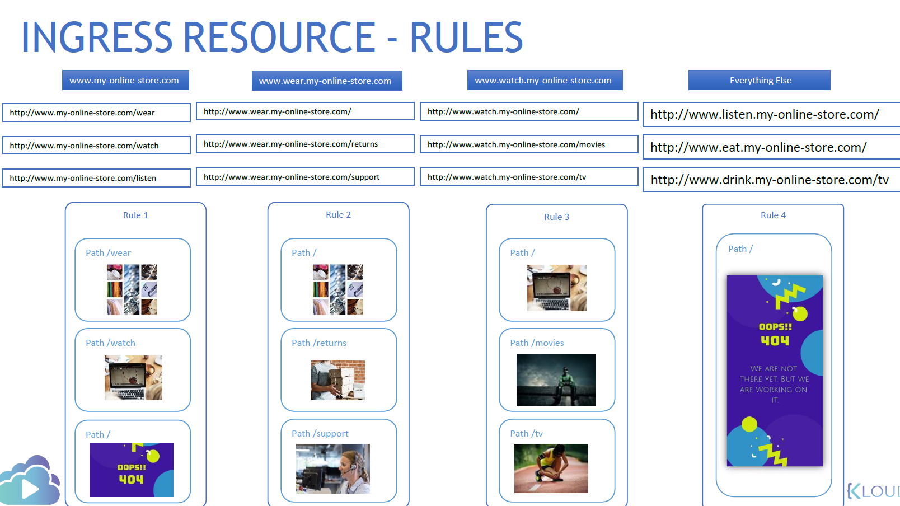

**Configuring Ingress Resources**
- We start by creating a similar definition file, nut now under spec we start with rules.

- We then configure the paths, paths is an array of multiple items. one path for each URL then we move the backend specified in the earlier Ingres file.
- kubectl describe ingress ingress-wear-watch
- There is something called default backend , when users hits a URL that isnt configured we migth want to show a nice message for them for that we need to default backend service.
- We also have can configure using the different domain names as well.
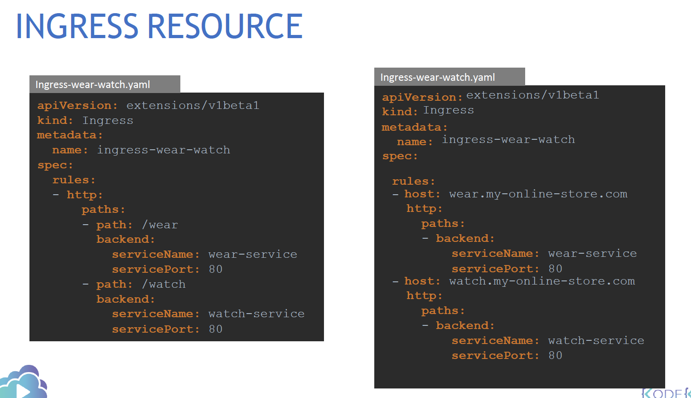

## 9.0 Troubleshooting:

### 9.1 Application Failures:

- Consider a 3 tier application, check if the web app and app server is accessible.
- If the CURL to web app fails to connect. Check the web app service and make sure the pod and web app service labels and selectors match.
- Check the web pod and make sure its running. Check the events related to pod using descirbe , also check the number of restart(if its restarting frequently its an issue)
- Check the logs why its restarting (kubectl get logs web -f ) or previous pod (kubectl get logs web -f --previous)
- Check the status of the APP service and DB serivce as before , also pods as well.

### 9.2 Control Plane Failure:

- Check the status of nodes.
- Check the status of control plane pods. (kubectl get pods -n kube-system)
- Check the control plane components are deployed as services check the status of the services. (service kube-apiserver status)
- Check the logs of controlplane compnents (kubectl logs kube-apisever -n kube-system)  (sudo journalctl -u kube-apiserver, if deployed as services)

### 9.3 Worker Node Failures:
-  Check the nodes status (ready or not) , then descirbe why its not ready , check for the status why there is an issue.
- if the status is unknown , check the last heart beat time when the node might have crashed. 
- check the top, df -h, status of the kubelet(service kubelet status, sudo journalctl -u kubelet)
- check the kubelet certs they are not expired and part of right group and right CN.

### 9.4 Networking:

```
Network Troubleshooting
Network Plugin in kubernetes
--------------------

Kubernetes uses CNI plugins to setup network. The kubelet is responsible for executing plugins as we mention the following parameters in kubelet configuration.

- cni-bin-dir:   Kubelet probes this directory for plugins on startup

- network-plugin: The network plugin to use from cni-bin-dir. It must match the name reported by a plugin probed from the plugin directory.


There are several plugins available and these are some.


1. Weave Net:


  These is the only plugin mentioned in the kubernetes documentation. To install,

kubectl apply -f "https://cloud.weave.works/k8s/net?k8s-version=$(kubectl version | base64 | tr -d '\n')"


You can find this in following documentation :

                  https://kubernetes.io/docs/setup/production-environment/tools/kubeadm/high-availability/


2. Flannel :


   To install,

  kubectl apply -f               https://raw.githubusercontent.com/coreos/flannel/2140ac876ef134e0ed5af15c65e414cf26827915/Documentation/kube-flannel.yml

   

Note: As of now flannel does not support kubernetes network policies.


3. Calico :

   

   To install,

   curl https://docs.projectcalico.org/manifests/calico.yaml -O

  Apply the manifest using the following command.

      kubectl apply -f calico.yaml

   Calico is said to have most advanced cni network plugin.


In CKA and CKAD exam, you won't be asked to install the cni plugin. But if asked you will be provided with the exact url to install it. If not, you can install weave net from the documentation 

      https://kubernetes.io/docs/setup/production-environment/tools/kubeadm/high-availability/


Note: If there are multiple CNI configuration files in the directory, the kubelet uses the configuration file that comes first by name in lexicographic order.


DNS in Kubernetes
-----------------
Kubernetes uses CoreDNS. CoreDNS is a flexible, extensible DNS server that can serve as the Kubernetes cluster DNS.


Memory and Pods

In large scale Kubernetes clusters, CoreDNS's memory usage is predominantly affected by the number of Pods and Services in the cluster. Other factors include the size of the filled DNS answer cache, and the rate of queries received (QPS) per CoreDNS instance.


Kubernetes resources for coreDNS are:   

a service account named coredns,

cluster-roles named coredns and kube-dns

clusterrolebindings named coredns and kube-dns, 

a deployment named coredns,

a configmap named coredns and a

service named kube-dns.


While analyzing the coreDNS deployment you can see that the the Corefile plugin consists of important configuration which is defined as a configmap.


Port 53 is used for for DNS resolution.


    kubernetes cluster.local in-addr.arpa ip6.arpa {
       pods insecure
       fallthrough in-addr.arpa ip6.arpa
       ttl 30
    }


This is the backend to k8s for cluster.local and reverse domains.


proxy . /etc/resolv.conf


Forward out of cluster domains directly to right authoritative DNS server.


Troubleshooting issues related to coreDNS
1. If you find CoreDNS pods in pending state first check network plugin is installed.

2. coredns pods have CrashLoopBackOff or Error state

If you have nodes that are running SELinux with an older version of Docker you might experience a scenario where the coredns pods are not starting. To solve that you can try one of the following options:

a)Upgrade to a newer version of Docker.

b)Disable SELinux.

c)Modify the coredns deployment to set allowPrivilegeEscalation to true:


kubectl -n kube-system get deployment coredns -o yaml | \
  sed 's/allowPrivilegeEscalation: false/allowPrivilegeEscalation: true/g' | \
  kubectl apply -f -
d)Another cause for CoreDNS to have CrashLoopBackOff is when a CoreDNS Pod deployed in Kubernetes detects a loop.


  There are many ways to work around this issue, some are listed here:


Add the following to your kubelet config yaml: resolvConf: <path-to-your-real-resolv-conf-file> This flag tells kubelet to pass an alternate resolv.conf to Pods. For systems using systemd-resolved, /run/systemd/resolve/resolv.conf is typically the location of the "real" resolv.conf, although this can be different depending on your distribution.

Disable the local DNS cache on host nodes, and restore /etc/resolv.conf to the original.

A quick fix is to edit your Corefile, replacing forward . /etc/resolv.conf with the IP address of your upstream DNS, for example forward . 8.8.8.8. But this only fixes the issue for CoreDNS, kubelet will continue to forward the invalid resolv.conf to all default dnsPolicy Pods, leaving them unable to resolve DNS.


3. If CoreDNS pods and the kube-dns service is working fine, check the kube-dns service has valid endpoints.

              kubectl -n kube-system get ep kube-dns

If there are no endpoints for the service, inspect the service and make sure it uses the correct selectors and ports.


Kube-Proxy
---------
kube-proxy is a network proxy that runs on each node in the cluster. kube-proxy maintains network rules on nodes. These network rules allow network communication to the Pods from network sessions inside or outside of the cluster.


In a cluster configured with kubeadm, you can find kube-proxy as a daemonset.


kubeproxy is responsible for watching services and endpoint associated with each service. When the client is going to connect to the service using the virtual IP the kubeproxy is responsible for sending traffic to actual pods.


If you run a kubectl describe ds kube-proxy -n kube-system you can see that the kube-proxy binary runs with following command inside the kube-proxy container.


    Command:
      /usr/local/bin/kube-proxy
      --config=/var/lib/kube-proxy/config.conf
      --hostname-override=$(NODE_NAME)
 

    So it fetches the configuration from a configuration file ie, /var/lib/kube-proxy/config.conf and we can override the hostname with the node name of at which the pod is running.

 

  In the config file we define the clusterCIDR, kubeproxy mode, ipvs, iptables, bindaddress, kube-config etc.

 

Troubleshooting issues related to kube-proxy
1. Check kube-proxy pod in the kube-system namespace is running.

2. Check kube-proxy logs.

3. Check configmap is correctly defined and the config file for running kube-proxy binary is correct.

4. kube-config is defined in the config map.

5. check kube-proxy is running inside the container

# netstat -plan | grep kube-proxy
tcp        0      0 0.0.0.0:30081           0.0.0.0:*               LISTEN      1/kube-proxy
tcp        0      0 127.0.0.1:10249         0.0.0.0:*               LISTEN      1/kube-proxy
tcp        0      0 172.17.0.12:33706       172.17.0.12:6443        ESTABLISHED 1/kube-proxy
tcp6       0      0 :::10256                :::*                    LISTEN      1/kube-proxy


```

- References:

- Debug Service issues:

                     https://kubernetes.io/docs/tasks/debug-application-cluster/debug-service/

- DNS Troubleshooting:

                     https://kubernetes.io/docs/tasks/administer-cluster/dns-debugging-resolution/


## 10.0 Installation of K8S:

- First before designinig a K8S cluster we need to ASK for the requirements.
- Main Objectives:
   1. Node Considerations
   2. Resource Considerations
   3. Network Considerations.
- To know the objectives we need to ask for the relavant list of questions like below.
   1. Purpose ?
      - Education  (Minikube, Single node Cluster with kubeadm/GCP/AWS for our learning purposes)
      - Development & Testing ( Multi node clusters with GCP/AWS/Kubeadm with single master & mutiple workers)
      - Hosting Prod Applications.  
            - Multi node cluster with more than one master node and multiple worker nodes.
            - kubeadm/GCP/AWS/AKS
            - Limit is 5000 nodes : 150,000 PODS : 300,000 containers and upto 100 PODs per node. Depending upon the number of nodes AWS/GCP if we use self managed  worker nodes or cloud manged nodes.
            - Kops is nice tool to depoy on AWS. On-Prem use kubeadm. 
   2. Cloud or On-Prem
      -  On-Prem/AWS/AKS/GKE.
      - On local Linux machine we can setup cluster by downlaading the binaries and running them , its very hard this approach.
      - We can use tools like kubeadm /minikube
   3. Workloads?
      - How Many?
      - What kind?
         - web
         - Big Data/AI/ML
      - Application Resource Req
         - CPU Intensive
         - Memory Intensive
      - Traffic
         - Heavy Traffic
         - Burst Traffic
- once we get to know the answers, we can decide on the type of resources we can configure.
   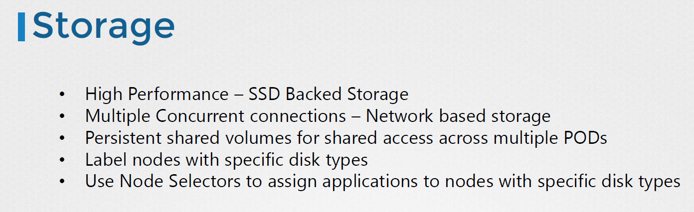
   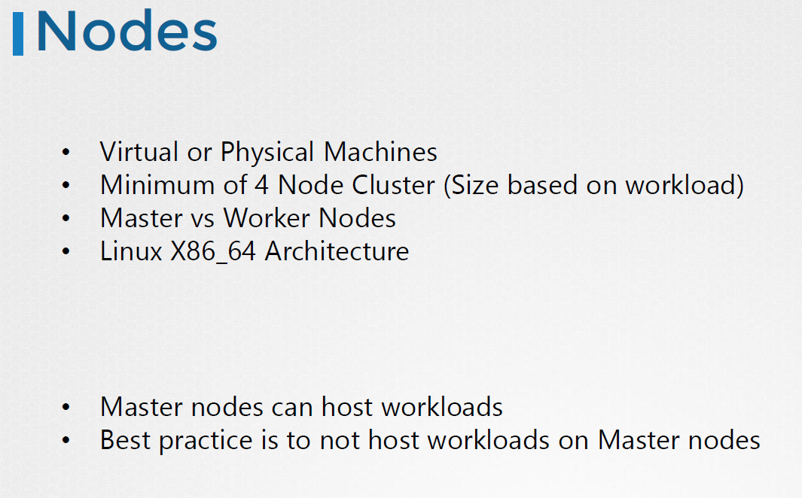
   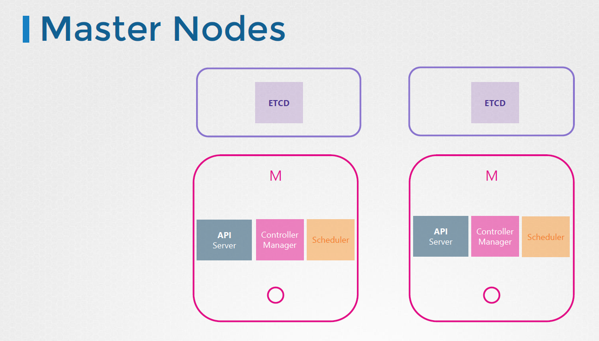

- **High Availablity:** 
   - Mutiple masters to avoid single point of failure, Cloud providers take care of these ofor us.
   - When we have mutiple masters its better to use LB to split the traffci to the Kube-apiserver.
   - Controller and Schduler is mantained using active and standby ones. This is done using the leader elect process, its same for scheduler.
   - ETCD we maintain couple of servers for ETCD, one active and other standby. we can maintain them inside the master node or seperately. Kube-apiserver is the only one talking to the ETCD.
   - ETCD runs on port 2379.  We write to any instance and replicated on other ETCD server. The read can be one using the anyone of them.


## 11.0 YAML and JSON Path:

### YAML:

- All anisble playbooks and K8S manifest files are written in YAML.
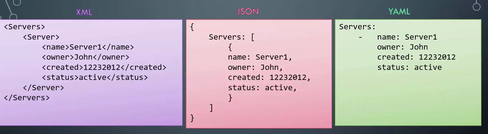
- Key/Value pairs are seperated by colon.
- Arrays are represented by - in front.
- Dictonary are grouped together under an item.
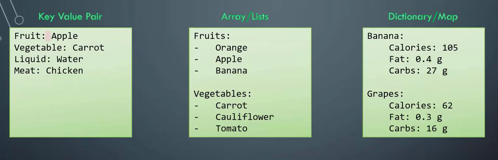
- Make sure we have equal number of blank spaces across.

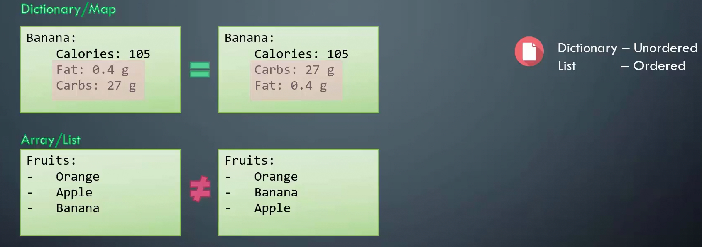

### JSON:

- JSON and YAML represent same data. JSON uses {} , whereas YAML uses intendation.
- YAML we use - to represent a list, in JSON we use the [] , seperated by comma.
- All programming languages have support for reading both the types.
**JSON PATH**: (Json query language)
   - Similar to SQL we can query and fetch the data. Its a query language.
   - JSON data always starts with { and ends with }  all the values are encapsulated within the dictionary, the top level dictionary is known as root element denoted by $
   - JSON path results are encapsulated within a array, when u run a query the output comes within the []
    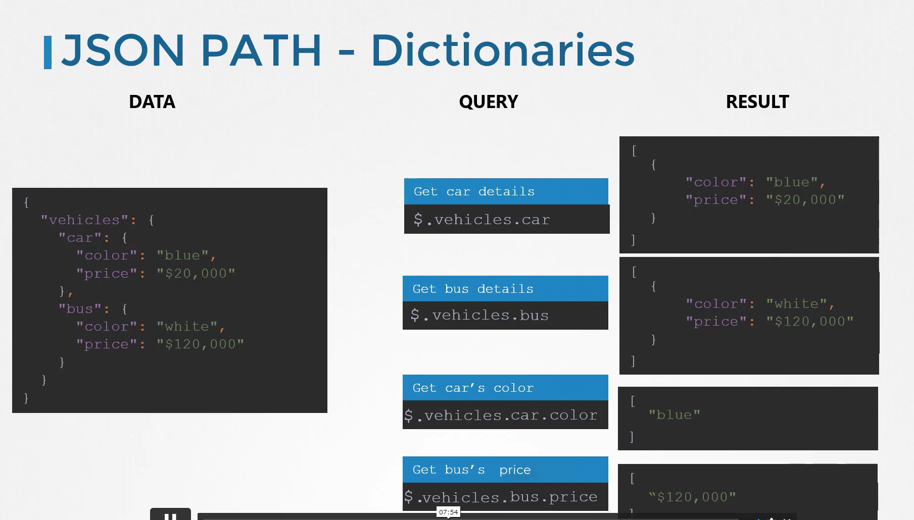
   - JSON PATH query for lists is a bit different, its fetched using the [0] the number varies as per the element you want to fetch in the list. (check the below image) Here the root element is denoted by $ as well if the entire JSON is encapsulated within a list.
    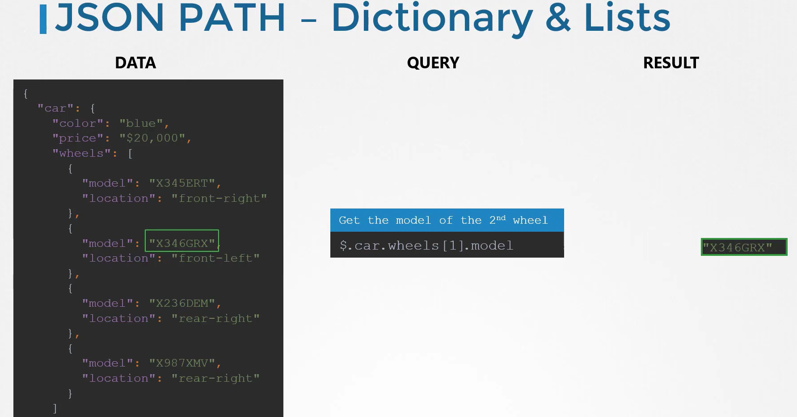  
   - Consider we have a list numbers , what if I want a list of numbers greater than 40. Check below.
   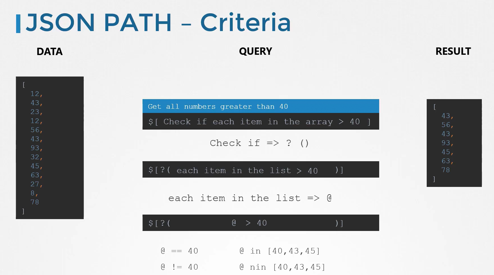
   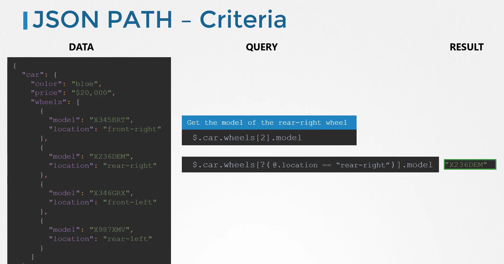

**JSON PATH (Wild Cards)**:
   - Refer the image below. In a dict we have car and bus , how do we retrieve all the colors present in these dict.
   - We can replace car or bus with any * is the wild card that we need to replace
    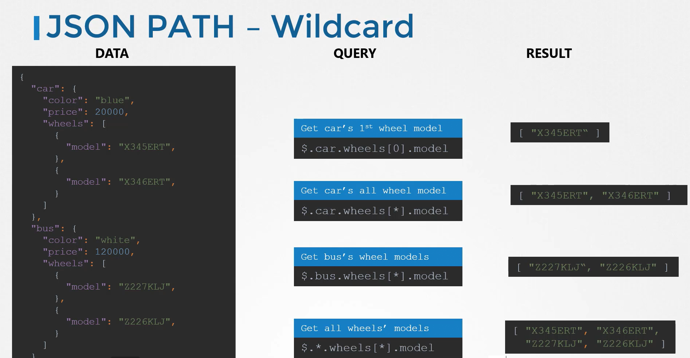

**JSON PATH (Lists)**:
   - How to fetch items in the list , this is similar to indexing in the python programming language.
     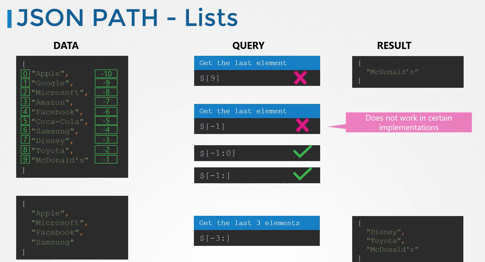


## ?.0 JSON PATH in K8S:

- When working on production grade k8s, we will have 100 of nodes and 1000 of pods, deployments and replicasets. 
- We often have requirements to query data of specific feilds and criteria amongst these pods is an overwhemling tasks.
- kubectl supports a JSON path option that makes filtering data across large data sets make it easy.
- Every time we use a kubectl command it sends the request to the kube-apiserver and the server send the information in JSON format
- The information that the kubectl shows is often less so that it is easily readable, we can read additional infromation using "-o wide" option.
- Suppose if I want information about the node and number of CPU they use? none of the kubectl commands provide me with that information. That is where JSON is useful.
- The below steps is required to be followed to get the ouput:
   1. Identify the kubectl command (ex: kubectl get pod)
   2. Familarize with the JSON format (ex: kubectl get pdod -o json)
   3. Form the JSON path query (ex: .items[0].spec.containers[0].image) Note: here $ isnt mandatory for the root as the K8S adds it automatically.
   4. use the JSON PATH query with the kubectl command. (ex: kubectl get pod -o=jsonpath='{.items[0].spec.containers[0].image}')

   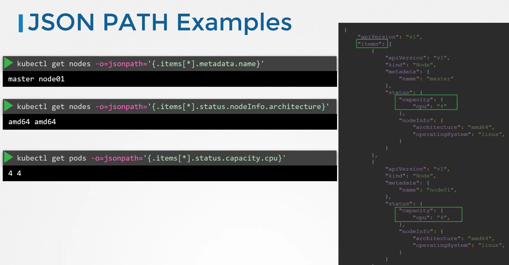
- We can also merge the jsonpath logic to get both the outputs and we can use loops to get the output in the desired format.
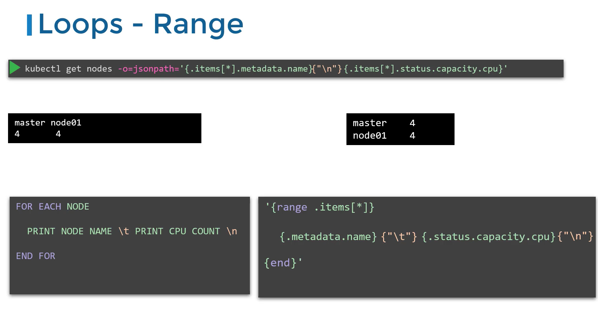
- Merge the above image logic into a single line to get the output.
- There is an another approach as well we can use the custom coloumns option as well.  (ex: kubectl get nodes -o=custom-coloumns=<coloumn name>:<JSON PATH>)
- In the below example we dont use items in the customs-coloumns as it automatically considers the all the items in the dictonary so no need to mention that. Cehck below image
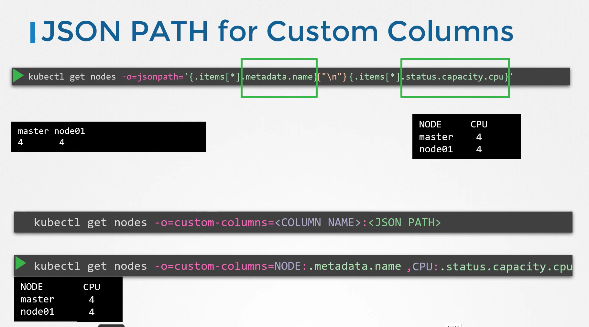
- We can sort the kubectl using the --sort-by command (kubectl get node --sort-by=.metdata.name)

```
To get the restart count of the redis-container  as we dont know the order every time.
$.status.containerStatuses[?(@.name == 'redis-container')].restartCount

{
  "apiVersion": "v1",
  "kind": "Pod",
  "metadata": {
    "name": "nginx-pod",
    "namespace": "default"
  },
  "spec": {
    "containers": [
      {
        "image": "nginx:alpine",
        "name": "nginx"
      },
      {
        "image": "redis:alpine",
        "name": "redis-container"
      }
    ],
    "nodeName": "node01"
  },
  "status": {
    "conditions": [
      {
        "lastProbeTime": null,
        "lastTransitionTime": "2019-06-13T05:34:09Z",
        "status": "True",
        "type": "Initialized"
      },
      {
        "lastProbeTime": null,
        "lastTransitionTime": "2019-06-13T05:34:09Z",
        "status": "True",
        "type": "PodScheduled"
      }
    ],
    "containerStatuses": [
      {
        "image": "nginx:alpine",
        "name": "nginx",
        "ready": false,
        "restartCount": 4,
        "state": {
          "waiting": {
            "reason": "ContainerCreating"
          }
        }
      },
      {
        "image": "redis:alpine",
        "name": "redis-container",
        "ready": false,
        "restartCount": 2,
        "state": {
          "waiting": {
            "reason": "ContainerCreating"
          }
        }
      }


```

## 
