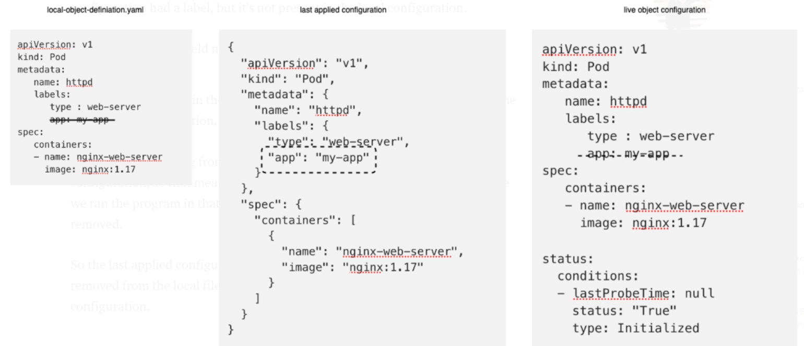

# KUBECTL COMMANDS:

- kubectl run nginx --image nginx
  (Deploys a docker container nginx but where does it get the image from hence we need to specify the image name. By default it gets from docker hub.)
- kubectl run nginx --image=nginx --dry-run=client -o yaml
  (Generate POD Manifest YAML file (-o yaml). Don't create it(--dry-run))
- kubectl create -f pod-definition.yml 
  (creates a sample yml file for the pod creation)
- kubectl get pods
  (gets the information about the list of current running pods)
- kubectl get pods -o wide 
  (gives additional information like IP and node on which pods are running)
- kubectl describe pod {pod_name}
  (describes the infirmation relavant to that pod.)
- kubectl apply -f pod.yml
  (applies the pod.yml definition)
- kubectl edit pod nginx
  (Helps edit the current running pod details)
- kubectl replace -f replicaset-def.yml
  (replace the replicaset-def.yml file with new one)
- kubectl scale --replicas=6 -f replicaset-def.yml
  (scale the current replicaset with more replicas directly via command line)
- kubectl get deploymens 
  (lists all the deployments that are created)
- kubectl get all
  (lists all the pods, replicasets and deployments.)
- kubectl create deployment --image=nginx nginx
  (Create a deployment)
- kubectl create deployment --image=nginx nginx --dry-run=client -o yaml
  (Generate Deployment YAML file (-o yaml). Don't create it(--dry-run))
- kubectl create deployment --image=nginx --replicas=4 nginx --dry-run=client -o yaml > nginx-deployment.yaml
  (Generate Deployment YAML file (-o yaml). Don't create it(--dry-run) with 4 Replicas (--replicas=4))
  Note: Save it to a file, make necessary changes to the file (for example, adding more replicas) and then create the deployment.
  kubectl create -f nginx-deployment.yaml
- kubectl get pods -n default
  (get pods corresponding to default namespace)
- kubectl create -f pod-definitio.yml --namespace=dev
  (creats the pod in dev namespace instead of default)
- kubectl config set-context $(kubectl config current-context) --namespace=dev
  (change the default namespace)
- kubectl get pods --all-namespaces
- kubectl get services
- kubectl get pods --selector environment=production,tier=frontend 
  (select pods using lables and selectors)
- kubectl apply -f yml_defnition.yml (declarative approach)
- kubectl set image deployment-name nginx=nignx:1.4
  (this changes the image name of the deployment , without making updates to the deploymeny yaml file)

- kubectl taint nodes node-name key=value:taint-effect
  (taint the nodes with the effect in key value format; taint-effect has three options Noschedule| PreferNoSchedule | NoExecute)


- kubectl label nodes node01 size=Large (label that particular node to size large so that we can use this in the nodeSelector in the pod yaml file to assign pod to this node)  

- kubectl rollout status deployment/myapp-deployment
  (rollout status)
- kubectl rollout history deployment-name
  (history of rollouts done)
- kubectl rollout undo deployment-name
  (undo a deployment and rollback to the previous version)

- kube-controller-manager --pod-eviction-timeout=5m0s
  (pod eviction timeout setting)
- kubectl drain node-1
  (drain pod of the nodes)
- kubectl cordon node-01
  (make the node unschedulable)
- kubectl uncordon node-01
  (make the node schedulable from unschdulable)


```
Certification Tips - Imperative Commands with Kubectl
While you would be working mostly the declarative way - using definition files, imperative commands can help in getting one time tasks done quickly, as well as generate a definition template easily. This would help save considerable amount of time during your exams.

Before we begin, familiarize with the two options that can come in handy while working with the below commands:

--dry-run: By default as soon as the command is run, the resource will be created. If you simply want to test your command , use the --dry-run=client option. This will not create the resource, instead, tell you whether the resource can be created and if your command is right.

-o yaml: This will output the resource definition in YAML format on screen.


Use the above two in combination to generate a resource definition file quickly, that you can then modify and create resources as required, instead of creating the files from scratch.


POD
Create an NGINX Pod

kubectl run nginx --image=nginx


Generate POD Manifest YAML file (-o yaml). Don't create it(--dry-run)

kubectl run nginx --image=nginx --dry-run=client -o yaml


Deployment
Create a deployment

kubectl create deployment --image=nginx nginx


Generate Deployment YAML file (-o yaml). Don't create it(--dry-run)

kubectl create deployment --image=nginx nginx --dry-run=client -o yaml


Generate Deployment with 4 Replicas

kubectl create deployment nginx --image=nginx --replicas=4


You can also scale a deployment using the kubectl scale command.

kubectl scale deployment nginx --replicas=4

Another way to do this is to save the YAML definition to a file and modify

kubectl create deployment nginx --image=nginx --dry-run=client -o yaml > nginx-deployment.yaml


You can then update the YAML file with the replicas or any other field before creating the deployment.


Service
Create a Service named redis-service of type ClusterIP to expose pod redis on port 6379

kubectl expose pod redis --port=6379 --name redis-service --dry-run=client -o yaml

(This will automatically use the pod's labels as selectors)

Or

kubectl create service clusterip redis --tcp=6379:6379 --dry-run=client -o yaml (This will not use the pods labels as selectors, instead it will assume selectors as app=redis. You cannot pass in selectors as an option. So it does not work very well if your pod has a different label set. So generate the file and modify the selectors before creating the service)


Create a Service named nginx of type NodePort to expose pod nginx's port 80 on port 30080 on the nodes:

kubectl expose pod nginx --type=NodePort --port=80 --name=nginx-service --dry-run=client -o yaml

(This will automatically use the pod's labels as selectors, but you cannot specify the node port. You have to generate a definition file and then add the node port in manually before creating the service with the pod.)

Or

kubectl create service nodeport nginx --tcp=80:80 --node-port=30080 --dry-run=client -o yaml

(This will not use the pods labels as selectors)

Both the above commands have their own challenges. While one of it cannot accept a selector the other cannot accept a node port. I would recommend going with the kubectl expose command. If you need to specify a node port, generate a definition file using the same command and manually input the nodeport before creating the service.

Reference:
https://kubernetes.io/docs/reference/generated/kubectl/kubectl-commands

https://kubernetes.io/docs/reference/kubectl/conventions/

```


```
Declarative Apporach how it works:

when you run the kubectl apply command if the object doesnt exsist object is created.
when the object is created similar configuration is stored in k8s memory called Live object configuration where it contains details of object yaml along with the extra params checking the status.

Also on top of this when you apply the kubectl apply command , k8s also converts the file to json format and stored as last applied configuration.
Going forward when change is made the three files are compared and updated.


```



# K8S YAML:

- Each and every yaml file within the k8s always contains 4 top level feilds.
  apiVersion:
  kind:
  metadata:
  spec:
- Depending upon the kind, apiVersion is defined. these are just **strings**
  ex: Pod  -> v1
      Service -> v1
      ReplicaSet -> apps/v1
      Deployment -> apps/v1
- Metadata is the data about the object. Its in the form of a **dictionary**. 
  we can have any number of lables for a given object.
  Ex: metadata:
        name: myapp-prod
        lables: 
          app: myapp
          version: v1
          type: frontend
- spec is where we give the container information. these are in the form of **list/array**
  Ex: spec:
        containers:
          - name: nginx-frontend   (here the "-" represents the first element in the list, as we can mention mutiple images and mutiple container will be spun up with in the POD)
            image: nginx
          - name: busybox
            image: busybox    

## Pod:

- Pod is the smallest unit within a k8s cluster inside which one or more containers can run.
- refer to the pod_example.yml on how to spin up a container using the pod based yaml.
        
## ReplicaSet:

- replicaset is kind inside yaml when specified min and max ranges.
- the min number of pods will be avaiable at all the time. when the traffic increases it may go up to the max number mentioned.
- helps in HA and distributes traffic across mutiple pods.
- Refer replicaset_example.yml for yaml file.
- Here we see that under the template section we place the definition of pod. However, all the pods with relavant selectors like name are placed under this replicaset.
- One might get a doubt whats the use of mentioning if replica set matches the pod using lables and selector. consider a secnario where one pod dies , so that replica set should know what pod and container needs to be spun up hence the template definition is mandatory.
- In order to increase the number of replicas  just edit the yml file with increased number of replicas number and run - kubectl replace -f replicaset-definition.yml

## Deployments: 

- When we want to upgrade our cotainer image from v1 to v2 , we want to upgrade the same seamlessly.
- however, we dont one to upgrade allo of them at once, so that users might face some issues.
- we need to implement a strategy to update one by one using rolling updates.
- All of these capabilites are done using k8s deployments.
- Deployments yaml is same a replicaset instead use the kind as Deployment.


**Deployments > ReplicaSets > Pod**


## Services :

- the service and mutiple pods under it are matched using the lables and selectors. check them in the yaml files.
- the service by the nature itself distributed across multiple nodes.
  - ClusterIP
  - Nodeport 
  - LoadBalancer
