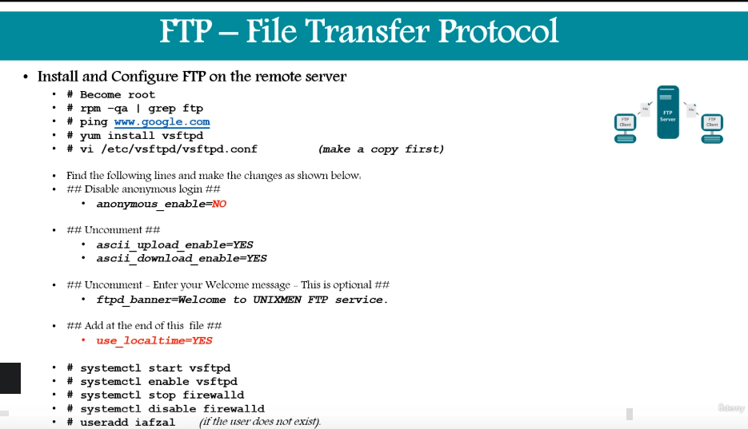
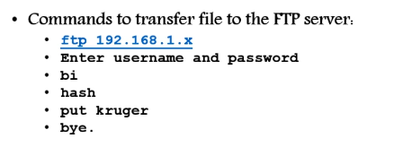
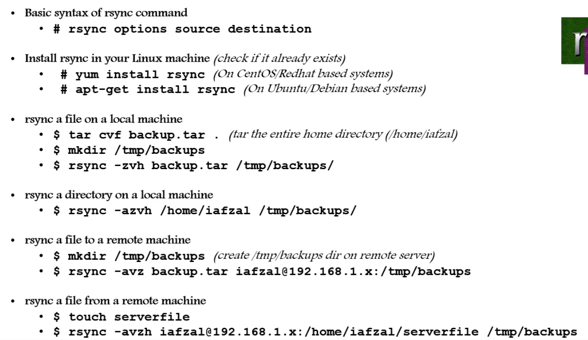
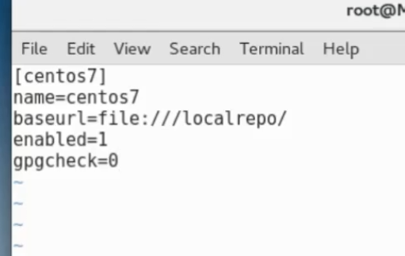
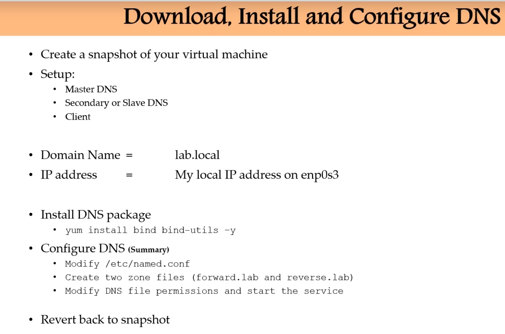
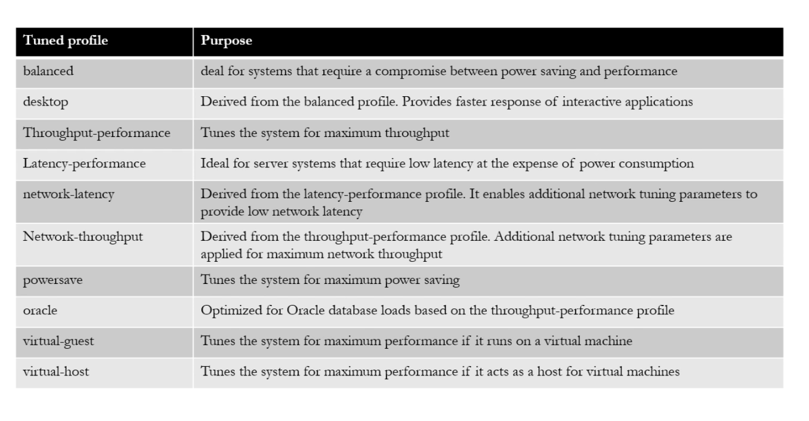

# Networking in Linux

## Network Components:

- IP
- subnet
- gateway (through which we can route the traffic to internet, router in home)
- static vs DHCP (static: IP address doesnt change when rebooted. DHCP: IP address change when rebooted and choosen from host of IP in our subnet)
- Interface ( where we connect our ethernet cable)
- Interface MAC (each and every device has a unique 16 digit MAC address)
- NIC (network interface card to which our ethernet cable is connected)

## Network Files and Commands:

- Interface  detection where we plug in the ethernet cable..
- Assigning an IP address.
- Interface configuration files.
    - /etc/resolv.conf: Lists nameservers that are used by your host for DNS resolution. If you are using DHCP, this file is automatically populated with DNS record issued by DHCP server.
    - /etc/hosts/: It is just a static lookup method for resolution. for the local system.
    - /etc/nsswitch.conf: It defined order of resolution. Who should it consult first for resolution, a DNS or a host file? For example, if the file has following configuration hosts: files dns then /etc/hosts file will be checked first for resolution, if domain is still un-resolvable, DNS will then be consulted(this is declared in the /etc/resolv.conf) the gateway to the DNS server. We can also declare spcific hosts and IP address here as well.
    - MORE ON THIS: https://www.xmodulo.com/etc-hosts-vs-etc-resolvconf.html

- **Network Commands**:
    - PING: to check whether we are recieving any traffic from a server.
    - ifconfig: to check our local network interface are.
    - ifup or ifdown: to bring or down the local netowrk interface.
    - netstat: it gives the information about the gateway how traffic is flowing which interface its using etc.,. **netstat -rnv** gives info in a tabular format.
    - tcpdump: it lists all the traffic coming and going out from the system. **tcpdump -i etho** here eth0 is the network interface where the traffic is flowing.

## NIC(Network Interface Card)**:
 - Its where the ethernet cable is connected to the system. thats where the NIC card is. the port where you insert the ethernet cable is called NIC port.
    - How to see the NIC configured in the system. Use the command **ifconfig** generally eth0 is the NIC card.
    - there are others as well like the **lo** which is the loopback device which is a special interface that your computer uses to communiate with itself. it is mainly used to run dagnostics and troublshooting, and to connect to the servers running on the local machine.
    - there might be others like virb0 o "virtual bridge 0" interface is used for NAT(Network Address Translation). Virtual env use it to connect to the outisde network.
    - command: **ethtool th0** to check on the information about interface speed whether it is up or not etc.,.. ex: if the link detected is no theres something wrong with the network card.

## NIC Bonding:
 - Network Bonding is combination of multiple NIC into single interface. this is called NIC aggregation.
    - Its main purpose is to provide HA and redundancy.
    - NIC BONDING PROCEDURE:

## New Netowrk Utilites:
- Network Manager is a service that provides set of tools designed specifically to manage the network configuation on Linux systems and is the default netowrk mgmt service.
- it makes network mgmt easier. it uses tools such as GUI, nmtui and nmcli
- **Network Configuration Methods**:
    - nmcli: short for network manager command line interface. the tool is useful when graphical env is not available.
    - nmtui: short for network manager text user interface. this tool can be run within any terminal window and allows changes to be made by making menu selections and entering data.
    - nm-connection-editor: A full graphical management tool providing access to most of the network manager configurations options.
    - GNOME settings: the network screen of the GNOME desktop settings application allow basic management tasks to be performed.

## Downloading Files or Apps:

- **wget** - its the command used to download the files or apps. Ex: wget https://google.com/filename
- If the app is not present in the yum repo we need to go to the web and copy the link location and do a wget to download the file.
- unzip the downloaded file and use the app.

## Curl & Ping commands:

- Suppose someone says the particular site is not reachable, first thing we try and communicate ourself and check.
- commands to do that is ping and curl commands.
- **curl**: to check if we can get to the specific site is up if yes we recieve an output of some random html content of that page. ex: curl https://www.google.com or to download a file using curl use(curl -O https://www.google.com/filename)
- **ping**: to see if the server is up or not by pinging the relavant IP addresss. ex: ip 192.48.2.1

## FTP (File Transfer Protocol):

- its a standard protocol used to transfer file between client and a server on a computer network.
- Default FTP port = 21
- Install and configure FTP on the ours and clients server. Allow traffic on port 21 (disbale firewall if facing issues).

- Use the below commands to tranfer the file to the client server once we establish a connection using the FTP server.

## SCP (secure copy):

-  Instead of FTP generally SCP is used to tranfer the files as it is more secure.
- Default SCP port : 22
- Command: **scp filename username@ip_address_of_remote_server:/home/username** later enter the  username and password for authentication.
- Ex: scp test.txt sai@192.168.1.2:/home/sai OR scp kale@192.168.3.4:/home/kale/test.txt  sai@192.168.1.2:/home/sai (in this mode we need enter the username and password for both the current and client server)

## rsync (remote synchronization):

- rsync is is a utility for efficiently transferring and synchronizing files within the same computer or o remote computer by comparing the file sizes and modification times.
- its mostly used for backup  of the files.
- rsync most useful part is incremental copy so it does not repeat already the exsisting copy of the files in the destination.
- refer the below commands for rsync.

## System Updates & repos :

- yum (centos) and apt-get (other distros)

## System Upgrade and patch mgmt:

- There are two type of upgrades:
    1. major system upgrade: 5,6,7
    2. Minor system upgrade: 7,7.2,7.7
- yum update -y (general minor updates every month or so)
- Dont upgrade. (upgrade deletes old pkgs and install new ones whereas update preserves the old ones as it is.)

## Create local yum repo:

- everytime you use yum it goes out to the web for those particular apps.
- instead for security we can create local repo where it will look into it rather directly reaching out to web
- mount the device where you have all the local repos stored.
- copy all the stuff to the /localrepo folder or (point that to the mounted device other cases)
- Which files in the linux that tells it looks for apps or files while using yum.
    - they are placed in /etc/yum.repos.d/
    - remove all the files there or take a backup of them and add the new file where you where to look for the  pkgs. (local.repo)

- once done run - command: **createrepo /localrepo/**
- later remove the cache from the yum repo /var/cache/yum using  yum clean all and check the repos yum repolist all.
- try and install new  kg from the repo and verify whether its working or not.

## Advance pkg mgmt:

- rpm is used when a pkg is already downloaded in the repo (mostly where the internet is disabled)
- command : yum install ntp -y
- to check if the pkg already installed in the local machine. command: rpm -qa | grep http*
- to remove existing pkg command: rpm -e pkg_name
- to install a downloaded rpm pkg. command: rpm -ihv /tmp/package.rpm
- we can also used yum command to remove a pkg. (yum remove pkg_name)
- to know more information about the pkg ( rpm -qi pkg_name)
- to know the location for the configuration file of the pkg ( rpm -qc pkg_name
- which sh give the output /usr/bin/sh the full path of the sh 
- now we can use the (rpm -qf /usr/bin/sh) to which pkg it belongs to

## Rollback pkgs and updates:

- yum history (gives the history of pkgs installed)
- yum history undo ID (select the relvant ID and do an undo)
- Note: take a snapshot of the virtual machine before you undo something.

## SSH & telnet:

- Telnet is not secure, not used anymore
- SSH is more secure. We can connect to the client server using the SSH on port 22.
- the process that listens for the traffic is sshd ( ps -ef | grep sshd)

## DNS (Domain Name Systems):

https://abegc.medium.com/system-design-interview-what-happens-when-you-type-a-url-example-google-com-f2294c1fbc43

- DNS & nameserver diff: https://medium.com/@sanjeevpandey18/dns-and-nameserver-5fe091da2522 

- Purpose? Hostname -> IP address.
    - Hostname -> IP address (A record)
    - IP to Hostname (PTR Record)
    - Hostname to Hostname (CNAME record)
- install the pkg called named (yum install bind bind-utils -y)
- start the service called named (systemctl start named)
- Files for DNS configuration on linux:
    - /etc/named.conf (conf for DNS)
    - /var/named (directory where we define records )
- process to create a DNS server.

## Hostname or Ip address lookup:

- commands used for DNS lookup
    - nslookup: they resolve hostname to ip, ip to ip , ip to hostname.
    - dig: similar in functionality but gives more information.

## NTP & Chronyd:

- this is used for time synchronization.
- /etc/ntp.conf
- systemctl restart ntpd.
- command: ntpq
- port number: 123
- chronyd is newer version of ntp.
- /etc/chronyd.conf
- pkg name: chronyd
- log file: /var/log/chrony
- command: chronyc

##  Important Commands:

- **timedatectl**:  its a new utility for RHEL/centos8  , which comes as a part of systemd and service mgr. it everntually replcaes date command
    - you can use with utility with the chronyd or ntp. just make the ntp setting as yes.
    - command to list time zones: timedatectl list-timezones & timedatectl set-timezone "calcutta"& timedatectl set-time "YYYY-MM-DD" 
    - to sync with the chronyd.(timedaectl set-ntp true)

- **sendmail** : it a major service used to send and recieve emails etc.,..
    - Files: /etc/mail/sendmail.cf, /etc/mail/sendmail.mc, /etc/mail
    - service: systemctl restart sendmail
    - command: mail -s  "sub" sai@gmail.com

- **Webserver**: apache httpd is most used webserver other include niginx etc.,.
    - Files: Configuration - /etc/httpd/conf/httpd.conf, html files - /var/www/html/index.html
    - log file: /var/log/httpd
    - systemctl restart httpd

- **Central Logger(rsyslog)**: Generate logs and stores logs from all other servers.
    -    pkg name:  rsyslog
    - file: /etc/rsyslog.conf
    - systemctl enable rsyslog (to enable it to run on boot)
    - port: 514

- **OS Hardening (Linux Security)**: 
    - User Account : /etc/passwd file contains all the users within the system. Create a password rotation policy( chage -l sai). we can see that in /etc/shadow file as well
    - Remove un-wanted pkgs: rpm -qa  | wc -l (number of pkgs in system), remove unwanted pkgs (rpm -e pkg name)
    - stop un-used services: systemctl -a (gives all the active and inactive services)
    - Check on Listening ports: netstat -tunlp (gives all the ports open and listening)
    - Secure SSH config: /etc/ssh/sshd_config (make changes to the config to make system more secure), permitrootlogin no stuff etc.,..
    - Enable Firewall (iptables/firewalld) : we can what ports to allow, what Ip to whitelist etc.,.. (firewall-config) . similarly iptables
    - Enable SELinux(Security Enchanced Linux) : it defines the transistion rights of every user,application that is running on the system. commands: sestatus,/etc/sysconfig/selinux , stat filename(gives the info of the complete file)
    - change listening services port numbers. keep updating as per the red hat policies.

- **LDAP**:
    - Open LDAP service name: sldap
    - files: /etc/openldap/sldap.d
    - we can also ceck using (ps -ef | grep sldap)
    - got nsswitch.conf and enable ldap instead of files so that it refers to that file. it requires admin to open another server where we install this stuff.

- **traceroute**:
    - it is used to trace the map of the journey of the packet of information undertakes from its source to destination. one use of it is to locate when a data loss occurs thorugh a network which could signify a node thats down.
    - beacuse each hop in the record reflects a new server or router between the orginating PC and client , reviewing the results of a traceroute scan helps also lets you identify slow points that effect the network traffic
    - command: traceroute www.google.com

- **How to open image file via command line**:
    - dnf install GraphicsMagic 
    - display filename

- **Configure and Secure SSH**:
    - shell provides a interface to the linux system.  (hardware> kernel> shell (ksh, csh , bash > utilites))
    - port: 22
    - we can do following to make it more secure:
        - Ideal time out. (if you leave ideal it will time out). enable in /etc/ssh/sshd_config
        - Diable root login (Permitrootlogin NO)
        - Limit users SSH access (Allowuser user1 user2)
        - use a different port
        - SSH Keys - access remote server without password.

- **SSH Keys - access server without password**:
    - More secure than using password
    - we can generate keys at root level or user level
    - commands:
        - ssh-keygen
        - ssh-copy-id root@192.168.43.4 (copying public key to client server)
        - ssh username@ip-address 
        - keys are added to the client server at /username/.ssh 

- **Cockpit**: web interface devloped by redhat to interact.
    - yum install cockpit -y and start the service.
    - https://ipaddress:9090 and enter the root and password
    - disable firewall if not able to access.

- **FIREWALL**:
    - firewalld or iptables(older)
    - install and enable them.
    - to check iptable rules (iptables -L ) and to flush them (iptables -F)
    - similarly for firewalld (firewall-cmd --list-all) and services that firewalld is aware of(firewall-cmd --get-services)
    - Check pdf section for more information.

- **System Performance Tuning**:
    - tuned: tune is for sys tuning and d is daemon.
    - this comes pre-installed with the centos 7 and 8
    
    - command:  tuned-adm, to check which profile is active. (tuned-adm active) (tuned-adm list profiles) (tuned-adm profile profile-name) (tuned-adm recommended) (tuned-adm off)

    - Another way of keeping the system fine-tuned is by proritizing process through nice and renice command.
    - if a server has 1 CPU we can execute 1 process at a time as they come in and other has to wait.
    - with nice and renice we can give preference to certain  processes within the system.
    - the prority can be set at 40 diff levels
    - -19 being the highest and 20 being the lowest. by default process  inherit the priority from the parent which is usually 0.
    -  command : nice -n -15 processname (to set the priority of a  process)
    - (to change priorirty of alredy running process) renice -n 12 PID

- **Containers**:
    - install docker and run containers. we can check the images from the official docker hub and thier usage.

- **KickStart**: its an automated way to install the linux operating system on the hardware.
    - to use kickstart use a kcikstart server and edit the  kcikstart file.
    - most of them use ansible these days or packer in the organizations to automate these stuff. (create a image in packer and install the same on AWS as AMI etc.,..)

- **DHCP Server**:
    - its generally managed by the network admins in the corporate world.
    - it automatically assigns a IP address to each new device. 
    - in home its done by the router. In corporate world they have dedicated routers that run the DHCP service.
    - pick a server, install the DHCP service using yum and edit the /etc/dhcp/dhcp.conf using the relavant values like subnet range and IP address etc.,..

