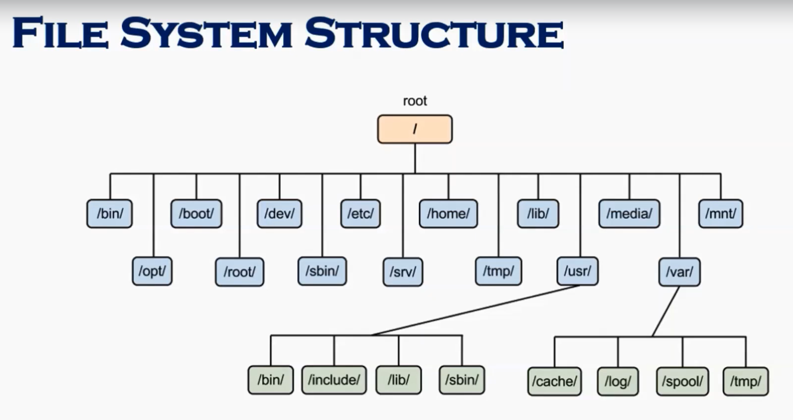
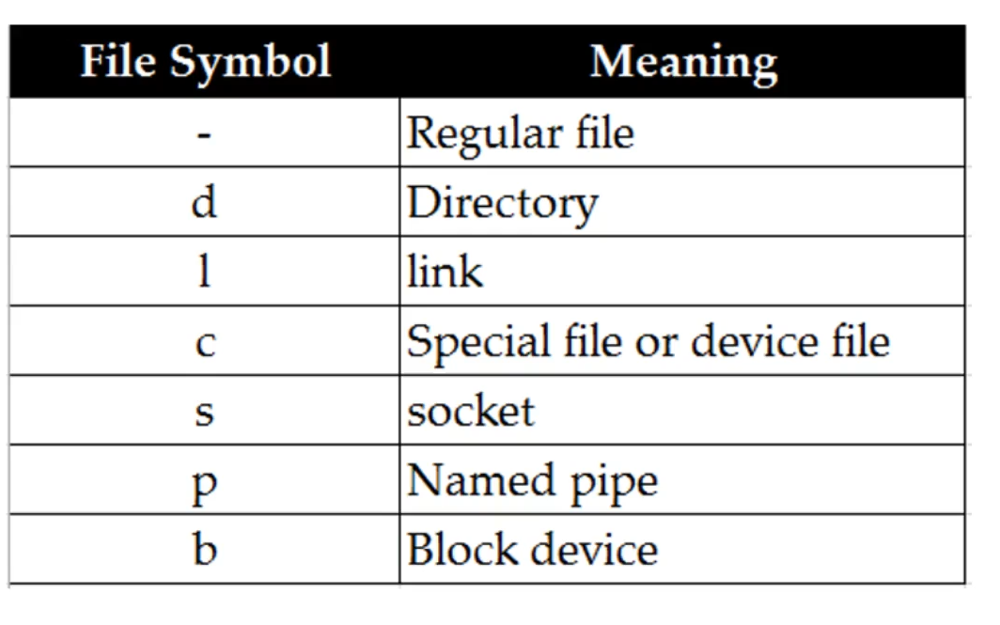
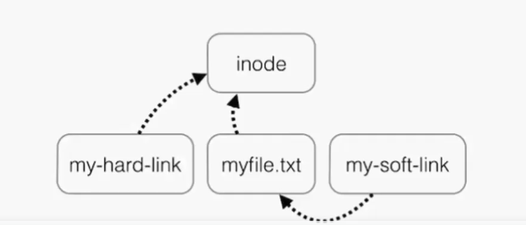
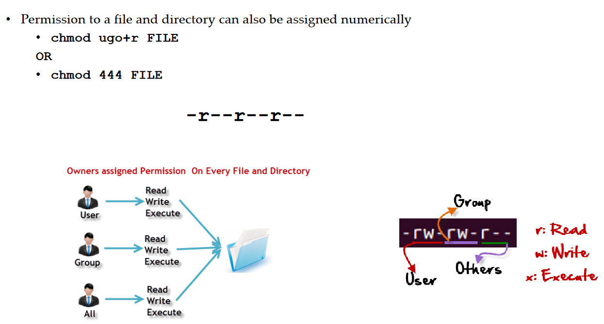
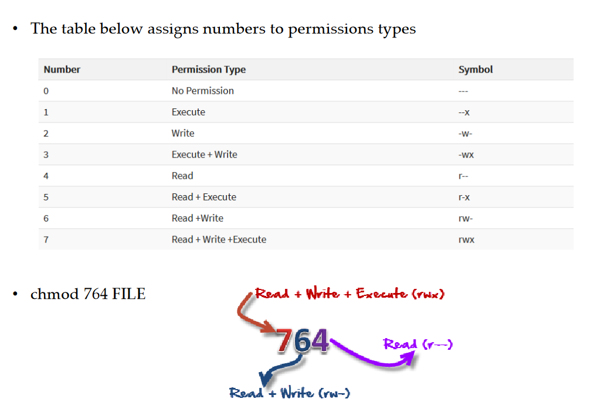
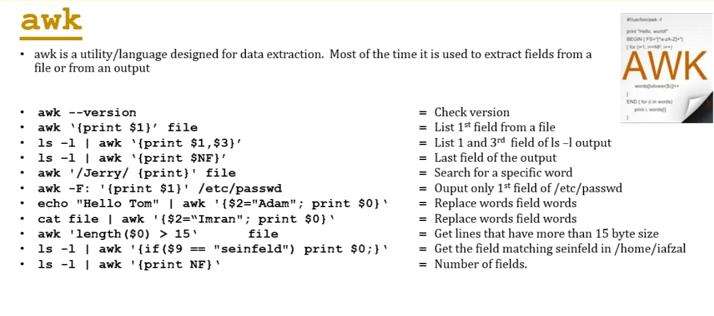
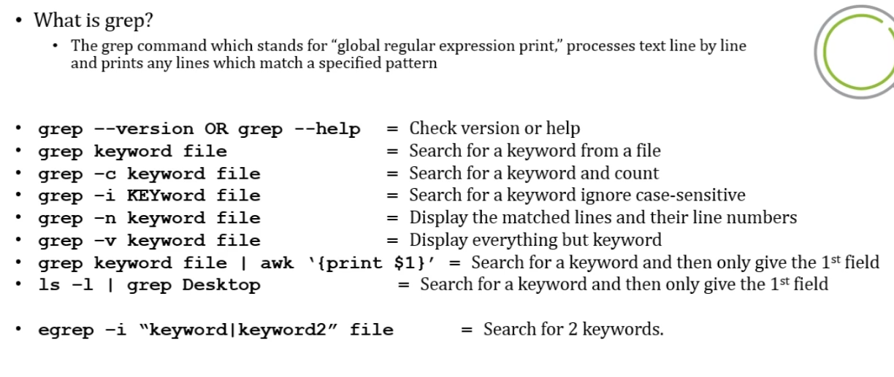
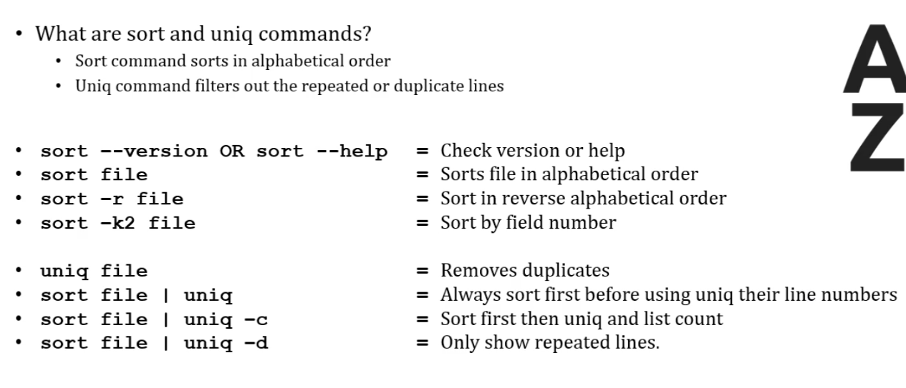
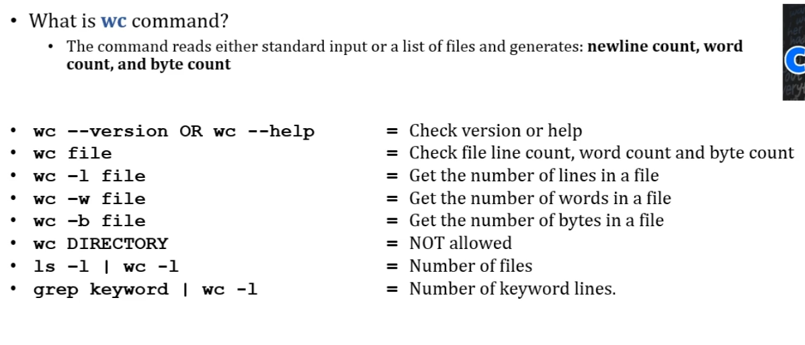

# Fundamentas of Linux:

- Linux is an OS just like any other OS which sits in between users and hardware.

### Linux vs Unix:

- Unix was developed for multi-user and multi-tasking in mid 1970.
- Linux is open source OS born in 1991.
- Linux is free which we can built upon.
- There are many flavours of Linux distribution today namely which developers built upon the open source linux namely Ubunutu, Fedora, SUSE, RedHat etc.,.(few are licensed and others are free)
- Unix supports very few file systems whereas Linux can be installed almost anywhere.

- Install CentOS 8 on your system using Oracle Virtual for practice which is very similar to industry grade redhat distribution.
- CentOS is similar to RedHat.
- Fedora -> Cent OS -> RHEL (the way new updates takes place in RHEL version)

- To know the IP address and network the linux is connected to use **ifconfig/ip a**  (ip a is new command after ifconfig depreciated.)

## Linux Files System:

- OS stores data on the disk using a structure called the file system, consisting of the files, directories and other information needed to access and locate them.
- There are many different type of file system. Ex: ext3, ext4, XFT, NTFS, FAT etc.,..
- Linux file system store information in heirarchy of files and directories.

- **File Structure** :
    - /boot : Contains the file that is used by the boot loader (grub.cfg)
    - /root: root user home directory. It is not same as /
    - /dev: System Devices (eg: disk, cdrom, speakers, flashdrive, keyboard etc.,..)
    - /etc: Contains configuration files required by all programs. (related to apps and other installs)
        - This also contains startup and shutdown shell scripts used to start/stop individual
                programs.
        - For example: /etc/resolv.conf, /etc/logrotate.conf
    - /bin -> /usr/bin : Everyday user commands. (For example: ps, ls, ping, grep, cp.)
    - /sbin -> /usr/bin: Just like /bin, /sbin also contains binary executables. ystem/Filesystem commands. (For example: iptables, reboot, fdisk, ifconfig, swapon)
    - /opt: Optional add-on application (Not part of the OS apps) this is used to install 3rd party apps.
    - /proc: Running Processes (Only exist in Memory)
        - This is a pseudo filesystem contains information about running process. For example:/proc/{pid} directory contains information about the process with that particular pid.
        - This is a virtual filesystem with text information about system resources. For example:/proc/uptime
    - /lib -> /usr/lib : C programming libs used by commands and apps.
        - To see which lib is used which command (strace -e open pwd)
    - /tmp: The directory where we have all the temp files.
    - /home: Directory for users.
    - /var: All the app logs and other logs go in here.
    - /run: System daemons that start at very early stages(systemd) to store temp runtime files like PID files.
    - /mnt: to mount external file system.
    - /media: is used for cd-rom mounts.
    - /usr: Contains binaries, libraries, documentation, and source-code for second level programs.
        - /usr/bin contains binary files for user programs. If you can’t find a user binary under /bin,look under /usr/bin. For example: at, awk, cc, less, scp
        - /usr/sbin contains binary files for system administrators. If you can’t find a system binary under /sbin, look under /usr/sbin. For example: atd, cron, sshd, useradd, userdel
        - /usr/lib contains libraries for /usr/bin and /usr/sbin
        - /usr/local contains users programs that you install from source. For example, when you install apache from source, it goes under /usr/local/apache2

#### File System Navigation:

- cd : change directory
- ls : list files
- pwd : present working directory

#### ROOT: 

- There are 3 types of root on Linux System.
    1. Root Account: root account is an account or username in linux which is most powerful account and has all the access.
    2. Root as / : Its called the root directory as in very first directory.
    3. Root home directory: The root user account also has a directory located in the /root called root home directory.

#### Absolute and Relative Paths:
- To  navigate a file system we have two type of paths.(absolute and relative)
- An absolute path start with a / ex: cd /var/sys/log
- relative path doesnt start with a / it identifies a location relvant to the current directory location you are in.

#### Directory Listing Attributes:

- When you do and ls -ltr it gives the following.
- EX: drwxrwxrwt  20 root root  24576 Jul  7 07:21 tmp
- drwxrwxrwt : type whether its a directory(starts with d), link(start with l), regular file(starts with just - )
- 20: no.of links
- root: Owner
- root: Group
- 24576: size
- Jul 7 07:21 : month date and time.
- tmp: name

#### Creating Files and Directories:

- whoami: tells you are logged in as which user.
- create a new file: touch and cp.
- Create directories: mkdir
- Copy Directories: cp -R source_directory target_directory

#### Linux File Types:

#### Finding Files and Directories:

- There are two main commands to find files or directories **find** and **locate**
- for locate you need to install a lib
- find . -name "sai"  (. is the current directory -name is the file/folder name)
- find / -name "httpd.log (/ searches from the root directory) (run man find to do more with this)

- **change password command**:  passwd userid 

- **Wild Cards**:
    1. ( * - represent 0 or more characters)
    2. ( ? - represent a single character)  ex: ls -l ?bcd* -> list all the files that starts with a single character and has bcd next to it.
        - (ls -l *[bd]* | more) lists everything thats has either b or d.
    3. ( [] - represent a range of characters)  ex: touch abc{1..9}-xyz creates 9 files strating abc1-xyz
    4. \ escape , ^ starting of the line , $ end of line

#### Soft and Hard Links:

- **inode**: every time you create any kind of file or directory computer assgins it a number called inode as it doesnt understand names.
- **Soft link**: Link will be removed if the file is removed or deleted. (ln -s /var/sys/sai sai) it creates a soft link to the mentioned path under the name sai in the current directory. (ln -s filename linkname)
- **Hard Link**: Deleting or renaming the original file will not effect the hard link (ln filename linkname)

- ls -li (to find the inode of the file)
    8193 drwxr-xr-x   2 root root   4096 Feb 20  2021 boot (8193 is the inode)
- when we create a soft link it gives a new inode to the soft link created. Even if we delete the source file the soft link file is still present. (we need to delete to prevent unecessary usage of inodes )
- We can create a hard link using (ln /var/sys/sai)  
    Note: if it fails to create a hard link it might be due to both the directories are not on the same partition.
    Hard link doesnt start with the l its created as normal file. Even if we delete the source file it still exsists with the file content here.
    hard links have the same inode. 

- More Info: https://medium.com/@meghamohan/hard-link-and-symbolic-link-3cad74e5b5dc 

## Linux Commands:

- **File permissions**: There are 3 types of perms read, write and execute. (rwx) 
    - Each permission can be controlled on a user, group and other levels. (ugo)
    - rwxrwxrwx (first 3 user, second 3 group, third 3 all others)
    - COMMAND: chmod 777 filename or chmod u+x filename or chmod g+rw filename

- **File Ownership** :
    - There are 2 owners of a file or directory USER and GROUP.
    - Command to change the ownership of file (chown)
        - usage: chown ownername filename (chown root sample.txt)
        - chown -R username:groupname file/directory (-R recursively change all the ownership within the directory, for file its not required)
    - command to change the ownership of group (chgrp)
        - chgrp ownername filename (chgrp root sample.txt)
    - getfacl filename (lists all the perms)

- **Access Control List**:
    - ACL provides more flexible permission mechanism for file system.Ex: if we want to give only outside user the read permission.
    - add perms to a user: setfacl -m u:user:rwx /path/to/file
    - add perms to group: setfacl -m g:grpname:rwx /path/to/file
    - to allow all files or directories to inheret the ACL from the directory it is within : setfacl -dm "entry" /path/to/dir
    - to remove a specific entry: setfacl -x u:user /path/to/file
    - to remove all ACL entrires: setfacl -b /path/to/file
    - Note: if you add ACL perms to a dir/file it will add a + sign at the end of the permission.
    - setting w permission with ACL does not allow to remove a file.
    
- **Help Commands**:
    - whatis command
    - man command
    - command --help 
- **Adding Text to the Files**:
    -  vi editor
    -  redirect command output using > or >>
    - echo > or >> (ex: echo "hello world" > file.txt)
- **Input and Output redirects**:
    - There are 3 redirects in lInux stdin(0), stdout(1), stderr(2)
    - stdout: output that we see on the terminal when we execute something.  (redirect to file ls -l &> file.txt, or ls -l &> /dev/null to destroy the stdout content)
    - stdin: feed the contents of a file to a file. eX: cat < file.txt it echoes teh file.txt contents 
    - stderr: if the command produced any error , we use redirects to redirect the error to other file ex: telnet localhost 2> errorfile, telnet localhost 2> /dev/null (all the content in the /dev/null is destroyed automatically)

- **tee**:
    - tee is used to view and store output at the same time.
    - echo "hello world" | tee file.txt   (it not only redirects the output to file.txt but also prints it on the terminal as well)
    echo "hello world" | tee -a file.txt (to append to the same file)
 
- **Pipe** :
    - Pipe send the output of a command to another command.
    - ex: ls -ltr | more (more actually lists one page at one time) or ls --l | tail -1
- **File maintenence commands**: cp, rm, mkdir, rmdir, chgrp, chown
- **File Display Commands**: cat, less, more, head, tail
- **File/Text processor commands**: cut, awk, grep, egrep, sort, uniq, wc
    - Cut: its the utility to print certain things in a line and edit out the remaining stuff.
            ex: cut -c1 filename (gives the first charcter in each line similarly cut -c1,4,5 give the resprcitve chars)
            cut -c1-3 (range of chars) 
            cut -d: -f 6 /etc/passwd (it cuts everything till delimiter : and -f 6 prints the 6 word in the line following the delimiter)
        
    - awk: its a very powerful command in itself.
            ex: aws '{print $2}' filename (prints the second field in the file)
        
    - grep/egrep: grep prints if it matches a specific key word, egrep for two or more key words.
        
    - sort/uniq: it prints all the unique values if there are duplicates within the file.
        
    - wc: counts the number of lines.
         

### Compare files (diff & cmp):

- diff compares the file line by line
- cmp compares the file byte by byte.

### Compress and Uncompress Files (tar, zip, gzip etc.,.):

- tar: takes a bunch  of files together and place it in a single file. 
        tar cvf directoryname (tars everything thats present in that directory) c-compress
        tar xvf filename(extract ) x-extract
- gzip: it actually compresses a file.
- gzip -d : uncompress a file.

### Truncate command:

- truncate is often used to shrink the file to a specific size or extend the size of the file to the specified size.
- truncate -s 20 filename 
- this command actually removes the data from the file to bring it to the required size.

### Combining and Splitting Files:

- mutiple files can be combined to one.
    - cat file1 file2 file3 > file4
- file can be split into multiple ones.
    - split file4
    - ex: split -l 300 file.txt childfile (this splits file.txt into each file consisting of 300 lines each namely childfilea, childfileb etc.,..)

    