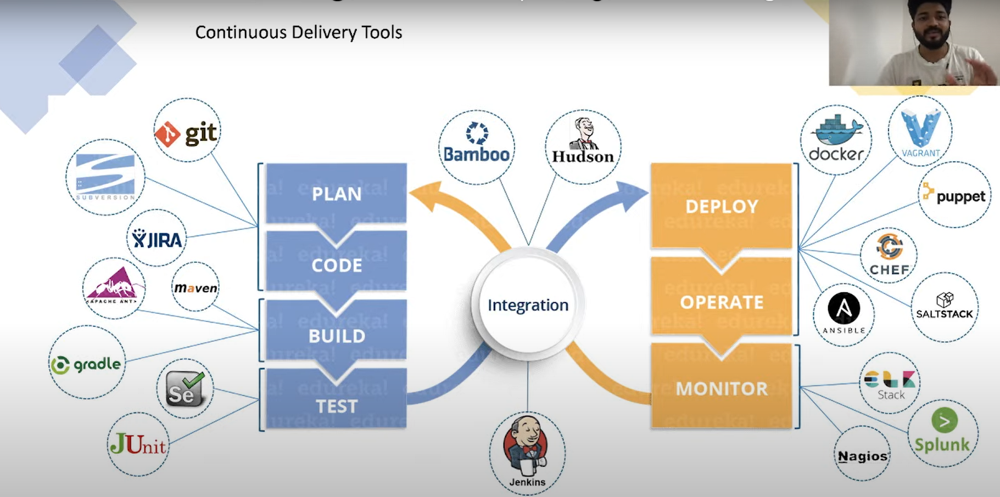
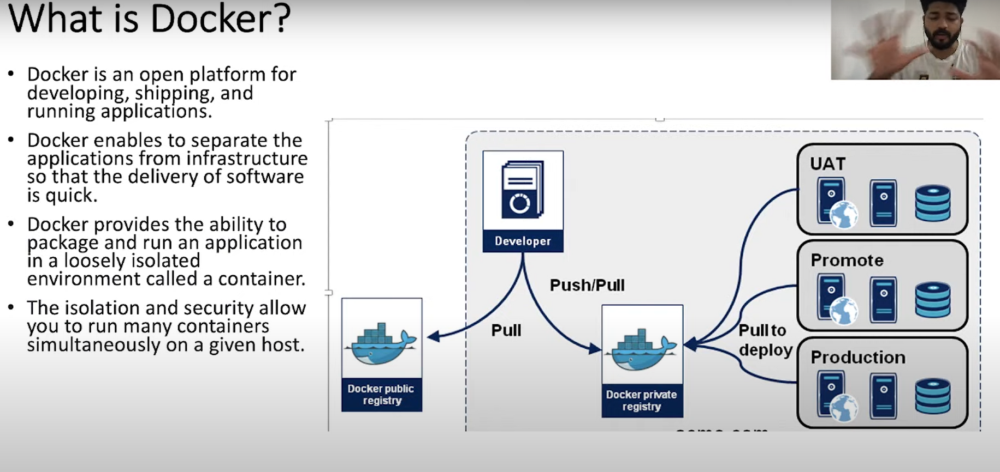
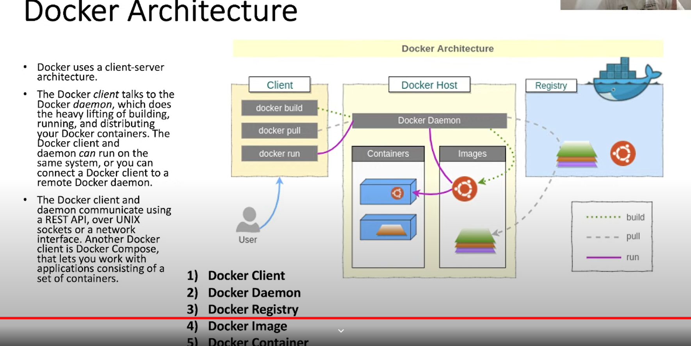
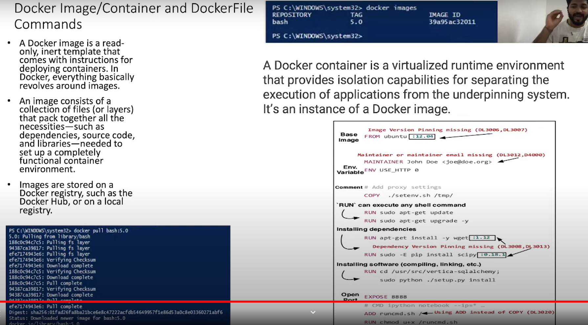
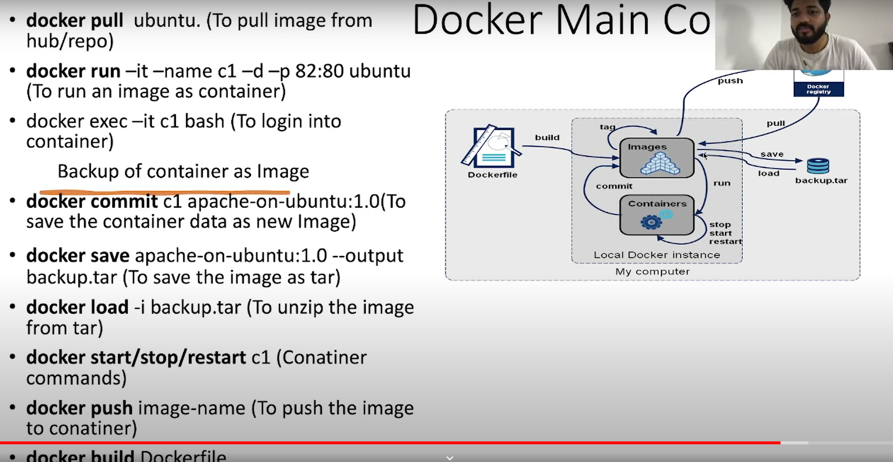
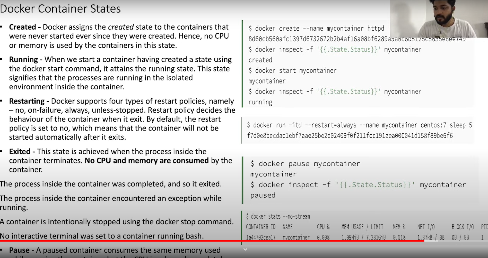
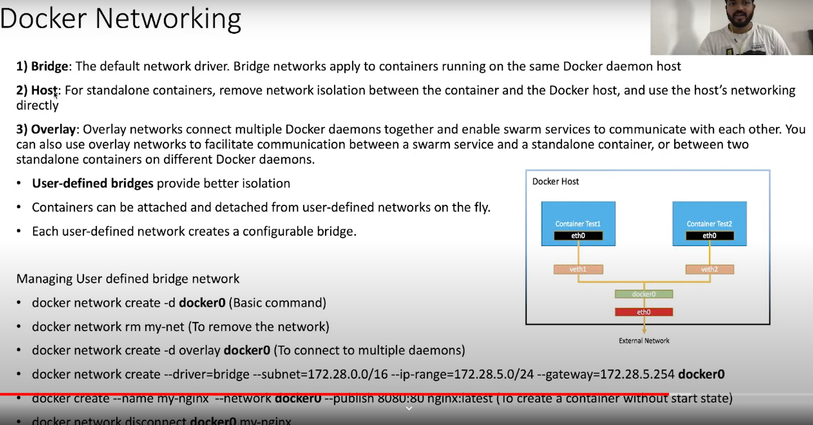

# DOCKER:



- Docker uses a client-server architecture. Client is nothing but where we install the docker application. This becomes the docker host.
- docker build will convert the file into an image
- docker pull will pull the image from the registry
- docker run will run the image as a container.



- Docker image is a read only, inert template comes with the instructions for deploying containers.
- Docker image consists of collection of files (layers) that pack together all necessities - such as dependncies, source code and related libs.


- Dockerfile has (mutiple layers) set of commands do a certain task.



```
FROM ubuntu:12.04   (base image and we can't have more than two from in a dockerfile; )

MAINTAINER Saikumar Kale <saikumar.aero@gmail.com>  (maintainer name can be declared here to know who developed these)

ENV USE_HTTP 0   (in ENV we can declare various env variables to pass certain values here USE_HTTP value is 0)

COPY ./setenv.sh /tmp/ (Docker copies just copied the shell script into the tmp folder)

# we have ADD as well . Difference between copy and add is  ADD allows <src> to be a URL and copies the content from the URL also ADD allows the source to be a zip file (Resources from remote URLs are not decompressed) and it unips the contents automatically to the destination withint the container. Docker recommends to use COPY so as when we want to copy the zip files we dont accidentally spill all the files open within the container.

RUN sudo apt-get update  

RUN sudo -E pip install scipy  :0.18.1 

RUN cd /usr/src/py; sudo python ./setup.py install 

#RUN helps us in installing software, dependencies, it can run any shell command inside the container.

EXPOSE 8888 (helps exposing the application port to the container port 888 which helps in communicating the outside world. )

ADD runcmd.sh / (Using ADD instead of COPY)

RUN chmod u+x /runcmd.sh 

CMD echo "hello from docker python" 

# Docker has a default entrypoint which is /bin/sh -c but does not have a default command. The ENTRYPOINT specifies a command that will always be executed when the container starts. The CMD specifies arguments that will be fed to the ENTRYPOINT.
# we can pass arguments via cli and entrypoint as well.

```



- docker run -it -name c1 -d -p 82:80 ubuntu
(it mean interactive mode, name given to the container, d is detached runs in background, p is port mapping for docker application to the host port)

- docker exec -it c1 bash 
(we use exec to go into the container )

- docker commit c1 apache-on-ubuntu:1.0 
(to save the container data as new image)

- docker save apache-on-ubtunu:1.0 --output backup.tar 
(to save the image as tar)

- docker load -i backup.tar (to unzip the image from tar)

- docker start/stop/restart/push/pull (other docker commands)
- docker build Dockerfile

## Container States:



- there are 5 states created, running,  restarting, exited , pause.
- create state containers are created by not started or consumed any cpu
- restarting state 4 restart policies that we can decide to use.
- exited when we container is terminated. No cpu and memory are consumed by the container.

## Docker Networking: 



- Bridge : The default network driver. Bridge networks apply to the containers running on same docker daemon host.
- Host: For standalone containers, remove network isolation and use host's networking directly.
- overlay: overlay network connect multiple docker daemons together and enable swarm services to commuincate with each other.you can use overlay network to communicate b/w swarm and standalone container, or b/w two standalone containers on different docker daemons.
- Check the picture for more clarity.
