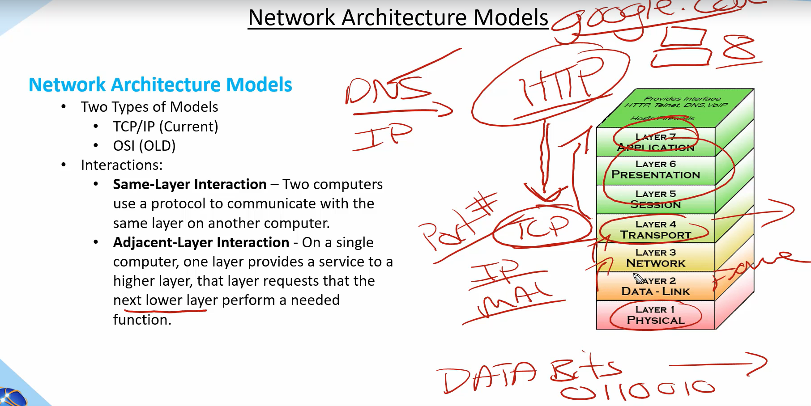
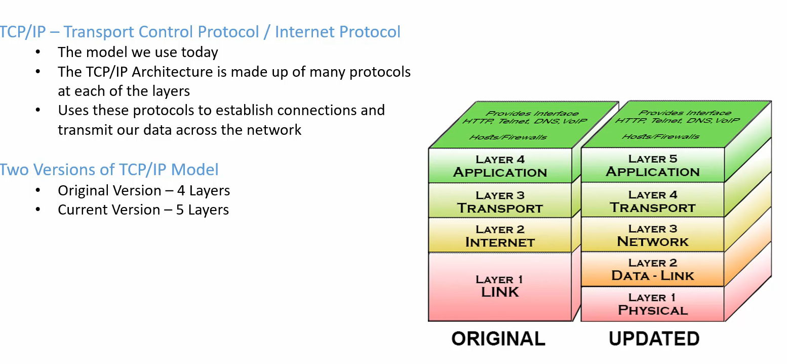
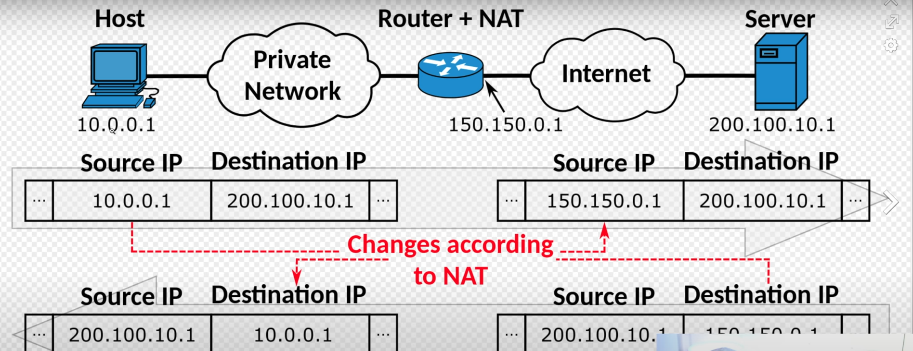

# NETWORKING

- Rules setup by ppl how a particular data is being sent (TCP, UDP etc.,.)
- WWW - Set of pages connected all over the internet by hyperlinks. Accessed via a URL and hosted by web server.
- As we have more and more pages its difficult to reach all of them hence we created search engines.
- PROTOCOLS: Set of rules how to communicate with each other over the web.
    - TCP: transfer control protocols. (it ensures complete data is being transferred.)
    - UDP: user datagram protocol. (not caring if entire data is being transferred, video recording etc.,.)
    - HTTP: hyper text transfer protocol (web browsers)
- Data is tranffered in packets.
- ISP(Internet Service Provider) gives router. It will have a global IP. All devices connected to router will have same global IP. With the router we have mutiple devices. Router assigns mutiple IP address known as Local IP address. It does via DHCP (Dynamic Host Control Protocol). 
- NAT is used to remember by router which device within the local network requested by what device.
- How does it know which application is being requested within the device. It is done by using ports. 
- LAN (Local Area Network): entire office we can connect under LAN as many as we want using ethernet cable  (MAN across city, WAN across countries)
- Modem is used to convert digital signals to analog signals.
- Networking works on different layers, the one visible to the users is the appliction layer.

## TCP/IP and OSI Model: 

(All People Seem to Need Data Processing) short cut to remember

- Network Architecture Models.
    - TCP/IP  (this is the one we need today)
    - OSI  (this we need to know as reference for any other model)
        - the first four layers happen within our network. 
        - from network to physical layer happens outisde the own network.

### OSI model 

- Application Layer: 
    - Users interact within this layer. ( browsers) 
    - Its the 5th layer of the TCP/IP architecture or 7th Layer of the OSI model.
    - It basically implemented in software. the users who interact with the application via UI.  if you send a msg in whatsapp it takes the msg and sends it to the Presenatation Layer.
- Presentation Layer: 
    - Presentation layer take the data from the App layer. it will take the msg convert it to binary format from the ASCII format. this is known as translation.
    - Here the encryption happens. It provdes abstraction as well (it assumes data being sent is taken care of). compression also happens at this layer. SSL as well used here.
- Session Layer:
    - Here the authentication and authorization happens.
    - It helps in setting up an session and termination once its closed.
    - like presentation layer data being send downward is taken care of transport layer. it dont take any confirmation back.
- Transport Layer:
    - Its responsible for transport the data using various protocols like TCP or UDP etc.,.
    - data received from session layer is divided into small data units called segments. every segment contains the port numbers of source and destion as well as a sequence number.
    - Sequence number helps in reassemble the data again to send the correct information.
    - it adds as check sum to every segment to check whether the data is sent correctly. (this is not done in UDP hence we might have data loss)
- Network Layer:
    - IP addressing is done in this layer as every computer  has its own IP address known as logical addressing.
    - it assigns the senders and recievers   IP address to ever segment and forms an IP data packet.
    - this is to make sure every data packet reaches correct destination.
    - Load Balancing also happens here as well.
- Data Link Layer:
    - it recieves the data from the network. whenever a packet is transported it will have IP address of sender, reciver and subnet mask.
    -  Data link layer helps in physical addressing similar to logical addressing done in network layer. Physical address are MAC address.
    - So in this layer source and destination mac address(12 digit alpha numeric number) is attached to the Data packet which forms a frame.
- Physical Layer:
    - it contains the hardware trasmits the frames as bits via electric signals. it converts the data from electric signals to bits. and pass on to the data link layer as frame on the recievers end.
    
### TCP/IP (transport control protocol):

- Here the application, presentation and transport model and combined into one. 
- Client - Server architecture. 
- We cannot reduce the ping time as we are getting the best possible time via cables.
- Peer - Peer architecture. (Applications hosted on various servers connected to each other. there is no one dedicated server)

# Web Protocols :

- TCP/IP:
    - http
        - we have a client-server architecture. we send a request and recieve a response, this protocol tells us how we send a request  to the server and request the response from the same.
        - http uses tcp to establish a connection and make sure no data is lost.
        - http in itself is a stateless connection.
        - http works on application layer whereas tcp works on transport layer.
        - we have various methods within the htttp (GET, PUT, POST, DELETE etc.,.)
    - dhcp (dynamic host control protocol which allocates IP address to various devices within the network
    - ftp
    - smtp  (email protocol)
    - pop3 
    - ssh 
    - vnc
- telnet port:23 (helps manage device remotely)
- UDP (stateless connection) data might be lost

# Ports: 
- If we send a response to IPp address and particular application within the IP is determined by port. If there are mutiple instances of the same application being run it makes use of ephemeral ports (random port number get assigned to mutiple instances and gets freed once the process is done)

# Status Codes:

1XX -> Information Codes

2XX -> Successs
3XX -> redirecting codes
4XX -> Client Errors
5XX -> Server Errors

# Cookies:

- Its a unique string , its stored on the clients browser. When you visit the app  for first time it will create a cookie.
Next time you request the same site this cookie is sent in the header and server will check within its DB about the session and returns the same.

- Third Party Cookies: for ads purpose.

# Email works?

- SMTP, POP3. (works in application layer)
- In transport layer we use TCP as we need to send entire data without loss.
- When I send an email it goes (sender-> senders SMTP server -> recievers SMTP server -> received)
- if both are using same gmail we have only one SMTP server.

# Domain Name System:

- mail.google.com
- .com -> root DNS servers (.com, .edu, .in etc.,.)  {TOP LEVEL DOMAINS (TLD)}
- with the .com we have all the second level domains as well (google.com)  {SECOND LEVEL DOMAINS (SLD)}
- mail is the sub-domain with in the google.com

# Transport Layer:

- Transfer of data from the network to the application within the same computer is done by transport layer.
- Network layer is transfer of data from one to another on the network.
- Transport layer has protocols like TCP and UDP.
- How will the system determine how to send data of different kinds like mail, txt and video? this is done by multiplexing.
- multiplexing will allows send the data to different destinations at once. transport layer has a multiplexer.
- de multiplexing happens on the destination. 
- Applications within the computer are determined by ports (The word “Port” is the number used by particular software.). the application and the network is connected via sockets (The word “Socket” is the combination of port and IP address in network layer). these sockets contains the port numbers of the application connected to.
- data is transfered in packets via network layer. transport layer will attach these packets port numbers.
- transport layer also takes care of congestion control.
- Congestion control alogs are built in transport layer.

- CHECKSUM : Transport layer uses this checksum if the data is completely sent or not. this checksum is sent along with the data and friend received the msg calcuates the check sum value using the data sent. if the value is different , data is lost or something went wrong.

- TIMERS: When you send a data packet to friend , he will send a msg he got the data then the timer will end. if there is no confirmation we know that the data is lost.
- We solve the duplicate packets issue using the sequence number.

## UDP (User Datagram Protocol) :
- Its an another transport layer protocol. here data may or may not be delivered. 
- data may change, data may not be in order.
- its a connection less protocol. 
- As we know every data packet source and destionation port number. 
- its very fast and used mostly for video conferencing, gaming etc.,..

## TCP (transmission control protocol) :
- its also works on the transport layer. Application layer sends a lot of raw data.
- tcp divides it into segements add unique seq number and add headers.
- congestion control.
- when does not arrive it takes care, it maintains the order of data.
- unlike UDP its connection oriented. i.e a connection  needs to be established to send data.

### TCP 3 way handshake:

- client - server establishes a 3 way handshake in TCP.
- client sends a syn flag and a seq number(random) to server.
- server sends an ack that it recieved seq number & syn flag.
- client  sends an ack to the server using seq number. 
- after the above 3 steps a connection will be established. the connection header contains lots of flags like seq, ack, syn etc.,..

## Network Layer:

- in the transport layer the data we have is in segments.
- In this layer the segements are converted into IP data packets.
- Here we work with the routers.
- the data packet first gets transmitted from our router to another router within the network as per the route table until it reaches the destination.
- each router can have a any number of route tables. it contains one by default.
- these route tables are added by the control plane. 
- there are different ways to add a routes 
    - static routing  (manual)
    - dynamic routing (its automatic and updated using the algorithms)
- **Internet Protocol** 
    - this protocol happens in the network layer.
    - public IP(global IP assigned to devices) and private IP(Ip that can be used within the local network) 
    - IPv4 these are 32 bit numbers, 4 words
    - IPv6 these are 128 bits.
    - Ex: 192.108.52.1    (192.108.52 [network address/subnet ID]) (1 [host device/ID])
        - here each number  has range of 0-255 known by the 8 bit numbers. 
        - these IP address are defined in the mutiple classes. 
    - the public IP address to assigned by ISP

    - there are certain IP address that are reserved.
    - Ex: LOOPBACK IP address (localhost : 127.0.0.1) 
    - We can reach our application within our computer using the locahost where our same system acts as client and server.
    - IP packets contains many flags (headers, IPs, ports, identification, TTL, protocols etc.,.)
    - TTL is something we set if we dont recieve an within that time we drop that packet.

## MiddleBoxes:

- these are few things that work apart from the router and network called middlebox
- firewall is an example of the middlebox
- we can set various rules so as to who can make a connection who can't.
- stateless firewall and stateful firewalls(remembers in the cache the previous ones.)

## NAT address translation:

- It modifies the public to the private IP within our network.

-

## DATA Link Layer:

- it will sends the data over the physical layer
- each device within our router have an unique IP address. it gets assgined by the DHCP.
- whenever a new device is configure within our network it gets an IP from the DHCP server within the router.
- Suppose there are many devices with the LAN. the data link layers establishes a connection within the local network using the MAC address of the physical device and transmits the data in frames. which contains the mac address of the destination as well.
- suppose  if it doesnt find the device within its local network via the ARP cache, it  sends a data link request to all the devices within the same netwok to establish a connection.
- ARP (address resolution protocol) contains the MAC address (data link layer address).  

