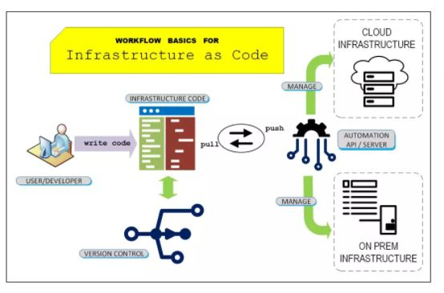

# 1. Terraform Basics

# 1.1 Infrastructure as Code (Iac) :

- Infrastructure as Code (IaC) is the managing and provisioning of infrastructure through code instead of through manual processes.
- With IaC, configuration files are created that contain your infrastructure specifications, which makes it easier to edit and distribute configurations. It also ensures that you provision the same environment every time.



# 1.2 Terraform Installation :

```
mkdir terraform

wget https://releases.hashicorp.com/terraform/1.1.4/terraform_1.1.4_linux_amd64.zip

unzip terraform_1.1.4_linux_amd64.zip

export PATH=/Users/{user_name}/{terraform_path}/:$PATH
or push the unzipped terraform to /bin using sudo and give root priviliges.

```

# 1.3 Understanding Terraform :


# 1.4 Terraform HCL Language :

- variables :  Input variables let you customize aspects of Terraform modules without altering the module's own source code
- types of variables : var, map, list, boolean etc.,..
```
mkdir terraform_test
cd terraform_test

vi main.tf
    variable "myvar" {
        type = string
        default = "hello terraform"
}

variable "mymap" {
        type = map
        default = {
                mykey = "my value"
        }
}

variable "mylists" {
        type = list
        default = [1,2,3]
}

var.myvar
"${var.myvar}"

var.mymap
var.mymap["mykey"]
"${var.mymap["mykey"]"

var.mylists
element(var.mylists, 1) #print the first element 
slice(var.mylists, 0, 2) #print the first two element

```

- Now we shall create a sample file to spin up aws instance

```
vi main.tf # enter below

provider "aws" {

}


resource "aws_instance" "example" {
        ami = var.AMIS[var.aws_region]
        instance_type = var.instance_type
}

vi variables.tf #enter below

variable "aws_region" {
        type = string
}

variable "instance_type" {
        type = string
        default  = "t2.micro"
}

variable "AMIS" {
        type = map(string)
        default = {
                us-east-1 = "ami_id"
        }
}

vi terraform.tfvars #enter below

aws_region="us-east-1"

```

# 1.5 AWS account setup : 

- set up the aws account to spin up the resources.

# 1.6 