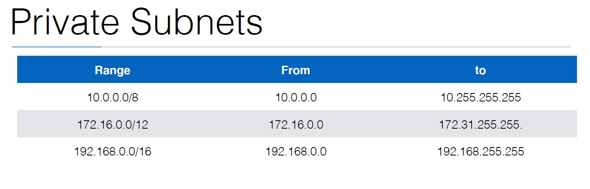
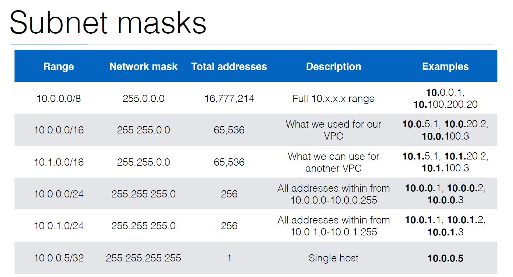

# 3.0 Creating a VPC :

- On Amazon AWS, you have a default VPC (Virtual Private Network) created
for you by AWS to launch instances in
- Up until now we used this default VPC
- VPC isolates the instances on a network level
- Best practice is to always launch your instances in a VPC that you create on your own.
- An instance launched in one VPC can never communicate with an instance
in an other VPC using their private IP addresses
  - They could communicate still, but using their public IP (not
recommended)
  - You could also link 2 VPCs, called peering/
- generic 3 -tier VPC






ssh {public_ip} -l ec2-user -i mykey

# 3.1 EBS :

- The t2.micro instance with this particular AMI automatically adds 8 GB of EBS storage (=
Elastic Block Storage)
- Some instance types have local storage on the instance itself. This is called ephemeral storage
- Extra volumes can be used for the log files, any real data that is put on
the instance
- EBS storage can be added using a terraform resource and then attached
to our instance

```
resource "aws_instance" "example" {
…
}
resource "aws_ebs_volume" "ebs-volume-1" {
availability_zone = "eu-west-1a"
    size = 20
    type = "gp2" # General Purpose storage, can also be standard or io1 or st1
tags {
Name = "extra volume data"
}
}
resource "aws_volume_attachment" "ebs-volume-1-attachment" {
device_name = "/dev/xvdh"
volume_id = "${aws_ebs_volume.ebs-volume-1.id}"
instance_id = "${aws_instance.example.id}"
}

```
- The root volume of 8 GB still exists
- If you want to increase the storage or type of the root volume, you can use
root_block_device within the aws_instance resource

```
resource "aws_instance" "example" {
root_block_device {
volume_size = 16
volume_type = "gp2"
delete_on_termination = true # whether to delete the root block device when the instance gets terminated or not
}
}
```

- Run the below commands to attach the data with the device name in the aws_volume_attachment. We cant see directly because we need to create a file system on it to mount it.

```
mkdir /data
mkfs.ext4 /dev/xvdh
mount /dev/xvdh /data
cat > /etc/fstab and enter "/dev/xvdh /data ext4 0 0" (check man fsatb for explanation) after we do this we dont need to enter /dev/xvdh every time

umount /data
mount /data (it will look for /dev/xvdh in fstab)
Note: as fastab is based on root storage /etc/fstab if rebooted it will gone hence, its good practice to provide the user data script.
```

# 3.2 User Data :

- Userdata in AWS can be used to do any customization at launch:
  - You can install extra software
  - Prepare the instance to join a cluster ex: e.g. consul cluster, ECS cluster
  - execute commands/scripts
  - mount volumes
- Note: Userdata is only executed at the creation of the instance, not when the instance
reboots
- Terraform allows you to add userdata to the aws_instance resource
  - Just as a string (for simple commands)
  - Using templates (for more complex instructions)
- Ex: below to install user data directly using simple commands
```
resource "aws_instance" "example" {
ami = "${lookup(var.AMIS, var.AWS_REGION)}"
instance_type = "t2.micro"
# the VPC subnet
subnet_id = "${aws_subnet.main-public-1.id}"
# the security group
vpc_security_group_ids = ["${aws_security_group.allow-ssh.id}"]
# the public SSH key
key_name = "${aws_key_pair.mykeypair.key_name}"
# userdata
  user_data = "#!/bin/bash\nwget http://swupdate.openvpn.org/as/openvpn-as-2.1.2-Ubuntu14.amd_64.deb\ndpkg -i openvpnas-
2.1.2-Ubuntu14.amd_64.deb"
}

```
- ex 2: to use the template file for complex instructions.

```
resource "aws_instance" "example" {
ami = "${lookup(var.AMIS, var.AWS_REGION)}"
instance_type = "t2.micro"
# the VPC subnet
subnet_id = "${aws_subnet.main-public-1.id}"
# the security group
vpc_security_group_ids = ["${aws_security_group.allow-ssh.id}"]
# the public SSH key
key_name = "${aws_key_pair.mykeypair.key_name}"
# userdata
  user_data = "${data.template_cloudinit_config.cloudinit-example.rendered}""
}

provider "cloudinit" {}
data "template_file" "init-script" {
template = "${file("scripts/init.cfg")}"
vars {
region = "${var.AWS_REGION}"
}
}
data "template_cloudinit_config" "cloudinit-example" {
gzip = false
base64_encode = false
part {
filename = "init.cfg"
content_type = "text/cloud-config"
content = "${data.template_file.init-script.rendered}"
}
}

#cloud-config script / inti script at scripts/init.cfg
repo_update: true
repo_upgrade: all
packages:
- docker
output:
all: '| tee -a /var/log/cloud-init-output.log'

```
- Another example is to use the template using terraform.

```
data "template_cloudinit_config" "cloudinit-example" {
gzip = false
base64_encode = false
part {
filename = "init.cfg"
content_type = "text/cloud-config"
content = "${template_file.init-script.rendered}"
}
# just a shell script instead of
part {
    content_type = "text/x-shellscript"
    content = "#!/bin/bash\necho ‘hello’"
  }
  # an upstart script (basically an init script to start/stop/restart/reload services)
  part {
    content_type = "text/upstart-job"
    content = "${file("scripts/start_docker_container.cfg")}"
  }
}

```

# 3.3 Static_Ip & EIP:

- Private IP addresses will be auto-assigned to EC2 instances
- Every subnet within the VPC has its own range (e.g. 10.0.1.0 - 10.0.1.255)
- By specifying the private IP, you can make sure the EC2 instance always
uses the same IP address:
```
resource "aws_instance" "example" {
ami = "${lookup(var.AMIS, var.AWS_REGION)}"
instance_type = "t2.micro"
subnet_id = "${aws_subnet.main-public-1.id}"
private_ip = "10.0.1.4" # within the range of subnet main-public-1
}

```
- To use a public IP address, you can use EIPs (Elastic IP addresses) they cant be specified directly as private IP.
- This is a public, static IP address that you can attach to your instance

```
resource "aws_instance" "example" {
ami = "${lookup(var.AMIS, var.AWS_REGION)}"
instance_type = "t2.micro"
subnet_id = "${aws_subnet.main-public-1.id}"
private_ip = "10.0.1.4" # within the range of subnet main-public-1
}
resource "aws_eip" "example-eip" {
instance = "${aws_instance.example.id}"
vpc = true
}

```
- Tip: You can use aws_eip.example-eip.public_ip attribute with the output
resource to show the IP address after terraform apply

# 3.4 Route 53 :

- Typically, you’ll not use IP addresses, but hostnames
- This is where route53 comes in
- You can host a domain name on AWS using Route53
- You first need to register a domain name using AWS or any accredited
registrar
- You can then create a zone in route53 (e.g. example.com) and add DNS
records (e.g. server1.example.com)

```
resource "aws_route53_zone" "example-com" {
name = "example.com"
}
resource "aws_route53_record" "server1-record" {
zone_id = "${aws_route53_zone.example-com.zone_id}"
name = "server1.example.com"
type = "A"
ttl = "300"
records = ["${aws_eip.example-eip.public_ip}"]
}

```

- Tip: When you register your domain name, you need to add the AWS nameservers to that
domain
- Route53 has a lot of nameservers. To know your nameservers for your particular domain,
you can use the output resource to output the property aws_route53_zone.examplecom.
name_servers

# 3.5 RDS :

- Its managed DB solution.
    - You can easily setup replication (high availability)
    - Automated snapshots (for backups)
    - Automated security updates
    - Easy instance replacement (for vertical scaling)
- Steps to create a RDS instance:
  - Create a subnet group
    - Allows you to specify in what subnets the database will be in (e.g. euwest-
1a and eu-west-1b)
  - Create a Parameter group
    - Allows you to specify parameters to change settings in the database
  - Create a security group that allows incoming traffic to the RDS instance
  - Create the RDS instance(s) itself

- for the paramete store refer below

```
resource "aws_db_parameter_group" "mariadb-parameters" {
name = "mariadb-parameters"
family = "mariadb10.1"
description = "MariaDB parameter group"
parameter {
name = "max_allowed_packet"
value = "16777216"
}
}
```
- We also specify a parameter that will be applied to MariaDB
- Seond we specify the subnet
```
resource "aws_db_subnet_group" "mariadb-subnet" {
name = "mariadb-subnet"
description = "RDS subnet group"
subnet_ids = ["${aws_subnet.main-private-1.id}","${aws_subnet.main-private-2.id}"]
}
```
- This subnet group specifies that the RDS will be put in the private subnets
- Third Security group

```
resource "aws_security_group" "allow-mariadb" {
vpc_id = "${aws_vpc.main.id}"
name = "allow-mariadb"
description = "allow-mariadb"
ingress {
from_port = 3306
to_port = 3306
protocol = "tcp"
security_groups = ["${aws_security_group.example.id}"] # allowing access from our example instance
}
egress {
from_port = 0
to_port = 0
protocol = "-1"
cidr_blocks = ["0.0.0.0/0"]
self = true
}
tags {
Name = "allow-mariadb"
}
}
```
- Final step RDS instance

```
resource "aws_db_instance" "mariadb" {
allocated_storage = 100 # 100 GB of storage, gives us more IOPS than a lower number
engine = "mariadb"
engine_version = "10.1.14"
instance_class = "db.t2.small" # use micro if you want to use the free tier
identifier = "mariadb"
name = "mariadb"
username = "root" # username
password = "a1c9f8v0zs" # password: create your own random password
db_subnet_group_name = "${aws_db_subnet_group.mariadb-subnet.name}"
parameter_group_name = "mariadb-parameters"
multi_az = "false" # set to true to have high availability: 2 instances synchronized with each other
vpc_security_group_ids = ["${aws_security_group.allow-mariadb.id}"]
storage_type = "gp2"
backup_retention_period = 30 # how long you’re going to keep your backups
availability_zone = "${aws_subnet.main-private-1.availability_zone}" # prefered AZ
tags {
Name = "mariadb-instance"
}
}

```
- RDS instance creation should be complete, check out the connection for the trail application.
