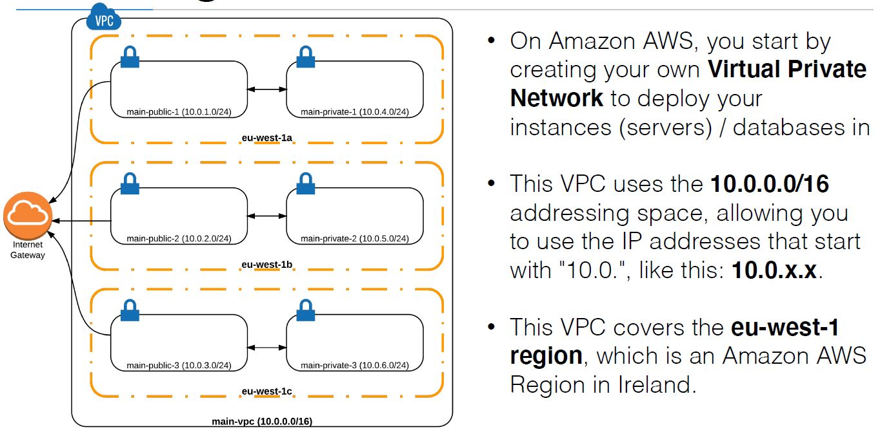

# 3.0 Creating a VPC :

- On Amazon AWS, you have a default VPC (Virtual Private Network) created
for you by AWS to launch instances in
- Up until now we used this default VPC
- VPC isolates the instances on a network level
- Best practice is to always launch your instances in a VPC that you create on your own.
- An instance launched in one VPC can never communicate with an instance
in an other VPC using their private IP addresses
  - They could communicate still, but using their public IP (not
recommended)
  - You could also link 2 VPCs, called peering
- generic 3 -tier VPC

